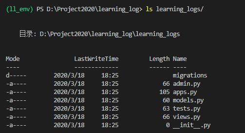
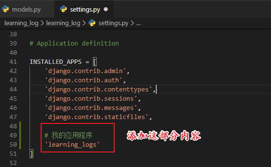
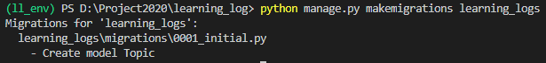
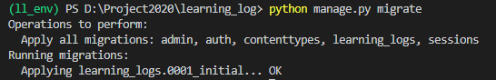
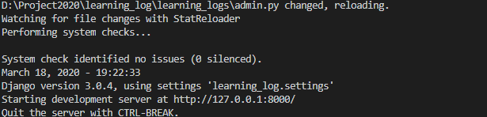
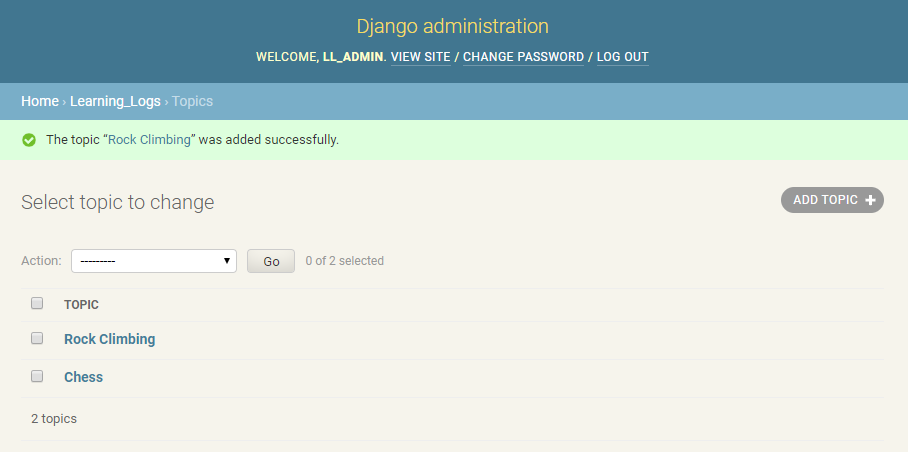
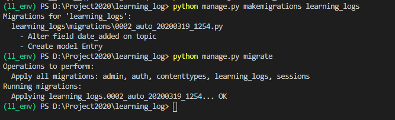
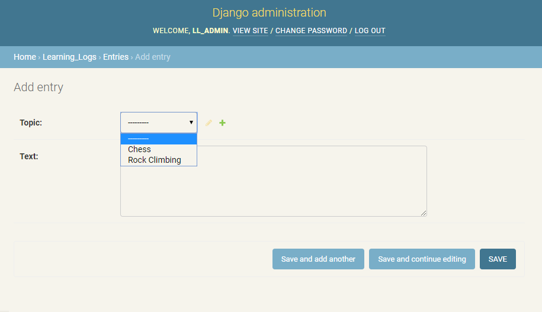

# 创建应用程序

[TOC]

## 一、启动

```
PS D:\Project2020> cd .\learning_log\
PS D:\Project2020\learning_log> ll_env\Scripts\activate
(ll_env) PS D:\Project2020\learning_log> python manage.py startapp learning_logs
(ll_env) PS D:\Project2020\learning_log> ls
```

- 命令startapp appname让Django建立创建应用程序所需的基础设施。如果现在查看项目目录，将看到其中新增了一个文件夹learning_logs


```
ls learning_logs/
```




## 二、定义模型

- models.py

  ```python
  from django.db import models
  
  # Create your models here.
  class Topic(models.Model):
      '''用户学习的主题'''
      text = models.CharField(max_length=200)
      date_added = models.DateTimeField(auto_now=True)
  
      def __str__(self):
          '''返回模型字符串表示'''
          return self.text
  ```

  

## 三、激活模型

要使用模型，必须让Django将应用程序包含到项目中。为此，打开settings.py（它位于目录learning_log/learning_log中），你将看到一个这样的片段，即告诉Django哪些应用程序安装在项目中：

- settings.py



接下来，需要让Django修改数据库，使其能够存储与模型Topic相关的信息。为此，在终端窗口中执行下面的命令：

```
python manage.py makemigrations learning_logs
```



命令makemigrations让Django确定该如何修改数据库，使其能够存储与我们定义的新模型相关联的数据。输出表明Django创建了一个名为0001_initial.py的迁移文件，这个文件将在数据库中为模型Topic创建一个表。

下面来应用这种迁移，让Django替我们修改数据库：

```
python manage.py migrate
```



每当需要修改“学习笔记”管理的数据时，都采取如下三个步骤：

- 修改models.py；

- 对learning_logs调用makemigrations；

- 让Django迁移项目。


## 四、Django 管理网站

### 4.1、创建超级用户

为在Django中创建超级用户，请执行下面的命令并按提示做：

```
python manage.py createsuperuser
```

- 用户名：ll_admin

- 密码：123456


### 4.2、向管理网站注册模型

我们创建应用程序learning_logs时，Django在models.py所在的目录中创建了一个名为
admin.py的文件。

为向管理网站注册Topic，请输入下面的代码：

- admin.py


运行

```
python manage.py runserver
```




浏览器访问http://localhost:8000/admin/，输入

- 用户名：ll_admin
- 密码：123456


### 4.3、添加主题

向管理网站注册Topic后，我们来添加第一个主题。为此，单击Topics进入主题网页。单击Add，你将看到一个用于添加新主题的表单。
在第一个方框中输入Chess，再单击Save，这将返回到主题管理页面，其中包含刚创建的主题。
下面再创建一个主题，以便有更多的数据可供使用。再次单击Add，并创建另一个主题Rock Climbing。当你单击Save时，将重新回到主题管理页面，其中包含主题Chess和Rock Climbing。




## 五、定义模型Entry

下面是模型Entry的代码：

```python
from django.db import models

# Create your models here.
class Topic(models.Model):
    '''用户学习的主题'''
    text = models.CharField(max_length=200)
    date_added = models.DateTimeField(auto_now_add=True)

    def __str__(self):
        '''返回模型字符串表示'''
        return self.text

class Entry(models.Model):
    '''学到的有关某个主题的具体知识'''
    topic = models.ForeignKey("Topic",on_delete=models.CASCADE)
    text = models.TextField()
    date_added = models.DateTimeField(auto_now_add=True)

    class Meta:
        verbose_name_plural = 'entries'

    def __str__(self):
        '''返回模型的字符串表示'''
        return self.text[:50] + "..."
```


## 六、迁移模型Entry

由于我们添加了一个新模型，因此需要再次迁移数据库。修改models.py ， 执行命令python manage.py makemigrations app_name ， 再执行命令python manage.py migrate。

下面来迁移数据库并查看输出：

```
python manage.py makemigrations learning_logs

python manage.py migrate
```



生成了一个新的迁移文件——0002_entry.py，它告诉Django如何修改数据库，使其能够存储与模型Entry相关的信息。

## 七、向管理网站注册Entry

我们还需要注册模型Entry。为此，需要将admin.py修改成类似于下面这样：

- admin.py

```python
from django.contrib import admin

# Register your models here.

from learning_logs.models import Topic,Entry


admin.site.register(Topic)
admin.site.register(Entry)
```


运行

```
python manage.py runserver 
```


单击Entries的Add链接，或者单击Entries再选择Add entry。你将看到一个下拉列表，让你能够选择要为哪个主题创建条目，还有一个用于输入条目的文本框。




## 八、Django shell

输入一些数据后，就可通过交互式终端会话以编程方式查看这些数据了。这种交互式环境称为Django shell，是测试项目和排除其故障的理想之地。

```
python manage.py shell 

from learning_logs.models import Topic

Topic.objects.all()

```


进行一系列的操作


- 每次修改模型后，你都需要重启shell，这样才能看到修改的效果。要退出shell会话，可按Ctr + D；如果你使用的是Windows系统，应按Ctr + Z，再按回车键。