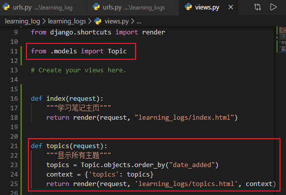
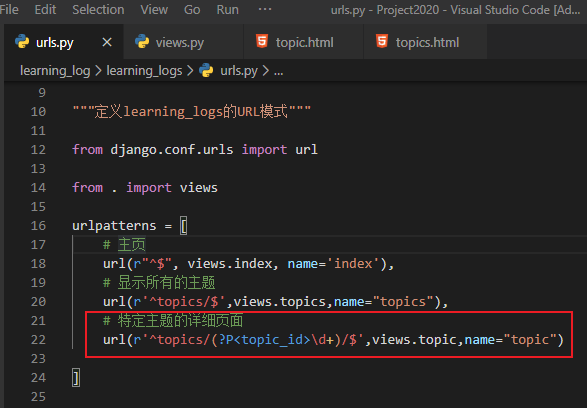
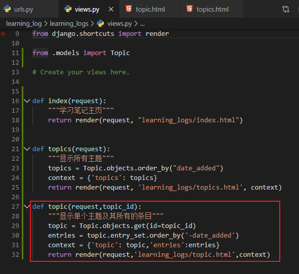

# 创建其他网页

[TOC]

## 一、模板继承

### 1.1、父模板

创建一个名为base.html的模板，并将其存储在index.html所在的目录中。

- base.html

  ```html
  <p>
      <a href="">Learning Log</a>
  </p>
  
  ```

  

### 1.2、子模板

重新编写index.html，使其继承base.html。

- index.html

  ```html
   
   
      <p>Learning Log helps you keep track of your learning, for any topic you're
      learning about.</p>
   
  ```

  

## 二、显示所有主题的页面

### 2.1、URL模式

修改learning_logs/urls.py：

```python
    # 显示所有的主题
    url(r'^topics/$',views.topics,name="topics")
```


### 2.2、视图

函数topics()需要从数据库中获取一些数据，并将其发送给模板。我们需要在views.py中添加

- views.py

```python
from django.shortcuts import render

from .models import Topic

# Create your views here.


def index(request):
    """学习笔记主页"""
    return render(request, "learning_logs/index.html")


def topics(request):
    """显示所有主题"""
    topics = Topic.objects.order_by("date_added")
    context = {'topics': topics}
    return render(request, 'learning_logs/topics.html', context)

```




### 2.3、模板

显示所有主题的页面的模板接受字典context，以便能够使用topics()提供的数据。请创建一个文件，将其命名为topics.html，并存储到index.html所在的目录中。

- topics.html

```html




    <p>Topics</p>

    <ul>
        
            <li>{{ topic}}</li>
        
            <li>No topics have been added yet.</li>
        
    </ul>


```

修改父模板，使其包含到显示所有主题的页面的链接

- base.html

  ```html
  <p>
      <a href="">Learning Log</a>
      <a href="">Topics</a>
  </p>
  
  ```

  

  

查看，刷新浏览器中的主页，将看到链接Topics


## 三、显示特定主题的页面

### 3.1、URL模式

如果用户要查看主题Chess（其id为1）的详细页面，URL将为http://localhost:8000/topics/1/。下面是与这个URL匹配的模式，它包含在learning_logs/urls.py中：

- urls.py

```python
    # 特定主题的详细页面
    url(r'^topics/(?P<topic_id>\d+)/$',views.topic,name="topic")
```



### 3.2、视图

函数topic()需要从数据库中获取指定的主题以及与之相关联的所有条目，如下所示：

- views.py

```python
def topic(request,topic_id):
    """显示单个主题及其所有的条目"""
    topic = Topic.objects.get(id=topic_id)
    entries = topic.entry_set.order_by('-date_added')
    context = {'topic': topic,'entries':entries}
    return render(request,'learning_logs/topic.html',context)
```



### 3.3、模板

这个模板需要显示主题的名称和条目的内容；如果当前主题不包含任何条目，我们还需向用户指出这一点：

- topic.html

  ```html
  
  
  
  
   <p>Topic: {{ topic}}</p>
  
   <p>Entries:</p>
   <ul>
       
          <li>
              <p>{{ entry.date_added|date:'M d, Y H:i'}}</p>
              <p>{{ entry.text|linebreaks }}</p>
          </li>
      
          <li>
              There are no entries for this topic yet.
          </li>
      
   </ul>
  
  
  ```

  

### 3.4将显示所有主题的页面中的每个主题都设置为链接

修改模板topics.html，让每个主题都链接到相应的网页

- topics.html

```html




  <p>Topics</p>

  <ul>
      
        <!-- <li>{{ topic}}</li> -->
        <li>
          <a href="">{{ topic }}</a>
          </li>
      
        <li>No topics have been added yet.</li>
      
  </ul>


```

浏览器刷新查看

