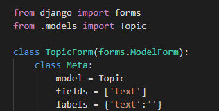
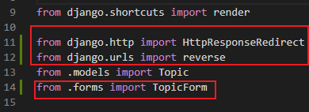
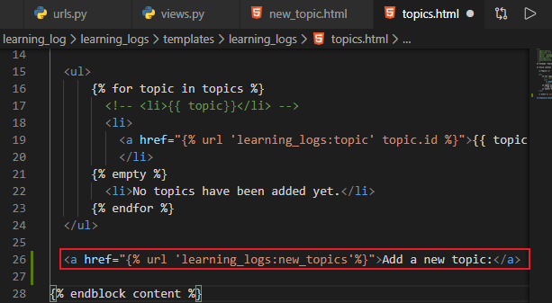
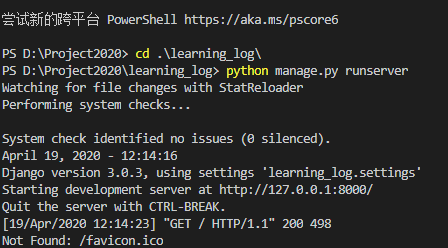
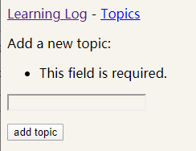
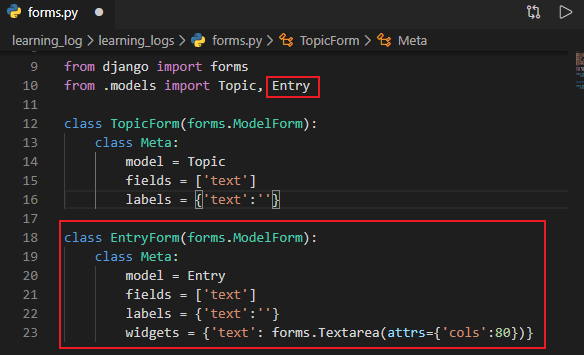
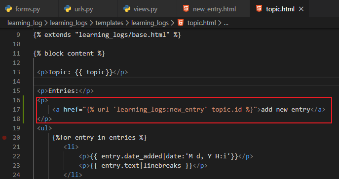
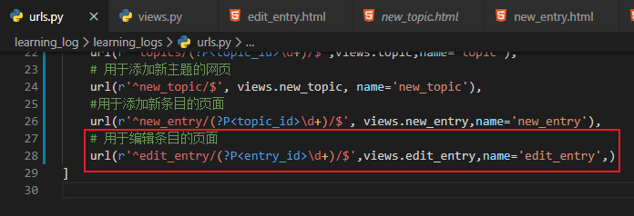
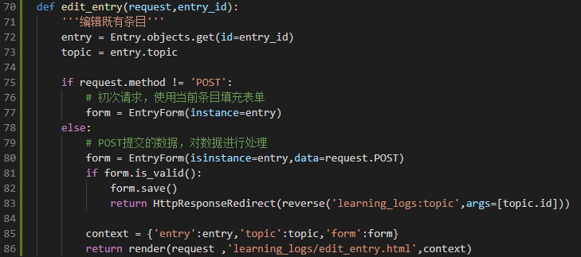

# 用户能够输入数据

[TOC]

## 一、添加新主题

### 1、用于添加主题的表单

创建一个名为forms.py的文件，将其存储到models.py所在的目录中，并在
其中编写你的第一个表单：

- forms.py

  ```python
  from django import forms
  from .models import Topic
  
  class TopicForm(forms.ModelForm):
      class Meta:
          model = Topic
          fields = ['text']
          labels = {'text':''}
  ```

  

  

### 2、URL模式new_topic

将其添加到learning_logs/urls.py中：

- urls.py

```
# 用于添加新主题的网页
url(r'^new_topic/$', views.new_topic, name='new_topic'),
```


### 3、视图函数new_topic()

- views.py

  ```python
  '''
  @Description: 
  @Version: 1.0
  @Autor: Henggao
  @Date: 2020-03-18 18:25:39
  @LastEditors: Henggao
  @LastEditTime: 2020-04-17 16:57:24
  '''
  from django.shortcuts import render
  
  from django.http import HttpResponseRedirect
  from django.urls import reverse
  from .models import Topic
  from .forms import TopicForm
  
  # Create your views here.
  
  
  def index(request):
      """学习笔记主页"""
      return render(request, "learning_logs/index.html")
  
  
  def topics(request):
      """显示所有主题"""
      topics = Topic.objects.order_by("date_added")
      context = {'topics': topics}
      return render(request, 'learning_logs/topics.html', context)
  
  def topic(request,topic_id):
      """显示单个主题及其所有的条目"""
      topic = Topic.objects.get(id=topic_id)
      entries = topic.entry_set.order_by('-date_added')
      context = {'topic': topic,'entries':entries}
      return render(request,'learning_logs/topic.html',context)
  
  def new_topic(request):
      '''添加新的主题'''
      if request.method !=  'POST':
          # 未提交数据：创建一个新的表单
          form = TopicForm()
      else:
          # POST提交的数据，对数据进行处理
          form = TopicForm(request.POST)
          if form.is_valid():
              form.save()
              return HttpResponseRedirect(reverse('learning_logs:topics'))
  
      context = {'form':form}
      return render(request,'learning_logs/new_topic.html',context)
  ```

  

  


### 4、GET请求和POST请求

对于只是从服务器读取数据的页面，使用GET请求；在用户需要通过表单提交信息时，通常使用POST请求。


### 5、模板new_topic

创建新模板`new_topic.html`,用来显示创建的表单：

- `new_topic.html`

  ```html
  
  
  
   <p>Add a new topic: </p>
  
   <form action=""  method="POST">
       
       {{ form.as_p}}
       <button name="submit">add topic</button>
   </form>
  
   
  ```

### 6、链接到页面new_topic

在页面topics中添加一个到页面new_topic的链接

- `topics.html`

  ```
  <a href="">Add a new topic:</a>
  
  ```

  

  

运行程序，查看

```
PS D:\Project2020> cd .\learning_log\
PS D:\Project2020\learning_log> python manage.py runserver
```



打开：http://127.0.0.1:8000/new_topic/



## 二、添加新的条目

### 1、用于添加新条目的表单

- forms.py

```python
'''
@Description: 
@Version: 1.0
@Autor: Henggao
@Date: 2020-04-17 16:16:18
@LastEditors: Henggao
@LastEditTime: 2020-04-17 16:20:26
'''
from django import forms
from .models import Topic, Entry

class TopicForm(forms.ModelForm):
    class Meta:
        model = Topic
        fields = ['text']
        labels = {'text':''}
        
class EntryForm(forms.ModelForm):
    class Meta:
        model = Entry
        fields = ['text']
        labels = {'text':''}
        widgets = {'text': forms.Textarea(attrs={'cols':80})}
```



### 2、URL模式new_entry

在用于添加新条目的页面的URL模式中，需要包含实参topic_id，因为条目必须与特定的主题相关联。该URL模式如下，我们将它添加到了learning_logs/urls.py中：

- urls.py

  ```
      #用于添加新条目的页面
      url(r'^new_entry/(?P<topic_id>\d+)/$', views.new_entry,name='new_entry'),
  ```

  

### 3、视图函数new_entry()

- view.py

```python
'''
@Description: 
@Version: 1.0
@Autor: Henggao
@Date: 2020-03-18 18:25:39
@LastEditors: Henggao
@LastEditTime: 2020-04-20 14:12:03
'''
from django.shortcuts import render

from django.http import HttpResponseRedirect
from django.urls import reverse
from .models import Topic
from .forms import TopicForm,EntryForm

# Create your views here.


def index(request):
    """学习笔记主页"""
    return render(request, "learning_logs/index.html")


def topics(request):
    """显示所有主题"""
    topics = Topic.objects.order_by("date_added")
    context = {'topics': topics}
    return render(request, 'learning_logs/topics.html', context)

def topic(request,topic_id):
    """显示单个主题及其所有的条目"""
    topic = Topic.objects.get(id=topic_id)
    entries = topic.entry_set.order_by('-date_added')
    context = {'topic': topic,'entries':entries}
    return render(request,'learning_logs/topic.html',context)

def new_topic(request):
    '''添加新的主题'''
    if request.method !=  'POST':
        # 未提交数据：创建一个新的表单
        form = TopicForm()
    else:
        # POST提交的数据，对数据进行处理
        form = TopicForm(request.POST)
        if form.is_valid():
            form.save()
            return HttpResponseRedirect(reverse('learning_logs:topics'))

    context = {'form':form}
    return render(request,'learning_logs/new_topic.html',context)

def new_entry(request,topic_id):
    '''在特定的主题中添加新条目'''
    topic = Topic.objects.get(id = topic_id)

    if request.method != 'POST':
        # 未提交数据，创建一个空表单
        form = EntryForm()
    else:
        # POST提交数据，随数据进行处理
        form = EntryForm(data=request.POST)
        if form.is_valid():
            new_entry = form.save(commit=False)
            new_entry.topic = topic
            new_entry.save()
            return HttpResponseRedirect(reverse('learning_logs:topic',args=[topic_id]))

    context = {'topic':topic,'form':form}
    return render(request,'learning_logs/new_entry.html',context)

```


### 4、模板new_entry

- new_entry.html

  ```html
  
  
  
  
   <p><a href="">{{ topic }}</a></p>
  
   <p>Add a new entry:</p>
   <form action="" method="POST">
      
      {{ form.as_p}}
      <button name="sumbit">add entry</button>
   </form>
  
  
  ```

  

### 5、链接到页面New_entry

- topic.html

  

运行程序，查看http://127.0.0.1:8000/new_entry/1/


## 三、编辑条目

### 1、URL模式edit_entry

- urls.py

  ```
      # 用于编辑条目的页面
      url(r'^edit_entry/(?P<entry_id>\d+)/$',views.edit_entry,name='edit_entry',)
  ```

  

### 2、视图函数edit_entry()

- views.py

```python
def edit_entry(request,entry_id):
    '''编辑既有条目'''
    entry = Entry.objects.get(id=entry_id)
    topic = entry.topic

    if request.method != 'POST':
        # 初次请求，使用当前条目填充表单
        form = EntryForm(instance=entry)
    else:
        # POST提交的数据，对数据进行处理
        form = EntryForm(isinstance=entry,data=request.POST)
        if form.is_valid():
            form.save()
            return HttpResponseRedirect(reverse('learning_logs:topic',args=[topic.id]))
        
        context = {'entry':entry,'topic':topic,'form':form}
        return render(request ,'learning_logs/edit_entry.html',context)
```




### 3、模板edit_entry

- edit_entry.html

  ```html
  
  
  <p><a href="">{{ topic }}</a></p>
  <p>Edit entry:</p>
  <form action="" method='post'>
      
      {{ form.as_p }}
      <button name="submit">save changes</button>
  </form>
  
  ```

  

### 4、链接到页面edit_entry

- topic.html

  ```
              <p>
                  <a href="">edit entry</a>
              </p>
  ```

  

运行程序，查看http://127.0.0.1:8000/topics/1/


