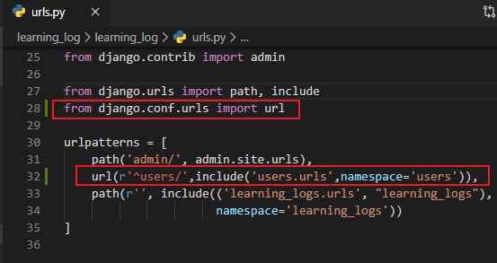
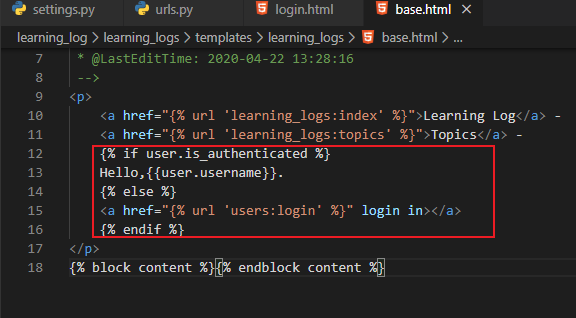
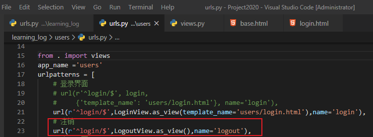

# 创建用户账户

[TOC]

## 一、应用程序users

我们首先使用命令startapp来创建一个名为users的应用程序：

```
PS D:\Project2020\learning_log> python manage.py startapp users
PS D:\Project2020\learning_log> ls
```


```
PS D:\Project2020\learning_log> ls users
```


### 1、将应用程序users添加到settings.py中

- settings.py

  

### 2、包含应用程序users的URL

- urls.py

  ```
  path(r'^users/',include('users.urls',namespace='users')),
  ```

  

  - 关于使用url与path
    - 建议您也切换为使用新的path()而不是url()
    - 如果要坚持使用url()或re_path()，请确保使用^和$来开始和结束正则表达式：

## 二、登陆页面

在目录learning_log/users/中，新建一个名为urls.py的文件，并在其中添加如下
代码：

- urls.py

  ```python
  
  '''为应用程序users定义url模式'''
  
  from django.conf.urls import url
  # from django.contrib.auth import login
  from django.contrib.auth.views import LoginView
  
  from . import views
  app_name ='users'
  urlpatterns = [
      # 登录界面
      # url(r'^login/$', login,
      #     {'template_name': 'users/login.html'}, name='login'),
      url(r'^login/$',LoginView.as_view(template_name='users/login.html'),name='login')
  ]
  
  ```

  ### 1、模板login.html

  在目录learning_log/users/中，创建一个名为templates的目录，并在其中创建一个名为users的目录。以下是模板login.html，你应将其存储到目录learning_log/users/templates/users/中：

- login.html

  ```html
  
  
  
  <p>Your username and password didn't match. Please try again.</p>
  
  <form method="post" action="">
      
      {{ form.as_p }}
      <button name="submit">log in</button>
      <input type="hidden" name="next" value="" />
  </form>
  {%% endblock content %}
  ```

### 2、链接到登陆页面

- base.html

  ```
      
      Hello,{{user.username}}.
      
      <a href="" login in></a>
      
  ```

  

### 3、使用登陆页面

访问http://localhost:8000/users/login/


## 三、注销

### 1、注销URL

下面的代码为注销定义了URL模式，该模式与URL http://locallwst:8000/users/logout/匹配。修改后的users/urls.py如下：

- urls.py

  ```python
      # 注销
      url(r'^login/$',LogoutView.as_view(),name='logout'),
  ```

  

### 2、视图函数logout_view()

函数logout_view()很简单：只是导入Django函数logout()，并调用它，再重定向到主页。请打开users/views.py，并输入下面的代码：

- view.py

```python
from django.shortcuts import render

# Create your views here.
from django.http import HttpResponseRedirect
from django.urls import reverse
from django.contrib.auth import logout

def logout_view(request):
    '''注销用户'''
    logout(request)
    return HttpResponseRedirect(reverse('learning_logs:index'))
```

### 3、链接到注销视图

- base.html

  

  

运行程序查看http://127.0.0.1:8000/


## 四、注册页面

### 1、注册页面的URL模式

下面的代码定义了注册页面的URL模式，它也包含在users/urls.py中：

- urls.py

  