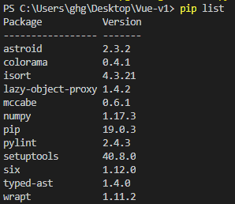

# Numpy数值计算

[TOC]

## 一、安装Numpy

### 1、安装

```shell
pip install numpy
```

- 使用pip安装的库默认放置在Python可执行程序目录下。库将被安装在`.\Python\\Lib\site-packages`目录下。

### 2、查看

```shell
pip list
```




## 二、Numpy数值计算

Numpy提供两种基本的对象：

- ndarray（N-dimensional Array Object）
- ufunc（Universal Function Object）

导入NumPy库

```python
import numpy as np
```

### 1、ndarray数据类型

- ndarray, 具有矢量算术运算和复杂广播能力的快速且节省空间的多维数组。 

- Numpy基本数据库类型

| 类型          | 类型代码 | 说明                                     |
| ------------- | -------- | ---------------------------------------- |
| int8、uint8   | i1、u1   | 有符号和无符号8位整型（1字节）           |
| int16、uint16 | i2、u2   | 有符号和无符号16位整型（2字节）          |
| int32、uint32 | i4、u4   | 有符号和无符号32位整型（4字节）          |
| int64、uint64 | i8、u8   | 有符号和无符号64位整型（8字节）          |
| float16       | f2       | 半精度浮点数                             |
| float32       | f4、f    | 单精度浮点数                             |
| float64       | f8、d    | 双精度浮点数                             |
| float128      | f16、g   | 扩展精度浮点数                           |
| complex64     | c8       | 分别用两个32位表示的复数                 |
| complex128    | c16      | 分别用两个64位表示的复数                 |
| complex256    | c32      | 分别用两个128位表示的复数                |
| bool          | ?        | 布尔型                                   |
| object        | O        | python对象                               |
| string        | Sn       | 固定长度字符串，每个字符1字节，如S10     |
| unicode       | Un       | 固定长度Unicode，字节数由系统决定，如U10 |

### 2、ndarray创建

### 3、随机数

### 4、ufunc

### 5、NumPy文件读取

#### 1、二进制文件读写

1.1、二进制文件读取

```python
arr1 = np.load('save_arry.npy')
print("Demo2: \n" , arr1)
```

1.2、二进制文件存储

```python
np.random.seed(123)
arr = np.random.rand(25).reshape(5,5)
print('Demo1: \n',  arr)
np.save('save_arry.npy',arr)
print('----Success----')
```

#### 2、文件列表形式数据读写

2.1、文件列表形式数据读取

```python
arr1 = np.loadtxt("savetxt.txt", delimiter=',')
print("Demo4: \n" ,arr1)
```

2.2、文件列表形式数据存储

```python
arr = np.arange(36).reshape(6,6)
print("Demo3: \n" ,arr)
# np.savetxt('savetxt.txt', arr ,fmt="%d" , delimiter=',')
# print("===success===")
```

