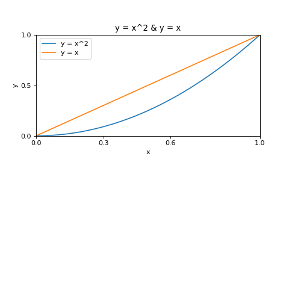
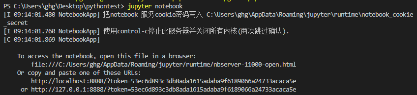
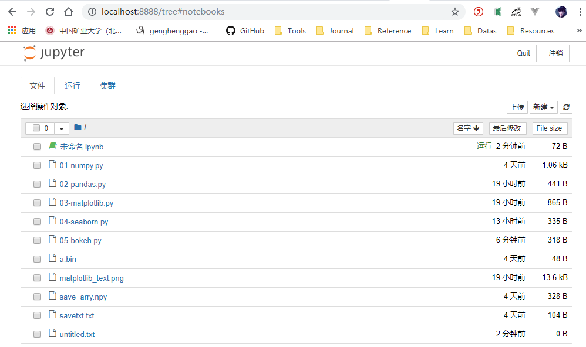
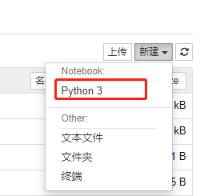
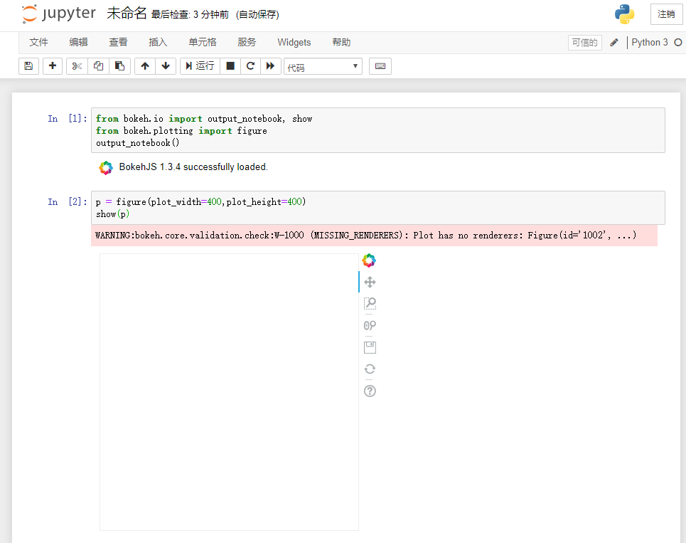
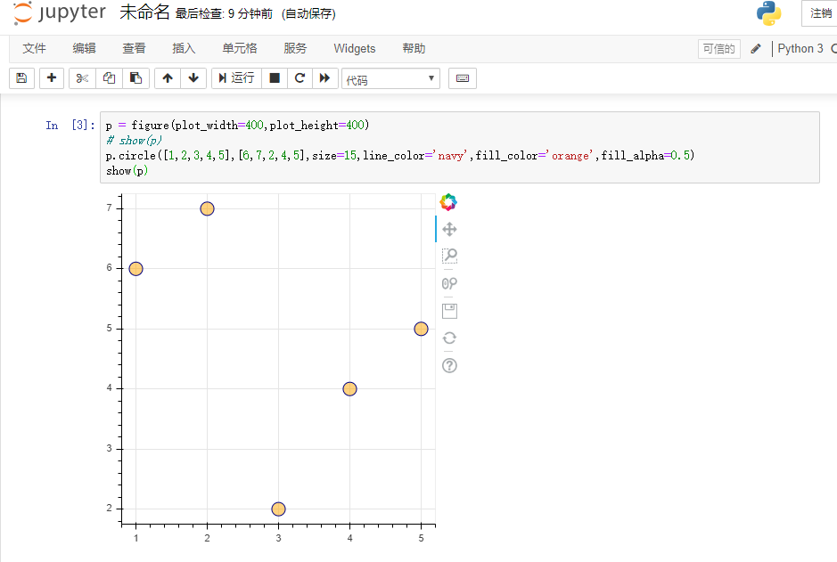

# Matplotlib

[TOC]

## 一、Matplotlib绘图基础

安装Matplotlib

```shell
pip install matplotlib
```

- canvas（画板）s
- figure（画布）
- axes（子图）
- 图表信息

### 1、编码风格

#### 1.1、基础流程

```python
import numpy as np
import matplotlib.pyplot as plt

fig = plt.figure(figsize=(6, 6), dpi=80) #创建画布
x = np.linspace(0, 1, 1000) 
fig.add_subplot(2, 1, 1)    #分为2*1的图形阵，选择 第一张图片绘图
plt.title('y = x^2 & y = x')    #添加标题
plt.xlabel('x') #添加x轴的名称 “x”
plt.ylabel('y') #添加y轴的名称 “y”
plt.xlim((0, 1))    #指定x轴范围(0,1)
plt.ylim((0, 1))    #指定y轴范围(0,1)
plt.xticks([0, 0.3, 0.6, 1])    #设置x轴的刻度
plt.yticks([0, 0.5, 1]) #设置y轴的刻度
plt.plot(x, x**2)
plt.plot(x, x)
plt.legend(['y = x^2', 'y = x'])    #添加图例
plt.savefig('matplotlib_text.png')  #保存图片
plt.show()
```



#### 1.2、绘图风格

### 2、动态rc参数

### 3、散点图

### 4、折线图

### 5、饼图

### 6、直方图和条形图

### 7、箱线图


## 二、Seaborn进阶绘图

安装seaborn模块

```shell
pip install seaborn
```


### 1、Seaborn基础

#### 1.1、简单绘图

#### 1.2、绘图风格

#### 1.3、调色板

### 2、关系图

#### 2.1、scatterplot

#### 2.2、lineplot

#### 2.3、replot

### 3、分类图

#### 3.1、stripplot

#### 3.2、swarmplot

#### 3.3、violinplot

#### 3.4、boxenplot

#### 3.5、pointplot

#### 3.6、countplot

#### 3.7、catplot

### 4、分布图

#### 4.1、kdeplot（核密度估计）

#### 4.2、rugplot

#### 4.3、distplot

### 5、回归图

#### 5.1、regplot

使用逻辑回归等非默认回归时，需要提前安装statesmodels模块与pasty模块。

#### 5.2、lmplot

### 6、矩阵图

#### 6.1、heatmap

#### 6.2、clustermap

### 7、网格图

#### 7.1、FaceGrid

#### 7.2、PairGrid

#### 7.3、JoinGrid


## 三、Bokeh交互绘图

 Bokeh是一款针对现代Web浏览器呈现功能的交互式可视化库 。

- 专门针对Web浏览器的交互式、可视化Python绘图库
- 可以做出像D3.js简洁漂亮的交互可视化效果，但是使用难度低于D3.js。
- 独立的HTML文档或服务端程序
- 可以处理大量、动态或数据流
- 支持Python (或Scala, R, Julia…)
- 不需要使用Javascript

Bokeh接口

- Charts: 高层接口，以简单的方式绘制复杂的统计图
- Plotting: 中层接口，用于组装图形元素
- Models: 底层接口，为开发者提供了最大的灵活性

安装Bokeh

```shell
pip install bokeh
```

### 0、Jupyter安装使用

安装jupyter

```shell
pip install jupyter
```

运行 notebook

```shell
jupyter notebook
```



网页查看




新建python3





### 1、基本构成语语法

#### 1.1、基础绘图

```python
p = figure(plot_width=400,plot_height=400)
# show(p)
p.circle([1,2,3,4,5],[6,7,2,4,5],size=15,line_color='navy',fill_color='orange',fill_alpha=0.5)
show(p)
```



#### 1.2、风格与主题

#### 1.3、数据源与转换

#### 1.4、添加注释

#### 1.5、布局

#### 1.6、链接与交互

### 2、常见图像绘制

#### 2.1、条形图与分类数据图

#### 2.2、网格图

NetworkX模块能在Bokeh中绘制网格图

安装NetworkX

```shell
pip install networkx
```

#### 2.3、地理图

Bokeh中提供了如下几种机制来绘制地理图

- GMapPlot：在谷歌地图上绘制。调用gmap函数并提供一个谷歌API即可。
- TileSource、especially WMTSTileSource：允许数据覆盖在各种地图上，包括谷歌地图。
- GeoJSONDataSource：允许从GeoJSON中读取数据（类似ColumnDataSource数据）

WTMS是平铺地图数据最常见的Web标准。

