# 函数

[TOC]

## 一、形参与实参

- 函数

```python
def calculate(x,y): #形参
    c = x**y
    return c

s = calculate(2,3) #实参
print(s)
```

- 形参

- 实参


## 二、位置参数与关键参数

默认值

位置参数、关键字实参

- *args 

- **kwargs

```python
def register(name,*args,**kwargs):
    print(name,args,kwargs)
    
register("Alex",22,"Student",sex="M",address="Jiangsu")

#Alex (22, 'Student') {'sex': 'M', 'address': 'Jiangsu'}
```


## 三、全局变量与局部变量

1、定义一个函数

```python
name = "henggao" #全局变量
def change():
    name = "Brill" #局部参数
    print(name)
    
change() 

print(name)
```

- 输出如下

```
Brill
henggao
```

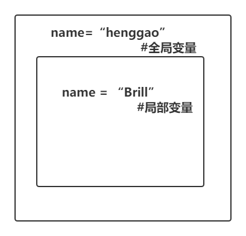

- 全局变量 global

- 局部变量 local


## 四、列表传递

```python
names = ["henggao","Brill"]
def change():
    names.append("James")
    return names

change()
print(names)
```

- 输出

```
['henggao', 'Brill', 'James']
```


## 五、嵌套函数

```python
name = " 全局name"
def change():
    name = " change name"

    def change2():
        name = "change2 name"
        print("第三层打印 " + name)
    change2()
    print("第二层打印 " + name)

change()
print("最外层打印 " + name)
```

- 输出

  ```
  第三层打印 change2 name
  第二层打印  change name
  最外层打印  全局name
  ```

  

## 六、匿名函数

```python
def calculate(x):
    return x**2

m = calculate(2)
print(m)

# 等价于匿名函数
n = lambda y:y**2

print(n(2))
```

- 输出

  ```
  4
  4
  ```

  

- 结合map函数使用

```python
def calc(x):
    return x**2

# res = map(calc,[1,2,3,4])
res = map(lambda x:x**2,[1,2,3,4])
for i in res:
    print(i)
```


## 七、高阶函数

变量可以指向函数，函数的参数能接受变量，那么一个函数就可以接受另一个函数作为参数，这种函数就称为高阶函数。

- 能接收一个或多个函数
- return 返回另一个函数

```python
def get_abs(n):
    return abs(n)

def add(x,y,f):
    return f(x) + f(y)

print(add(2,-10,get_abs))
```

- 输出

  ```
  12
  ```

  

## 八、递归函数

```python
# 循环
n = 100
 
while n > 0 :
    n = int(n / 2)
    print(n)

# 函数递归
def calc(n):
    print(n)
    n = int(n / 2)
    if n > 0:
        calc(n)

calc(100)
```

- 输出

  ```
  # 循环输出
  50
  25
  12
  6
  3
  1
  0
  
  # 递归函数输出
  100
  50
  25
  12
  6
  3
  1
  0
  1
  3
  6
  12
  25
  50
  ```

  - 解析图

  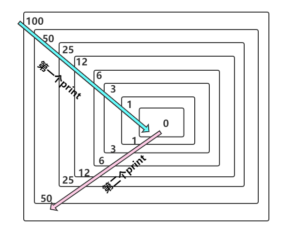

- 类似于压栈，递归效率不高。

## 九、内置函数


## 十、装饰器

装饰器：在不改变源代码的情况下，给函数添加功能。

语法糖

### 1、例子

```python
'''
@Description: 
@Version: 1.0
@Autor: Henggao
@Date: 2020-02-22 17:57:47
@LastEditors: Henggao
@LastEditTime: 2020-02-22 20:21:32
'''
account = {
    "is_authentic": False,  # 用户登录就改成True
    "username": "henggao",  # 用户名
    "password": "abc123"  # 用户密码
}


def login():
    if account["is_authentic"] is False:
        username = input("username :")
        password = input("password :")
        if username == account["username"] and password == account["password"]:
            print("Welcome login ...")
            account["is_authentic"] = True
        else:
            print("Wrong username or passwprd")
    else:
        print("用户已登录，验证通过")


def home():
    print("-----首页-----")


def book():
    print("-----书籍------")


def vedio():
    print("-----视频专区")


home()
book()
vedio()

```

运行输出

```
-----首页-----
-----书籍------
-----视频专区
```


#### 要求一

给book或者vedio模块加上验证。

##### 思路一：

- 直接给book模块添加login()方法

  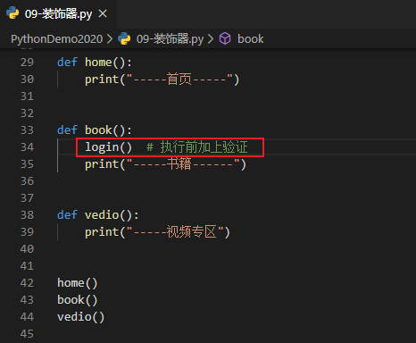

运行输出，这是需要验证用户名和密码了

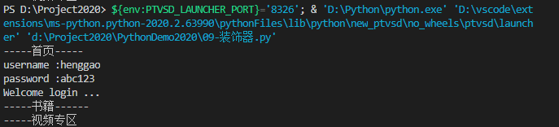

这样做的问题是，我们需要改变book模块，这违反了项目开发中“**开放-封闭**”原则。

- 封闭：已经实现的功能代码不应该被修改
- 开放：对现有的功能的扩展开放

##### 思路二：

不改变book原代码，给book添加功能。

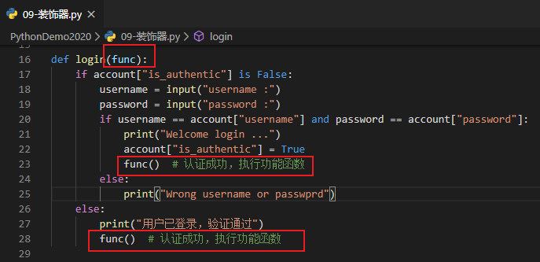

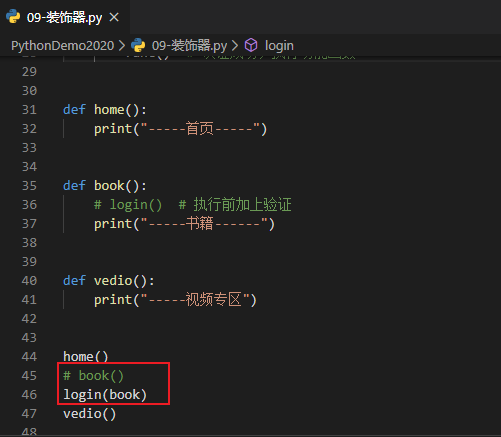

这种方式没有改变book原代码，但**调用方式**改变了，“开放-封闭”原则是原有的代码不能改，原有的调用方式也不要能改。

##### 思路三

如下图修改

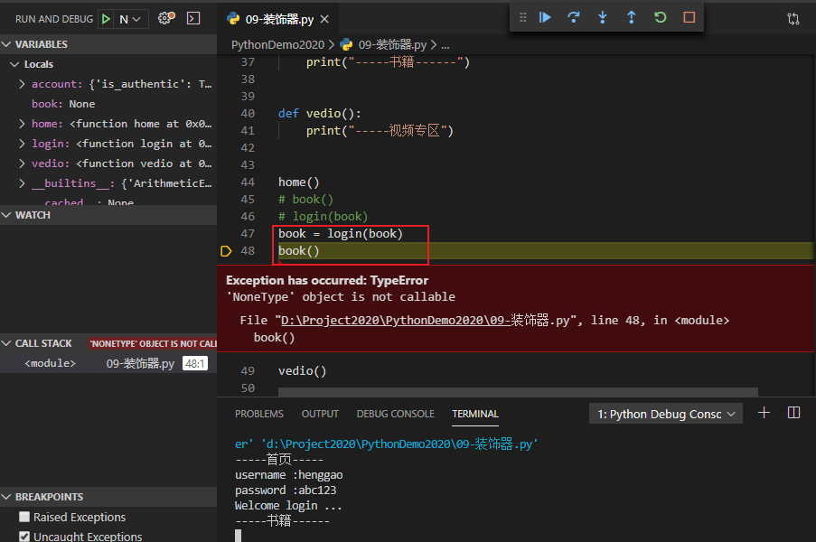

book()这样使用是调用login()?

##### 思路四

思路三中book调用是NoneType，可以使用“嵌套函数+闭包”方式解决，加上嵌套函数返回inner内存地址。

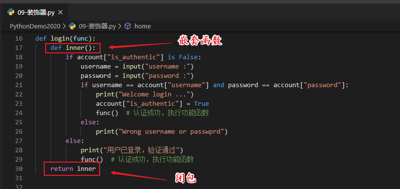

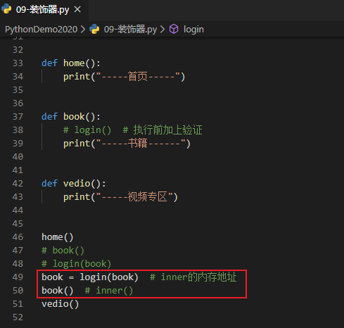

完整代码

```python
'''
@Description: 
@Version: 1.0
@Autor: Henggao
@Date: 2020-02-22 17:57:47
@LastEditors: Henggao
@LastEditTime: 2020-02-22 21:09:09
'''
account = {
    "is_authentic": False,  # 用户登录就改成True
    "username": "henggao",  # 用户名
    "password": "abc123"  # 用户密码
}


def login(func):
    def inner():
        if account["is_authentic"] is False:
            username = input("username :")
            password = input("password :")
            if username == account["username"] and password == account["password"]:
                print("Welcome login ...")
                account["is_authentic"] = True
                func()  # 认证成功，执行功能函数
            else:
                print("Wrong username or passwprd")
        else:
            print("用户已登录，验证通过")
            func()  # 认证成功，执行功能函数
    return inner


def home():
    print("-----首页-----")


def book():
    # login()  # 执行前加上验证
    print("-----书籍------")


def vedio():
    print("-----视频专区")


home()
# book()
# login(book)
book = login(book)  # inner的内存地址
book()  # inner()
vedio()

```

输出

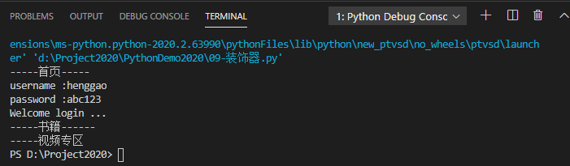

下面这句可以简写成`@login`

```
book = login(book)  # inner的内存地址
```

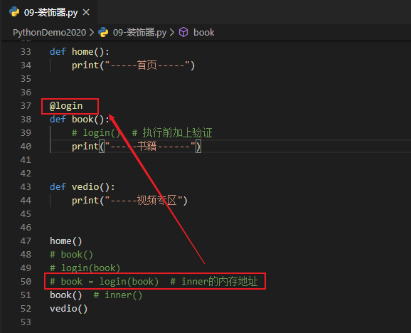

#### 要求二

当vedio模块中vip等级达到>3,可以解锁新区域。

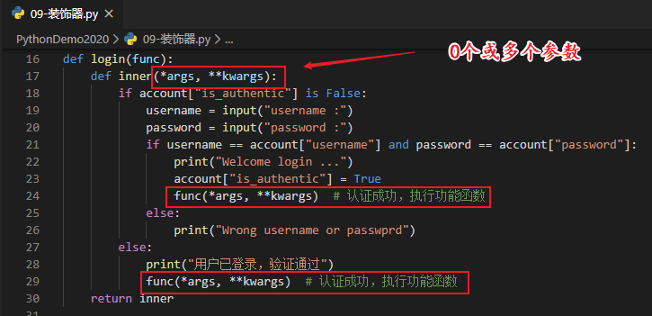

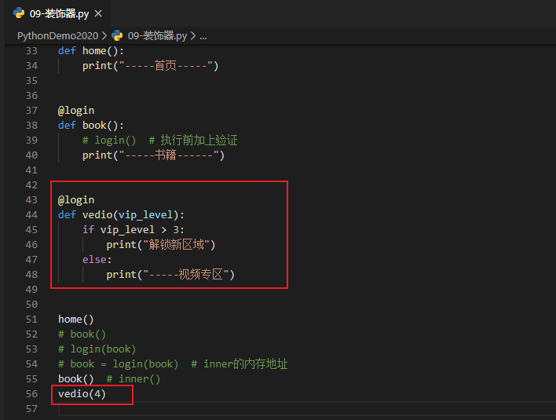

输出

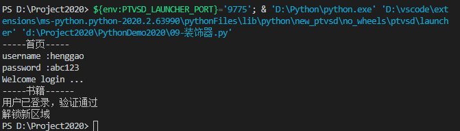

完整代码

```python
'''
@Description: 
@Version: 1.0
@Autor: Henggao
@Date: 2020-02-22 17:57:47
@LastEditors: Henggao
@LastEditTime: 2020-02-22 21:28:18
'''
account = {
    "is_authentic": False,  # 用户登录就改成True
    "username": "henggao",  # 用户名
    "password": "abc123"  # 用户密码
}


def login(func):
    def inner(*args, **kwargs):
        if account["is_authentic"] is False:
            username = input("username :")
            password = input("password :")
            if username == account["username"] and password == account["password"]:
                print("Welcome login ...")
                account["is_authentic"] = True
                func(*args, **kwargs)  # 认证成功，执行功能函数
            else:
                print("Wrong username or passwprd")
        else:
            print("用户已登录，验证通过")
            func(*args, **kwargs)  # 认证成功，执行功能函数
    return inner


def home():
    print("-----首页-----")


@login
def book():
    # login()  # 执行前加上验证
    print("-----书籍------")


@login
def vedio(vip_level):
    if vip_level > 3:
        print("解锁新区域")
    else:
        print("-----视频专区")


home()
# book()
# login(book)
# book = login(book)  # inner的内存地址
book()  # inner()
vedio(4)

```

