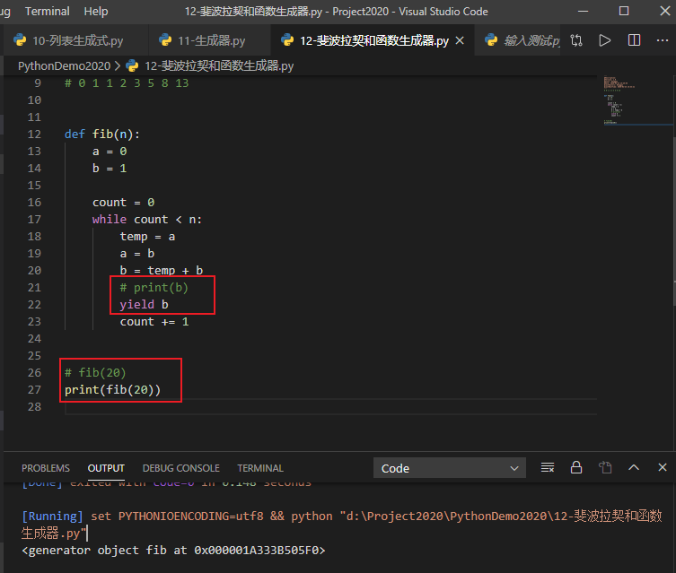

## 斐波拉契数列

斐波拉契数列

```python
# 0 1 1 2 3 5 8 13
a = 0
b = 1

count = 0
while count < 20:
    temp = a
    a = b
    b = temp + b
    print(b)
    count += 1
```

输出

```
1
2
3
5
8
13
21
34
55
89
144
233
377
610
987
1597
2584
4181
6765
10946
```

修改为函数

```python
# 0 1 1 2 3 5 8 13

def fib(n):
    a = 0
    b = 1

    count = 0
    while count < n:
        temp = a
        a = b
        b = temp + b
        print(b)
        count += 1

fib(20)
```

将上述改为函数生成器



```python
'''
@Description: 
@Version: 1.0
@Autor: Henggao
@Date: 2020-02-23 14:25:54
@LastEditors: Henggao
@LastEditTime: 2020-02-23 14:46:42
'''
# 0 1 1 2 3 5 8 13


def fib(n):
    a = 0
    b = 1

    count = 0
    while count < n:
        temp = a
        a = b
        b = temp + b
        # print(b)
        yield b  # 暂停
        count += 1


# fib(20)
print(fib(20))

f = fib(20)
# print(next(f))
# print(next(f))
# print("---do sth else---")
# print(next(f))
# print(f.__next__())  # 和print(next(f))一样
# print(next(f))
for f in f:
    print(f)

```


## 生成器实现并发编程

1、外部向函数内部赋值

```python
'''
@Description: 
@Version: 1.0
@Autor: Henggao
@Date: 2020-02-23 15:19:45
@LastEditors: Henggao
@LastEditTime: 2020-02-23 15:24:29
'''


def g_test():
    while True:
        n = yield  # 接收到的值给n
        print("receive from outside : ", n)


g = g_test()
g.__next__()  # 调用生成器，同时会发送None到yield

for i in range(10):
    g.send(i)  # 调用生成器，同时发送i

```

- 输出

```
receive from outside : 0

receive from outside : 1

receive from outside : 2

receive from outside : 3

receive from outside : 4

receive from outside : 5

receive from outside : 6

receive from outside : 7

receive from outside : 8

receive from outside : 9
```


2、单线程多并发

```python
'''
@Description: 
@Version: 1.0
@Autor: Henggao
@Date: 2020-02-23 15:42:15
@LastEditors: Henggao
@LastEditTime: 2020-02-23 15:54:34
'''


def consumer(name):
    print("------消费者%s开始吃包子了......" % name)
    while True:
        baozi = yield  # 接受外面的包子
        print("消费者%s接收到的包子编号： %s" % (name, baozi))


c1 = consumer("c1")
c2 = consumer("c2")
c3 = consumer("c3")

c1.__next__()  # 调用生成器，同时会发送到yield
c2.__next__()
c3.__next__()

for i in range(10):
    print("--------生产了第%s批包子----------")
    c1.send(i)  # 调用生成器，同时发送i
    c2.send(i)
    c3.send(i)

```

- 输出

```
------消费者c1开始吃包子了......
------消费者c2开始吃包子了......
------消费者c3开始吃包子了......
--------生产了第%s批包子----------
消费者c1接收到的包子编号： 0
消费者c2接收到的包子编号： 0
消费者c3接收到的包子编号： 0
--------生产了第%s批包子----------
消费者c1接收到的包子编号： 1
消费者c2接收到的包子编号： 1
消费者c3接收到的包子编号： 1
--------生产了第%s批包子----------
消费者c1接收到的包子编号： 2
消费者c2接收到的包子编号： 2
消费者c3接收到的包子编号： 2
--------生产了第%s批包子----------
消费者c1接收到的包子编号： 3
消费者c2接收到的包子编号： 3
消费者c3接收到的包子编号： 3
--------生产了第%s批包子----------
消费者c1接收到的包子编号： 4
消费者c2接收到的包子编号： 4
消费者c3接收到的包子编号： 4
--------生产了第%s批包子----------
消费者c1接收到的包子编号： 5
消费者c2接收到的包子编号： 5
消费者c3接收到的包子编号： 5
--------生产了第%s批包子----------
消费者c1接收到的包子编号： 6
消费者c2接收到的包子编号： 6
消费者c3接收到的包子编号： 6
--------生产了第%s批包子----------
消费者c1接收到的包子编号： 7
消费者c2接收到的包子编号： 7
消费者c3接收到的包子编号： 7
--------生产了第%s批包子----------
消费者c1接收到的包子编号： 8
消费者c2接收到的包子编号： 8
消费者c3接收到的包子编号： 8
--------生产了第%s批包子----------
消费者c1接收到的包子编号： 9
消费者c2接收到的包子编号： 9
消费者c3接收到的包子编号： 9
```

