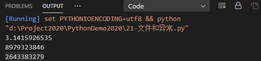

# 文件和异常

[TOC]

## 一、读取文件

在文件夹PythonDemo2020下建立一个pi_digits.txt

```txt
3.1415926535
8979323846
2643383279
```

编写py文件读取pi_digits.txt

```python
# with open('./PythonDemo2020/pi_digits.txt') as file_object:
with open('PythonDemo2020\pi_digits.txt') as file_object:
    contents = file_object.read()
    print(contents)
```

输出如下




## 二、写入空文件

编写write_message.py

```python
filename = 'PythonDemo2020/programming.txt'
with open(filename, 'w') as file_object:
    file_object.write("I love programming.")
```

- 读取模式（'r'）
- 写入模式（'w'）
- 附加模式（'a'）
- 读取和写入文件的模式（'r+'）
- 如果你省略了模式实参，Python将以默认的只读模式打开文件。

- 以写入（'w'）模式打开文件时千万要小心，因为如果指定的文件已经存在，Python将在**返回文件对象前清空该文件**。
- 如果你要给文件添加内容，而不是覆盖原有的内容，可以附加模式打开文件。


## 三、使用try-except 代码块

```python
try:
    print(5/0)
except ZeroDivisionError:
    print("You can't divide by zero!")
```


## 四、try-except-else代码块


## 五、存储数据

- 使用函数json.dump()，将数字列表存储到文件numbers.json中。

```python
import json
numbers = [2, 3, 5, 7, 11, 13,15]
filename = 'pythondemo2020/numbers.json'
with open(filename, 'w') as f_obj:
    json.dump(numbers, f_obj)
```

- 使用json.load()将这个列表读取到内存中


## 六、列子

```python
import json
def get_data():
    filename = 'pythondemo2020/favorite_data.json'
    try:
        with open(filename, 'r') as f:
            num = json.load(f)
            # print('your favorite number is :' + num +'.')
    except FileNotFoundError:
        return None
    else:
        return num


def get_new_data():
    filename = 'pythondemo2020/favorite_data.json'
    your_favourite_data = input("Please write  your favorite number : ")
    with open(filename, 'w') as f:
        json.dump(your_favourite_data, f)
        return your_favourite_data


def prove_data():
    # num1 = input("input your number : ")
    num = get_data()
    if num:
        print('Data from get_data.Your favorite number is : ' + num + '.')

    else:
        num2 = get_new_data()
        print('Add new Data.Your favorite number is : ' + num2 + '.')


prove_data()

```

