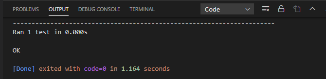

# 测试代码

[TOC]

## 一、知识点

- Python模块unittest中的工具来测试代码。

## 二、例子

### Demo1

问题：

编写一个函数，它接受两个形参：一个城市名和一个国家名。这个函数返回一个格式为City, Country 的字符串，如Santiago, Chile。将这个函数存储在一个名为city _functions.py 的模块中。
创建一个名为test_cities.py 的程序，对刚编写的函数进行测试（别忘了，你需要导
入模块unittest 以及要测试的函数）。编写一个名为test_city_country()的方法，核实使用类似于'santiago'和'chile'这样的值来调用前述函数时，得到的字符串是正确的。
运行test_cities.py，确认测试test_city_country()通过了。

1、创建一个函数

- city_country_function.py

```python
def get_city_country(city, country):
    '''打印城市和国家'''
    city_country = city.title() + '-' + country.title()
    return city_country

```

2、使用unittest测试

- test_cities.py

```python
'''
@Description: 
@Version: 1.0
@Autor: Henggao
@Date: 2020-03-11 17:22:11
@LastEditors: Henggao
@LastEditTime: 2020-03-12 11:19:46
'''
import sys
import os
#  __file__获取执行文件相对路径，整行为取上一级的上一级目录
BASE_DIR = os.path.dirname(os.path.dirname(os.path.abspath(__file__)))
sys.path.append(BASE_DIR)

from PythonDemo2020.city_country_function import get_city_country
import unittest

class NameTestCase(unittest.TestCase):
    '''测试city_country.py'''

    def test_city_country(self):
        '''显示城市和国家'''
        show_city_country = get_city_country('beijing', 'China')


unittest.main()

```

3、运行test_cities.py




### Demo2

问题：修改前面的函数，使其包含第三个必不可少的形参population，并
返回一个格式为City, Country – population xxx 的字符串，如Santiago, Chile –
population 5000000。运行test_cities.py，确认测试test_city_country()未通过。
修改上述函数，将形参population 设置为可选的。再次运行test_cities.py，确认测
试test_city_country()又通过了。
再编写一个名为test_city_country_population()的测试，核实可以使用类似于
'santiago'、'chile'和'population=5000000'这样的值来调用这个函数。再次运行
test_cities.py，确认测试test_city_country_population()通过了。

1、修改city_country_function.py

```python
def get_city_country(city, country, population):
    '''打印城市和国家'''
    city_country = city.title() + ',' + country.title() + '-'+ population
    return city_country
```

2、运行test_cities.py

```
E
======================================================================
ERROR: test_city_country (__main__.NameTestCase)
显示城市和国家
----------------------------------------------------------------------
Traceback (most recent call last):
  File "d:\Project2020\PythonDemo2020\25-test_cities.py", line 23, in test_city_country
    show_city_country = get_city_country('beijing', 'China')
TypeError: get_city_country() missing 1 required positional argument: 'population'

----------------------------------------------------------------------
Ran 1 test in 0.001s

FAILED (errors=1)

[Done] exited with code=1 in 1.148 seconds
```


### Demo3

问题：修改上述函数，将形参population 设置为可选的。再次运行test_cities.py，确认测试test_city_country()又通过了。

1、修改city_country_function.py

```
def get_city_country(city, country, population=''):
    if population:
        '''打印城市和国家'''
        city_country = city.title() + ',' + country.title() + '-'+ str(population)
        return city_country
    else:
        '''打印城市和国家'''
        city_country = city.title() + ',' + country.title()
        return city_country

```

2、运行test_cities.py

```
.
----------------------------------------------------------------------
Ran 1 test in 0.000s

OK
```


### Demo4

问题：

再编写一个名为test_city_country_population()的测试，核实可以使用类似于
'santiago'、'chile'和'population=5000000'这样的值来调用这个函数。再次运行
test_cities.py，确认测试test_city_country_population()通过了。

1、添加test_city_country_population()

- test_cities.py

```python
import sys
import os
#  __file__获取执行文件相对路径，整行为取上一级的上一级目录
BASE_DIR = os.path.dirname(os.path.dirname(os.path.abspath(__file__)))
sys.path.append(BASE_DIR)

from PythonDemo2020.city_country_function import get_city_country
import unittest

class NameTestCase(unittest.TestCase):
    '''测试city_country.py'''

    def test_city_country(self):
        '''显示城市和国家'''
        show_city_country = get_city_country('beijing', 'China')

    def test_city_country_population(self):
        show_city_country = get_city_country('beijing', 'China',200000)


unittest.main()
```

2、运行test_cities.py

```
..
----------------------------------------------------------------------
Ran 2 tests in 0.000s

OK
```


## Demo5：setup()使用

问题

编写一个名为Employee 的类，其方法__init__()接受名、姓和年薪，并将它们都存储在属性中。编写一个名为give_raise()的方法，它默认将年薪增加5000美元，但也能够接受其他的年薪增加量。
为Employee 编写一个测试用例，其中包含两个测试方法：test_give_default_
raise()和test_give_custom_raise()。使用方法setUp()，以免在每个测试方法中都创
建新的雇员实例。运行这个测试用例，确认两个测试都通过了。

1、Employee .py

```python
'''
@Description: 
@Version: 1.0
@Autor: Henggao
@Date: 2020-03-12 20:51:27
@LastEditors: Henggao
@LastEditTime: 2020-03-12 22:03:00
'''


class Employee():
    def __init__(self, first_name, last_name, salary):
        self.first_name = first_name
        self.last_name = last_name
        self.salary = salary

    def give_raise(self, rasie_salary=5000):
        '''薪资默认增加5000'''
        self.salary += int(rasie_salary)
        return self.salary

# my_employee = Employee('a','b',3000)
# print(my_employee.first_name)
# print(my_employee.last_name)
# print(my_employee.salary)
# raise_salary = my_employee.give_raise()
# print(raise_salary)

```

2、测试

- test_salary.py

```python
'''
@Description: 
@Version: 1.0
@Autor: Henggao
@Date: 2020-03-12 20:58:23
@LastEditors: Henggao
@LastEditTime: 2020-03-12 22:01:04
'''
import sys
import os
'''__file__获取执行文件相对路径，整行为取上一级的上一级目录'''
BASE_DIR = os.path.dirname(os.path.dirname(os.path.abspath(__file__)))
sys.path.append(BASE_DIR)

from PythonDemo2020.employee import Employee
import unittest

class TestSalary(unittest.TestCase):

    def setUp(self):

        self.my_employee = Employee('lebron','james',3500)

    def test_give_default_raise(self):

        name =  self.my_employee.first_name.title() + ' ' + self.my_employee.last_name.title()
        test_salary =  self.my_employee.give_raise()
        print('=====默认增加5000=====')
        print(name + ' :\t' + str(test_salary))

    def test_give_custom_raise(self):

        print('=====自定义增加=====')
        name =  self.my_employee.first_name.title() + ' ' + self.my_employee.last_name.title()
        test_salary = self.my_employee.give_raise(6000)

        print(name + ' :\t' + str(test_salary))


unittest.main()

```

3、输出

```
..
----------------------------------------------------------------------
Ran 2 tests in 0.000s

OK
=====自定义增加=====
Lebron James :	9500
=====默认增加5000=====
Lebron James :	8500
```

