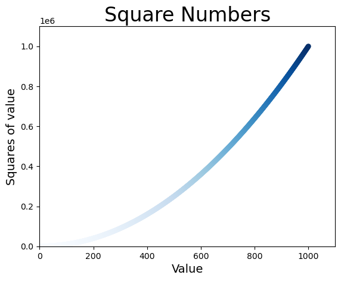
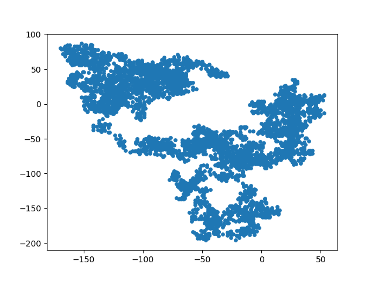
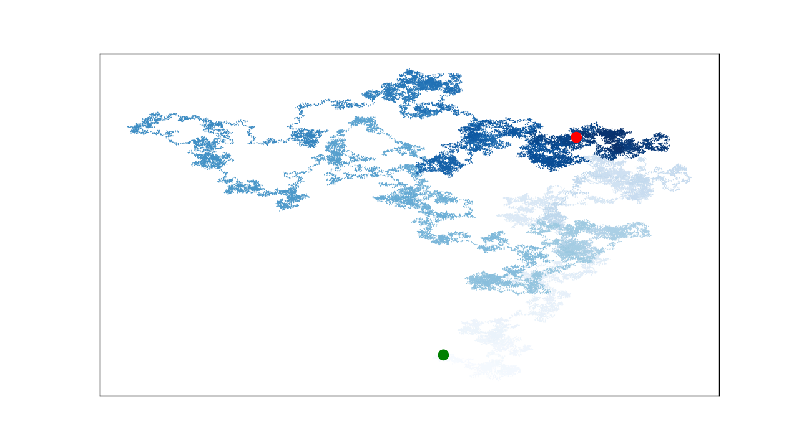
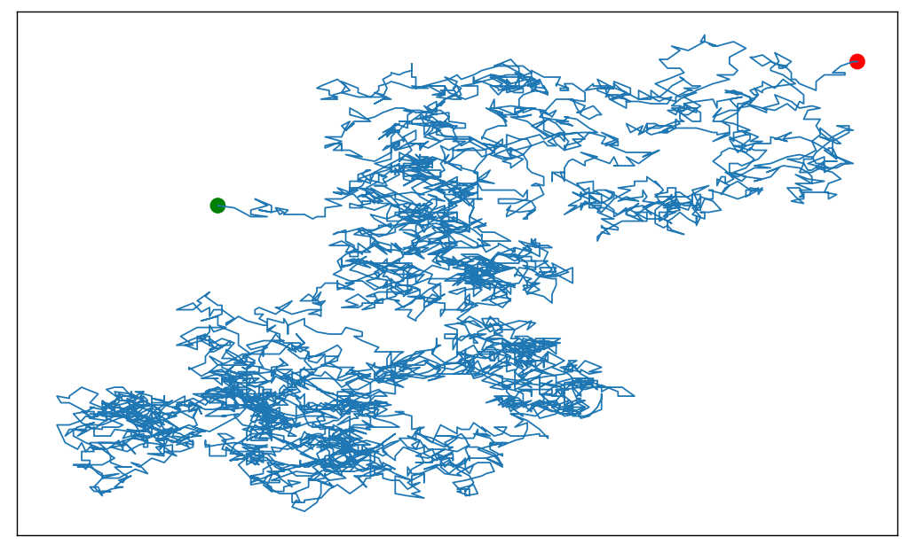
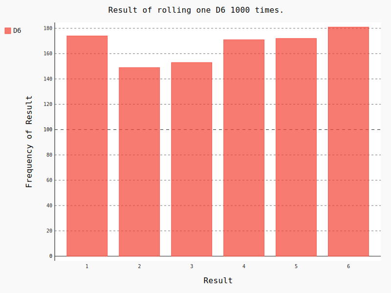
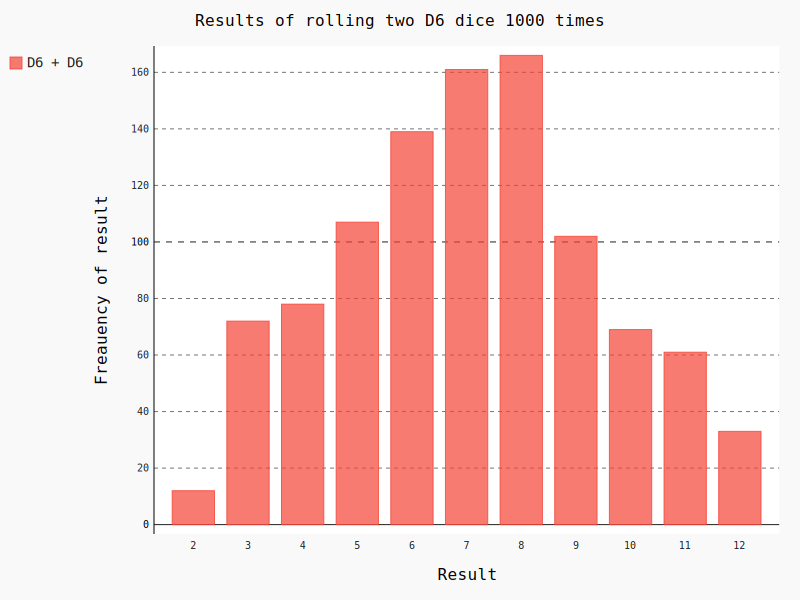
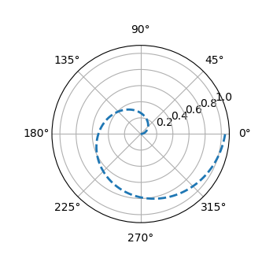

# matplotlib

[TOC]

## 一、绘制简单的折线图

- 01-mpl-squares.py

```python
'''
@Description: 
@Version: 1.0
@Autor: Henggao
@Date: 2020-03-15 11:43:57
@LastEditors: Henggao
@LastEditTime: 2020-03-15 15:43:52
'''
import matplotlib.pyplot as plt

input_values = [1,2,3,4,5]
squares = [1, 4, 9, 16, 25]
plt.plot(input_values, squares, linewidth=5)

# 设置图标标题，坐标加上标签
plt.title("Square Numbers", fontsize=24)
plt.xlabel("Value", fontsize=14)
plt.ylabel("Square of value", fontsize=14)

# 设置刻度标记大小
plt.tick_params(axis='both', labelsize=14)

plt.show()

```


## 二、使用scatter()绘制散点图

- 02-scatter_squares.py

```python
'''
@Description: 
@Version: 1.0
@Autor: Henggao
@Date: 2020-03-15 15:45:29
@LastEditors: Henggao
@LastEditTime: 2020-03-15 15:54:33
'''

import matplotlib.pyplot as plt

x_values = [1, 2, 3, 4, 5]
y_values = [1, 4, 9, 16, 25]

plt.scatter(x_values, y_values, s=100)
# 设置图标标题并给坐标轴加上标签
plt.title("Square Numbers", fontsize=24)
plt.xlabel("Value", fontsize=14)
plt.ylabel("Squares of value", fontsize=14)

# 设置刻度标记的大小
plt.tick_params(axis='both', which='major', labelsize=14)

plt.show()

```

- 03-scatter_squares.py

  ```python
  '''
  @Description: 
  @Version: 1.0
  @Autor: Henggao
  @Date: 2020-03-15 15:56:33
  @LastEditors: Henggao
  @LastEditTime: 2020-03-15 16:59:03
  '''
  
  import matplotlib.pyplot as plt
  
  x_values = list(range(1, 1001))
  y_values = [x**2 for x in x_values]
  
  plt.scatter(x_values, y_values, c=y_values,
              cmap=plt.cm.Blues, edgecolors='none', s=40)
  
  # 设置图标标题并给坐标轴加上标签
  plt.title("Square Numbers", fontsize=24)
  plt.xlabel("Value", fontsize=14)
  plt.ylabel("Squares of value", fontsize=14)
  
  # 设置刻度标记的大小
  # plt.tick_params(axis='both', which='major', labelsize=14)
  
  # 设置每个坐标的取值范围
  plt.axis([0, 1100, 0, 1100000])
  # plt.show()
  plt.savefig('squares_plot.png', bbox_inches='tight')
  
  ```

- 运行03-scatter_squares.py，生成文件squares_plot.png

  

## 三、随机漫步数（一）

- random_walk.py

  ```python
  '''
  @Description: 
  @Version: 1.0
  @Autor: Henggao
  @Date: 2020-03-15 18:48:06
  @LastEditors: Henggao
  @LastEditTime: 2020-03-15 19:15:29
  '''
  
  from random import choice
  
  
  class RandomWalk():
      ''' 一个生成随机漫步数据的类'''
  
      def __init__(self, num_points=5000):
          '''初始化随机漫步的属性'''
          self.num_points = num_points
  
          # 所有随机漫步都始于（0，0）
          self.x_values = [0]
          self.y_values = [0]
  
      def fill_walk(self):
          '''计算随机漫步包含的所有点'''
  
          # 不断漫步，知道列表达到指定的长度
          while len(self.x_values) < self.num_points:
              # 决定前进方向及沿这个方向前进的距离
              x_direction = choice([1, -1])
              x_distance = choice([0, 1, 2, 3, 4])
              x_step = x_direction * x_distance
  
              y_direction = choice([1, -1])
              y_distance = choice([0, 1, 2, 3, 4])
              y_step = y_direction * y_distance
  
              # 拒绝原地踏步
              if x_step == 0 and y_step == 0:
                  continue
  
              # 计算下一个点的x和y值
              next_x = self.x_values[-1] + x_step
              next_y = self.y_values[-1] + y_step
  
              self.x_values.append(next_x)
              self.y_values.append(next_y)
  
  ```

- rw_visual.py

  ```python
  '''
  @Description: 
  @Version: 1.0
  @Autor: Henggao
  @Date: 2020-03-15 19:13:54
  @LastEditors: Henggao
  @LastEditTime: 2020-03-15 19:25:19
  '''
  import sys,os
  #  __file__获取执行文件相对路径，整行为取上一级的上一级目录
  BASE_DIR = os.path.dirname(os.path.dirname(os.path.abspath(__file__)))
  sys.path.append(BASE_DIR)
  
  import matplotlib.pylab as plt
  
  from Pythonvisual.random_walk import RandomWalk
  
  # 创建一个RandomWalk实例，并将其包含的点都绘制出来
  
  rw = RandomWalk()
  rw.fill_walk()
  plt.scatter(rw.x_values, rw.y_values, s=15)
  plt.show()
  
  ```

- 运行rw_visual.py如图

  

## 四、随机慢步数（二）

- rw_visual.py

  ```python
  '''
  @Description: 
  @Version: 1.0
  @Autor: Henggao
  @Date: 2020-03-15 19:13:54
  @LastEditors: Henggao
  @LastEditTime: 2020-03-15 20:50:04
  '''
  import sys
  import os
  #  __file__获取执行文件相对路径，整行为取上一级的上一级目录
  BASE_DIR = os.path.dirname(os.path.dirname(os.path.abspath(__file__)))
  sys.path.append(BASE_DIR)
  
  from Pythonvisual.random_walk import RandomWalk
  import matplotlib.pylab as plt
  
  # 只要程序处于活动状态，就不断的模拟随机漫步
  while True:
      # 创建一个RandomWalk实例，并将其包含的点都绘制出来
      rw = RandomWalk(50000)
      rw.fill_walk()
  
      # 设置绘制窗口尺寸
      plt.figure(dpi=128,figsize=(10,6))
  
      point_numbers = list(range(rw.num_points))
  
      plt.scatter(rw.x_values, rw.y_values,c=point_numbers, 
                      cmap=plt.cm.Blues,edgecolor='none', s=1)
      
      # 突出起点和终点
      plt.scatter(0,0,c='green',edgecolors='none',s =100)
      plt.scatter(rw.x_values[-1], rw.y_values[-1], c='red', edgecolors='none',
                      s=100)
  
      # 隐藏坐标轴
      plt.axes().get_xaxis().set_visible(False)
      plt.axes().get_yaxis().set_visible(False)
      
      plt.show()
  
      keep_running = input("Make anther walk? (y/n):")
      if keep_running == 'n':
          break
  
  ```

- 运行rw_visual.py如图：

  

## 五、练习

问题：修改rw_visual.py，将其中的plt.scatter()替换为plt.plot()。为模拟花粉在水滴表面的运动路径，向plt.plot()传递rw.x_values 和rw.y_values，并指定实参值linewidth。使用5000 个点而不是50 000 个点。

- rw_visual2.py

```python
'''
@Description: 
@Version: 1.0
@Autor: Henggao
@Date: 2020-03-15 19:13:54
@LastEditors: Henggao
@LastEditTime: 2020-03-16 13:24:45
'''
import sys
import os
#  __file__获取执行文件相对路径，整行为取上一级的上一级目录
BASE_DIR = os.path.dirname(os.path.dirname(os.path.abspath(__file__)))
sys.path.append(BASE_DIR)

from Pythonvisual.random_walk import RandomWalk
import matplotlib.pylab as plt

# 只要程序处于活动状态，就不断的模拟随机漫步
while True:
    # 创建一个RandomWalk实例，并将其包含的点都绘制出来
    rw = RandomWalk(5000)
    rw.fill_walk()

    # 设置绘制窗口尺寸
    plt.figure(dpi=128,figsize=(10,6))

    plt.plot(rw.x_values, rw.y_values, linewidth=1)  

    # 突出起点和终点
    plt.scatter(0,0,c='green',edgecolors='none',s =100)
    plt.scatter(rw.x_values[-1], rw.y_values[-1], c='red', edgecolors='none',
                    s=100)
                    
    # 隐藏坐标轴
    plt.axes().get_xaxis().set_visible(False)
    plt.axes().get_yaxis().set_visible(False)
    
    # plt.show()
    # 保存图片
    plt.savefig('water_visual2.png', bbox_inches='tight')

    keep_running = input("Make anther walk? (y/n):")
    if keep_running == 'n':
        break

```

- 运行rw_visual2.py，如图




## 六、使用Pygal 模拟掷骰子

### 1、掷骰子

- 创建die.py，骰子类

  ```python
  '''
  @Description: 
  @Version: 1.0
  @Autor: Henggao
  @Date: 2020-03-16 14:26:34
  @LastEditors: Henggao
  @LastEditTime: 2020-03-16 14:29:30
  '''
  
  from random import randint
  
  class Die():
      '''表示一个骰子的类'''
  
      def __init__(self,num_sides=6):
          ''''骰子默认为6面'''
          self.num_sides =num_sides
  
      def roll(self):
          '''返回一个位于1和投资面之间的随机值'''
          return randint(1,self.num_sides)
  
  ```

- 创建die_visual.py,实现掷骰子、分析结果、绘制直方图。

  ```python
  '''
  @Description: 
  @Version: 1.0
  @Autor: Henggao
  @Date: 2020-03-16 15:16:12
  @LastEditors: Henggao
  @LastEditTime: 2020-03-16 15:59:35
  '''
  
  import sys
  import os
  #  __file__获取执行文件相对路径，整行为取上一级的上一级目录
  BASE_DIR = os.path.dirname(os.path.dirname(os.path.abspath(__file__)))
  sys.path.append(BASE_DIR)
  
  from Pythonvisual.die import Die
  import pygal
  
  # 创建一个D6
  die = Die()
  
  # 掷几次骰子，并将结果存储在一个列表中
  results = []
  for roll_num in range(1000):
      result = die.roll()
      results.append(result)
  
  # print(results)
  # 分析结果
  frequencies = []
  for value in range(1,die.num_sides+1):
      frequency = results.count(value)
      frequencies.append(frequency)
  
  # print(frequencies)
  # 对数据进行可视化
  hist = pygal.Bar()
  
  hist.title = 'Result of rolling one D6 1000 times.'
  hist.x_labels = ['1','2','3','4','5','6']
  hist.x_title = 'Result' 
  hist.y_title = "Frequency of Result"
  
  hist.add('D6',frequencies)
  hist.render_to_file('die_visual.svg')
  
  
  ```

- 运行die_visual.py，生成文件die_visual.svg。



### 2、掷两个骰子

- dice_visual.py

  ```python
  '''
  @Description: 
  @Version: 1.0
  @Autor: Henggao
  @Date: 2020-03-16 16:07:04
  @LastEditors: Henggao
  @LastEditTime: 2020-03-16 18:35:26
  '''
  import sys
  import os
  #  __file__获取执行文件相对路径，整行为取上一级的上一级目录
  BASE_DIR = os.path.dirname(os.path.dirname(os.path.abspath(__file__)))
  sys.path.append(BASE_DIR)
  
  import pygal
  from Pythonvisual.die import Die
  
  # c创建两个D6骰子
  die_1 = Die()
  die_2 = Die()
  
  # 掷骰子多次，并将结果存储到一个列表中
  results = []
  for roll_num in range(1000):
      result = die_1.roll() + die_2.roll()
      results.append(result)
  
  # 分析结果
  frequencies = []
  max_result = die_1.num_sides + die_2.num_sides
  for value in range(2,max_result+1):
      frequency = results.count(value)
      frequencies.append(frequency)
  
  # 可视化结果
  hist = pygal.Bar()
  
  hist.title = "Results of rolling two D6 dice 1000 times"
  hist.x_labels = ['2','3','4','5','6','7','8','9','10','11','12']
  hist.x_title = "Result"
  hist.y_title = "Freauency of result"
  
  hist.add("D6 + D6", frequencies)
  hist.render_to_file('dice_visual_sum.svg')
  
  ```

  

- 运行dice_visual.py,生成结果如图

  


## 七、绘制极坐标

```
import matplotlib.pyplot as plt
import numpy as np

theta = np.arange(0,2*np.pi,0.02)
ax1 = plt.subplot(121,projection = 'polar')
ax1.plot(theta,theta/6,'--',lw=2)
plt.show()
```



