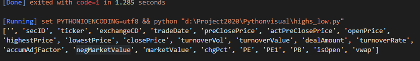
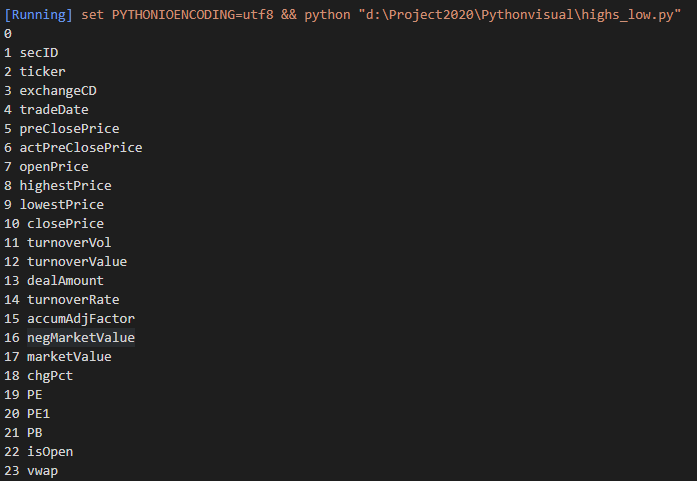
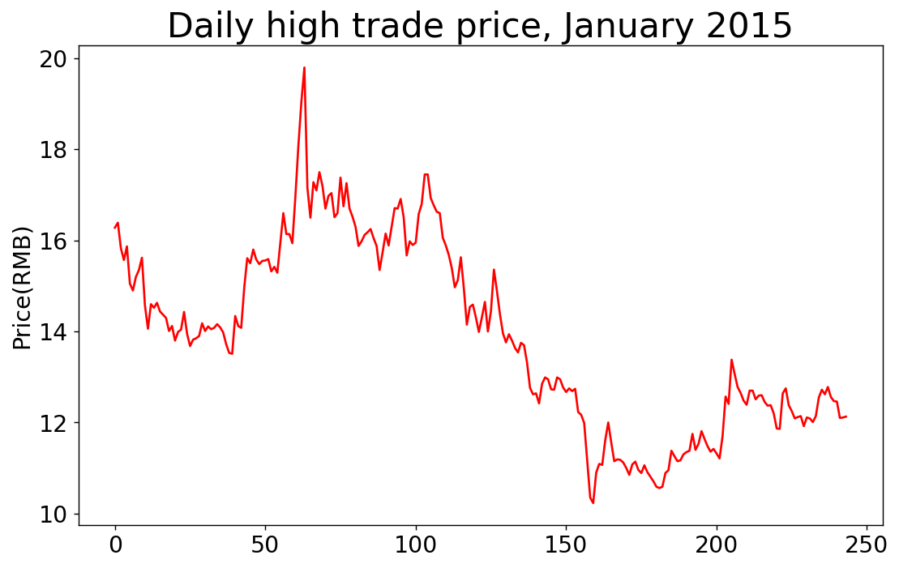
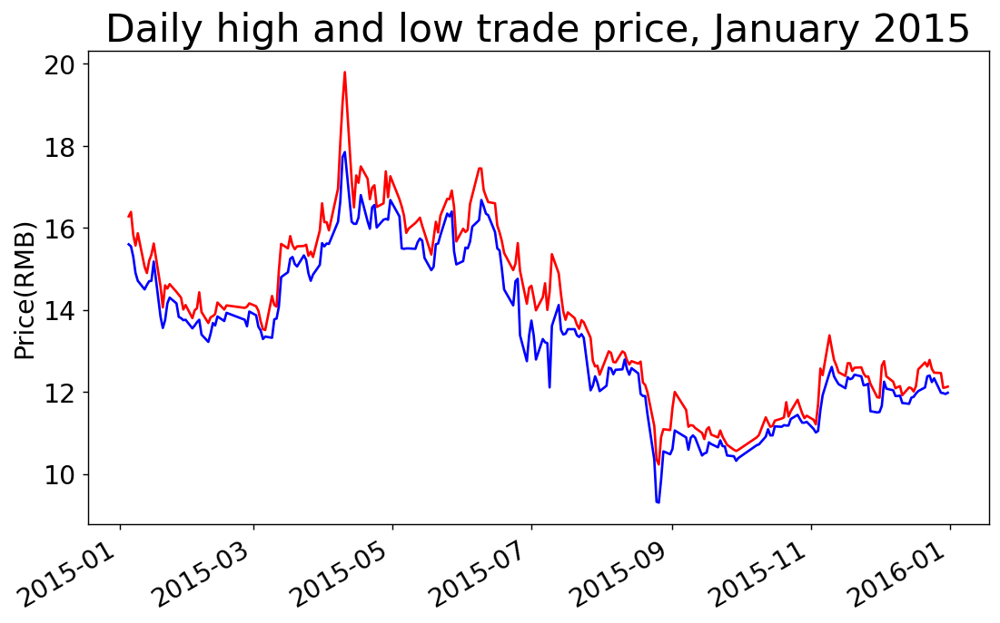
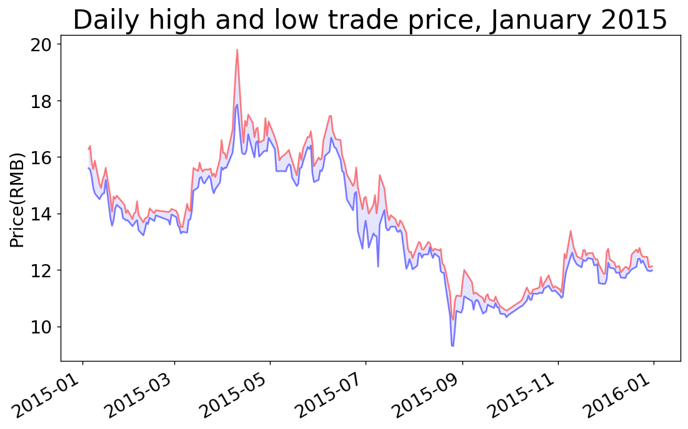

# 数据下载

[TOC]

## 一、CSV 文件格式

- 逗号分隔的值（CSV）

### 1、分析CSV 文件头

以price.csv问研究数据。

```python
import csv

filename = 'price1.csv'
with open(filename,'r') as f:
    reader = csv.reader(f)
    header_row = next(reader)
    print(header_row)
```

运行输出




### 2、打印文件头及其位置

```python
import csv

filename = 'price1.csv'
with open(filename,'r') as f:
    reader = csv.reader(f)
    header_row = next(reader)

    for index,column_header in enumerate(header_row):
        print(index,column_header)
```

运行输出



### 3、绘制最高交易价格

```python
'''
@Description: 
@Version: 1.0
@Autor: Henggao
@Date: 2020-03-16 19:44:34
@LastEditors: Henggao
@LastEditTime: 2020-03-16 20:21:47
'''
import csv
from matplotlib import pyplot as plt

# 从文件从获取最高价格
filename = 'price1.csv'
with open(filename,'r') as f:
    reader = csv.reader(f)
    header_row = next(reader)

    highs = []
    for row in reader:
        high = float(row[8])
        highs.append(high)

    print(highs)


# 根据数据绘制图形
fig = plt.figure(dpi=128,figsize=(10,6))
plt.plot(highs,c='red')

# 设置图形的格式
plt.title("Daily high trade price, January 2015",fontsize=24)
plt.xlabel('',fontsize=16)
plt.ylabel("Price(RMB)",fontsize=16)
plt.tick_params(axis='both',which='major',labelsize=16)

plt.show()
# plt.savefig('highest_price.png',bbox_inches='tight')
```



### 4、添加日期

```python
'''
@Description: 
@Version: 1.0
@Autor: Henggao
@Date: 2020-03-16 19:44:34
@LastEditors: Henggao
@LastEditTime: 2020-03-16 20:30:13
'''
import csv
from datetime import datetime

from matplotlib import pyplot as plt

# 从文件从获取日期和最高价格
filename = 'price1.csv'
with open(filename,'r') as f:
    reader = csv.reader(f)
    header_row = next(reader)

    dates,highs = [],[]
    for row in reader:
        current_date = datetime.strptime(row[4],"%Y/%m/%d")
        dates.append(current_date)
        high = float(row[8])
        highs.append(high)

    # print(highs)

# 根据数据绘制图形
fig = plt.figure(dpi=128,figsize=(10,6))
plt.plot(dates,highs,c='red')

# 设置图形的格式
plt.title("Daily high trade price, January 2015",fontsize=24)
plt.xlabel('',fontsize=16)
fig.autofmt_xdate()
plt.ylabel("Price(RMB)",fontsize=16)
plt.tick_params(axis='both',which='major',labelsize=16)

plt.show()
# plt.savefig('highest_price.png',bbox_inches='tight')
```


### 5、再绘制一个数据系列

最低价格

```python
'''
@Description: 
@Version: 1.0
@Autor: Henggao
@Date: 2020-03-16 19:44:34
@LastEditors: Henggao
@LastEditTime: 2020-03-16 20:40:53
'''
import csv
from datetime import datetime

from matplotlib import pyplot as plt

# 从文件从获取日期、最高价格和最低价格
filename = 'price1.csv'
with open(filename, 'r') as f:
    reader = csv.reader(f)
    header_row = next(reader)

    dates, highs, lows = [], [], []
    for row in reader:
        current_date = datetime.strptime(row[4], "%Y/%m/%d")
        dates.append(current_date)

        high = float(row[8])
        highs.append(high)

        low = float(row[9])
        lows.append(low)

    # print(highs)
# 根据数据绘制图形
fig = plt.figure(dpi=128, figsize=(10, 6))
plt.plot(dates, highs, c='red')
plt.plot(dates, lows, c='blue')

# 设置图形的格式
plt.title("Daily high and low trade price, January 2015", fontsize=24)
plt.xlabel('', fontsize=16)
fig.autofmt_xdate()
plt.ylabel("Price(RMB)", fontsize=16)
plt.tick_params(axis='both', which='major', labelsize=16)

# plt.show()
plt.savefig('date_price.png', bbox_inches='tight')

```

date_price,png

### 6、给图表区域着色

```python
'''
@Description: 
@Version: 1.0
@Autor: Henggao
@Date: 2020-03-16 19:44:34
@LastEditors: Henggao
@LastEditTime: 2020-03-16 20:44:23
'''
import csv
from datetime import datetime

from matplotlib import pyplot as plt

# 从文件从获取日期、最高价格和最低价格
filename = 'price1.csv'
with open(filename, 'r') as f:
    reader = csv.reader(f)
    header_row = next(reader)

    dates, highs, lows = [], [], []
    for row in reader:
        current_date = datetime.strptime(row[4], "%Y/%m/%d")
        dates.append(current_date)

        high = float(row[8])
        highs.append(high)

        low = float(row[9])
        lows.append(low)

    # print(highs)
# 根据数据绘制图形
fig = plt.figure(dpi=128, figsize=(10, 6))
plt.plot(dates, highs, c='red',alpha=0.5)
plt.plot(dates, lows, c='blue',alpha=0.5)
plt.fill_between(dates,highs,lows,facecolor='blue',alpha=0.1)
# 设置图形的格式
plt.title("Daily high and low trade price, January 2015", fontsize=24)
plt.xlabel('', fontsize=16)
fig.autofmt_xdate()
plt.ylabel("Price(RMB)", fontsize=16)
plt.tick_params(axis='both', which='major', labelsize=16)

# plt.show()
plt.savefig('color_date_price.png', bbox_inches='tight')

```




### 7、错误检查

- 缺失数据可能会引发异常，如果不妥善地处理，可能导致程序崩溃。

```python
'''
@Description: 
@Version: 1.0
@Autor: Henggao
@Date: 2020-03-16 19:44:34
@LastEditors: Henggao
@LastEditTime: 2020-03-16 20:51:22
'''
import csv
from datetime import datetime

from matplotlib import pyplot as plt

# 从文件从获取日期、最高价格和最低价格
filename = 'price1.csv'
with open(filename, 'r') as f:
    reader = csv.reader(f)
    header_row = next(reader)

    dates, highs, lows = [], [], []
    for row in reader:
        try:               
            current_date = datetime.strptime(row[4], "%Y/%m/%d")
            high = float(row[8])
            low = float(row[9])
        except ValueError:
            print(current_date,'missing data')
        else:
            dates.append(current_date)
            highs.append(high)
            lows.append(low)

    # print(highs)
# 根据数据绘制图形
fig = plt.figure(dpi=128, figsize=(10, 6))
plt.plot(dates, highs, c='red',alpha=0.5)
plt.plot(dates, lows, c='blue',alpha=0.5)
plt.fill_between(dates,highs,lows,facecolor='blue',alpha=0.1)
# 设置图形的格式
title = "Daily high_low trade price, January 2015"
plt.title(title, fontsize=24)
plt.xlabel('', fontsize=16)
fig.autofmt_xdate()
plt.ylabel("Price(RMB)", fontsize=16)
plt.tick_params(axis='both', which='major', labelsize=16)

plt.show()
# plt.savefig('color_date_price.png', bbox_inches='tight')

```

