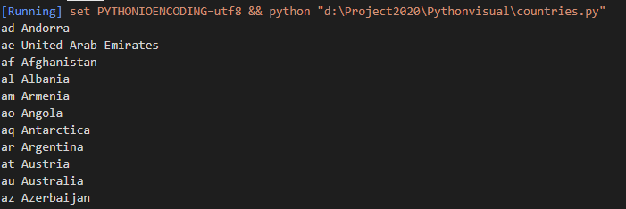
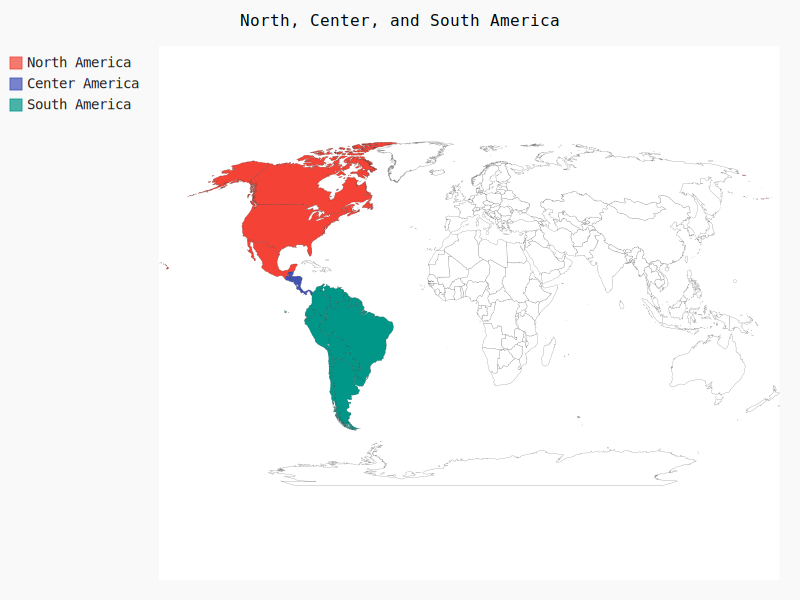
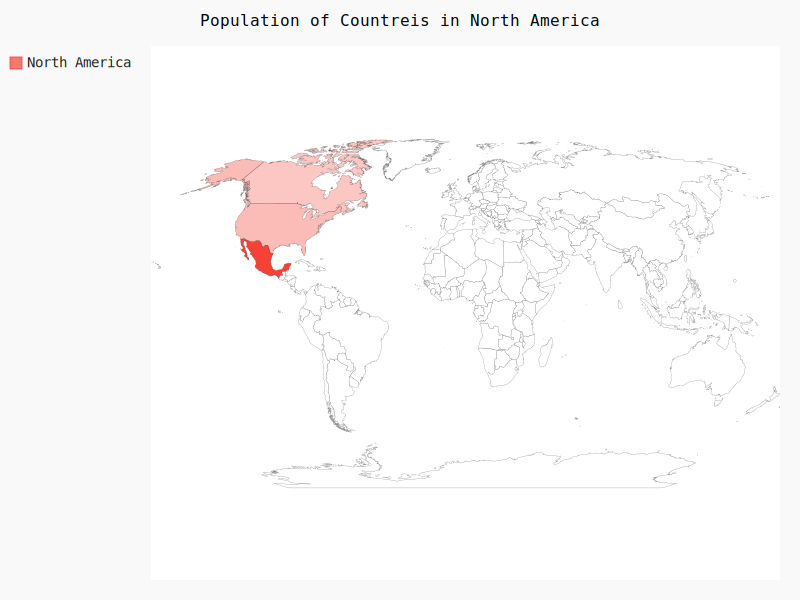
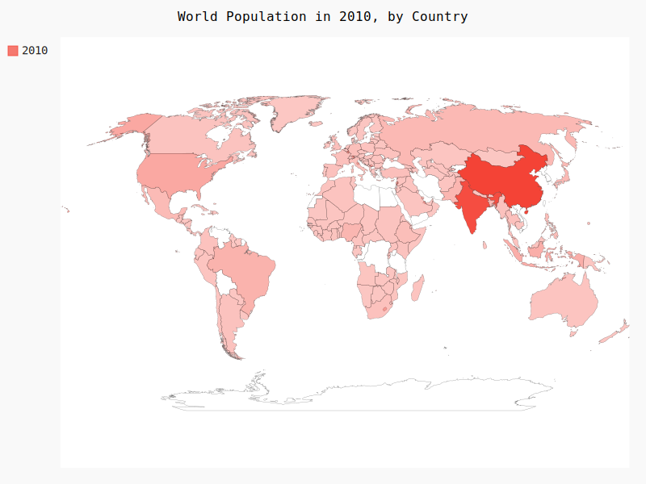
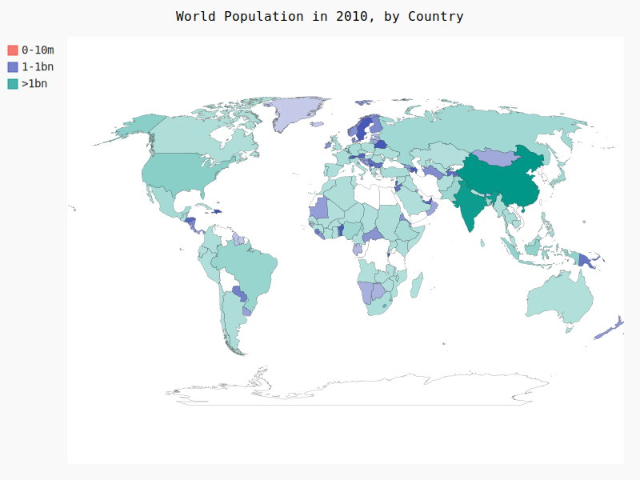
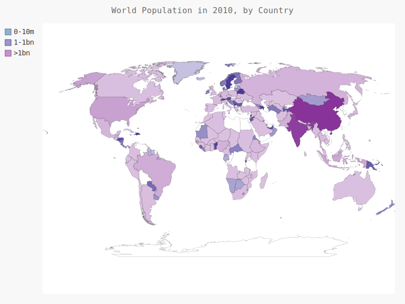

# json数据

[TOC]

## 一、下载世界人口数据

- Open Knowledge Foundation（http://data.okfn.org/）提供了大量可以免
  费使用的数据集，这些数据就来自其中一个数据集。
- world_population.py

```python
'''
@Description: 
@Versiion: 1.0
@Autor: Henggao
@Date: 2020-03-17 12:40:15
@LastEditors: Henggao
@LastEditTime: 2020-03-17 13:52:40
'''
import json

# 将一个数据加载到一个列表中
filename = 'population.json'
with open(filename, 'r') as f:
    pop_data = json.load(f)
    # print(pop_data)

# 打印每个国家2010年的人口数量
for pop_dict in pop_data:
    # print(pop_dict)
    # print(pop_dict["Country Name"])
    # print(pop_dict['Year'] == 2010)
    if pop_dict['Year'] == 2010:
        country_name = pop_dict['Country Name']
        population = pop_dict['Value']
        print(country_name + ':' + str(population))

```


## 二、获取两个字母的国别码

- 现在pygal已经没有i18n模块，要改用`pygal_maps_world.i18n`

- 安装（使用豆瓣源下载快）

  ```
  pip install -i https://pypi.douban.com/simple pygal_maps_world
  ```

- countries.py

  ```python
  from pygal_maps_world.i18n import COUNTRIES
  
  for countru_code in sorted(COUNTRIES.keys()):
      print(countru_code,COUNTRIES[countru_code])
  ```

  - 运行输出

    

  

- ountry_codes.py（为获取国别码，我们将编写一个函数，它在COUNTRIES中查找并返回国别码。）

  ```python
  '''
  @Description: 
  @Version: 1.0
  @Autor: Henggao
  @Date: 2020-03-17 14:10:33
  @LastEditors: Henggao
  @LastEditTime: 2020-03-17 14:16:49
  '''
  from pygal_maps_world.i18n import COUNTRIES
  
  def get_country_code(country_name):
      '''根据指定的国家，返回Pygal使用的两个字母的国别码'''
      for code,name in COUNTRIES.items():
          if name == country_name:
              return code
  
      # 如果没有找到指定的国家，就返回None
      return None
  # print(get_country_code('Andorra'))
  # print(get_country_code('United Arab Emirates'))
  # print(get_country_code('Afghanistan'))
  ```

- world_population.py

  ```python
  '''
  @Description: 
  @Versiion: 1.0
  @Autor: Henggao
  @Date: 2020-03-17 12:40:15
  @LastEditors: Henggao
  @LastEditTime: 2020-03-17 14:22:13
  '''
  import sys
  import os
  #  __file__获取执行文件相对路径，整行为取上一级的上一级目录
  BASE_DIR = os.path.dirname(os.path.dirname(os.path.abspath(__file__)))
  sys.path.append(BASE_DIR)
  
  import json
  from Pythonvisual.country_codes import get_country_code
  
  # 将一个数据加载到一个列表中
  filename = 'population.json'
  with open(filename, 'r') as f:
      pop_data = json.load(f)
      # print(pop_data)
  
  # 打印每个国家2010年的人口数量
  for pop_dict in pop_data:
      # print(pop_dict)
      # print(pop_dict["Country Name"])
      # print(pop_dict['Year'] == 2010)
      if pop_dict['Year'] == 2010:
          country_name = pop_dict['Country Name']
          population = int(pop_dict['Value'])
          # print(country_name + ':' + str(population))
          code = get_country_code(country_name)
          if code:
              print(code + ':' + str(population))
          else:
              print('ERROR - ' + country_name)
  
  ```

  

## 三、制作世界地图

Pygal提供了图表类型Worldmap，可帮助你制作呈现各国数据的世界地图。

- americas,py

  ```python
  '''
  @Description: 
  @Version: 1.0
  @Autor: Henggao
  @Date: 2020-03-17 14:25:06
  @LastEditors: Henggao
  @LastEditTime: 2020-03-17 14:51:19
  '''
  import pygal
  
  # wm = pygal.Worldmap()
  wm = pygal.maps.world.World()
  wm.title = "North, Center, and South America"
  
  wm.add("North America", ['ca', 'mx', 'us'])
  wm.add("Center America", ['bz', 'cr', 'gt', 'hn', 'ni', 'pa', 'sv'])
  wm.add("South America", ['ar', 'bo', 'br', 'cl', 'co', 'ec',
                           'gf', 'gy', 'pe', 'py', 'sr', 'uy', 've'])
  wm.render_to_file('americas.svg')
  
  ```

  运行，生成`americas.svg`

  


## 四、在世界地图上呈现数字数据

- na_populations.py

  ```python
  '''
  @Description: 
  @Version: 1.0
  @Autor: Henggao
  @Date: 2020-03-17 14:56:06
  @LastEditors: Henggao
  @LastEditTime: 2020-03-17 15:06:22
  '''
  import pygal
  
  wm = pygal.maps.world.World()
  wm.title = "Population of Countreis in North America"
  wm.add('North America', {'ca': 24126000, 'us': 30934900, 'mx': 113423000})
  
  wm.render_to_file('na_populations.svg')
  
  ```

  运行，生成`na_populations.svg`

  


## 五、绘制完整的世界人口地图

- world_popolation.py

  ```python
  '''
  @Description: 
  @Versiion: 1.0
  @Autor: Henggao
  @Date: 2020-03-17 12:40:15
  @LastEditors: Henggao
  @LastEditTime: 2020-03-17 15:17:05
  '''
  import sys
  import os
  #  __file__获取执行文件相对路径，整行为取上一级的上一级目录
  BASE_DIR = os.path.dirname(os.path.dirname(os.path.abspath(__file__)))
  sys.path.append(BASE_DIR)
  
  import json
  from Pythonvisual.country_codes import get_country_code
  import pygal
  
  # 将一个数据加载到一个列表中
  filename = 'population.json'
  with open(filename, 'r') as f:
      pop_data = json.load(f)
      # print(pop_data)
  
  # 创建一个包含人口数量的字典
  cc_populations = {}
  # 打印每个国家2010年的人口数量
  for pop_dict in pop_data:
      # print(pop_dict)
      # print(pop_dict["Country Name"])
      # print(pop_dict['Year'] == 2010)
      if pop_dict['Year'] == 2010:
          country_name = pop_dict['Country Name']
          population = int(pop_dict['Value'])
          # print(country_name + ':' + str(population))
          code = get_country_code(country_name)
          if code:
              # print(code + ':' + str(population))
              cc_populations[code] = population
          # else:
          #     print('ERROR - ' + country_name)
  wm = pygal.maps.world.World()
  wm.title = "World Population in 2010, by Country"
  wm.add('2010',cc_populations)
  
  wm.render_to_file('world_population.svg')
  ```

  - 运行输出`world_population.svg`

    


## 六、根据人口数量将国家分组

- world_

  ```python
  '''
  @Description: 
  @Versiion: 1.0
  @Autor: Henggao
  @Date: 2020-03-17 12:40:15
  @LastEditors: Henggao
  @LastEditTime: 2020-03-17 15:28:53
  '''
  import sys
  import os
  #  __file__获取执行文件相对路径，整行为取上一级的上一级目录
  BASE_DIR = os.path.dirname(os.path.dirname(os.path.abspath(__file__)))
  sys.path.append(BASE_DIR)
  
  import json
  from Pythonvisual.country_codes import get_country_code
  import pygal
  
  # 将一个数据加载到一个列表中
  filename = 'population.json'
  with open(filename, 'r') as f:
      pop_data = json.load(f)
      # print(pop_data)
  
  # 创建一个包含人口数量的字典
  cc_populations = {}
  # 打印每个国家2010年的人口数量
  for pop_dict in pop_data:
      # print(pop_dict)
      # print(pop_dict["Country Name"])
      # print(pop_dict['Year'] == 2010)
      if pop_dict['Year'] == 2010:
          country_name = pop_dict['Country Name']
          population = int(pop_dict['Value'])
          # print(country_name + ':' + str(population))
          code = get_country_code(country_name)
          if code:
              # print(code + ':' + str(population))
              cc_populations[code] = population
          # else:
          #     print('ERROR - ' + country_name)
  
  # 根据人口数量将所有国家分成三组
  cc_pops_1, cc_pops_2, cc_pops_3 = {},{},{}
  for cc, pop in cc_populations.items():
      if pop < 10000000:
          cc_pops_2[cc] = pop
      elif pop < 10000000:
          cc_pops_2[cc] = pop
      else:
          cc_pops_3[cc] = pop
  
  # 看看每组分别包含多少国家
  print(len(cc_pops_1),len(cc_pops_2),len(cc_pops_3))
  
  wm = pygal.maps.world.World()
  wm.title = "World Population in 2010, by Country"
  wm.add('0-10m',cc_pops_1)
  wm.add('1-1bn',cc_pops_2)
  wm.add('>1bn',cc_pops_3)
  
  wm.render_to_file('categroy_world_population.svg')
  ```

  运行输出

  


## 七、使用Pygal 设置世界地图的样式

- world_population.py

  ```python
  '''
  @Description: 
  @Versiion: 1.0
  @Autor: Henggao
  @Date: 2020-03-17 12:40:15
  @LastEditors: Henggao
  @LastEditTime: 2020-03-17 15:38:38
  '''
  import sys
  import os
  #  __file__获取执行文件相对路径，整行为取上一级的上一级目录
  BASE_DIR = os.path.dirname(os.path.dirname(os.path.abspath(__file__)))
  sys.path.append(BASE_DIR)
  
  import json
  from Pythonvisual.country_codes import get_country_code
  import pygal
  from pygal.style import RotateStyle
  
  # 将一个数据加载到一个列表中
  filename = 'population.json'
  with open(filename, 'r') as f:
      pop_data = json.load(f)
      # print(pop_data)
  
  # 创建一个包含人口数量的字典
  cc_populations = {}
  # 打印每个国家2010年的人口数量
  for pop_dict in pop_data:
      # print(pop_dict)
      # print(pop_dict["Country Name"])
      # print(pop_dict['Year'] == 2010)
      if pop_dict['Year'] == 2010:
          country_name = pop_dict['Country Name']
          population = int(pop_dict['Value'])
          # print(country_name + ':' + str(population))
          code = get_country_code(country_name)
          if code:
              # print(code + ':' + str(population))
              cc_populations[code] = population
          # else:
          #     print('ERROR - ' + country_name)
  
  # 根据人口数量将所有国家分成三组
  cc_pops_1, cc_pops_2, cc_pops_3 = {},{},{}
  for cc, pop in cc_populations.items():
      if pop < 10000000:
          cc_pops_2[cc] = pop
      elif pop < 10000000:
          cc_pops_2[cc] = pop
      else:
          cc_pops_3[cc] = pop
  
  # 看看每组分别包含多少国家
  print(len(cc_pops_1),len(cc_pops_2),len(cc_pops_3))
  
  wm = pygal.maps.world.World()
  wm_style = RotateStyle('#336699')
  wm = pygal.maps.world.World(style=wm_style)
  wm.title = "World Population in 2010, by Country"
  wm.add('0-10m',cc_pops_1)
  wm.add('1-1bn',cc_pops_2)
  wm.add('>1bn',cc_pops_3)
  
  wm.render_to_file('style_world_population.svg')
  ```

  - 运行输出

    

## 八、加亮颜色主题

- world_population.py

```python
'''
@Description: 
@Versiion: 1.0
@Autor: Henggao
@Date: 2020-03-17 12:40:15
@LastEditors: Henggao
@LastEditTime: 2020-03-17 15:44:46
'''
import sys
import os
#  __file__获取执行文件相对路径，整行为取上一级的上一级目录
BASE_DIR = os.path.dirname(os.path.dirname(os.path.abspath(__file__)))
sys.path.append(BASE_DIR)

import json
from Pythonvisual.country_codes import get_country_code
import pygal
from pygal.style import LightColorizedStyle as LCS,RotateStyle as RS

# 将一个数据加载到一个列表中
filename = 'population.json'
with open(filename, 'r') as f:
    pop_data = json.load(f)
    # print(pop_data)

# 创建一个包含人口数量的字典
cc_populations = {}
# 打印每个国家2010年的人口数量
for pop_dict in pop_data:
    # print(pop_dict)
    # print(pop_dict["Country Name"])
    # print(pop_dict['Year'] == 2010)
    if pop_dict['Year'] == 2010:
        country_name = pop_dict['Country Name']
        population = int(pop_dict['Value'])
        # print(country_name + ':' + str(population))
        code = get_country_code(country_name)
        if code:
            # print(code + ':' + str(population))
            cc_populations[code] = population
        # else:
        #     print('ERROR - ' + country_name)

# 根据人口数量将所有国家分成三组
cc_pops_1, cc_pops_2, cc_pops_3 = {},{},{}
for cc, pop in cc_populations.items():
    if pop < 10000000:
        cc_pops_2[cc] = pop
    elif pop < 10000000:
        cc_pops_2[cc] = pop
    else:
        cc_pops_3[cc] = pop

# 看看每组分别包含多少国家
print(len(cc_pops_1),len(cc_pops_2),len(cc_pops_3))

wm = pygal.maps.world.World()
wm_style = RS('#336699',base_style=LCS)
wm = pygal.maps.world.World(style=wm_style)
wm.title = "World Population in 2010, by Country"
wm.add('0-10m',cc_pops_1)
wm.add('1-1bn',cc_pops_2)
wm.add('>1bn',cc_pops_3)

wm.render_to_file('light_style_world_population.svg')
```

- 运行输出

  