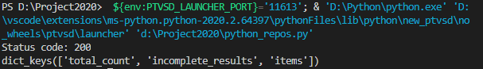
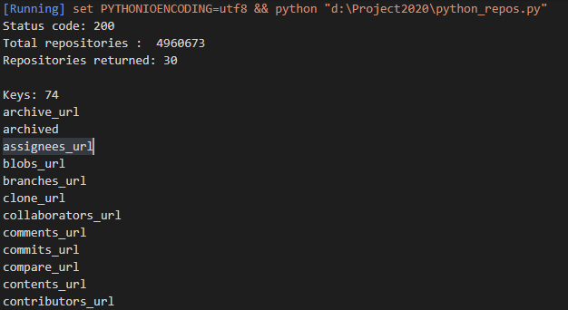
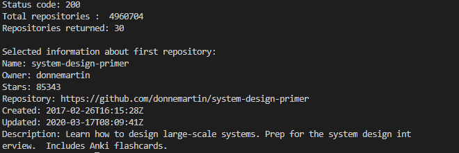
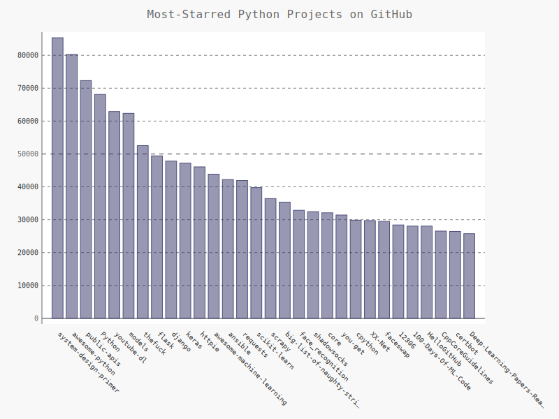
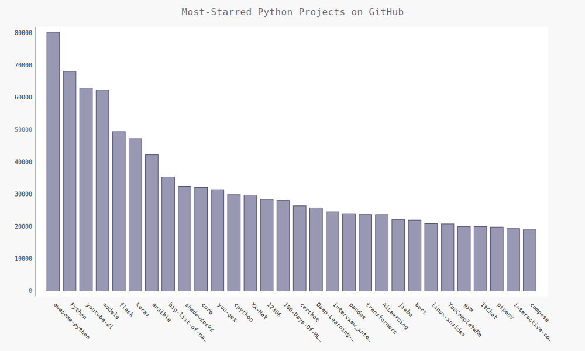
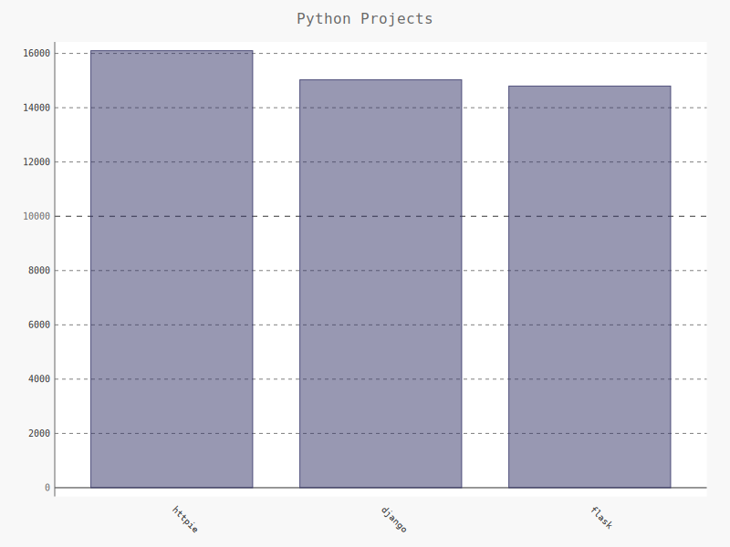
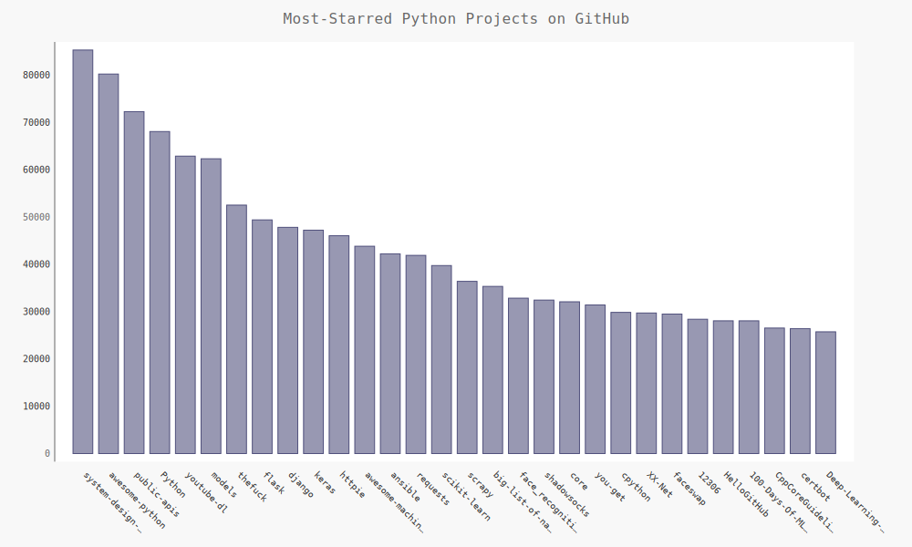

# WebAPI

[TOC]

## 一、使用API 调用请求数据

GitHub的API让你能够通过API调用来请求各种信息。要知道API调用是什么样的，请在浏览器的地址栏中输入如下地址并按回车键：

https://api.github.com/search/repositories?q=language:python&sort=stars


## 二、安装requests

- 安装`requests`模块

```
pip install requests
```


## 三、处理API 响应

- python_repos.py

```python
'''
@Description: 
@Version: 1.0
@Autor: Henggao
@Date: 2020-03-17 15:58:46
@LastEditors: Henggao
@LastEditTime: 2020-03-17 16:02:33
'''
import requests

# 执行API调用并存储响应
url = 'https://api.github.com/search/repositories?q=language:python&sort=stars'
r = requests.get(url)
print("Status code:", r.status_code)

# 将API响应存储在一个变量中
response_dict = r.json()

# 处理结果
print(response_dict.keys())

```

运行输出




## 四、处理响应字典

- python_repos.py

  ```python
  '''
  @Description: 
  @Version: 1.0
  @Autor: Henggao
  @Date: 2020-03-17 15:58:46
  @LastEditors: Henggao
  @LastEditTime: 2020-03-17 16:18:09
  '''
  import requests
  
  # 执行API调用并存储响应
  url = 'https://api.github.com/search/repositories?q=language:python&sort=stars'
  r = requests.get(url)
  print("Status code:", r.status_code)
  
  # 将API响应存储在一个变量中
  response_dict = r.json()
  
  # 处理结果
  # print(response_dict.keys())
  print("Total repositories : ", response_dict['total_count'])
  
  # 探索有关仓库的信息
  repo_dicts = response_dict['items']
  print("Repositories returned:", len(repo_dicts))
  
  # 研究第一仓库
  repo_dict = repo_dicts[0]
  print("\nKeys:",len(repo_dict))
  for key in sorted(repo_dict.keys()):
      print(key)
  ```

  运行输出

  


下面来提取repo_dict中与一些键相关联的值：

- python_repos.py

```python
'''
@Description: 
@Version: 1.0
@Autor: Henggao
@Date: 2020-03-17 15:58:46
@LastEditors: Henggao
@LastEditTime: 2020-03-17 16:23:31
'''
import requests

# 执行API调用并存储响应
url = 'https://api.github.com/search/repositories?q=language:python&sort=stars'
r = requests.get(url)
print("Status code:", r.status_code)

# 将API响应存储在一个变量中
response_dict = r.json()

# 处理结果
# print(response_dict.keys())
print("Total repositories : ", response_dict['total_count'])

# 探索有关仓库的信息
repo_dicts = response_dict['items']
print("Repositories returned:", len(repo_dicts))

# 研究第一仓库
repo_dict = repo_dicts[0]
# print("\nKeys:",len(repo_dict))
# for key in sorted(repo_dict.keys()):
#     print(key)

print("\nSelected information about first repository:")
print('Name:', repo_dict['name'])
print('Owner:', repo_dict['owner']['login'])
print('Stars:', repo_dict['stargazers_count'])
print('Repository:', repo_dict['html_url'])
print('Created:', repo_dict['created_at'])
print('Updated:', repo_dict['updated_at'])
print('Description:', repo_dict['description'])
```




## 五、概述最受欢迎的仓库

- python_repos.py

```python
'''
@Description: 
@Version: 1.0
@Autor: Henggao
@Date: 2020-03-17 15:58:46
@LastEditors: Henggao
@LastEditTime: 2020-03-17 16:41:45
'''
import requests

# 执行API调用并存储响应
url = 'https://api.github.com/search/repositories?q=language:python&sort=stars'
r = requests.get(url)
print("Status code:", r.status_code)

# 将API响应存储在一个变量中
response_dict = r.json()

# 处理结果
# print(response_dict.keys())
print("Total repositories : ", response_dict['total_count'])

# 探索有关仓库的信息
repo_dicts = response_dict['items']
print("Repositories returned:", len(repo_dicts))

# 研究第一仓库
# repo_dict = repo_dicts[0]
# print("\nKeys:",len(repo_dict))
# for key in sorted(repo_dict.keys()):
#     print(key)

# print("\nSelected information about first repository:")
# print('Name:', repo_dict['name'])
# print('Owner:', repo_dict['owner']['login'])
# print('Stars:', repo_dict['stargazers_count'])
# print('Repository:', repo_dict['html_url'])
# print('Created:', repo_dict['created_at'])
# print('Updated:', repo_dict['updated_at'])
# print('Description:', repo_dict['description'])

print("\nSelected information about each repository:")
for repo_dict in repo_dicts:
    print('\nName:', repo_dict['name'])
    print('Owner:', repo_dict['owner']['login'])
    print('Stars:', repo_dict['stargazers_count'])
    print('Repository:', repo_dict['html_url'])
    print('Description:', repo_dict['description'])
```


## 六、监视API 的速率限制

大多数API都存在速率限制，即你在特定时间内可执行的请求数存在限制。获悉GitHub的限制，请在浏览器中输入https://api.github.com/rate_limit，

```
{
  "resources": {
    "core": {
      "limit": 60,
      "remaining": 59,
      "reset": 1584435265
    },
    "search": {
      "limit": 10,
      "remaining": 9,
      "reset": 1584434844
    },
    "graphql": {
      "limit": 0,
      "remaining": 0,
      "reset": 1584438444
    },
    "integration_manifest": {
      "limit": 5000,
      "remaining": 5000,
      "reset": 1584438444
    },
    "source_import": {
      "limit": 5,
      "remaining": 5,
      "reset": 1584434904
    }
  },
  "rate": {
    "limit": 60,
    "remaining": 59,
    "reset": 1584435265
  }
}
```

- 极限为每分钟10个请求，而在当前这一分钟内，我们还可执行9个请求。

- 很多API都要求你注册获得API密钥后才能执行API调用。获得API密钥后，配额将高得多。


## 七、使用Pygal 可视化仓库

- python_repos.py

  ```python
  '''
  @Description: 
  @Version: 1.0
  @Autor: Henggao
  @Date: 2020-03-17 15:58:46
  @LastEditors: Henggao
  @LastEditTime: 2020-03-17 17:13:46
  '''
  import requests
  import pygal
  from pygal.style import LightColorizedStyle as LCS, LightenStyle as LS
  
  # 执行API调用并存储响应
  url = 'https://api.github.com/search/repositories?q=language:python&sort=stars'
  r = requests.get(url)
  print("Status code:", r.status_code)
  
  # 将API响应存储在一个变量中
  response_dict = r.json()
  
  # 处理结果
  # print(response_dict.keys())
  print("Total repositories : ", response_dict['total_count'])
  
  # 探索有关仓库的信息
  repo_dicts = response_dict['items']
  # print("Repositories returned:", len(repo_dicts))
  
  # 研究第一仓库
  # repo_dict = repo_dicts[0]
  # print("\nKeys:",len(repo_dict))
  # for key in sorted(repo_dict.keys()):
  #     print(key)
  
  # print("\nSelected information about first repository:")
  # print('Name:', repo_dict['name'])
  # print('Owner:', repo_dict['owner']['login'])
  # print('Stars:', repo_dict['stargazers_count'])
  # print('Repository:', repo_dict['html_url'])
  # print('Created:', repo_dict['created_at'])
  # print('Updated:', repo_dict['updated_at'])
  # print('Description:', repo_dict['description'])
  
  # print("\nSelected information about each repository:")
  # for repo_dict in repo_dicts:
  #     print('\nName:', repo_dict['name'])
  #     print('Owner:', repo_dict['owner']['login'])
  #     print('Stars:', repo_dict['stargazers_count'])
  #     print('Repository:', repo_dict['html_url'])
  #     print('Description:', repo_dict['description'])
  
  names, stars = [], []
  for repo_dict in repo_dicts:
      names.append(repo_dict['name'])
      stars.append(repo_dict['stargazers_count'])
  
  # 可视化
  my_style = LS('#333366', base_style=LCS)
  chart = pygal.Bar(style=my_style, x_label_rotation=45, show_legend=False)
  chart.title = "Most-Starred Python Projects on GitHub"
  chart.x_labels = names
  
  chart.add('', stars)
  chart.render_to_file('python_repos.svg')
  
  ```

  - 运行输出`python_repos.svg`

    


## 八、改进Pygal 图表

- python_repos.py

  ```python
  '''
  @Description: 
  @Version: 1.0
  @Autor: Henggao
  @Date: 2020-03-17 15:58:46
  @LastEditors: Henggao
  @LastEditTime: 2020-03-17 17:22:34
  '''
  import requests
  import pygal
  from pygal.style import LightColorizedStyle as LCS, LightenStyle as LS
  
  # 执行API调用并存储响应
  url = 'https://api.github.com/search/repositories?q=language:python&sort=stars'
  r = requests.get(url)
  print("Status code:", r.status_code)
  
  # 将API响应存储在一个变量中
  response_dict = r.json()
  
  # 处理结果
  # print(response_dict.keys())
  print("Total repositories : ", response_dict['total_count'])
  
  # 探索有关仓库的信息
  repo_dicts = response_dict['items']
  # print("Repositories returned:", len(repo_dicts))
  
  # 研究第一仓库
  # repo_dict = repo_dicts[0]
  # print("\nKeys:",len(repo_dict))
  # for key in sorted(repo_dict.keys()):
  #     print(key)
  
  # print("\nSelected information about first repository:")
  # print('Name:', repo_dict['name'])
  # print('Owner:', repo_dict['owner']['login'])
  # print('Stars:', repo_dict['stargazers_count'])
  # print('Repository:', repo_dict['html_url'])
  # print('Created:', repo_dict['created_at'])
  # print('Updated:', repo_dict['updated_at'])
  # print('Description:', repo_dict['description'])
  
  # print("\nSelected information about each repository:")
  # for repo_dict in repo_dicts:
  #     print('\nName:', repo_dict['name'])
  #     print('Owner:', repo_dict['owner']['login'])
  #     print('Stars:', repo_dict['stargazers_count'])
  #     print('Repository:', repo_dict['html_url'])
  #     print('Description:', repo_dict['description'])
  
  names, stars = [], []
  for repo_dict in repo_dicts:
      names.append(repo_dict['name'])
      stars.append(repo_dict['stargazers_count'])
  
  # 可视化
  my_style = LS('#333366', base_style=LCS)
  my_config = pygal.Config()
  my_config.x_label_rotation = 45
  my_config.show_legend = False
  my_config.title_font_size = 24
  my_config.label_font_size = 14
  my_config.major_label_font_size = 18
  my_config.truncate_label = 15
  my_config.show_y_guides = False
  my_config.width = 1000
  
  # chart = pygal.Bar(style=my_style, x_label_rotation=45, show_legend=False)
  chart = pygal.Bar(my_config,style = my_style)
  chart.title = "Most-Starred Python Projects on GitHub"
  chart.x_labels = names
  
  chart.add('', stars)
  chart.render_to_file('better_python_repos.svg')
  
  ```

  - 运行生成`better_python_repos.svg`

  


## 九、添加自定义工具提示

- bar_descriptions.py

  ```python
  '''
  @Description: 
  @Version: 1.0
  @Autor: Henggao
  @Date: 2020-03-17 17:28:39
  @LastEditors: Henggao
  @LastEditTime: 2020-03-17 17:35:23
  '''
  import pygal
  
  from pygal.style import LightColorizedStyle as LCS, LightenStyle as LS
  
  my_style = LS('#333366', base_style=LCS)
  chart = pygal.Bar(style=my_style, x_label_rotation=45, show_legend=False)
  chart.title = 'Python Projects'
  chart.x_labels = ['httpie', 'django', 'flask']
  
  plot_dicts = [
      {'value': 16101, 'label': 'Description of httpie'},
      {'value': 15028, 'label': 'Description of django'},
      {'value': 14798, 'label': 'Description of flask'},
  ]
  
  chart.add('', plot_dicts)
  chart.render_to_file('bar_descriptions.svg')
  
  ```

  运行生成`bar_descriptions.svg`

  


## 十、根据数据绘图

- python_repos.py

  ```python
  '''
  @Description: 
  @Version: 1.0
  @Autor: Henggao
  @Date: 2020-03-17 15:58:46
  @LastEditors: Henggao
  @LastEditTime: 2020-03-17 17:51:29
  '''
  import requests
  import pygal
  from pygal.style import LightColorizedStyle as LCS, LightenStyle as LS
  
  # 执行API调用并存储响应
  url = 'https://api.github.com/search/repositories?q=language:python&sort=stars'
  r = requests.get(url)
  print("Status code:", r.status_code)
  
  # 将API响应存储在一个变量中
  response_dict = r.json()
  
  # 处理结果
  # print(response_dict.keys())
  print("Total repositories : ", response_dict['total_count'])
  
  # 探索有关仓库的信息
  repo_dicts = response_dict['items']
  # print("Repositories returned:", len(repo_dicts))
  
  # 研究第一仓库
  # repo_dict = repo_dicts[0]
  # print("\nKeys:",len(repo_dict))
  # for key in sorted(repo_dict.keys()):
  #     print(key)
  
  # print("\nSelected information about first repository:")
  # print('Name:', repo_dict['name'])
  # print('Owner:', repo_dict['owner']['login'])
  # print('Stars:', repo_dict['stargazers_count'])
  # print('Repository:', repo_dict['html_url'])
  # print('Created:', repo_dict['created_at'])
  # print('Updated:', repo_dict['updated_at'])
  # print('Description:', repo_dict['description'])
  
  # print("\nSelected information about each repository:")
  # for repo_dict in repo_dicts:
  #     print('\nName:', repo_dict['name'])
  #     print('Owner:', repo_dict['owner']['login'])
  #     print('Stars:', repo_dict['stargazers_count'])
  #     print('Repository:', repo_dict['html_url'])
  #     print('Description:', repo_dict['description'])
  
  # names, stars = [], []
  # for repo_dict in repo_dicts:
  #     names.append(repo_dict['name'])
  #     stars.append(repo_dict['stargazers_count'])
  
  
  names, plot_dicts = [], []
  for repo_dict in repo_dicts:
      names.append(repo_dict['name'])
  
      plot_dict = {
          'value': repo_dict['stargazers_count'],
          'label': str(repo_dict['description'])
      }
      plot_dicts.append(plot_dict)
  
  # 可视化
  my_style = LS('#333366', base_style=LCS)
  my_config = pygal.Config()
  my_config.x_label_rotation = 45
  my_config.show_legend = False
  my_config.title_font_size = 24
  my_config.label_font_size = 14
  my_config.major_label_font_size = 18
  my_config.truncate_label = 15
  my_config.show_y_guides = False
  my_config.width = 1000
  
  # chart = pygal.Bar(style=my_style, x_label_rotation=45, show_legend=False)
  chart = pygal.Bar(my_config, style=my_style)
  chart.title = "Most-Starred Python Projects on GitHub"
  chart.x_labels = names
  
  # chart.add('', stars)
  chart.add('', plot_dicts)
  chart.render_to_file('base_python_repos.svg')
  
  ```

  - 运行输出

    

## 十一、在图表中添加可单击的链接

- python_repos.py

```python
'''
@Description: 
@Version: 1.0
@Autor: Henggao
@Date: 2020-03-17 15:58:46
@LastEditors: Henggao
@LastEditTime: 2020-03-17 18:05:31
'''
import requests
import pygal
from pygal.style import LightColorizedStyle as LCS, LightenStyle as LS

# 执行API调用并存储响应
url = 'https://api.github.com/search/repositories?q=language:python&sort=stars'
r = requests.get(url)
print("Status code:", r.status_code)

# 将API响应存储在一个变量中
response_dict = r.json()

# 处理结果
# print(response_dict.keys())
print("Total repositories : ", response_dict['total_count'])

# 探索有关仓库的信息
repo_dicts = response_dict['items']
# print("Repositories returned:", len(repo_dicts))

# 研究第一仓库
# repo_dict = repo_dicts[0]
# print("\nKeys:",len(repo_dict))
# for key in sorted(repo_dict.keys()):
#     print(key)

# print("\nSelected information about first repository:")
# print('Name:', repo_dict['name'])
# print('Owner:', repo_dict['owner']['login'])
# print('Stars:', repo_dict['stargazers_count'])
# print('Repository:', repo_dict['html_url'])
# print('Created:', repo_dict['created_at'])
# print('Updated:', repo_dict['updated_at'])
# print('Description:', repo_dict['description'])

# print("\nSelected information about each repository:")
# for repo_dict in repo_dicts:
#     print('\nName:', repo_dict['name'])
#     print('Owner:', repo_dict['owner']['login'])
#     print('Stars:', repo_dict['stargazers_count'])
#     print('Repository:', repo_dict['html_url'])
#     print('Description:', repo_dict['description'])

# names, stars = [], []
# for repo_dict in repo_dicts:
#     names.append(repo_dict['name'])
#     stars.append(repo_dict['stargazers_count'])


names, plot_dicts = [], []
for repo_dict in repo_dicts:
    names.append(repo_dict['name'])

    plot_dict = {
        'value': repo_dict['stargazers_count'],
        'label': str(repo_dict['description']),
        'xlink': repo_dict['html_url'],
    }
    plot_dicts.append(plot_dict)

# 可视化
my_style = LS('#333366', base_style=LCS)
my_config = pygal.Config()
my_config.x_label_rotation = 45
my_config.show_legend = False
my_config.title_font_size = 24
my_config.label_font_size = 14
my_config.major_label_font_size = 18
my_config.truncate_label = 15
my_config.show_y_guides = False
my_config.width = 1000

# chart = pygal.Bar(style=my_style, x_label_rotation=45, show_legend=False)
chart = pygal.Bar(my_config, style=my_style)
chart.title = "Most-Starred Python Projects on GitHub"
chart.x_labels = names

# chart.add('', stars)
chart.add('', plot_dicts)
chart.render_to_file('base_python_repos.svg')

```


## 十二、Hacker News API

使用其他网站的API调用，我们来看看[Hacker News](https://news.ycombinator.com/)。

下面的调用返回本书编写时最热门的文章的信息：

```
https://hacker-news.firebaseio.com/v0/item/9884165.json
```

响应是一个字典，包含ID为9884165的文章的信息：

```
{"by":"nns","descendants":297,"id":9884165,"kids":[9885099,9884723,9885165,9884789,9885604,9884137,9886151,9885220,9885790,9884661,9885844,9885029,9884817,9887342,9884545,9884372,9884499,9884881,9884109,9886496,9884342,9887832,9885023,9884334,9884707,9887008,9885348,9885131,9887539,9885880,9884196,9884640,9886534,9885152],"score":558,"time":1436875181,"title":"New Horizons: Nasa spacecraft speeds past Pluto","type":"story","url":"http://www.bbc.co.uk/news/science-environment-33524589"}
```

- hn_submissions.py

  ```python
  '''
  @Description: 
  @Version: 1.0
  @Autor: Henggao
  @Date: 2020-03-17 18:14:03
  @LastEditors: Henggao
  @LastEditTime: 2020-03-17 18:26:51
  '''
  import requests
  
  from operator import itemgetter
  
  # 执行API调用并存储响应
  url = 'https://hacker-news.firebaseio.com/v0/topstories.json'
  r = requests.get(url)
  print("Status code:", r.status_code)
  
  # 处理有关每篇文章的信息
  submission_ids = r.json()
  submission_dicts = []
  for submission_id in submission_ids[:30]:
      # 对于每篇文章，都执行一个API调用
      url = ('https://hacker-news.firebaseio.com/v0/item/' +
             str(submission_id) + '.json')
      submission_r = requests.get(url)
      print(submission_r.status_code)
      response_dict = submission_r.json()
  
      submission_dict = {
          'title': response_dict['title'],
          'link': 'http://news.ycombinator.com/item?id=' + str(submission_id),
          'comments': response_dict.get('descendants', 0)
      }
      submission_dicts.append(submission_dict)
  submission_dicts = sorted(
      submission_dicts, key=itemgetter('comments'), reverse=True)
  
  for submission_dict in submission_dicts:
      print("\nTitle: ", submission_dict['title'])
      print('Discussion link: ', submission_dict['link'])
      print('Comments: ', submission_dict['comments'])
  
  ```

  - 运行输出

    ```
    Status code: 200
    200
    200
    200
    200
    200
    200
    200
    200
    200
    200
    200
    200
    200
    200
    200
    200
    200
    200
    200
    200
    200
    200
    200
    200
    200
    200
    200
    200
    200
    200
    
    Title:  NPM Is Joining GitHub
    Discussion link:  http://news.ycombinator.com/item?id=22594549
    Comments:  484
    
    Title:  Amazon to hire 100k warehouse and delivery workers
    Discussion link:  http://news.ycombinator.com/item?id=22597200
    Comments:  282
    
    Title:  What If Andrew Yang Was Right?
    Discussion link:  http://news.ycombinator.com/item?id=22599838
    Comments:  219
    
    Title:  Chloroquine has shown apparent efficacy in treatment of Covid-19
    Discussion link:  http://news.ycombinator.com/item?id=22601196
    Comments:  172
    
    Title:  I am mesmerized by our new robotic vacuum (2019)
    Discussion link:  http://news.ycombinator.com/item?id=22591507
    Comments:  165
    
    Title:  Global oil use heads for steepest annual contraction
    Discussion link:  http://news.ycombinator.com/item?id=22597446
    Comments:  145
    
    Title:  How I recorded an album on my own, in my room
    Discussion link:  http://news.ycombinator.com/item?id=22591972
    Comments:  89
    
    Title:  Don't Terminate People's Internet Connections
    Discussion link:  http://news.ycombinator.com/item?id=22599137
    Comments:  88
    
    Title:  Low-Cost Arduino-Based Ventilator
    Discussion link:  http://news.ycombinator.com/item?id=22599415
    Comments:  72
    
    Title:  Facebook, Reddit, Google, Twitter, YouTube joint statement on misinformation
    Discussion link:  http://news.ycombinator.com/item?id=22602787
    Comments:  68
    
    Title:  HashiCorp Raises $175M at $5.1B Valuation
    Discussion link:  http://news.ycombinator.com/item?id=22599793
    Comments:  64
    
    Title:  Kind - run local Kubernetes clusters using Docker
    Discussion link:  http://news.ycombinator.com/item?id=22597880
    Comments:  57
    
    Title:  Show HN: Intention – DAG Todo App
    Discussion link:  http://news.ycombinator.com/item?id=22591311
    Comments:  48
    
    Title:  Outbreak – playable simulations of a disease outbreak
    Discussion link:  http://news.ycombinator.com/item?id=22596158
    Comments:  46
    
    Title:  Text Processing in the Shell
    Discussion link:  http://news.ycombinator.com/item?id=22590824
    Comments:  35
    
    Title:  NsCDE: Not So Common Desktop Environment
    Discussion link:  http://news.ycombinator.com/item?id=22601342
    Comments:  28
    
    Title:  Bicycles for the mind have to be see-through [pdf]
    Discussion link:  http://news.ycombinator.com/item?id=22599953
    Comments:  26
    
    Title:  Serverless eBook Using Gitbook, GitHub Pages, GitHub Actions, and Calibre
    Discussion link:  http://news.ycombinator.com/item?id=22602888
    Comments:  15
    
    Title:  Looking inside a vintage Soviet TTL logic integrated circuit
    Discussion link:  http://news.ycombinator.com/item?id=22599224
    Comments:  14
    
    Title:  The Write Stuff for the Commodore 128
    Discussion link:  http://news.ycombinator.com/item?id=22601382
    Comments:  8
    
    Title:  Show HN: Free web hosting for handshake TLDs, no account required
    Discussion link:  http://news.ycombinator.com/item?id=22600998
    Comments:  5
    
    Title:  Phyphox: Physical Phone Experiments
    Discussion link:  http://news.ycombinator.com/item?id=22591306
    Comments:  5
    
    Title:  Irmin: A distributed database written in OCaml
    Discussion link:  http://news.ycombinator.com/item?id=22591949
    Comments:  4
    
    Title:  Show HN: Pascal to LLVM Compiler in Haskell
    Discussion link:  http://news.ycombinator.com/item?id=22593737
    Comments:  2
    
    Title:  On Pandemic and Literature
    Discussion link:  http://news.ycombinator.com/item?id=22592007
    Comments:  2
    
    Title:  The future of design tools (and why developers should care)
    Discussion link:  http://news.ycombinator.com/item?id=22603142
    Comments:  1
    
    Title:  Analog-Cartpole: A hybrid analog/digital reinforcement learning experiment
    Discussion link:  http://news.ycombinator.com/item?id=22574012
    Comments:  1
    
    Title:  LVI – Hijacking Transient Execution with Load Value Injection
    Discussion link:  http://news.ycombinator.com/item?id=22597278
    Comments:  0
    
    Title:  PIRL: Learn Image Representations Immune to Geometric Transformation
    Discussion link:  http://news.ycombinator.com/item?id=22591894
    Comments:  0
    
    Title:  Circle visualization of a number's digits, like with π
    Discussion link:  http://news.ycombinator.com/item?id=22591952
    Comments:  0
    ```

    