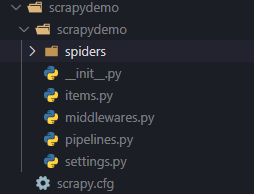
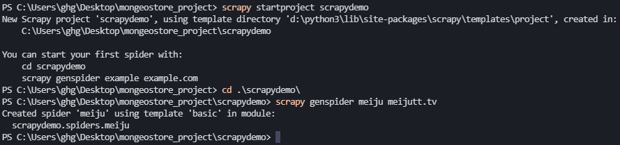
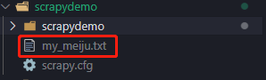

# Scarpy爬虫

[TOC]

## 1.  安装

```
pip install Scrapy
```


## 2. 实例

### 2.1 创建Scrapy项目

```
scrapy startproject scrapydemo
```

- 目录结构如下



- scrapy.cfg: 项目的配置文件。
- scrapydemo/: 项目的Python模块，将会从这里引用代码。
- scrapydemo/items.py: 项目的目标文件。
- scrapydemo/pipelines.py: 项目的管道文件。
- scrapydemo/settings.py: 项目的设置文件。
- scrapydemo/spiders/: 存储爬虫代码目录。


### 2.2 制作爬虫

- 使用命令创建爬虫
- 注意切换对应目录

```
scrapy genspider example example.com

scrapy genspider meiju meijutt.tv
```

- meiju 爬虫名称

- meijutt.tv 爬取网站




### 2.3 编写代码

- meiju.py

  ```python
  import scrapy
  # from scrapydemo.items import ScrapydemoItem
  from scrapydemo.items import ScrapydemoItem
  
  class MeijuSpider(scrapy.Spider):
      name = 'meiju'
      allowed_domains = ['meijutt.tv']
      # start_urls = ['http://meijutt.tv/']
      start_urls = ['https://www.meijutt.tv/new100.html']
  
      def parse(self, response):
          # print("=======================")
          # print(response)
          # print("+++++++++++++++++++++++")
          # movies = response.xpath('//ul[@class="top-list fn-clear"]/li')
          movies = response.xpath('//ul[@class="top-list  fn-clear"]/li')
          # print("results:" )
          # print(movies)
          for each_movie in movies:
              item = ScrapydemoItem()
              item['name'] = each_movie.xpath('./h5/a/@title').extract()[0]
              yield item
  ```

  

- items.py

  ```
  import scrapy
  
  
  class ScrapydemoItem(scrapy.Item):
      # define the fields for your item here like:
      # name = scrapy.Field()
      name = scrapy.Field()
  ```

  

- settings.py

  ```
  # Add Info
  ITEM_PIPELINES= {'scrapydemo.pipelines.ScrapydemoPipeline':100}
  ```

  

- pipelines.py

  ```python
  from itemadapter import ItemAdapter
  
  
  class ScrapydemoPipeline(object):
      print('test')
      def process_item(self, item, spider):
          # print("test1")
          # with open('my_meiju.txt','a') as fp:
          #     print(item)
          #     print(item['name'])
          #     # fp.write(item['name'].encode('utf-8') + '\n')
          #     fp.write(item['name'].encoding('utf-8') + '\n')
          #     # fp.write(item['name'] + '\n')
          with open('my_meiju.txt','a',encoding='utf-8') as fp:
              print(item)
              print(item['name'])
              # fp.write(item['name'].encode('utf-8') + '\n')
              # fp.write(item['name'].encoding('utf-8') + '\n')
              fp.write(item['name'] + '\n')
  ```

  - 注意中文编码问题


### 2.4 运行爬虫

- 在爬虫根目录下，运行（`PS C:\Users\ghg\Desktop\mongeostore_project\scrapydemo> `）

```
scrapy crawl meiju
```

### 2.5 查看文件

- 文件在爬虫根目录下（`PS C:\Users\ghg\Desktop\mongeostore_project\scrapydemo> `）



- 注意文件路径问题

  

## 3.  实例2

### 3.1 新建爬虫工程

```
scrapy startproject getinfo
```

### 3.2 创建爬虫

```
cd getinfo

scrapy genspider getinfo-xpath quotes.toscrape.com
```

### 3.3 编写代码

- spiders/getinfo-xpath.py

  ```python
  import scrapy
  
  
  class GetinfoXpathSpider(scrapy.Spider):
      name = 'getinfo-xpath'
      allowed_domains = ['quotes.toscrape.com']
      start_urls = ['http://quotes.toscrape.com/']
  
      def parse(self, response):
          for quote in response.xpath('//div[@class = "quote"]'):
              yield{
                  'text': quote.xpath('./span[@class="text"]/text()').extract_first(),
                  'author': quote.xpath('.//small[@class="author"]/text()').extract_first(),
                  'tags': quote.xpath('.//div[@class="tags"]/a[@class="tag"]/text()').extract(),
              }
              next_page_url = response.xpath('//li[@class ="next"]/a/@href').extract_first()
              if next_page_url is not None:
                  yield scrapy.Request(response.urljoin(next_page_url))
  ```

- 以下文件默认即可
  - pipelines.py
  - settings.py
  - items.py

### 3.4 运行爬虫

```
scrapy crawl getinfo-xpath
```

- Tips:tipping_hand_man::我在创建项目时`getinfo-xpath`，生成文件是getinfo_xpath.py,运行爬虫是`getinfo-xpath`