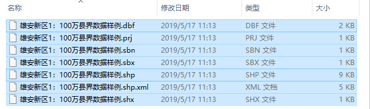
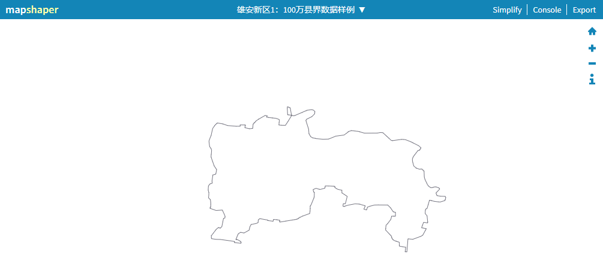
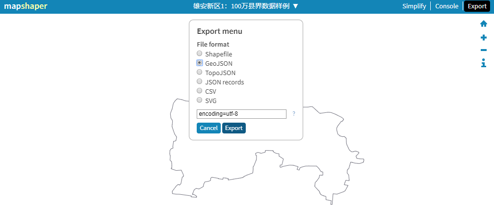

# 硕士论文

[TOC]

## 一、开题准备

### 1、shp格式转为json格式

- 第一步：打开网站http://www.mapshaper.org/ 

- 第二步：点击select按钮，选择目标shp图层 

- 第三步：确认，import导入： 

  

-  第四步：点击右上角的export，选择GeoJson ,输入encoding=utf8,点击export，方法一转换完成： 

  

- shp转化为json在线转化网站 
  - http://www.mapshaper.org/ 
  -  https://mygeodata.cloud/converter/shp-to-json 
  -  http://2geojson.com/ 
  -  http://techslides.com/demos/mapping/shapefile-geojson-converter.html 
  -  http://jeffpaine.github.io/geojson-topojson/ 
  -  http://geojson.io/#map=2/20.0/0.0 
  -  http://www.shpescape.com/ 
  -  http://arcgisgeojson.azurewebsites.net/ 

参考： 

https://blog.csdn.net/baidu_34304646/article/details/78076900 

 https://blog.csdn.net/u010534192/article/details/53163280 

### 2、Cesium添加GeoJson数据

 将前面转换得到的json格式世界数据叠加到Cesium的底图上。 

### 3、python 地震数据可视化

参考：

 https://blog.csdn.net/sinat_27917465/article/details/86517738 

### 4、java查看SEGY

Java实现查看SEGY（.su格式）数据道头字信息的GUI图形用户界面

### 5、VTK显示