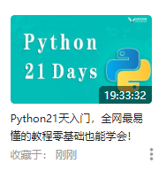
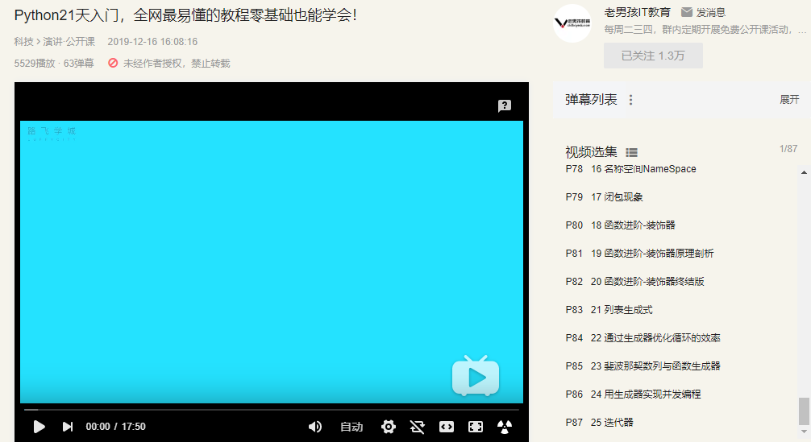

# Reading

- 2018.5-9

  - 《Hadoop权威指南》--Tom White著 王海译
  - 《Python+Spark2.0+Hadoop机器学习与大数据实战》--林大贵著

  -  《地球信息科学》 --陈述彭 编
  - 《Java从入门到精通（第4版）》--明日科技著
  - 《Java从小白到大牛》--关东升著
  - 《MongoDB实战（第二版》）--KyleBanker 著 徐雷译
  - 《MongoDB大数据处理权威指南  第2版》--David Hows著 王肖峰译
  - 《MongoDB实战 架构、开发与管理》--Shakuntala Gupta Edward著 蒲成译
  - 《LINUX 就该这么学》--刘遄  著
  
- 2018.10

  - 《大数据SPARK企业级实战》--王家林 编
  
- 2018.11

  - 《Spark最佳实践》--陈欢 林世飞 著
  
- 2019.3

  - 《JavaWeb开发案例课堂》-- 刘玉红著 
  
- 2019.4

  - 《SpringBoot企业级应用开发实战》
  
- 2019.6

  - 《Spring5高级编程》
  
- 2019.7

  - 《SpringBoot+Vue全栈开发实战》
  
- 2019.8

  - 《大数据时代的数据挖掘》
  
- 2019.9

  - 2019Vue、Vuejs最详细教程-入门到项目实战（coderwhy）
  - 《SpringBoot+SpringCloud+Vue+Element项目实战》--徐丽健著
  
- 2019.10
  
  - 《Python3智能数据分析快速入门》--李明江、张良均著
  
- 2019.11
  
  - ArcGIS API for JavaScript 33讲
  
- 2020.2

  - [Python21天入门，全网最易懂的教程零基础也能学会！](https://www.bilibili.com/video/av79492539)（87）

    

  

- 2020.3-5

  - Django

- 2020.6

  - Restframework

- 2020.9

  - 开题

