[TOC]

- 环境说明：
  -  操作系统： centos7 64位 4台
    - 192.168.55.110 master
    - 192.168.55.111 slave1
    - 192.168.55.112 slave2
    - 192.168.55.113 slave3

- 要求
  - 安装jdk，配置jdk环境变量（在搭建Hadoop集群时已经配置号了）
  - 安装Scala


## 一.Scala安装

### 1、下载

#### 1、访问官网：https://www.scala-lang.org/

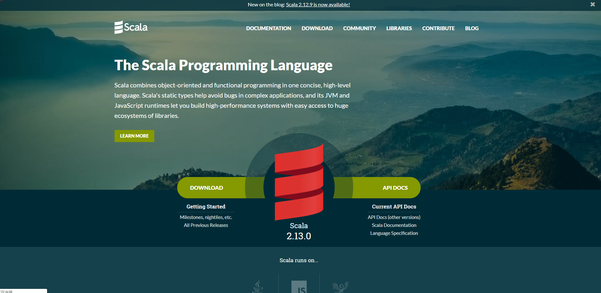

#### 2、点击DOWNLOAD

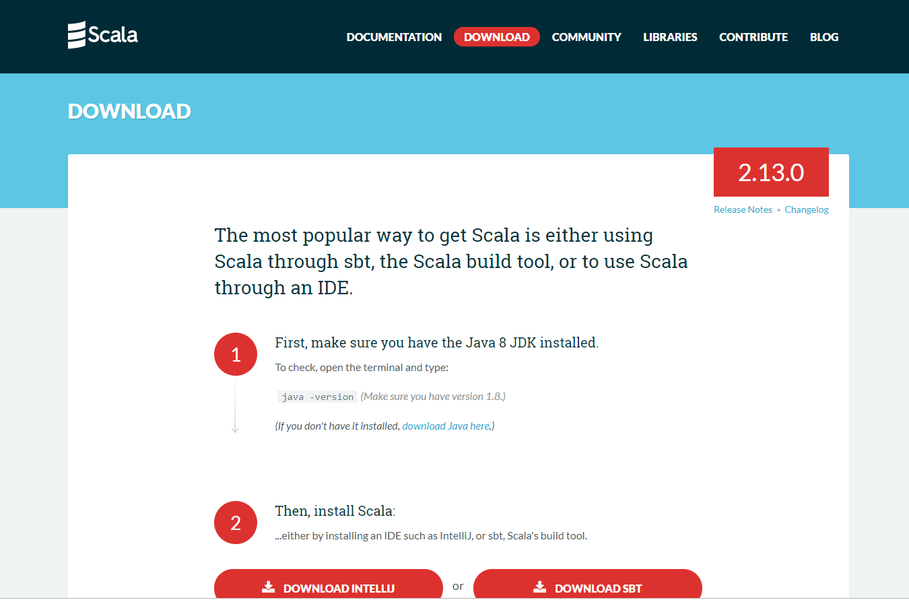

- 向下滚动，选择版本下载。

  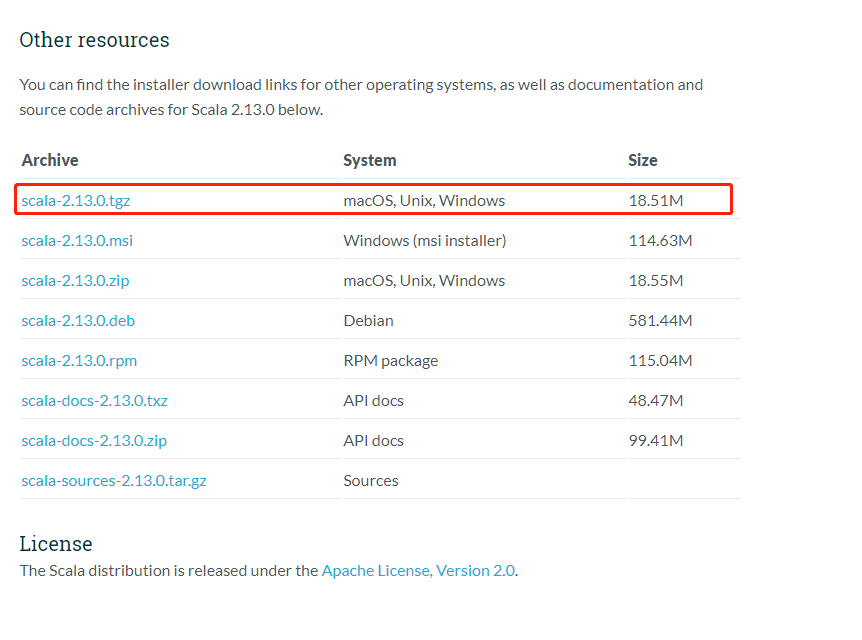

- 下载后上传到虚拟机目录`/usr/local`

- 也可以直接在虚拟机CentOS上下载，右击`scala-2.13.0.tgz`，复制链接。

  ```shell
  [root@master hduser]# cd /usr/local
  [root@master local]# ll
  total 0
  drwxr-xr-x. 2 root root  6 Apr 11  2018 bin
  drwxr-xr-x. 2 root root  6 Apr 11  2018 etc
  drwxr-xr-x. 2 root root  6 Apr 11  2018 games
  drwxr-xr-x. 3 root root 26 Aug 31 15:54 hadoop
  drwxr-xr-x. 2 root root  6 Apr 11  2018 include
  drwxrwxrwx. 3 root root 26 Aug 31 10:23 java
  drwxr-xr-x. 2 root root  6 Apr 11  2018 lib
  drwxr-xr-x. 2 root root  6 Apr 11  2018 lib64
  drwxr-xr-x. 2 root root  6 Apr 11  2018 libexec
  drwxr-xr-x. 2 root root  6 Apr 11  2018 sbin
  drwxr-xr-x. 5 root root 49 Aug 26 19:02 share
  drwxr-xr-x. 2 root root  6 Apr 11  2018 src
  [root@master local]# wget https://downloads.lightbend.com/scala/2.13.0/scala-2.13.0.tgz
  ```

  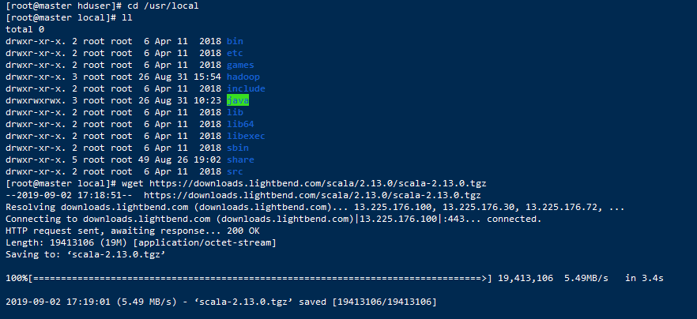

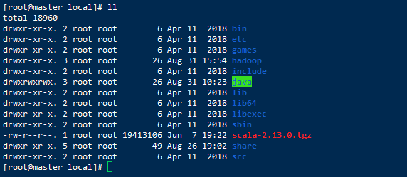

#### 3、解压

```shell
[root@master local]# tar -zxvf scala-2.13.0.tgz 
```

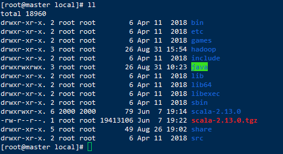

### 2、配置环境变量

#### 1、编辑/etc/profile

```
[root@master local]# vim /etc/profile
```

#### 2、添加如下配置信息

```properties
#Scala environmentnvironment
export SCALA_HOME=/usr/local/scala-2.13.0
export PATH=$PATH:$SCALA_HOME/bin
```

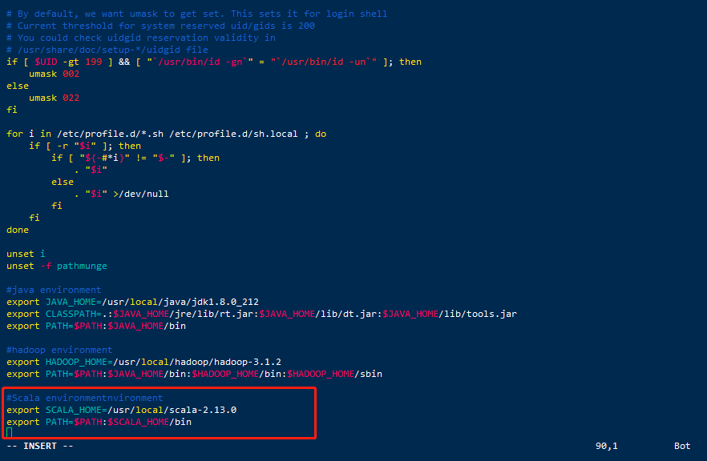

#### 3、使配置生效

```shell
[root@master local]# source /etc/profile
```

#### 4、查看版本号

```shell
[root@master local]# scala -version
```

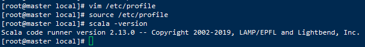

### 3、在slave1、slave2、slave3上进行安装

#### 1、将`scala-2.13.0.tgz`压缩包发送到slave节点。

```shell
[root@master local]# scp -r scala-2.13.0.tgz root@slave1:/usr/local/
  
[root@master local]# scp -r scala-2.13.0.tgz root@slave2:/usr/local/

[root@master local]# scp -r scala-2.13.0.tgz root@slave3:/usr/local/
```

#### 2、查看

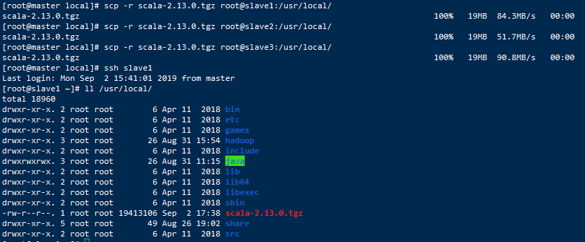

#### 3、解压，配置环境 变量

#### 4、配置完成后可以删除压缩包`scala-2.13.0.tgz`

```shell
[root@slave3 local]# rm -rf scala-2.13.0.tgz 
```

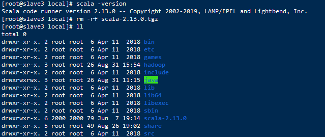


## 二. 下载 Spark2.4.4 版本

### 1、下载

#### 1、访问官网：http://spark.apache.org/，点击Download。

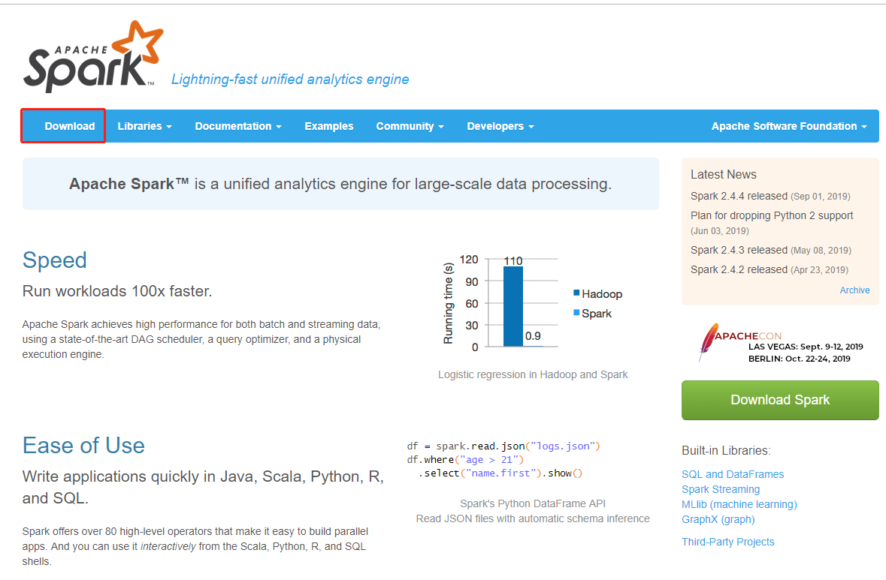

#### 2、点击`spark-2.4.4-bin-hadoop2.7.tgz`

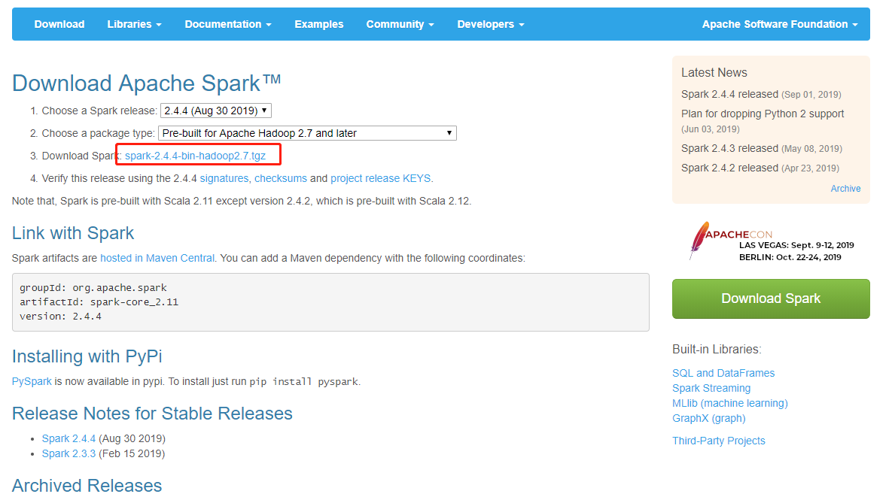

#### 3、选择下载

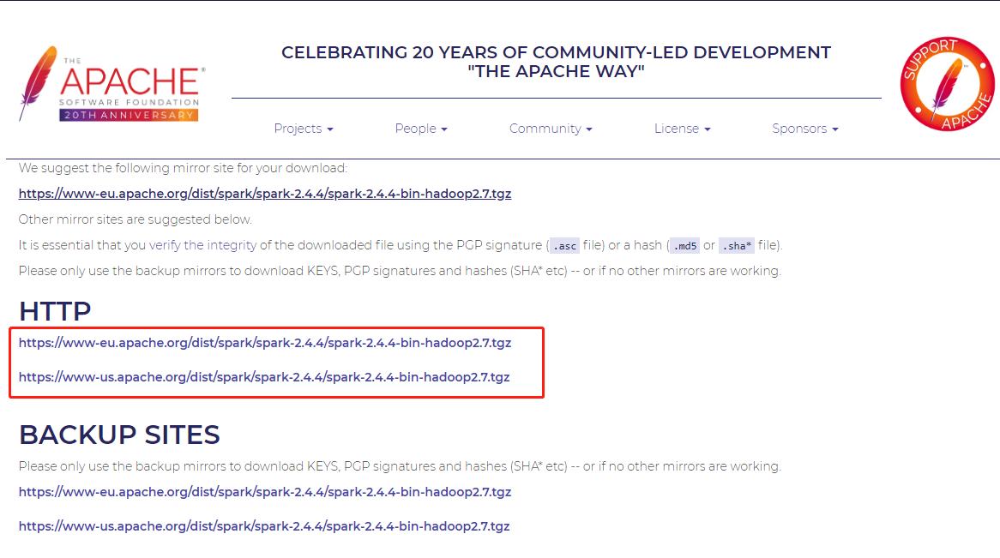

- 也可以在CentOS上下载：右击链接复制链接

- 这里建议用[清华大学开源镜像网站](https://mirrors.tuna.tsinghua.edu.cn/)下载：https://mirrors.tuna.tsinghua.edu.cn/（官网速度比较慢）

  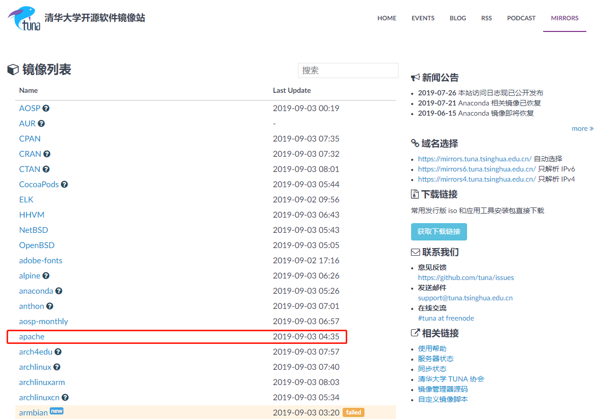

- 找到Spark

  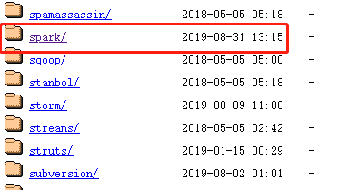

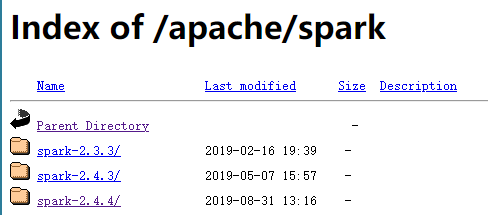

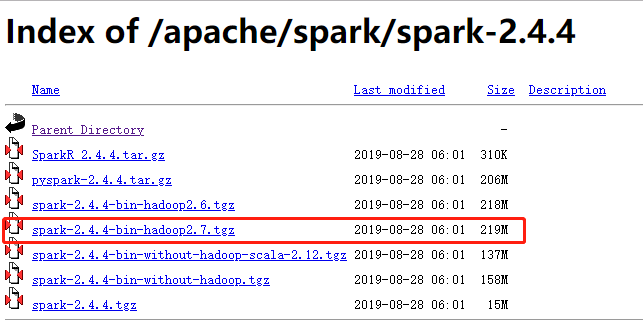

- 右击复制链接，在CentOS7上下载

```shell
[root@master local]# wget https://mirrors.tuna.tsinghua.edu.cn/apache/spark/spark-2.4.4/spark-2.4.4-bin-hadoop2.7.tgz
```

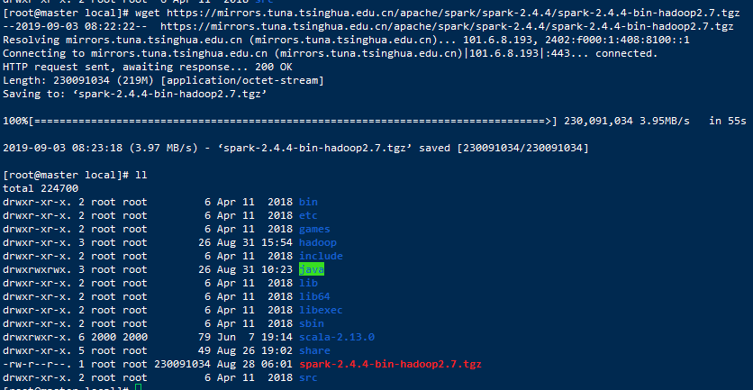


### 2、安装

#### 1、解压

```shell
[root@master local]# tar -zxvf spark-2.4.4-bin-hadoop2.7.tgz 
```

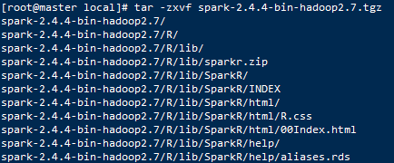

#### 2、查看

```shell
[root@master local]# ll
```

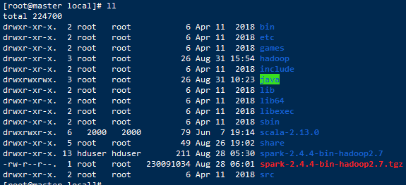

### 3、配置环境变量

#### 1、编辑/etc/profile

```shell
[root@master local]# vim /etc/profile
```

#### 2、添加如下配置信息

```properties
#Spark environment
export SPARK_HOME=/usr/local/spark-2.4.4-bin-hadoop2.7
export PATH=$PATH:$SPARK_HOME/bin
```

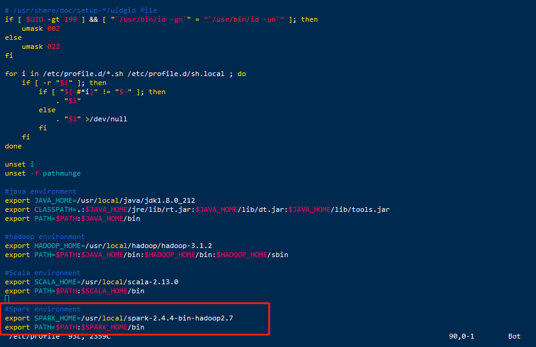

#### 3、使配置生效

```shell
[root@master local]# source /etc/profile
```

#### 4、验证安装成功

```shell
[root@master local]# spark-shell
```

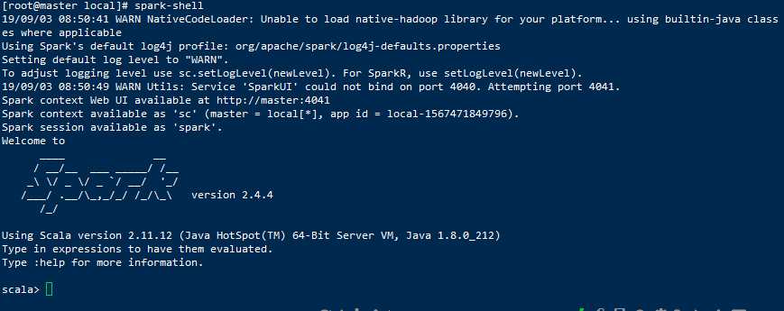

- 说明安装成功

#### 5、配置spark

##### 1、进入`conf`文件夹

```shell
[root@master local]# cd spark-2.4.4-bin-hadoop2.7/
[root@master spark-2.4.4-bin-hadoop2.7]# cd conf/
```

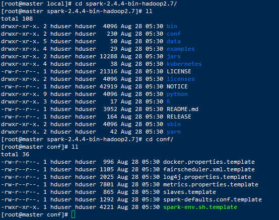

##### 2、把`spark-env.sh.template`复制一份`spark-env.sh`

```shell
[root@master conf]# cp spark-env.sh.template  spark-env.sh
```

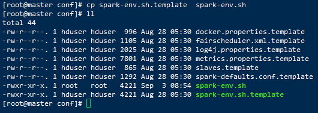

##### 3、配置`spark-env.sh`

```shell
[root@master conf]# vim spark-env.sh
```

##### 4、加入以下配置

```properties
#java environment
export JAVA_HOME=/usr/local/java/jdk1.8.0_212      

#hadoop environment
export HADOOP_HOME=/usr/local/hadoop/hadoop-3.1.2

#Scala environment
export SCALA_HOME=/usr/local/scala-2.13.0

#Spark environment
export SPARK_HOME=/usr/local/spark-2.4.4-bin-hadoop2.7
export SPARK_MASTER_IP=master
export SPARK_MASTER_PORT=7077
export SPARK_EXECUTOR_MEMORY=1G
```

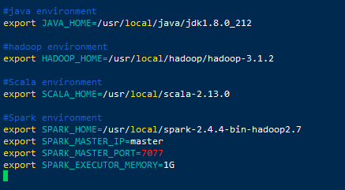

##### 5、把slaves.template拷贝一份改名为slaves

```shell
[root@master conf]# cp slaves.template slaves
```

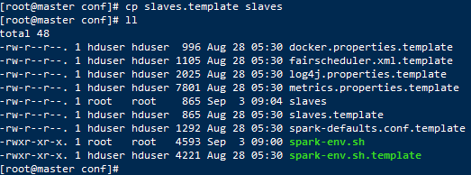

##### 6、配置slaves

```shell
[root@master conf]# vim slaves
```

- 删除localhost，加入以下配置

- ```properties
  #添加节点域名到slaves文件中
  master     
  slave1     
  slave2     
  slave3
  ```

- maser slave1 slave2为3个服务器的别名（也可以写ip地址）

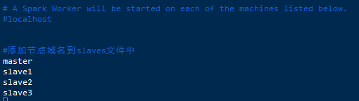

##### 7、将spark复制到slave1、slave2、slave3节点（其它所有节点）

```shell
[root@master local]# scp -r spark-2.4.4-bin-hadoop2.7 slave1:/usr/local/
[root@master local]# scp -r spark-2.4.4-bin-hadoop2.7 slave2:/usr/local/
[root@master local]# scp -r spark-2.4.4-bin-hadoop2.7 slave3:/usr/local/
```

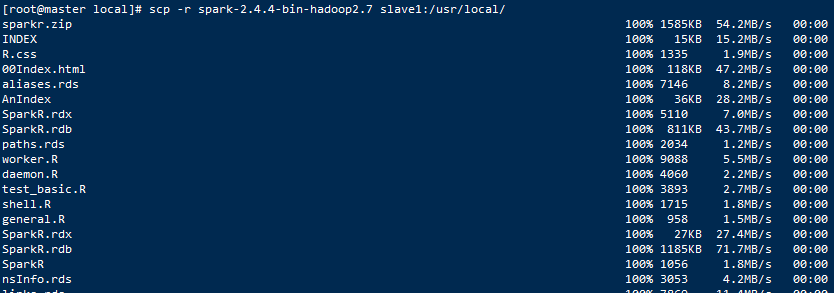

- 备注：每个节点的环境变量都要同样配置，并且spark包中的配置的节点名称或者ip地址也要做相应的修改

##### 8、切换到slave节点查看

```shell
[root@master local]# ssh slave1

[root@slave1 ~]# cd /usr/local/

[root@slave1 local]# ll
```

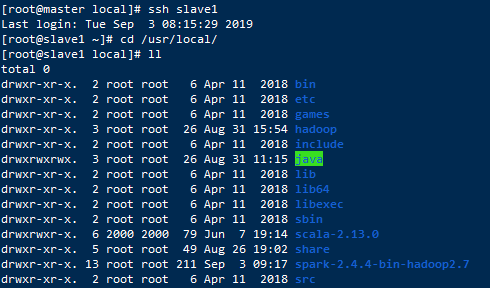


### 4、启动和测试Spark集群

- 因为spark是依赖于hadoop提供的分布式文件系统的，所以在启动spark之前，先确保hadoop在正常运行。

##### 1、在master节点，先启动Hadoop集群

- 进入`/usr/local/hadoop/hadoop-3.1.2/sbin/`

  ```shell
  [root@master hduser]# cd /usr/local/hadoop/hadoop-3.1.2/sbin/
  ```

- 启动Hadoop集群

  - **注意：上面的命令中有./这个不能少，./的意思是执行当前目录下的start-all.sh脚本。**

  ```shell
  [root@master sbin]# ./start-all.sh
  ```

##### 2、在master节点，启动Spark集群

- 进入`/usr/local/spark-2.4.4-bin-hadoop2.7/sbin/`

```
[root@master hduser]# cd /usr/local/spark-2.4.4-bin-hadoop2.7/sbin/
```

- 启动Spark集群
  - **注意：上面的命令中有./这个不能少，./的意思是执行当前目录下的start-all.sh脚本。**

```shell
[root@master local]# ./start-all.sh
```

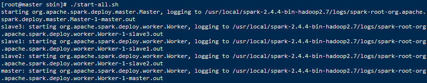

##### 3、master节点查看

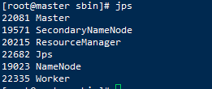

##### 4、slave节点查看

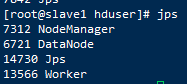


##### 5、Web端查看

- 浏览器输入：http://192.168.55.110:8080/

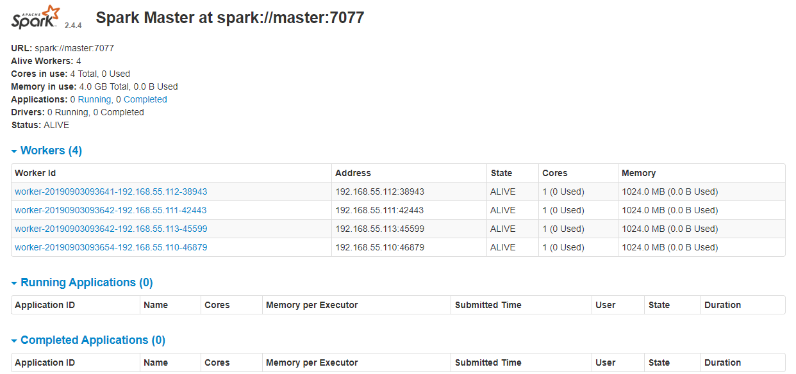


参考：

https://blog.csdn.net/k393393/article/details/92440892

https://blog.csdn.net/pucao_cug/article/details/72353701

https://blog.csdn.net/yang735136055/article/details/100061111