[TOC]


## 一. 使用单机local模式提交任务

##### 1、进入`/usr/local/spark-2.4.4-bin-hadoop2.7/`

```shell
[root@master hduser]# cd /usr/local/spark-2.4.4-bin-hadoop2.7
```

##### 2、 执行命令，用单机模式运行计算圆周率的Demo：

```shell
[root@master spark-2.4.4-bin-hadoop2.7]# ./bin/spark-submit  --class   org.apache.spark.examples.SparkPi  --master   local  examples/jars/spark-examples_2.11-2.4.4.jar
```

- 命令执行后，spark示例开始执行

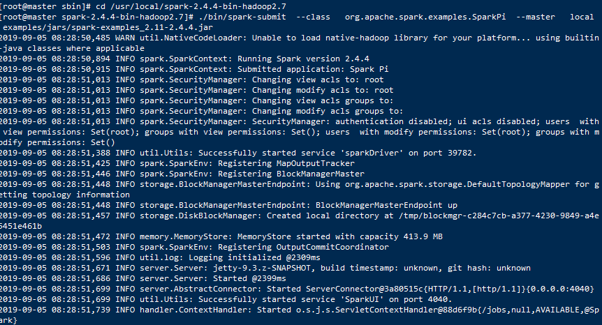

-  执行结果用红框标出来

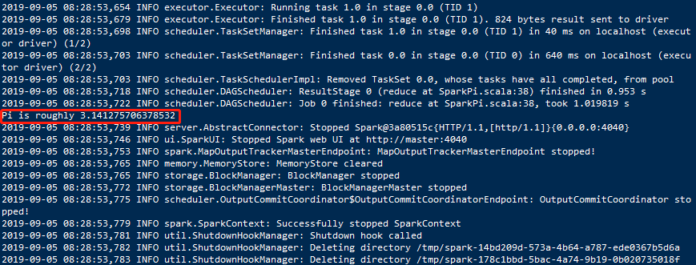

- 完整的控制台输出是：

  ```shell
  [root@master sbin]# cd /usr/local/spark-2.4.4-bin-hadoop2.7
  [root@master spark-2.4.4-bin-hadoop2.7]# ./bin/spark-submit  --class   org.apache.spark.examples.SparkPi  --master   local  examples/jars/spark-examples_2.11-2.4.4.jar
  2019-09-05 08:28:50,485 WARN util.NativeCodeLoader: Unable to load native-hadoop library for your platform... using builtin-java classes where applicable
  2019-09-05 08:28:50,894 INFO spark.SparkContext: Running Spark version 2.4.4
  2019-09-05 08:28:50,915 INFO spark.SparkContext: Submitted application: Spark Pi
  2019-09-05 08:28:51,013 INFO spark.SecurityManager: Changing view acls to: root
  2019-09-05 08:28:51,013 INFO spark.SecurityManager: Changing modify acls to: root
  2019-09-05 08:28:51,013 INFO spark.SecurityManager: Changing view acls groups to: 
  2019-09-05 08:28:51,013 INFO spark.SecurityManager: Changing modify acls groups to: 
  2019-09-05 08:28:51,013 INFO spark.SecurityManager: SecurityManager: authentication disabled; ui acls disabled; users  with view permissions: Set(root); groups with view permissions: Set(); users  with modify permissions: Set(root); groups with modify permissions: Set()
  2019-09-05 08:28:51,388 INFO util.Utils: Successfully started service 'sparkDriver' on port 39782.
  2019-09-05 08:28:51,425 INFO spark.SparkEnv: Registering MapOutputTracker
  2019-09-05 08:28:51,446 INFO spark.SparkEnv: Registering BlockManagerMaster
  2019-09-05 08:28:51,448 INFO storage.BlockManagerMasterEndpoint: Using org.apache.spark.storage.DefaultTopologyMapper for getting topology information
  2019-09-05 08:28:51,448 INFO storage.BlockManagerMasterEndpoint: BlockManagerMasterEndpoint up
  2019-09-05 08:28:51,457 INFO storage.DiskBlockManager: Created local directory at /tmp/blockmgr-c284c7cb-a377-4230-9849-a4e5451e461b
  2019-09-05 08:28:51,472 INFO memory.MemoryStore: MemoryStore started with capacity 413.9 MB
  2019-09-05 08:28:51,503 INFO spark.SparkEnv: Registering OutputCommitCoordinator
  2019-09-05 08:28:51,596 INFO util.log: Logging initialized @2309ms
  2019-09-05 08:28:51,671 INFO server.Server: jetty-9.3.z-SNAPSHOT, build timestamp: unknown, git hash: unknown
  2019-09-05 08:28:51,686 INFO server.Server: Started @2399ms
  2019-09-05 08:28:51,699 INFO server.AbstractConnector: Started ServerConnector@3a80515c{HTTP/1.1,[http/1.1]}{0.0.0.0:4040}
  2019-09-05 08:28:51,699 INFO util.Utils: Successfully started service 'SparkUI' on port 4040.
  2019-09-05 08:28:51,739 INFO handler.ContextHandler: Started o.s.j.s.ServletContextHandler@88d6f9b{/jobs,null,AVAILABLE,@Spark}
  2019-09-05 08:28:51,739 INFO handler.ContextHandler: Started o.s.j.s.ServletContextHandler@4d4d8fcf{/jobs/json,null,AVAILABLE,@Spark}
  2019-09-05 08:28:51,740 INFO handler.ContextHandler: Started o.s.j.s.ServletContextHandler@610db97e{/jobs/job,null,AVAILABLE,@Spark}
  2019-09-05 08:28:51,740 INFO handler.ContextHandler: Started o.s.j.s.ServletContextHandler@3fabf088{/jobs/job/json,null,AVAILABLE,@Spark}
  2019-09-05 08:28:51,741 INFO handler.ContextHandler: Started o.s.j.s.ServletContextHandler@1e392345{/stages,null,AVAILABLE,@Spark}
  2019-09-05 08:28:51,741 INFO handler.ContextHandler: Started o.s.j.s.ServletContextHandler@12f3afb5{/stages/json,null,AVAILABLE,@Spark}
  2019-09-05 08:28:51,741 INFO handler.ContextHandler: Started o.s.j.s.ServletContextHandler@4ced35ed{/stages/stage,null,AVAILABLE,@Spark}
  2019-09-05 08:28:51,742 INFO handler.ContextHandler: Started o.s.j.s.ServletContextHandler@74d7184a{/stages/stage/json,null,AVAILABLE,@Spark}
  2019-09-05 08:28:51,743 INFO handler.ContextHandler: Started o.s.j.s.ServletContextHandler@51b01960{/stages/pool,null,AVAILABLE,@Spark}
  2019-09-05 08:28:51,743 INFO handler.ContextHandler: Started o.s.j.s.ServletContextHandler@6831d8fd{/stages/pool/json,null,AVAILABLE,@Spark}
  2019-09-05 08:28:51,743 INFO handler.ContextHandler: Started o.s.j.s.ServletContextHandler@27dc79f7{/storage,null,AVAILABLE,@Spark}
  2019-09-05 08:28:51,744 INFO handler.ContextHandler: Started o.s.j.s.ServletContextHandler@6b85300e{/storage/json,null,AVAILABLE,@Spark}
  2019-09-05 08:28:51,744 INFO handler.ContextHandler: Started o.s.j.s.ServletContextHandler@3aaf4f07{/storage/rdd,null,AVAILABLE,@Spark}
  2019-09-05 08:28:51,745 INFO handler.ContextHandler: Started o.s.j.s.ServletContextHandler@5cbf9e9f{/storage/rdd/json,null,AVAILABLE,@Spark}
  2019-09-05 08:28:51,745 INFO handler.ContextHandler: Started o.s.j.s.ServletContextHandler@18e8473e{/environment,null,AVAILABLE,@Spark}
  2019-09-05 08:28:51,746 INFO handler.ContextHandler: Started o.s.j.s.ServletContextHandler@5a2f016d{/environment/json,null,AVAILABLE,@Spark}
  2019-09-05 08:28:51,746 INFO handler.ContextHandler: Started o.s.j.s.ServletContextHandler@1a38ba58{/executors,null,AVAILABLE,@Spark}
  2019-09-05 08:28:51,746 INFO handler.ContextHandler: Started o.s.j.s.ServletContextHandler@3ad394e6{/executors/json,null,AVAILABLE,@Spark}
  2019-09-05 08:28:51,763 INFO handler.ContextHandler: Started o.s.j.s.ServletContextHandler@6058e535{/executors/threadDump,null,AVAILABLE,@Spark}
  2019-09-05 08:28:51,763 INFO handler.ContextHandler: Started o.s.j.s.ServletContextHandler@42deb43a{/executors/threadDump/json,null,AVAILABLE,@Spark}
  2019-09-05 08:28:51,771 INFO handler.ContextHandler: Started o.s.j.s.ServletContextHandler@1deb2c43{/static,null,AVAILABLE,@Spark}
  2019-09-05 08:28:51,771 INFO handler.ContextHandler: Started o.s.j.s.ServletContextHandler@24b52d3e{/,null,AVAILABLE,@Spark}
  2019-09-05 08:28:51,772 INFO handler.ContextHandler: Started o.s.j.s.ServletContextHandler@15deb1dc{/api,null,AVAILABLE,@Spark}
  2019-09-05 08:28:51,772 INFO handler.ContextHandler: Started o.s.j.s.ServletContextHandler@3a45c42a{/jobs/job/kill,null,AVAILABLE,@Spark}
  2019-09-05 08:28:51,772 INFO handler.ContextHandler: Started o.s.j.s.ServletContextHandler@36dce7ed{/stages/stage/kill,null,AVAILABLE,@Spark}
  2019-09-05 08:28:51,774 INFO ui.SparkUI: Bound SparkUI to 0.0.0.0, and started at http://master:4040
  2019-09-05 08:28:51,798 INFO spark.SparkContext: Added JAR file:/usr/local/spark-2.4.4-bin-hadoop2.7/examples/jars/spark-examples_2.11-2.4.4.jar at spark://master:39782/jars/spark-examples_2.11-2.4.4.jar with timestamp 1567643331798
  2019-09-05 08:28:51,897 INFO executor.Executor: Starting executor ID driver on host localhost
  2019-09-05 08:28:51,957 INFO util.Utils: Successfully started service 'org.apache.spark.network.netty.NettyBlockTransferService' on port 39117.
  2019-09-05 08:28:51,958 INFO netty.NettyBlockTransferService: Server created on master:39117
  2019-09-05 08:28:51,959 INFO storage.BlockManager: Using org.apache.spark.storage.RandomBlockReplicationPolicy for block replication policy
  2019-09-05 08:28:51,977 INFO storage.BlockManagerMaster: Registering BlockManager BlockManagerId(driver, master, 39117, None)
  2019-09-05 08:28:51,980 INFO storage.BlockManagerMasterEndpoint: Registering block manager master:39117 with 413.9 MB RAM, BlockManagerId(driver, master, 39117, None)
  2019-09-05 08:28:51,983 INFO storage.BlockManagerMaster: Registered BlockManager BlockManagerId(driver, master, 39117, None)
  2019-09-05 08:28:51,983 INFO storage.BlockManager: Initialized BlockManager: BlockManagerId(driver, master, 39117, None)
  2019-09-05 08:28:52,083 INFO handler.ContextHandler: Started o.s.j.s.ServletContextHandler@6050462a{/metrics/json,null,AVAILABLE,@Spark}
  2019-09-05 08:28:52,702 INFO spark.SparkContext: Starting job: reduce at SparkPi.scala:38
  2019-09-05 08:28:52,733 INFO scheduler.DAGScheduler: Got job 0 (reduce at SparkPi.scala:38) with 2 output partitions
  2019-09-05 08:28:52,734 INFO scheduler.DAGScheduler: Final stage: ResultStage 0 (reduce at SparkPi.scala:38)
  2019-09-05 08:28:52,734 INFO scheduler.DAGScheduler: Parents of final stage: List()
  2019-09-05 08:28:52,735 INFO scheduler.DAGScheduler: Missing parents: List()
  2019-09-05 08:28:52,753 INFO scheduler.DAGScheduler: Submitting ResultStage 0 (MapPartitionsRDD[1] at map at SparkPi.scala:34), which has no missing parents
  2019-09-05 08:28:52,909 INFO memory.MemoryStore: Block broadcast_0 stored as values in memory (estimated size 1936.0 B, free 413.9 MB)
  2019-09-05 08:28:52,985 INFO memory.MemoryStore: Block broadcast_0_piece0 stored as bytes in memory (estimated size 1256.0 B, free 413.9 MB)
  2019-09-05 08:28:52,990 INFO storage.BlockManagerInfo: Added broadcast_0_piece0 in memory on master:39117 (size: 1256.0 B, free: 413.9 MB)
  2019-09-05 08:28:53,021 INFO spark.SparkContext: Created broadcast 0 from broadcast at DAGScheduler.scala:1161
  2019-09-05 08:28:53,031 INFO scheduler.DAGScheduler: Submitting 2 missing tasks from ResultStage 0 (MapPartitionsRDD[1] at map at SparkPi.scala:34) (first 15 tasks are for partitions Vector(0, 1))
  2019-09-05 08:28:53,044 INFO scheduler.TaskSchedulerImpl: Adding task set 0.0 with 2 tasks
  2019-09-05 08:28:53,086 INFO scheduler.TaskSetManager: Starting task 0.0 in stage 0.0 (TID 0, localhost, executor driver, partition 0, PROCESS_LOCAL, 7866 bytes)
  2019-09-05 08:28:53,121 INFO executor.Executor: Running task 0.0 in stage 0.0 (TID 0)
  2019-09-05 08:28:53,124 INFO executor.Executor: Fetching spark://master:39782/jars/spark-examples_2.11-2.4.4.jar with timestamp 1567643331798
  2019-09-05 08:28:53,277 INFO client.TransportClientFactory: Successfully created connection to master/192.168.55.110:39782 after 90 ms (0 ms spent in bootstraps)
  2019-09-05 08:28:53,280 INFO util.Utils: Fetching spark://master:39782/jars/spark-examples_2.11-2.4.4.jar to /tmp/spark-14bd209d-573a-4b64-a787-ede0367b5d6a/userFiles-0474c33a-d16d-4232-a44c-7abee336f3b4/fetchFileTemp3963728465075988607.tmp
  2019-09-05 08:28:53,530 INFO executor.Executor: Adding file:/tmp/spark-14bd209d-573a-4b64-a787-ede0367b5d6a/userFiles-0474c33a-d16d-4232-a44c-7abee336f3b4/spark-examples_2.11-2.4.4.jar to class loader
  2019-09-05 08:28:53,650 INFO executor.Executor: Finished task 0.0 in stage 0.0 (TID 0). 867 bytes result sent to driver
  2019-09-05 08:28:53,652 INFO scheduler.TaskSetManager: Starting task 1.0 in stage 0.0 (TID 1, localhost, executor driver, partition 1, PROCESS_LOCAL, 7866 bytes)
  2019-09-05 08:28:53,654 INFO executor.Executor: Running task 1.0 in stage 0.0 (TID 1)
  2019-09-05 08:28:53,679 INFO executor.Executor: Finished task 1.0 in stage 0.0 (TID 1). 824 bytes result sent to driver
  2019-09-05 08:28:53,698 INFO scheduler.TaskSetManager: Finished task 1.0 in stage 0.0 (TID 1) in 40 ms on localhost (executor driver) (1/2)
  2019-09-05 08:28:53,703 INFO scheduler.TaskSetManager: Finished task 0.0 in stage 0.0 (TID 0) in 640 ms on localhost (executor driver) (2/2)
  2019-09-05 08:28:53,703 INFO scheduler.TaskSchedulerImpl: Removed TaskSet 0.0, whose tasks have all completed, from pool 
  2019-09-05 08:28:53,718 INFO scheduler.DAGScheduler: ResultStage 0 (reduce at SparkPi.scala:38) finished in 0.953 s
  2019-09-05 08:28:53,722 INFO scheduler.DAGScheduler: Job 0 finished: reduce at SparkPi.scala:38, took 1.019819 s
  Pi is roughly 3.141275706378532
  2019-09-05 08:28:53,739 INFO server.AbstractConnector: Stopped Spark@3a80515c{HTTP/1.1,[http/1.1]}{0.0.0.0:4040}
  2019-09-05 08:28:53,746 INFO ui.SparkUI: Stopped Spark web UI at http://master:4040
  2019-09-05 08:28:53,753 INFO spark.MapOutputTrackerMasterEndpoint: MapOutputTrackerMasterEndpoint stopped!
  2019-09-05 08:28:53,765 INFO memory.MemoryStore: MemoryStore cleared
  2019-09-05 08:28:53,765 INFO storage.BlockManager: BlockManager stopped
  2019-09-05 08:28:53,772 INFO storage.BlockManagerMaster: BlockManagerMaster stopped
  2019-09-05 08:28:53,775 INFO scheduler.OutputCommitCoordinator$OutputCommitCoordinatorEndpoint: OutputCommitCoordinator stopped!
  2019-09-05 08:28:53,779 INFO spark.SparkContext: Successfully stopped SparkContext
  2019-09-05 08:28:53,781 INFO util.ShutdownHookManager: Shutdown hook called
  2019-09-05 08:28:53,782 INFO util.ShutdownHookManager: Deleting directory /tmp/spark-14bd209d-573a-4b64-a787-ede0367b5d6a
  2019-09-05 08:28:53,783 INFO util.ShutdownHookManager: Deleting directory /tmp/spark-178c1bbd-5bac-4a74-9b19-0b020735018f
  ```


## 二、使用独立的Spark集群模式运行Demo

- 这种模式也就是`Standalone`模式，使用独立的Spark集群模式提交任务，需要先启动Spark集群，但是不需要启动Hadoop集群。

##### 1、在master节点，启动Spark集群

- 进入`/usr/local/spark-2.4.4-bin-hadoop2.7/sbin/`

```shell
[root@master hduser]# cd /usr/local/spark-2.4.4-bin-hadoop2.7/sbin/
```

- 启动Spark集群
  - **注意：上面的命令中有./这个不能少，./的意思是执行当前目录下的start-all.sh脚本。**

```shell
[root@master sbin]# ./start-all.sh
```

- 启动成功后，可以访问下面的地址看是否成功：http://master:8080/或者http://192.168.55.110:8080/


##### 2、进入`/usr/local/spark-2.4.4-bin-hadoop2.7/`

```shell
[root@master sbin]# cd /usr/local/spark-2.4.4-bin-hadoop2.7/
```

##### 3、 执行命令，用单机模式运行计算圆周率的Demo：

```shell
[root@master spark-2.4.4-bin-hadoop2.7]# ./bin/spark-submit  --class   org.apache.spark.examples.SparkPi  --master   spark://192.168.55.110:7077  examples/jars/spark-examples_2.11-2.4.4.jar
```

- 命令执行后，spark示例程序已经开始执行

  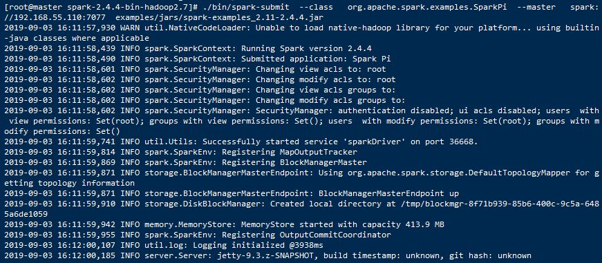

- 很快执行结果出来了，结果用红框标出来
- 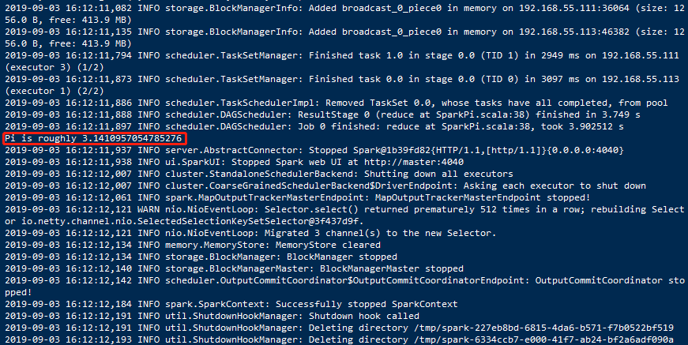

- 完整信息：

  ```shell
  [root@master spark-2.4.4-bin-hadoop2.7]# ./bin/spark-submit  --class   org.apache.spark.examples.SparkPi  --master   spark://192.168.55.110:7077  examples/jars/spark-examples_2.11-2.4.4.jar
  2019-09-03 16:11:57,930 WARN util.NativeCodeLoader: Unable to load native-hadoop library for your platform... using builtin-java classes where applicable
  2019-09-03 16:11:58,439 INFO spark.SparkContext: Running Spark version 2.4.4
  2019-09-03 16:11:58,490 INFO spark.SparkContext: Submitted application: Spark Pi
  2019-09-03 16:11:58,601 INFO spark.SecurityManager: Changing view acls to: root
  2019-09-03 16:11:58,602 INFO spark.SecurityManager: Changing modify acls to: root
  2019-09-03 16:11:58,602 INFO spark.SecurityManager: Changing view acls groups to: 
  2019-09-03 16:11:58,602 INFO spark.SecurityManager: Changing modify acls groups to: 
  2019-09-03 16:11:58,602 INFO spark.SecurityManager: SecurityManager: authentication disabled; ui acls disabled; users  with view permissions: Set(root); groups with view permissions: Set(); users  with modify permissions: Set(root); groups with modify permissions: Set()
  2019-09-03 16:11:59,741 INFO util.Utils: Successfully started service 'sparkDriver' on port 36668.
  2019-09-03 16:11:59,814 INFO spark.SparkEnv: Registering MapOutputTracker
  2019-09-03 16:11:59,869 INFO spark.SparkEnv: Registering BlockManagerMaster
  2019-09-03 16:11:59,871 INFO storage.BlockManagerMasterEndpoint: Using org.apache.spark.storage.DefaultTopologyMapper for getting topology information
  2019-09-03 16:11:59,871 INFO storage.BlockManagerMasterEndpoint: BlockManagerMasterEndpoint up
  2019-09-03 16:11:59,910 INFO storage.DiskBlockManager: Created local directory at /tmp/blockmgr-8f71b939-85b6-400c-9c5a-6485a6de1059
  2019-09-03 16:11:59,942 INFO memory.MemoryStore: MemoryStore started with capacity 413.9 MB
  2019-09-03 16:11:59,955 INFO spark.SparkEnv: Registering OutputCommitCoordinator
  2019-09-03 16:12:00,107 INFO util.log: Logging initialized @3938ms
  2019-09-03 16:12:00,185 INFO server.Server: jetty-9.3.z-SNAPSHOT, build timestamp: unknown, git hash: unknown
  2019-09-03 16:12:00,269 INFO server.Server: Started @4101ms
  2019-09-03 16:12:00,291 INFO server.AbstractConnector: Started ServerConnector@1b39fd82{HTTP/1.1,[http/1.1]}{0.0.0.0:4040}
  2019-09-03 16:12:00,291 INFO util.Utils: Successfully started service 'SparkUI' on port 4040.
  2019-09-03 16:12:00,390 INFO handler.ContextHandler: Started o.s.j.s.ServletContextHandler@160c3ec1{/jobs,null,AVAILABLE,@Spark}
  2019-09-03 16:12:00,391 INFO handler.ContextHandler: Started o.s.j.s.ServletContextHandler@1e392345{/jobs/json,null,AVAILABLE,@Spark}
  2019-09-03 16:12:00,391 INFO handler.ContextHandler: Started o.s.j.s.ServletContextHandler@12f3afb5{/jobs/job,null,AVAILABLE,@Spark}
  2019-09-03 16:12:00,392 INFO handler.ContextHandler: Started o.s.j.s.ServletContextHandler@2c22a348{/jobs/job/json,null,AVAILABLE,@Spark}
  2019-09-03 16:12:00,392 INFO handler.ContextHandler: Started o.s.j.s.ServletContextHandler@7bd69e82{/stages,null,AVAILABLE,@Spark}
  2019-09-03 16:12:00,392 INFO handler.ContextHandler: Started o.s.j.s.ServletContextHandler@74d7184a{/stages/json,null,AVAILABLE,@Spark}
  2019-09-03 16:12:00,393 INFO handler.ContextHandler: Started o.s.j.s.ServletContextHandler@51b01960{/stages/stage,null,AVAILABLE,@Spark}
  2019-09-03 16:12:00,393 INFO handler.ContextHandler: Started o.s.j.s.ServletContextHandler@6b85300e{/stages/stage/json,null,AVAILABLE,@Spark}
  2019-09-03 16:12:00,394 INFO handler.ContextHandler: Started o.s.j.s.ServletContextHandler@3aaf4f07{/stages/pool,null,AVAILABLE,@Spark}
  2019-09-03 16:12:00,394 INFO handler.ContextHandler: Started o.s.j.s.ServletContextHandler@5cbf9e9f{/stages/pool/json,null,AVAILABLE,@Spark}
  2019-09-03 16:12:00,394 INFO handler.ContextHandler: Started o.s.j.s.ServletContextHandler@18e8473e{/storage,null,AVAILABLE,@Spark}
  2019-09-03 16:12:00,395 INFO handler.ContextHandler: Started o.s.j.s.ServletContextHandler@5a2f016d{/storage/json,null,AVAILABLE,@Spark}
  2019-09-03 16:12:00,395 INFO handler.ContextHandler: Started o.s.j.s.ServletContextHandler@1a38ba58{/storage/rdd,null,AVAILABLE,@Spark}
  2019-09-03 16:12:00,395 INFO handler.ContextHandler: Started o.s.j.s.ServletContextHandler@3ad394e6{/storage/rdd/json,null,AVAILABLE,@Spark}
  2019-09-03 16:12:00,396 INFO handler.ContextHandler: Started o.s.j.s.ServletContextHandler@6058e535{/environment,null,AVAILABLE,@Spark}
  2019-09-03 16:12:00,396 INFO handler.ContextHandler: Started o.s.j.s.ServletContextHandler@42deb43a{/environment/json,null,AVAILABLE,@Spark}
  2019-09-03 16:12:00,396 INFO handler.ContextHandler: Started o.s.j.s.ServletContextHandler@1deb2c43{/executors,null,AVAILABLE,@Spark}
  2019-09-03 16:12:00,397 INFO handler.ContextHandler: Started o.s.j.s.ServletContextHandler@3bb9efbc{/executors/json,null,AVAILABLE,@Spark}
  2019-09-03 16:12:00,397 INFO handler.ContextHandler: Started o.s.j.s.ServletContextHandler@1cefc4b3{/executors/threadDump,null,AVAILABLE,@Spark}
  2019-09-03 16:12:00,397 INFO handler.ContextHandler: Started o.s.j.s.ServletContextHandler@2b27cc70{/executors/threadDump/json,null,AVAILABLE,@Spark}
  2019-09-03 16:12:00,414 INFO handler.ContextHandler: Started o.s.j.s.ServletContextHandler@6f6a7463{/static,null,AVAILABLE,@Spark}
  2019-09-03 16:12:00,415 INFO handler.ContextHandler: Started o.s.j.s.ServletContextHandler@5af5def9{/,null,AVAILABLE,@Spark}
  2019-09-03 16:12:00,415 INFO handler.ContextHandler: Started o.s.j.s.ServletContextHandler@3a45c42a{/api,null,AVAILABLE,@Spark}
  2019-09-03 16:12:00,423 INFO handler.ContextHandler: Started o.s.j.s.ServletContextHandler@27a0a5a2{/jobs/job/kill,null,AVAILABLE,@Spark}
  2019-09-03 16:12:00,424 INFO handler.ContextHandler: Started o.s.j.s.ServletContextHandler@7692cd34{/stages/stage/kill,null,AVAILABLE,@Spark}
  2019-09-03 16:12:00,425 INFO ui.SparkUI: Bound SparkUI to 0.0.0.0, and started at http://master:4040
  2019-09-03 16:12:00,457 INFO spark.SparkContext: Added JAR file:/usr/local/spark-2.4.4-bin-hadoop2.7/examples/jars/spark-examples_2.11-2.4.4.jar at spark://master:36668/jars/spark-examples_2.11-2.4.4.jar with timestamp 1567498320456
  2019-09-03 16:12:00,814 INFO client.StandaloneAppClient$ClientEndpoint: Connecting to master spark://192.168.55.110:7077...
  2019-09-03 16:12:01,180 INFO client.TransportClientFactory: Successfully created connection to /192.168.55.110:7077 after 189 ms (0 ms spent in bootstraps)
  2019-09-03 16:12:01,895 INFO cluster.StandaloneSchedulerBackend: Connected to Spark cluster with app ID app-20190903161201-0000
  2019-09-03 16:12:01,990 INFO client.StandaloneAppClient$ClientEndpoint: Executor added: app-20190903161201-0000/0 on worker-20190903160346-192.168.55.110-36206 (192.168.55.110:36206) with 1 core(s)
  2019-09-03 16:12:02,073 INFO cluster.StandaloneSchedulerBackend: Granted executor ID app-20190903161201-0000/0 on hostPort 192.168.55.110:36206 with 1 core(s), 1024.0 MB RAM
  2019-09-03 16:12:02,073 INFO client.StandaloneAppClient$ClientEndpoint: Executor added: app-20190903161201-0000/1 on worker-20190903160424-192.168.55.113-36628 (192.168.55.113:36628) with 1 core(s)
  2019-09-03 16:12:02,074 INFO cluster.StandaloneSchedulerBackend: Granted executor ID app-20190903161201-0000/1 on hostPort 192.168.55.113:36628 with 1 core(s), 1024.0 MB RAM
  2019-09-03 16:12:02,074 INFO client.StandaloneAppClient$ClientEndpoint: Executor added: app-20190903161201-0000/2 on worker-20190903160433-192.168.55.112-33727 (192.168.55.112:33727) with 1 core(s)
  2019-09-03 16:12:02,074 INFO cluster.StandaloneSchedulerBackend: Granted executor ID app-20190903161201-0000/2 on hostPort 192.168.55.112:33727 with 1 core(s), 1024.0 MB RAM
  2019-09-03 16:12:02,074 INFO client.StandaloneAppClient$ClientEndpoint: Executor added: app-20190903161201-0000/3 on worker-20190903160407-192.168.55.111-43708 (192.168.55.111:43708) with 1 core(s)
  2019-09-03 16:12:02,074 INFO cluster.StandaloneSchedulerBackend: Granted executor ID app-20190903161201-0000/3 on hostPort 192.168.55.111:43708 with 1 core(s), 1024.0 MB RAM
  2019-09-03 16:12:02,395 INFO util.Utils: Successfully started service 'org.apache.spark.network.netty.NettyBlockTransferService' on port 45728.
  2019-09-03 16:12:02,396 INFO netty.NettyBlockTransferService: Server created on master:45728
  2019-09-03 16:12:02,397 INFO storage.BlockManager: Using org.apache.spark.storage.RandomBlockReplicationPolicy for block replication policy
  2019-09-03 16:12:02,394 INFO client.StandaloneAppClient$ClientEndpoint: Executor updated: app-20190903161201-0000/0 is now RUNNING
  2019-09-03 16:12:02,413 INFO storage.BlockManagerMaster: Registering BlockManager BlockManagerId(driver, master, 45728, None)
  2019-09-03 16:12:02,428 INFO client.StandaloneAppClient$ClientEndpoint: Executor updated: app-20190903161201-0000/1 is now RUNNING
  2019-09-03 16:12:02,428 INFO client.StandaloneAppClient$ClientEndpoint: Executor updated: app-20190903161201-0000/3 is now RUNNING
  2019-09-03 16:12:02,428 INFO client.StandaloneAppClient$ClientEndpoint: Executor updated: app-20190903161201-0000/2 is now RUNNING
  2019-09-03 16:12:02,430 INFO storage.BlockManagerMasterEndpoint: Registering block manager master:45728 with 413.9 MB RAM, BlockManagerId(driver, master, 45728, None)
  2019-09-03 16:12:02,439 INFO storage.BlockManagerMaster: Registered BlockManager BlockManagerId(driver, master, 45728, None)
  2019-09-03 16:12:02,440 INFO storage.BlockManager: Initialized BlockManager: BlockManagerId(driver, master, 45728, None)
  2019-09-03 16:12:03,636 INFO handler.ContextHandler: Started o.s.j.s.ServletContextHandler@abbc908{/metrics/json,null,AVAILABLE,@Spark}
  2019-09-03 16:12:03,792 INFO cluster.StandaloneSchedulerBackend: SchedulerBackend is ready for scheduling beginning after reached minRegisteredResourcesRatio: 0.0
  2019-09-03 16:12:07,994 INFO spark.SparkContext: Starting job: reduce at SparkPi.scala:38
  2019-09-03 16:12:08,059 INFO scheduler.DAGScheduler: Got job 0 (reduce at SparkPi.scala:38) with 2 output partitions
  2019-09-03 16:12:08,060 INFO scheduler.DAGScheduler: Final stage: ResultStage 0 (reduce at SparkPi.scala:38)
  2019-09-03 16:12:08,060 INFO scheduler.DAGScheduler: Parents of final stage: List()
  2019-09-03 16:12:08,061 INFO scheduler.DAGScheduler: Missing parents: List()
  2019-09-03 16:12:08,076 INFO scheduler.DAGScheduler: Submitting ResultStage 0 (MapPartitionsRDD[1] at map at SparkPi.scala:34), which has no missing parents
  2019-09-03 16:12:08,397 INFO memory.MemoryStore: Block broadcast_0 stored as values in memory (estimated size 1936.0 B, free 413.9 MB)
  2019-09-03 16:12:08,715 INFO memory.MemoryStore: Block broadcast_0_piece0 stored as bytes in memory (estimated size 1256.0 B, free 413.9 MB)
  2019-09-03 16:12:08,718 INFO storage.BlockManagerInfo: Added broadcast_0_piece0 in memory on master:45728 (size: 1256.0 B, free: 413.9 MB)
  2019-09-03 16:12:08,719 INFO cluster.CoarseGrainedSchedulerBackend$DriverEndpoint: Registered executor NettyRpcEndpointRef(spark-client://Executor) (192.168.55.113:52754) with ID 1
  2019-09-03 16:12:08,734 INFO spark.SparkContext: Created broadcast 0 from broadcast at DAGScheduler.scala:1161
  2019-09-03 16:12:08,754 INFO scheduler.DAGScheduler: Submitting 2 missing tasks from ResultStage 0 (MapPartitionsRDD[1] at map at SparkPi.scala:34) (first 15 tasks are for partitions Vector(0, 1))
  2019-09-03 16:12:08,755 INFO scheduler.TaskSchedulerImpl: Adding task set 0.0 with 2 tasks
  2019-09-03 16:12:08,796 INFO scheduler.TaskSetManager: Starting task 0.0 in stage 0.0 (TID 0, 192.168.55.113, executor 1, partition 0, PROCESS_LOCAL, 7870 bytes)
  2019-09-03 16:12:08,843 INFO cluster.CoarseGrainedSchedulerBackend$DriverEndpoint: Registered executor NettyRpcEndpointRef(spark-client://Executor) (192.168.55.111:34418) with ID 3
  2019-09-03 16:12:08,844 INFO scheduler.TaskSetManager: Starting task 1.0 in stage 0.0 (TID 1, 192.168.55.111, executor 3, partition 1, PROCESS_LOCAL, 7870 bytes)
  2019-09-03 16:12:08,909 INFO cluster.CoarseGrainedSchedulerBackend$DriverEndpoint: Registered executor NettyRpcEndpointRef(spark-client://Executor) (192.168.55.112:43882) with ID 2
  2019-09-03 16:12:09,005 INFO storage.BlockManagerMasterEndpoint: Registering block manager 192.168.55.113:46382 with 413.9 MB RAM, BlockManagerId(1, 192.168.55.113, 46382, None)
  2019-09-03 16:12:09,159 INFO storage.BlockManagerMasterEndpoint: Registering block manager 192.168.55.112:42022 with 413.9 MB RAM, BlockManagerId(2, 192.168.55.112, 42022, None)
  2019-09-03 16:12:09,185 INFO storage.BlockManagerMasterEndpoint: Registering block manager 192.168.55.111:36064 with 413.9 MB RAM, BlockManagerId(3, 192.168.55.111, 36064, None)
  2019-09-03 16:12:10,525 INFO cluster.CoarseGrainedSchedulerBackend$DriverEndpoint: Registered executor NettyRpcEndpointRef(spark-client://Executor) (192.168.55.110:46094) with ID 0
  2019-09-03 16:12:11,029 INFO storage.BlockManagerMasterEndpoint: Registering block manager 192.168.55.110:44808 with 413.9 MB RAM, BlockManagerId(0, 192.168.55.110, 44808, None)
  2019-09-03 16:12:11,082 INFO storage.BlockManagerInfo: Added broadcast_0_piece0 in memory on 192.168.55.111:36064 (size: 1256.0 B, free: 413.9 MB)
  2019-09-03 16:12:11,135 INFO storage.BlockManagerInfo: Added broadcast_0_piece0 in memory on 192.168.55.113:46382 (size: 1256.0 B, free: 413.9 MB)
  2019-09-03 16:12:11,794 INFO scheduler.TaskSetManager: Finished task 1.0 in stage 0.0 (TID 1) in 2949 ms on 192.168.55.111 (executor 3) (1/2)
  2019-09-03 16:12:11,873 INFO scheduler.TaskSetManager: Finished task 0.0 in stage 0.0 (TID 0) in 3097 ms on 192.168.55.113 (executor 1) (2/2)
  2019-09-03 16:12:11,886 INFO scheduler.TaskSchedulerImpl: Removed TaskSet 0.0, whose tasks have all completed, from pool 
  2019-09-03 16:12:11,888 INFO scheduler.DAGScheduler: ResultStage 0 (reduce at SparkPi.scala:38) finished in 3.749 s
  2019-09-03 16:12:11,897 INFO scheduler.DAGScheduler: Job 0 finished: reduce at SparkPi.scala:38, took 3.902512 s
  Pi is roughly 3.1410957054785276
  2019-09-03 16:12:11,937 INFO server.AbstractConnector: Stopped Spark@1b39fd82{HTTP/1.1,[http/1.1]}{0.0.0.0:4040}
  2019-09-03 16:12:11,938 INFO ui.SparkUI: Stopped Spark web UI at http://master:4040
  2019-09-03 16:12:12,007 INFO cluster.StandaloneSchedulerBackend: Shutting down all executors
  2019-09-03 16:12:12,007 INFO cluster.CoarseGrainedSchedulerBackend$DriverEndpoint: Asking each executor to shut down
  2019-09-03 16:12:12,061 INFO spark.MapOutputTrackerMasterEndpoint: MapOutputTrackerMasterEndpoint stopped!
  2019-09-03 16:12:12,121 WARN nio.NioEventLoop: Selector.select() returned prematurely 512 times in a row; rebuilding Selector io.netty.channel.nio.SelectedSelectionKeySetSelector@3f437d9f.
  2019-09-03 16:12:12,121 INFO nio.NioEventLoop: Migrated 3 channel(s) to the new Selector.
  2019-09-03 16:12:12,134 INFO memory.MemoryStore: MemoryStore cleared
  2019-09-03 16:12:12,134 INFO storage.BlockManager: BlockManager stopped
  2019-09-03 16:12:12,140 INFO storage.BlockManagerMaster: BlockManagerMaster stopped
  2019-09-03 16:12:12,142 INFO scheduler.OutputCommitCoordinator$OutputCommitCoordinatorEndpoint: OutputCommitCoordinator stopped!
  2019-09-03 16:12:12,184 INFO spark.SparkContext: Successfully stopped SparkContext
  2019-09-03 16:12:12,191 INFO util.ShutdownHookManager: Shutdown hook called
  2019-09-03 16:12:12,191 INFO util.ShutdownHookManager: Deleting directory /tmp/spark-227eb8bd-6815-4da6-b571-f7b0522bf519
  2019-09-03 16:12:12,193 INFO util.ShutdownHookManager: Deleting directory /tmp/spark-6334ccb7-e000-41f7-ab24-bf2a6adf090a
  ```

  

## 三、使用Spark 集群+Hadoop集群的模式提交任务

- 这种模式也叫**On-Yarn模式**，主要包括**yarn-Client**和**yarn-Cluster**两种模式。在这种模式下提交任务，需要先启动Hadoop集群，然后在启动Spark集群。

##### 1、启动Hadoop集群

```shell
[root@master hduser]# cd /usr/local/hadoop/hadoop-3.1.2/sbin/
[root@master sbin]# ./start-all.sh 
```

- master节点查看

  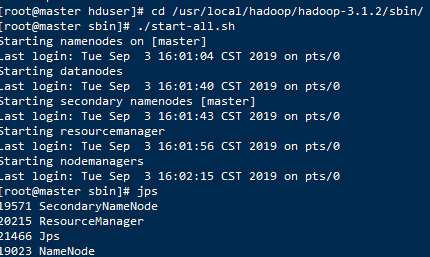

- slave节点查看

  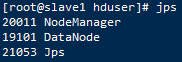

##### 2、启动Spark集群

```shell
[root@master sbin]# cd /usr/local/spark-2.4.4-bin-hadoop2.7/sbin/
[root@master sbin]# ./start-all.sh 
```

- master节点查看

  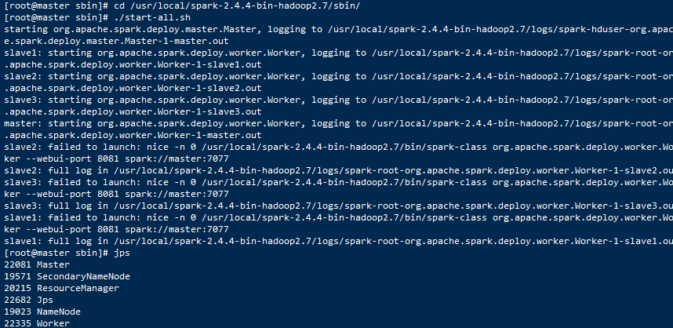

- slave节点查看

  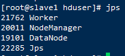

##### 3、进入`/usr/local/spark-2.4.4-bin-hadoop2.7/`

```shell
[root@master sbin]# cd /usr/local/spark-2.4.4-bin-hadoop2.7/
```

##### 4、 执行命令，用yarn-client模式运行计算圆周率的Demo

```shell
[root@master spark-2.4.4-bin-hadoop2.7]# ./bin/spark-submit  --class   org.apache.spark.examples.SparkPi  --master   yarn-client  examples/jars/spark-examples_2.11-2.4.4.jar
```

- 命令执行后，spark示例开始执行

  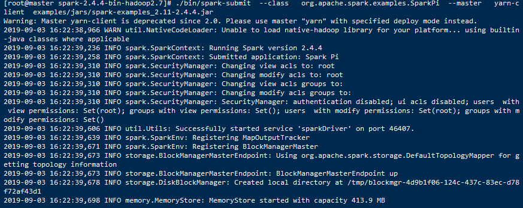

- 执行结果用红框标出来

  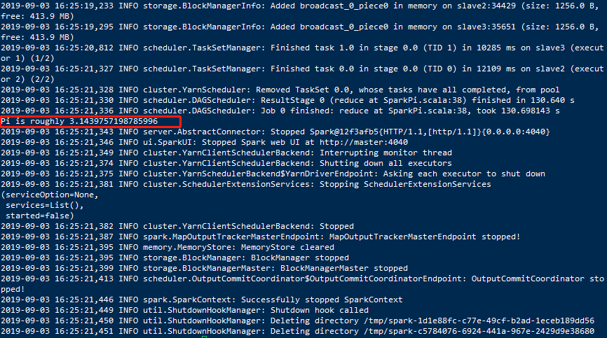

- 完整信息：

  ```shell
  [root@master spark-2.4.4-bin-hadoop2.7]# ./bin/spark-submit  --class   org.apache.spark.examples.SparkPi  --master   yarn-client  examples/jars/spark-examples_2.11-2.4.4.jar
  Warning: Master yarn-client is deprecated since 2.0. Please use master "yarn" with specified deploy mode instead.
  2019-09-03 16:22:38,966 WARN util.NativeCodeLoader: Unable to load native-hadoop library for your platform... using builtin-java classes where applicable
  2019-09-03 16:22:39,236 INFO spark.SparkContext: Running Spark version 2.4.4
  2019-09-03 16:22:39,258 INFO spark.SparkContext: Submitted application: Spark Pi
  2019-09-03 16:22:39,310 INFO spark.SecurityManager: Changing view acls to: root
  2019-09-03 16:22:39,310 INFO spark.SecurityManager: Changing modify acls to: root
  2019-09-03 16:22:39,310 INFO spark.SecurityManager: Changing view acls groups to: 
  2019-09-03 16:22:39,310 INFO spark.SecurityManager: Changing modify acls groups to: 
  2019-09-03 16:22:39,310 INFO spark.SecurityManager: SecurityManager: authentication disabled; ui acls disabled; users  with view permissions: Set(root); groups with view permissions: Set(); users  with modify permissions: Set(root); groups with modify permissions: Set()
  2019-09-03 16:22:39,606 INFO util.Utils: Successfully started service 'sparkDriver' on port 46407.
  2019-09-03 16:22:39,639 INFO spark.SparkEnv: Registering MapOutputTracker
  2019-09-03 16:22:39,671 INFO spark.SparkEnv: Registering BlockManagerMaster
  2019-09-03 16:22:39,673 INFO storage.BlockManagerMasterEndpoint: Using org.apache.spark.storage.DefaultTopologyMapper for getting topology information
  2019-09-03 16:22:39,673 INFO storage.BlockManagerMasterEndpoint: BlockManagerMasterEndpoint up
  2019-09-03 16:22:39,678 INFO storage.DiskBlockManager: Created local directory at /tmp/blockmgr-4d9b1f06-124c-437c-83ec-d78f72af43d1
  2019-09-03 16:22:39,698 INFO memory.MemoryStore: MemoryStore started with capacity 413.9 MB
  2019-09-03 16:22:39,802 INFO spark.SparkEnv: Registering OutputCommitCoordinator
  2019-09-03 16:22:39,872 INFO util.log: Logging initialized @2069ms
  2019-09-03 16:22:39,962 INFO server.Server: jetty-9.3.z-SNAPSHOT, build timestamp: unknown, git hash: unknown
  2019-09-03 16:22:40,021 INFO server.Server: Started @2218ms
  2019-09-03 16:22:40,035 INFO server.AbstractConnector: Started ServerConnector@12f3afb5{HTTP/1.1,[http/1.1]}{0.0.0.0:4040}
  2019-09-03 16:22:40,035 INFO util.Utils: Successfully started service 'SparkUI' on port 4040.
  2019-09-03 16:22:40,054 INFO handler.ContextHandler: Started o.s.j.s.ServletContextHandler@32c0915e{/jobs,null,AVAILABLE,@Spark}
  2019-09-03 16:22:40,054 INFO handler.ContextHandler: Started o.s.j.s.ServletContextHandler@6b739528{/jobs/json,null,AVAILABLE,@Spark}
  2019-09-03 16:22:40,054 INFO handler.ContextHandler: Started o.s.j.s.ServletContextHandler@622ef26a{/jobs/job,null,AVAILABLE,@Spark}
  2019-09-03 16:22:40,055 INFO handler.ContextHandler: Started o.s.j.s.ServletContextHandler@5f577419{/jobs/job/json,null,AVAILABLE,@Spark}
  2019-09-03 16:22:40,055 INFO handler.ContextHandler: Started o.s.j.s.ServletContextHandler@28fa700e{/stages,null,AVAILABLE,@Spark}
  2019-09-03 16:22:40,056 INFO handler.ContextHandler: Started o.s.j.s.ServletContextHandler@3d526ad9{/stages/json,null,AVAILABLE,@Spark}
  2019-09-03 16:22:40,056 INFO handler.ContextHandler: Started o.s.j.s.ServletContextHandler@e041f0c{/stages/stage,null,AVAILABLE,@Spark}
  2019-09-03 16:22:40,057 INFO handler.ContextHandler: Started o.s.j.s.ServletContextHandler@3f3c966c{/stages/stage/json,null,AVAILABLE,@Spark}
  2019-09-03 16:22:40,057 INFO handler.ContextHandler: Started o.s.j.s.ServletContextHandler@11ee02f8{/stages/pool,null,AVAILABLE,@Spark}
  2019-09-03 16:22:40,058 INFO handler.ContextHandler: Started o.s.j.s.ServletContextHandler@4102b1b1{/stages/pool/json,null,AVAILABLE,@Spark}
  2019-09-03 16:22:40,058 INFO handler.ContextHandler: Started o.s.j.s.ServletContextHandler@61a5b4ae{/storage,null,AVAILABLE,@Spark}
  2019-09-03 16:22:40,058 INFO handler.ContextHandler: Started o.s.j.s.ServletContextHandler@3a71c100{/storage/json,null,AVAILABLE,@Spark}
  2019-09-03 16:22:40,059 INFO handler.ContextHandler: Started o.s.j.s.ServletContextHandler@5b69fd74{/storage/rdd,null,AVAILABLE,@Spark}
  2019-09-03 16:22:40,059 INFO handler.ContextHandler: Started o.s.j.s.ServletContextHandler@f325091{/storage/rdd/json,null,AVAILABLE,@Spark}
  2019-09-03 16:22:40,060 INFO handler.ContextHandler: Started o.s.j.s.ServletContextHandler@437e951d{/environment,null,AVAILABLE,@Spark}
  2019-09-03 16:22:40,094 INFO handler.ContextHandler: Started o.s.j.s.ServletContextHandler@77b325b3{/environment/json,null,AVAILABLE,@Spark}
  2019-09-03 16:22:40,094 INFO handler.ContextHandler: Started o.s.j.s.ServletContextHandler@63a5e46c{/executors,null,AVAILABLE,@Spark}
  2019-09-03 16:22:40,095 INFO handler.ContextHandler: Started o.s.j.s.ServletContextHandler@7e8e8651{/executors/json,null,AVAILABLE,@Spark}
  2019-09-03 16:22:40,095 INFO handler.ContextHandler: Started o.s.j.s.ServletContextHandler@49ef32e0{/executors/threadDump,null,AVAILABLE,@Spark}
  2019-09-03 16:22:40,095 INFO handler.ContextHandler: Started o.s.j.s.ServletContextHandler@271f18d3{/executors/threadDump/json,null,AVAILABLE,@Spark}
  2019-09-03 16:22:40,099 INFO handler.ContextHandler: Started o.s.j.s.ServletContextHandler@6bd51ed8{/static,null,AVAILABLE,@Spark}
  2019-09-03 16:22:40,100 INFO handler.ContextHandler: Started o.s.j.s.ServletContextHandler@7a34b7b8{/,null,AVAILABLE,@Spark}
  2019-09-03 16:22:40,100 INFO handler.ContextHandler: Started o.s.j.s.ServletContextHandler@58cd06cb{/api,null,AVAILABLE,@Spark}
  2019-09-03 16:22:40,101 INFO handler.ContextHandler: Started o.s.j.s.ServletContextHandler@bae47a0{/jobs/job/kill,null,AVAILABLE,@Spark}
  2019-09-03 16:22:40,101 INFO handler.ContextHandler: Started o.s.j.s.ServletContextHandler@74a9c4b0{/stages/stage/kill,null,AVAILABLE,@Spark}
  2019-09-03 16:22:40,102 INFO ui.SparkUI: Bound SparkUI to 0.0.0.0, and started at http://master:4040
  2019-09-03 16:22:40,121 INFO spark.SparkContext: Added JAR file:/usr/local/spark-2.4.4-bin-hadoop2.7/examples/jars/spark-examples_2.11-2.4.4.jar at spark://master:46407/jars/spark-examples_2.11-2.4.4.jar with timestamp 1567498960121
  2019-09-03 16:22:41,538 INFO client.RMProxy: Connecting to ResourceManager at master/192.168.55.110:8032
  2019-09-03 16:22:41,919 INFO yarn.Client: Requesting a new application from cluster with 3 NodeManagers
  2019-09-03 16:22:42,017 INFO yarn.Client: Verifying our application has not requested more than the maximum memory capability of the cluster (8192 MB per container)
  2019-09-03 16:22:42,018 INFO yarn.Client: Will allocate AM container, with 896 MB memory including 384 MB overhead
  2019-09-03 16:22:42,024 INFO yarn.Client: Setting up container launch context for our AM
  2019-09-03 16:22:42,027 INFO yarn.Client: Setting up the launch environment for our AM container
  2019-09-03 16:22:42,032 INFO yarn.Client: Preparing resources for our AM container
  2019-09-03 16:22:42,125 WARN yarn.Client: Neither spark.yarn.jars nor spark.yarn.archive is set, falling back to uploading libraries under SPARK_HOME.
  2019-09-03 16:22:49,251 INFO yarn.Client: Uploading resource file:/tmp/spark-1d1e88fc-c77e-49cf-b2ad-1eceb189dd56/__spark_libs__152573066735870679.zip -> hdfs://master/user/root/.sparkStaging/application_1567497747258_0001/__spark_libs__152573066735870679.zip
  2019-09-03 16:22:52,913 INFO yarn.Client: Uploading resource file:/tmp/spark-1d1e88fc-c77e-49cf-b2ad-1eceb189dd56/__spark_conf__8817966144214771479.zip -> hdfs://master/user/root/.sparkStaging/application_1567497747258_0001/__spark_conf__.zip
  2019-09-03 16:22:53,076 INFO spark.SecurityManager: Changing view acls to: root
  2019-09-03 16:22:53,076 INFO spark.SecurityManager: Changing modify acls to: root
  2019-09-03 16:22:53,076 INFO spark.SecurityManager: Changing view acls groups to: 
  2019-09-03 16:22:53,076 INFO spark.SecurityManager: Changing modify acls groups to: 
  2019-09-03 16:22:53,076 INFO spark.SecurityManager: SecurityManager: authentication disabled; ui acls disabled; users  with view permissions: Set(root); groups with view permissions: Set(); users  with modify permissions: Set(root); groups with modify permissions: Set()
  2019-09-03 16:22:54,724 INFO yarn.Client: Submitting application application_1567497747258_0001 to ResourceManager
  2019-09-03 16:22:55,216 INFO impl.YarnClientImpl: Submitted application application_1567497747258_0001
  2019-09-03 16:22:55,217 INFO cluster.SchedulerExtensionServices: Starting Yarn extension services with app application_1567497747258_0001 and attemptId None
  2019-09-03 16:22:56,222 INFO yarn.Client: Application report for application_1567497747258_0001 (state: ACCEPTED)
  2019-09-03 16:22:56,225 INFO yarn.Client: 
           client token: N/A
           diagnostics: [Tue Sep 03 16:22:55 +0800 2019] Scheduler has assigned a container for AM, waiting for AM container to be launched
           ApplicationMaster host: N/A
           ApplicationMaster RPC port: -1
           queue: default
           start time: 1567498974899
           final status: UNDEFINED
           tracking URL: http://master:8088/proxy/application_1567497747258_0001/
           user: root
  2019-09-03 16:22:57,227 INFO yarn.Client: Application report for application_1567497747258_0001 (state: ACCEPTED)
  2019-09-03 16:22:58,229 INFO yarn.Client: Application report for application_1567497747258_0001 (state: ACCEPTED)
  2019-09-03 16:22:59,232 INFO yarn.Client: Application report for application_1567497747258_0001 (state: ACCEPTED)
  2019-09-03 16:23:00,234 INFO yarn.Client: Application report for application_1567497747258_0001 (state: ACCEPTED)
  2019-09-03 16:23:01,236 INFO yarn.Client: Application report for application_1567497747258_0001 (state: ACCEPTED)
  2019-09-03 16:23:02,238 INFO yarn.Client: Application report for application_1567497747258_0001 (state: ACCEPTED)
  2019-09-03 16:23:03,241 INFO yarn.Client: Application report for application_1567497747258_0001 (state: ACCEPTED)
  2019-09-03 16:23:04,246 INFO yarn.Client: Application report for application_1567497747258_0001 (state: ACCEPTED)
  2019-09-03 16:23:05,248 INFO yarn.Client: Application report for application_1567497747258_0001 (state: ACCEPTED)
  2019-09-03 16:23:06,251 INFO yarn.Client: Application report for application_1567497747258_0001 (state: ACCEPTED)
  2019-09-03 16:23:07,254 INFO yarn.Client: Application report for application_1567497747258_0001 (state: ACCEPTED)
  2019-09-03 16:23:08,257 INFO yarn.Client: Application report for application_1567497747258_0001 (state: ACCEPTED)
  2019-09-03 16:23:09,261 INFO yarn.Client: Application report for application_1567497747258_0001 (state: RUNNING)
  2019-09-03 16:23:09,261 INFO yarn.Client: 
           client token: N/A
           diagnostics: N/A
           ApplicationMaster host: 192.168.55.111
           ApplicationMaster RPC port: -1
           queue: default
           start time: 1567498974899
           final status: UNDEFINED
           tracking URL: http://master:8088/proxy/application_1567497747258_0001/
           user: root
  2019-09-03 16:23:09,262 INFO cluster.YarnClientSchedulerBackend: Application application_1567497747258_0001 has started running.
  2019-09-03 16:23:09,269 INFO util.Utils: Successfully started service 'org.apache.spark.network.netty.NettyBlockTransferService' on port 35609.
  2019-09-03 16:23:09,270 INFO netty.NettyBlockTransferService: Server created on master:35609
  2019-09-03 16:23:09,271 INFO storage.BlockManager: Using org.apache.spark.storage.RandomBlockReplicationPolicy for block replication policy
  2019-09-03 16:23:09,288 INFO storage.BlockManagerMaster: Registering BlockManager BlockManagerId(driver, master, 35609, None)
  2019-09-03 16:23:09,292 INFO storage.BlockManagerMasterEndpoint: Registering block manager master:35609 with 413.9 MB RAM, BlockManagerId(driver, master, 35609, None)
  2019-09-03 16:23:09,295 INFO storage.BlockManagerMaster: Registered BlockManager BlockManagerId(driver, master, 35609, None)
  2019-09-03 16:23:09,295 INFO storage.BlockManager: Initialized BlockManager: BlockManagerId(driver, master, 35609, None)
  2019-09-03 16:23:09,438 INFO handler.ContextHandler: Started o.s.j.s.ServletContextHandler@3e5beab5{/metrics/json,null,AVAILABLE,@Spark}
  2019-09-03 16:23:09,649 INFO cluster.YarnClientSchedulerBackend: Add WebUI Filter. org.apache.hadoop.yarn.server.webproxy.amfilter.AmIpFilter, Map(PROXY_HOSTS -> master, PROXY_URI_BASES -> http://master:8088/proxy/application_1567497747258_0001), /proxy/application_1567497747258_0001
  2019-09-03 16:23:09,660 INFO ui.JettyUtils: Adding filter org.apache.hadoop.yarn.server.webproxy.amfilter.AmIpFilter to /jobs, /jobs/json, /jobs/job, /jobs/job/json, /stages, /stages/json, /stages/stage, /stages/stage/json, /stages/pool, /stages/pool/json, /storage, /storage/json, /storage/rdd, /storage/rdd/json, /environment, /environment/json, /executors, /executors/json, /executors/threadDump, /executors/threadDump/json, /static, /, /api, /jobs/job/kill, /stages/stage/kill, /metrics/json.
  2019-09-03 16:23:09,982 INFO cluster.YarnSchedulerBackend$YarnSchedulerEndpoint: ApplicationMaster registered as NettyRpcEndpointRef(spark-client://YarnAM)
  2019-09-03 16:23:10,279 INFO cluster.YarnClientSchedulerBackend: SchedulerBackend is ready for scheduling beginning after waiting maxRegisteredResourcesWaitingTime: 30000(ms)
  2019-09-03 16:23:10,638 INFO spark.SparkContext: Starting job: reduce at SparkPi.scala:38
  2019-09-03 16:23:10,659 INFO scheduler.DAGScheduler: Got job 0 (reduce at SparkPi.scala:38) with 2 output partitions
  2019-09-03 16:23:10,659 INFO scheduler.DAGScheduler: Final stage: ResultStage 0 (reduce at SparkPi.scala:38)
  2019-09-03 16:23:10,660 INFO scheduler.DAGScheduler: Parents of final stage: List()
  2019-09-03 16:23:10,660 INFO scheduler.DAGScheduler: Missing parents: List()
  2019-09-03 16:23:10,663 INFO scheduler.DAGScheduler: Submitting ResultStage 0 (MapPartitionsRDD[1] at map at SparkPi.scala:34), which has no missing parents
  2019-09-03 16:23:11,034 INFO memory.MemoryStore: Block broadcast_0 stored as values in memory (estimated size 1936.0 B, free 413.9 MB)
  2019-09-03 16:23:11,064 INFO memory.MemoryStore: Block broadcast_0_piece0 stored as bytes in memory (estimated size 1256.0 B, free 413.9 MB)
  2019-09-03 16:23:11,066 INFO storage.BlockManagerInfo: Added broadcast_0_piece0 in memory on master:35609 (size: 1256.0 B, free: 413.9 MB)
  2019-09-03 16:23:11,073 INFO spark.SparkContext: Created broadcast 0 from broadcast at DAGScheduler.scala:1161
  2019-09-03 16:23:11,148 INFO scheduler.DAGScheduler: Submitting 2 missing tasks from ResultStage 0 (MapPartitionsRDD[1] at map at SparkPi.scala:34) (first 15 tasks are for partitions Vector(0, 1))
  2019-09-03 16:23:11,149 INFO cluster.YarnScheduler: Adding task set 0.0 with 2 tasks
  2019-09-03 16:23:26,166 WARN cluster.YarnScheduler: Initial job has not accepted any resources; check your cluster UI to ensure that workers are registered and have sufficient resources
  2019-09-03 16:23:41,166 WARN cluster.YarnScheduler: Initial job has not accepted any resources; check your cluster UI to ensure that workers are registered and have sufficient resources
  2019-09-03 16:23:56,165 WARN cluster.YarnScheduler: Initial job has not accepted any resources; check your cluster UI to ensure that workers are registered and have sufficient resources
  2019-09-03 16:24:11,166 WARN cluster.YarnScheduler: Initial job has not accepted any resources; check your cluster UI to ensure that workers are registered and have sufficient resources
  2019-09-03 16:24:26,165 WARN cluster.YarnScheduler: Initial job has not accepted any resources; check your cluster UI to ensure that workers are registered and have sufficient resources
  2019-09-03 16:24:41,166 WARN cluster.YarnScheduler: Initial job has not accepted any resources; check your cluster UI to ensure that workers are registered and have sufficient resources
  2019-09-03 16:24:56,166 WARN cluster.YarnScheduler: Initial job has not accepted any resources; check your cluster UI to ensure that workers are registered and have sufficient resources
  2019-09-03 16:25:09,169 INFO cluster.YarnSchedulerBackend$YarnDriverEndpoint: Registered executor NettyRpcEndpointRef(spark-client://Executor) (192.168.55.112:36676) with ID 2
  2019-09-03 16:25:09,233 INFO scheduler.TaskSetManager: Starting task 0.0 in stage 0.0 (TID 0, slave2, executor 2, partition 0, PROCESS_LOCAL, 7877 bytes)
  2019-09-03 16:25:09,794 INFO storage.BlockManagerMasterEndpoint: Registering block manager slave2:34429 with 413.9 MB RAM, BlockManagerId(2, slave2, 34429, None)
  2019-09-03 16:25:10,526 INFO cluster.YarnSchedulerBackend$YarnDriverEndpoint: Registered executor NettyRpcEndpointRef(spark-client://Executor) (192.168.55.113:40746) with ID 1
  2019-09-03 16:25:10,527 INFO scheduler.TaskSetManager: Starting task 1.0 in stage 0.0 (TID 1, slave3, executor 1, partition 1, PROCESS_LOCAL, 7877 bytes)
  2019-09-03 16:25:11,015 INFO storage.BlockManagerMasterEndpoint: Registering block manager slave3:35651 with 413.9 MB RAM, BlockManagerId(1, slave3, 35651, None)
  2019-09-03 16:25:19,233 INFO storage.BlockManagerInfo: Added broadcast_0_piece0 in memory on slave2:34429 (size: 1256.0 B, free: 413.9 MB)
  2019-09-03 16:25:19,295 INFO storage.BlockManagerInfo: Added broadcast_0_piece0 in memory on slave3:35651 (size: 1256.0 B, free: 413.9 MB)
  2019-09-03 16:25:20,812 INFO scheduler.TaskSetManager: Finished task 1.0 in stage 0.0 (TID 1) in 10285 ms on slave3 (executor 1) (1/2)
  2019-09-03 16:25:21,327 INFO scheduler.TaskSetManager: Finished task 0.0 in stage 0.0 (TID 0) in 12109 ms on slave2 (executor 2) (2/2)
  2019-09-03 16:25:21,328 INFO cluster.YarnScheduler: Removed TaskSet 0.0, whose tasks have all completed, from pool 
  2019-09-03 16:25:21,330 INFO scheduler.DAGScheduler: ResultStage 0 (reduce at SparkPi.scala:38) finished in 130.640 s
  2019-09-03 16:25:21,336 INFO scheduler.DAGScheduler: Job 0 finished: reduce at SparkPi.scala:38, took 130.698143 s
  Pi is roughly 3.1439757198785996
  2019-09-03 16:25:21,343 INFO server.AbstractConnector: Stopped Spark@12f3afb5{HTTP/1.1,[http/1.1]}{0.0.0.0:4040}
  2019-09-03 16:25:21,346 INFO ui.SparkUI: Stopped Spark web UI at http://master:4040
  2019-09-03 16:25:21,349 INFO cluster.YarnClientSchedulerBackend: Interrupting monitor thread
  2019-09-03 16:25:21,374 INFO cluster.YarnClientSchedulerBackend: Shutting down all executors
  2019-09-03 16:25:21,375 INFO cluster.YarnSchedulerBackend$YarnDriverEndpoint: Asking each executor to shut down
  2019-09-03 16:25:21,381 INFO cluster.SchedulerExtensionServices: Stopping SchedulerExtensionServices
  (serviceOption=None,
   services=List(),
   started=false)
  2019-09-03 16:25:21,382 INFO cluster.YarnClientSchedulerBackend: Stopped
  2019-09-03 16:25:21,387 INFO spark.MapOutputTrackerMasterEndpoint: MapOutputTrackerMasterEndpoint stopped!
  2019-09-03 16:25:21,395 INFO memory.MemoryStore: MemoryStore cleared
  2019-09-03 16:25:21,395 INFO storage.BlockManager: BlockManager stopped
  2019-09-03 16:25:21,399 INFO storage.BlockManagerMaster: BlockManagerMaster stopped
  2019-09-03 16:25:21,413 INFO scheduler.OutputCommitCoordinator$OutputCommitCoordinatorEndpoint: OutputCommitCoordinator stopped!
  2019-09-03 16:25:21,446 INFO spark.SparkContext: Successfully stopped SparkContext
  2019-09-03 16:25:21,449 INFO util.ShutdownHookManager: Shutdown hook called
  2019-09-03 16:25:21,450 INFO util.ShutdownHookManager: Deleting directory /tmp/spark-1d1e88fc-c77e-49cf-b2ad-1eceb189dd56
  2019-09-03 16:25:21,451 INFO util.ShutdownHookManager: Deleting directory /tmp/spark-c5784076-6924-441a-967e-2429d9e38680
  ```

- Web端查看，输入[http://master:8088](http://master:8088/)或者[http://192.168.55.110:8088](http://192.168.55.110:8088/)

  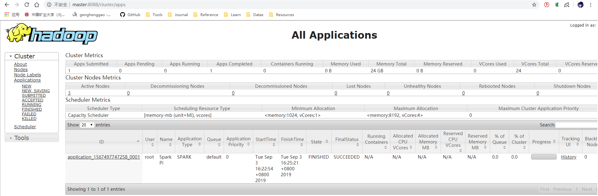


参考：

https://blog.csdn.net/pucao_cug/article/details/72453382


## 四、本地运行Spark-Shell

1、切换到路径`/usr/local/spark-2.4.4-bin-hadoop2.7/`

```shell
[root@master local]# cd /usr/local/spark-2.4.4-bin-hadoop2.7/
```

2、运行spark-shell

```shell
[root@master spark-2.4.4-bin-hadoop2.7]# ./bin/spark-shell
```

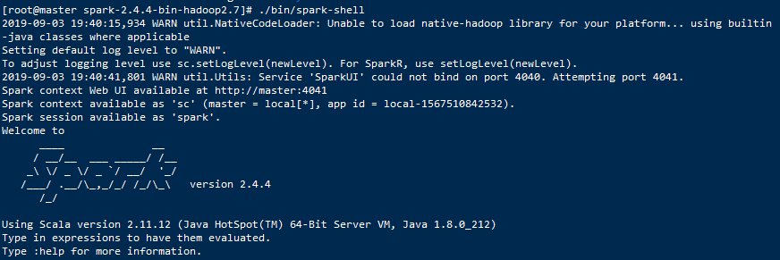

3、运行词频统计

- 在spark-2.4.4-bin-hadoop2.7目录下新建input文件夹，写俩个test.txt、test1.txt文件

  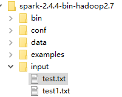

  - test.txt内容

  ```
  Hello World
  Hello Spark
  Hello Scala
  ```

  - test1.txt内容

  ```
  Hello Henggao
  ```

- 运行测试sc.master查看当前运行模式

```shell
scala> sc.master
res7: String = local[*]

#使用绝对路径
scala> sc.textFile("file:/usr/local/spark-2.4.4-bin-hadoop2.7/input").flatMap(_.split(" ")).map((_,1)).reduceByKey(_+_).collect
```

- 运行结果

  ```shell
  res8: Array[(String, Int)] = Array((Hello,4), (World,1), (Scala,1), (Spark,1), (Henggao,1))
  ```

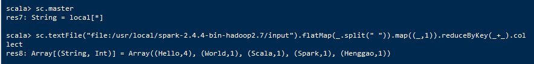

```shell
#使用相对路径
scala> sc.textFile("input").flatMap(_.split(" ")).map((_,1)).reduceByKey(_+_).collect
```

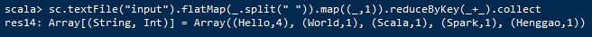

- textFile("input")：读取本地input文件夹数据；
- .flatMap(_.split(" "))_：压平操作，按照空格分隔符将一行数据映射成一个个单词；
- _.map((_,1))：对每一个元素操作，将单词映射为元组；
- .reduceByKey(_+_)：按照key将值进行聚合，相加；
- .collect：将数据收集到Driver端展示。

