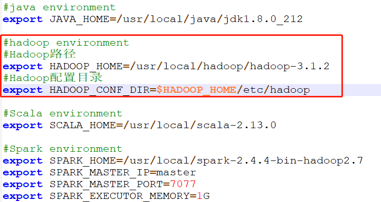

## 一. either HADOOP_CONF_DIR or YARN_CONF_DIR must be set in the environment.

```shell
[root@master spark-2.4.4-bin-hadoop2.7]# ./bin/spark-submit  --class   org.apache.spark.examples.SparkPi  --master   yarn-client  examples/jars/spark-examples_2.11-2.4.4.jar 
Exception in thread "main" org.apache.spark.SparkException: When running with master 'yarn-client' either HADOOP_CONF_DIR or YARN_CONF_DIR must be set in the environment.
        at org.apache.spark.deploy.SparkSubmitArguments.error(SparkSubmitArguments.scala:657)
        at org.apache.spark.deploy.SparkSubmitArguments.validateSubmitArguments(SparkSubmitArguments.scala:290)
        at org.apache.spark.deploy.SparkSubmitArguments.validateArguments(SparkSubmitArguments.scala:251)
        at org.apache.spark.deploy.SparkSubmitArguments.<init>(SparkSubmitArguments.scala:120)
        at org.apache.spark.deploy.SparkSubmit$$anon$2$$anon$1.<init>(SparkSubmit.scala:907)
        at org.apache.spark.deploy.SparkSubmit$$anon$2.parseArguments(SparkSubmit.scala:907)
        at org.apache.spark.deploy.SparkSubmit.doSubmit(SparkSubmit.scala:81)
        at org.apache.spark.deploy.SparkSubmit$$anon$2.doSubmit(SparkSubmit.scala:920)
        at org.apache.spark.deploy.SparkSubmit$.main(SparkSubmit.scala:929)
        at org.apache.spark.deploy.SparkSubmit.main(SparkSubmit.scala)
```

- 分析 `HADOOP_CONF_DIR` or `YARN_CONF_DIR`没有配置

- 解决方案

  - 在`/spark-2.4.4-bin-hadoop2.7/conf/spark-env.sh`中添加如下信息即可。

    ```properties
    #Hadoop配置目录
    export HADOOP_CONF_DIR=$HADOOP_HOME/etc/hadoop 
    ```

    

- 同样修改slave1、slave2、slave3节点上的配置

  ```shell
  [root@master conf]# scp -r spark-env.sh slave1:/usr/local/spark-2.4.4-bin-hadoop2.7/conf/
  
  [root@master conf]# scp -r spark-env.sh slave2:/usr/local/spark-2.4.4-bin-hadoop2.7/conf/
  
  [root@master conf]# scp -r spark-env.sh slave3:/usr/local/spark-2.4.4-bin-hadoop2.7/conf/
  ```

  
  
  参考：
  
  https://blog.csdn.net/shenfuli/article/details/48162949

## 二、