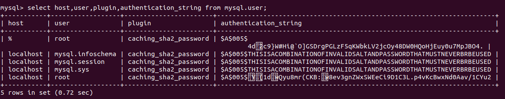
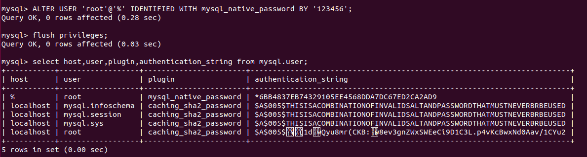
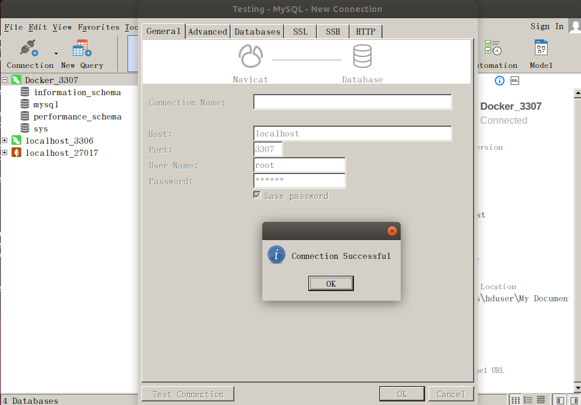

# Docker

docker主机（Host）：安装了Docker程序的机器 ；

docker客户端（Client）：连接docker主机进行操作 ； 

docker仓库（Registry）：用来保存各种打包好的软件镜像 ；

docker镜像（Images）：软件打包好的镜像，放在docker仓库中 ；

docker容器（Container）：镜像启动后的实例成为一个容器，容器是独立运行的一个或一组应用 ；

使用Docker步骤：

1. 安装Docker ；
2. 去Docker仓库找到软件对应的镜像 ；
3. 使用Docker运行这个镜像，这个镜像就会生成一个Docker容器 ；
4. 对容器的启动停止就是对软件的启动停止 ；

## 安装Docker

### 1）、安装Linux虚拟机

1. ​	VMWare（重量级）、VirtualBox（轻量级、免费） ；
2. 导入虚拟机文件 ；
3.  双击启动虚拟机
4. 使用客户端连接服务器进行命令操作
5. 设置虚拟机网络
6. 设置好网络后重启

### 2）、常用操作

Docker版本： `docker -v`

搜索镜像：`docker search 关键字`

​			    	`docker search mysql `

下载镜像： `docker pull mysql` (默认下载Lastest)

​					`	docker pull 镜像名：tag`

​					`docker pull mysql：5.5` （下载5.5版本）

查看镜像： `docker images`

删除镜像：`docker rmi image-id`

<https://hub.docker.com/>

### 3）、容器操作

```shell
1.搜索镜像
root@data1:~# docker search tomcat
2.拉取镜像
root@data1:~# docker pull tomcat
3.查看运行中的容器
root@data1:~# docker ps
4.查看所有的容器
root@data1:~# docker ps -a
5.删除容器
root@data1:~# docker rm 容器id
6.停止运行中的容器
root@data1:~# docker stop 容器id
7.启动容器
root@data1:~# docker start 容器id
8.启动一个做了端口映射的tomcat
root@data1:~# docker run -d -p 8888:8080 tomcat
-d:后台运行
-p:将主机的端口映射到容器的一个端口 主机端口：容器内部的端口

9.开启防火墙
ufw enable
10.关闭防火墙
ufw disable
11.查看防火墙状态
sudo ufw status
```


## 安装MySQL

```shell
拉取镜像
root@data1:~# docker pull mysql

参照官方,未做端口映射
root@data1:~# docker run --name mysql101 -e MYSQL_ROOT_PASSWORD=123 -d mysql
70e3ef7b91fe7cce8108e501e5e1bda4b4354b235e3707047fed8cb23bc06f8f
root@data1:~# docker ps 
CONTAINER ID        IMAGE               COMMAND                  CREATED             STATUS              PORTS                 NAMES
70e3ef7b91fe        mysql               "docker-entrypoint.s…"   18 seconds ago      Up 13 seconds       3306/tcp, 33060/tcp   mysql101
```

做了端口映射

```shell
root@data1:~# docker run -p 3306:3306 --name mysql102 -e MYSQL_ROOT_PASSWORD=123 -d mysql
183a3041aa0ebf7bc4a868dc82f11504b83ce0c1317f632d06d90e7004b80272
root@data1:~# docker ps 
CONTAINER ID        IMAGE               COMMAND                  CREATED             STATUS              PORTS                               NAMES
183a3041aa0e        mysql               "docker-entrypoint.s…"   32 seconds ago      Up 23 seconds       0.0.0.0:3306->3306/tcp, 33060/tcp   mysql102
70e3ef7b91fe        mysql               "docker-entrypoint.s…"   3 minutes ago       Up 3 minutes        3306/tcp, 33060/tcp                 mysql101
```


## Ubuntu18.04远程连接docker中的MySQL遇到的问题

**原因：mysql 8.0 默认使用 caching_sha2_password 身份验证机制；客户端不支持新的加密方式。**

### 解决方案：

修改用户（root）的加密方式

### 步骤：

#### 1、进入mysql容器内部

```shell
root@data1:~# docker exec -it mysql03 bash   ## mysql03是容器的别名，这里也可以用容器的id代替
```

#### 2、登录mysql

```shell
root@10da34fde054:/# mysql -u root -p
Enter password: 
Welcome to the MySQL monitor.  Commands end with ; or \g.
Your MySQL connection id is 10
Server version: 8.0.16 MySQL Community Server - GPL

Copyright (c) 2000, 2019, Oracle and/or its affiliates. All rights reserved.

Oracle is a registered trademark of Oracle Corporation and/or its
affiliates. Other names may be trademarks of their respective
owners.

Type 'help;' or '\h' for help. Type '\c' to clear the current input statement.
```

#### 3、设置用户配置项

##### 1）、查看用户信息
```mysql
mysql> select host,user,plugin,authentication_string from mysql.user;
+-----------+------------------+-----------------------+------------------------------------------------------------------------+
| host      | user             | plugin                | authentication_string                                                  |
+-----------+------------------+-----------------------+------------------------------------------------------------------------+
| %         | root             | caching_sha2_password | $A$005$
                                                                4d2c9}W#Hi@`O]GSDrgPGLzF5qKWbkLV2jcOy48DW0HQoHjEuy0u7MpJBO4. |
| localhost | mysql.infoschema | caching_sha2_password | $A$005$THISISACOMBINATIONOFINVALIDSALTANDPASSWORDTHATMUSTNEVERBRBEUSED |
| localhost | mysql.session    | caching_sha2_password | $A$005$THISISACOMBINATIONOFINVALIDSALTANDPASSWORDTHATMUSTNEVERBRBEUSED |
| localhost | mysql.sys        | caching_sha2_password | $A$005$THISISACOMBINATIONOFINVALIDSALTANDPASSWORDTHATMUSTNEVERBRBEUSED |
| localhost | root             | caching_sha2_password | $A$005$Y(1dwQyu8mr(CKB:w8ev3gnZWxSWEeCi9D1C3L.p4vKcBwxNd0Aav/1CYu2 |
+-----------+------------------+-----------------------+------------------------------------------------------------------------+
```



```
mysql> ALTER USER 'root'@'%' IDENTIFIED WITH mysql_native_password BY '123456';
Query OK, 0 rows affected (0.28 sec)

mysql> flush privileges;
Query OK, 0 rows affected (0.03 sec)

mysql> select host,user,plugin,authentication_string from mysql.user;
+-----------+------------------+-----------------------+------------------------------------------------------------------------+
| host      | user             | plugin                | authentication_string                                                  |
+-----------+------------------+-----------------------+------------------------------------------------------------------------+
| %         | root             | mysql_native_password | *6BB4837EB74329105EE4568DDA7DC67ED2CA2AD9                              |
| localhost | mysql.infoschema | caching_sha2_password | $A$005$THISISACOMBINATIONOFINVALIDSALTANDPASSWORDTHATMUSTNEVERBRBEUSED |
| localhost | mysql.session    | caching_sha2_password | $A$005$THISISACOMBINATIONOFINVALIDSALTANDPASSWORDTHATMUSTNEVERBRBEUSED |
| localhost | mysql.sys        | caching_sha2_password | $A$005$THISISACOMBINATIONOFINVALIDSALTANDPASSWORDTHATMUSTNEVERBRBEUSED |
| localhost | root             | caching_sha2_password | $A$005$Y(1dwQyu8mr(CKB:w8ev3gnZWxSWEeCi9D1C3L.p4vKcBwxNd0Aav/1CYu2 |
+-----------+------------------+-----------------------+------------------------------------------------------------------------+
```

备注：host为 % 表示不限制ip localhost表示本机使用 plugin非mysql_native_password 则需要修改密码

##### 2）、修改加密方式

```shell
mysql> ALTER USER 'root'@'%' IDENTIFIED WITH mysql_native_password BY '123456';    ### 123456 mysql的登录密码
Query OK, 0 rows affected (0.28 sec)

mysql> flush privileges;
Query OK, 0 rows affected (0.03 sec)

#查看用户信息
mysql> select host,user,plugin,authentication_string from mysql.user;
+-----------+------------------+-----------------------+------------------------------------------------------------------------+
| host      | user             | plugin                | authentication_string                                                  |
+-----------+------------------+-----------------------+------------------------------------------------------------------------+
| %         | root             | mysql_native_password | *6BB4837EB74329105EE4568DDA7DC67ED2CA2AD9                              |
| localhost | mysql.infoschema | caching_sha2_password | $A$005$THISISACOMBINATIONOFINVALIDSALTANDPASSWORDTHATMUSTNEVERBRBEUSED |
| localhost | mysql.session    | caching_sha2_password | $A$005$THISISACOMBINATIONOFINVALIDSALTANDPASSWORDTHATMUSTNEVERBRBEUSED |
| localhost | mysql.sys        | caching_sha2_password | $A$005$THISISACOMBINATIONOFINVALIDSALTANDPASSWORDTHATMUSTNEVERBRBEUSED |
| localhost | root             | caching_sha2_password | $A$005$Y(1dwQyu8mr(CKB:w8ev3gnZWxSWEeCi9D1C3L.p4vKcBwxNd0Aav/1CYu2 |
+-----------+------------------+-----------------------+------------------------------------------------------------------------+
```





[参考](https://blog.csdn.net/tyt_XiaoTao/article/details/84621087)：https://blog.csdn.net/tyt_XiaoTao/article/details/84621087

## Docker常用操作

```shell
启动容器
root@data1:~# docker start 42956764dd2e

1、搜索镜像
[root@localhost ~]# docker search tomcat
2、拉取镜像
[root@localhost ~]# docker pull tomcat
3、根据镜像启动容器
docker run --name mytomcat -d tomcat:latest
4、docker ps  
查看运行中的容器
5、 停止运行中的容器
docker stop  容器的id
6、查看所有的容器
docker ps -a
7、启动容器
docker start 容器id
8、删除一个容器
 docker rm 容器id
9、启动一个做了端口映射的tomcat
[root@localhost ~]# docker run -d -p 8888:8080 tomcat
-d：后台运行
-p: 将主机的端口映射到容器的一个端口    主机端口:容器内部的端口

10、为了演示简单关闭了linux的防火墙
service firewalld status ；查看防火墙状态
service firewalld stop：临时关闭防火墙
11、查看容器的日志
docker logs container-name/container-id

更多命令参看
https://docs.docker.com/engine/reference/commandline/docker/
可以参考每一个镜像的文档
```


