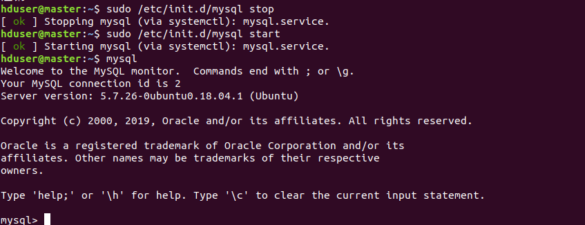

## Ubuntu18.04安装MySQl

**环境信息： 
		OS：Ubuntu18.04 
		MySQL: 5.7.22**

### 安装MySQl

```shell
#命令1
sudo apt-get update
#命令2
sudo apt-get install mysql-server
```

## Ubuntu下MySQL忘记密码重置方法

### 方法一：

1）：编辑mysqld.cnf文件

```shell
sudo vi /etc/mysql/mysql.conf.d/mysqld.cnf
```

2）：在文件中的skip-external-locking一行的下面添加一行：

```shell
skip-grant-tables
```

3）：重启MySQL服务

```shell
sudo service mysql restart
```

4）：终端输入mysql进入MySQL，输入USE mysql切换至mysql数据库

```mysql
mysql
USE mysql
```

5）：把root用户的密码修改为000000

```shell
UPDATE mysql.user SET authentication_string=password('000000') WHERE User='root' AND Host ='localhost';
```

原文：https://blog.csdn.net/xiamoyanyulrq/article/details/83041724 


## 常用命令

```mysql
create database new_dbname;--新建数据库
drop database old_dbnane; --删除数据库
show databases;--显示数据库
use databasename;--使用数据库
select database();--查看已选择的数据库

show tables;--显示当前库的所有表
create table tablename(fieldname1 fieldtype1,fieldname2 fieldtype2,..)[ENGINE=engine_name];--创建表
drop table tablename; --删除表
create table tablename select statement;--通过子查询创建表
desc tablename;--查看表结构
show create table tablename;--查看建表语句

alter table tablename add new_fielname new_fieldtype;--新增列
alter table tablename add new_fielname new_fieldtype after 列名1;--在列名1后新增列
alter table tablename modify fieldname new_fieldtype;--修改列
alter table tablename drop fieldname;--删除列
alter table tablename_old rename tablename_new;--表重命名

insert into tablename(fieldname1,fieldname2,fieldnamen) valuse(value1,value2,valuen);--增
delete from tablename [where fieldname=value];--删
update tablename set fieldname1=new_value where filename2=value;--改
select * from tablename [where filename=value];--查

truncate table tablename;--清空表中所有数据，DDL语句

show engines;--查看mysql现在已提供的存储引擎:
show variables like '%storage_engine%';--查看mysql当前默认的存储引擎
show create table tablename;--查看某张表用的存储引擎（结果的"ENGINE="部分）
alter table tablename ENGINE=InnoDB--修改引擎
create table tablename(fieldname1 fieldtype1,fieldname2 fieldtype2,..) ENGINE=engine_name;--创建表时设置存储引擎

#查看数据库
show databases;

#选中数据库
use mysql;

#接着查看当前数据库账户信息
mysql> select user,host from user;

#创建一个souvc的用户，并赋予权限。
grant all privileges on *.* to  souvc@"%" identified by "abc123" with grant option;
#grant是授权命令，其中souvc是我们连接用的用户名、”abc123″是连接密码，用户名后面的“%”通用符表示允许各host操作。

#刷新数据库账户权限：
flush privileges;

#刷新权限之后，重新查询。
select user,host from user;
#删除用户
drop user root@'%';
```


## 问题解决

如下错误：

```shell
hduser@master:~$ mysql -uroot -p
Enter password: 
ERROR 1524 (HY000): Plugin 'auth_socket' is not loaded
```

解决方法：

```shell
hduser@master:~$ sudo /etc/init.d/mysql stop
[ ok ] Stopping mysql (via systemctl): mysql.service.
hduser@master:~$ sudo /etc/init.d/mysql start
[ ok ] Starting mysql (via systemctl): mysql.service.
```

