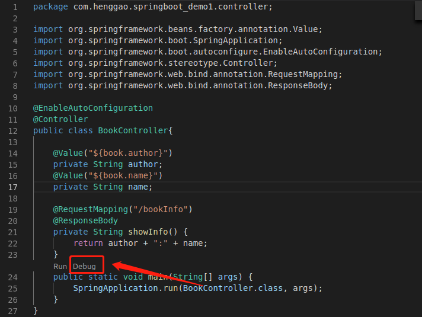
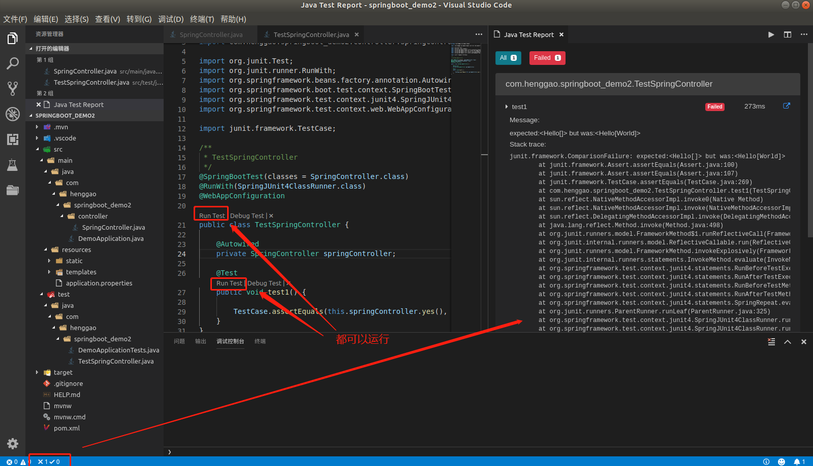
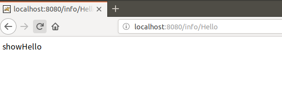
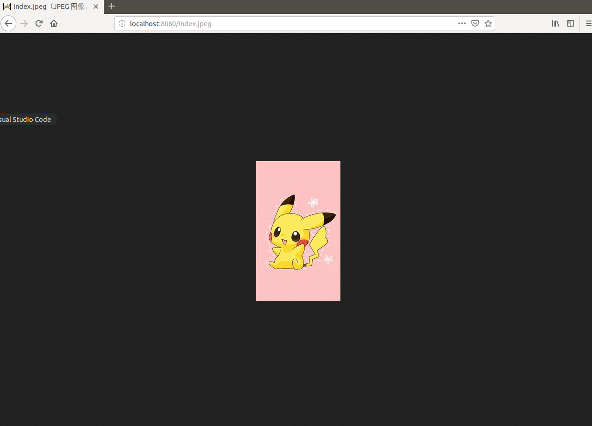
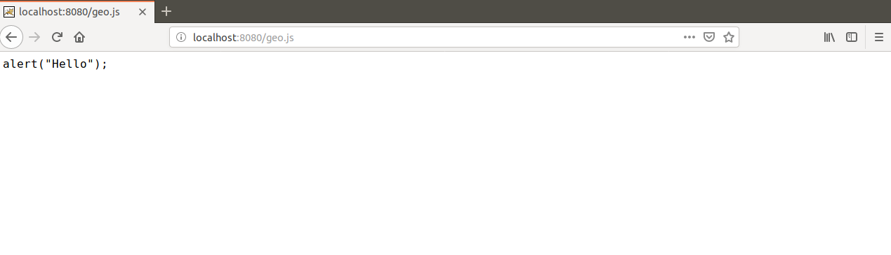
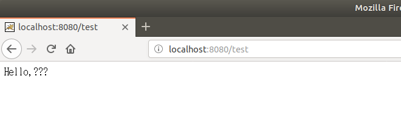

## Demo1：SpringBoot

VSCode中创建第一个SpringBoot+Maven项目

1）、创建controller文件夹，文件夹下创建BookController.java类

```java
package com.henggao.springboot_demo1.controller;

import org.springframework.beans.factory.annotation.Value;
import org.springframework.boot.SpringApplication;
import org.springframework.boot.autoconfigure.EnableAutoConfiguration;
import org.springframework.stereotype.Controller;
import org.springframework.web.bind.annotation.RequestMapping;
import org.springframework.web.bind.annotation.ResponseBody;

@EnableAutoConfiguration
@Controller
public class BookController{

    @Value("${book.author}")
    private String author;
    @Value("${book.name}")
    private String name;

    @RequestMapping("/bookInfo")
    @ResponseBody
    private String showInfo() {
        return author + ":" + name;
    }
    public static void main(String[] args) {
        SpringApplication.run(BookController.class, args);
    }
}
```


2）、在appliaction.properties中添加测试信息（可以使用application.yml）

```properties
book.author=Tom
book.name=SpringBoot
```

3）、运行Debug



## Demo2：SpringBoot中@ConfigurationPropertie

1）、使用类型安全配置**@ConfigurationProperties**，使用相同的前缀（本例的book），这个方法需要**setter、getter**方法。

```java
package com.henggao.springboot_demo1.controller;

//import org.springframework.beans.factory.annotation.Value;
import org.springframework.boot.SpringApplication;
import org.springframework.boot.autoconfigure.EnableAutoConfiguration;
import org.springframework.boot.context.properties.ConfigurationProperties;
import org.springframework.stereotype.Controller;
import org.springframework.web.bind.annotation.RequestMapping;
import org.springframework.web.bind.annotation.ResponseBody;

@EnableAutoConfiguration
@Controller
@ConfigurationProperties(prefix = "book")
public class BookController {

    // @Value("${book.author}")
    private String author;
    // @Value("${book.name}")
    private String name;

    @RequestMapping("/bookInfo")
    @ResponseBody
    private String showInfo() {
        return author + ":" + name;
    }

    public String getName() {
        return name;
    }

    public void setName(String name) {
        this.name = name;
    }

    public String getAuthor() {
        return author;
    }

    public void setAuthor(String author) {
        this.author = author;
    }

    public static void main(String[] args) {
        SpringApplication.run(BookController.class, args);
    }

}
```

2）、运行Debug,可以成功显示。

## Demo3：LomBok中@Data的使用

1）、可以使用**LomBok**插件中**@Data**，可以省略**setter、getter**方法。

```java
package com.henggao.springboot_demo1.controller;

//import org.springframework.beans.factory.annotation.Value;
import org.springframework.boot.SpringApplication;
import org.springframework.boot.autoconfigure.EnableAutoConfiguration;
import org.springframework.boot.context.properties.ConfigurationProperties;
import org.springframework.stereotype.Controller;
import org.springframework.web.bind.annotation.RequestMapping;
import org.springframework.web.bind.annotation.ResponseBody;

import lombok.Data;

@EnableAutoConfiguration
@Controller
@ConfigurationProperties(prefix = "book")
@Data
public class HelloController {

    // @Value("${book.author}")
    private String author;
    // @Value("${book.name}")
    private String name;

    @RequestMapping("/bookInfo")
    @ResponseBody
    private String showInfo() {
        return author + ":" + name;
    }

    // public String getName() {
    // return name;
    // }

    // public void setName(String name) {
    // this.name = name;
    // }

    // public String getAuthor() {
    // return author;
    // }

    // public void setAuthor(String author) {
    // this.author = author;
    // }

    public static void main(String[] args) {
        SpringApplication.run(HelloController.class, args);
    }

}
```

2）、运行Debug，成功显示。

### Problems

1）、产生如下问题

```shell

  .   ____          _            __ _ _
 /\\ / ___'_ __ _ _(_)_ __  __ _ \ \ \ \
( ( )\___ | '_ | '_| | '_ \/ _` | \ \ \ \
 \\/  ___)| |_)| | | | | || (_| |  ) ) ) )
  '  |____| .__|_| |_|_| |_\__, | / / / /
 =========|_|==============|___/=/_/_/_/
 :: Spring Boot ::        (v2.1.4.RELEASE)

2019-05-13 14:03:51.969  INFO 14090 --- [  restartedMain] c.h.springboot_demo1.DemoApplication     : Starting DemoApplication on master with PID 14090 (/home/hduser/SpringBoot/springboot_demo1/target/classes started by hduser in /home/hduser/SpringBoot)
2019-05-13 14:03:51.993  INFO 14090 --- [  restartedMain] c.h.springboot_demo1.DemoApplication     : No active profile set, falling back to default profiles: default
2019-05-13 14:03:52.244  INFO 14090 --- [  restartedMain] .e.DevToolsPropertyDefaultsPostProcessor : Devtools property defaults active! Set 'spring.devtools.add-properties' to 'false' to disable
2019-05-13 14:03:52.245  INFO 14090 --- [  restartedMain] .e.DevToolsPropertyDefaultsPostProcessor : For additional web related logging consider setting the 'logging.level.web' property to 'DEBUG'
2019-05-13 14:03:56.189  INFO 14090 --- [  restartedMain] o.s.b.w.embedded.tomcat.TomcatWebServer  : Tomcat initialized with port(s): 8080 (http)
2019-05-13 14:03:56.256  INFO 14090 --- [  restartedMain] o.apache.catalina.core.StandardService   : Starting service [Tomcat]
2019-05-13 14:03:56.258  INFO 14090 --- [  restartedMain] org.apache.catalina.core.StandardEngine  : Starting Servlet engine: [Apache Tomcat/9.0.17]
2019-05-13 14:03:56.477  INFO 14090 --- [  restartedMain] o.a.c.c.C.[Tomcat].[localhost].[/]       : Initializing Spring embedded WebApplicationContext
2019-05-13 14:03:56.480  INFO 14090 --- [  restartedMain] o.s.web.context.ContextLoader            : Root WebApplicationContext: initialization completed in 4233 ms
2019-05-13 14:03:57.115  INFO 14090 --- [  restartedMain] o.s.s.concurrent.ThreadPoolTaskExecutor  : Initializing ExecutorService 'applicationTaskExecutor'
2019-05-13 14:03:57.605  WARN 14090 --- [  restartedMain] o.s.b.d.a.OptionalLiveReloadServer       : Unable to start LiveReload server
2019-05-13 14:03:57.748 ERROR 14090 --- [  restartedMain] org.apache.catalina.util.LifecycleBase   : Failed to start component [Connector[HTTP/1.1-8080]]

org.apache.catalina.LifecycleException: Protocol handler start failed
	at org.apache.catalina.connector.Connector.startInternal(Connector.java:1008) ~[tomcat-embed-core-9.0.17.jar:9.0.17]
	at org.apache.catalina.util.LifecycleBase.start(LifecycleBase.java:183) ~[tomcat-embed-core-9.0.17.jar:9.0.17]
	at org.apache.catalina.core.StandardService.addConnector(StandardService.java:226) [tomcat-embed-core-9.0.17.jar:9.0.17]
	at org.springframework.boot.web.embedded.tomcat.TomcatWebServer.addPreviouslyRemovedConnectors(TomcatWebServer.java:259) [spring-boot-2.1.4.RELEASE.jar:2.1.4.RELEASE]
	at org.springframework.boot.web.embedded.tomcat.TomcatWebServer.start(TomcatWebServer.java:197) [spring-boot-2.1.4.RELEASE.jar:2.1.4.RELEASE]
	at org.springframework.boot.web.servlet.context.ServletWebServerApplicationContext.startWebServer(ServletWebServerApplicationContext.java:311) [spring-boot-2.1.4.RELEASE.jar:2.1.4.RELEASE]
	at org.springframework.boot.web.servlet.context.ServletWebServerApplicationContext.finishRefresh(ServletWebServerApplicationContext.java:164) [spring-boot-2.1.4.RELEASE.jar:2.1.4.RELEASE]
	at org.springframework.context.support.AbstractApplicationContext.refresh(AbstractApplicationContext.java:552) [spring-context-5.1.6.RELEASE.jar:5.1.6.RELEASE]
	at org.springframework.boot.web.servlet.context.ServletWebServerApplicationContext.refresh(ServletWebServerApplicationContext.java:142) [spring-boot-2.1.4.RELEASE.jar:2.1.4.RELEASE]
	at org.springframework.boot.SpringApplication.refresh(SpringApplication.java:775) [spring-boot-2.1.4.RELEASE.jar:2.1.4.RELEASE]
	at org.springframework.boot.SpringApplication.refreshContext(SpringApplication.java:397) [spring-boot-2.1.4.RELEASE.jar:2.1.4.RELEASE]
	at org.springframework.boot.SpringApplication.run(SpringApplication.java:316) [spring-boot-2.1.4.RELEASE.jar:2.1.4.RELEASE]
	at org.springframework.boot.SpringApplication.run(SpringApplication.java:1260) [spring-boot-2.1.4.RELEASE.jar:2.1.4.RELEASE]
	at org.springframework.boot.SpringApplication.run(SpringApplication.java:1248) [spring-boot-2.1.4.RELEASE.jar:2.1.4.RELEASE]
	at com.henggao.springboot_demo1.DemoApplication.main(DemoApplication.java:10) [classes/:na]
	at sun.reflect.NativeMethodAccessorImpl.invoke0(Native Method) ~[na:1.8.0_191]
	at sun.reflect.NativeMethodAccessorImpl.invoke(NativeMethodAccessorImpl.java:62) ~[na:1.8.0_191]
	at sun.reflect.DelegatingMethodAccessorImpl.invoke(DelegatingMethodAccessorImpl.java:43) ~[na:1.8.0_191]
	at java.lang.reflect.Method.invoke(Method.java:498) ~[na:1.8.0_191]
	at org.springframework.boot.devtools.restart.RestartLauncher.run(RestartLauncher.java:49) [spring-boot-devtools-2.1.4.RELEASE.jar:2.1.4.RELEASE]
Caused by: java.net.BindException: 地址已在使用
	at sun.nio.ch.Net.bind0(Native Method) ~[na:1.8.0_191]
	at sun.nio.ch.Net.bind(Net.java:433) ~[na:1.8.0_191]
	at sun.nio.ch.Net.bind(Net.java:425) ~[na:1.8.0_191]
	at sun.nio.ch.ServerSocketChannelImpl.bind(ServerSocketChannelImpl.java:223) ~[na:1.8.0_191]
	at sun.nio.ch.ServerSocketAdaptor.bind(ServerSocketAdaptor.java:74) ~[na:1.8.0_191]
	at org.apache.tomcat.util.net.NioEndpoint.initServerSocket(NioEndpoint.java:236) ~[tomcat-embed-core-9.0.17.jar:9.0.17]
	at org.apache.tomcat.util.net.NioEndpoint.bind(NioEndpoint.java:210) ~[tomcat-embed-core-9.0.17.jar:9.0.17]
	at org.apache.tomcat.util.net.AbstractEndpoint.bindWithCleanup(AbstractEndpoint.java:1103) ~[tomcat-embed-core-9.0.17.jar:9.0.17]
	at org.apache.tomcat.util.net.AbstractEndpoint.start(AbstractEndpoint.java:1189) ~[tomcat-embed-core-9.0.17.jar:9.0.17]
	at org.apache.coyote.AbstractProtocol.start(AbstractProtocol.java:568) ~[tomcat-embed-core-9.0.17.jar:9.0.17]
	at org.apache.catalina.connector.Connector.startInternal(Connector.java:1005) ~[tomcat-embed-core-9.0.17.jar:9.0.17]
	... 19 common frames omitted

2019-05-13 14:03:57.822  INFO 14090 --- [  restartedMain] o.apache.catalina.core.StandardService   : Stopping service [Tomcat]
2019-05-13 14:03:57.892  INFO 14090 --- [  restartedMain] ConditionEvaluationReportLoggingListener :

Error starting ApplicationContext. To display the conditions report re-run your application with 'debug' enabled.
2019-05-13 14:03:57.901 ERROR 14090 --- [  restartedMain] o.s.b.d.LoggingFailureAnalysisReporter   :

***************************
APPLICATION FAILED TO START
***************************

Description:

The Tomcat connector configured to listen on port 8080 failed to start. The port may already be in use or the connector may be misconfigured.

Action:

Verify the connector's configuration, identify and stop any process that's listening on port 8080, or configure this application to listen on another port.

2019-05-13 14:03:57.924  INFO 14090 --- [  restartedMain] o.s.s.concurrent.ThreadPoolTaskExecutor  : Shutting down ExecutorService 'applicationTaskExecutor'
```

错误分析;端口号被占用，在application.properties添加端口号8089。

```properties
book.author=Aaron Bill
book.name=SpringBoot
server.port=8089
```

## Demo4：SpringBoot整合测试

### 一、SpringBoot整合测试

1）、在src/main/java/com/henggao/springboot_demo2/controller编写SpringController.java

```java
package com.henggao.springboot_demo2.controller;

import org.springframework.boot.SpringApplication;
import org.springframework.boot.autoconfigure.EnableAutoConfiguration;
import org.springframework.stereotype.Controller;
import org.springframework.web.bind.annotation.RequestMapping;
import org.springframework.web.bind.annotation.ResponseBody;

/**
 * SpringController
 */
@EnableAutoConfiguration
@Controller
public class SpringController {
    @RequestMapping("/hello")
    @ResponseBody

    public String yes() {
        return "Hello";
    }

    public static void main(String[] args) {
        SpringApplication.run(SpringController.class, args);
    }
}
```

2）、在src/test/java/com/henggao/springboot_demo2下编写TesSpringController.java

```java
package com.henggao.springboot_demo2;

import com.henggao.springboot_demo2.controller.SpringController;

import org.junit.Test;
import org.junit.runner.RunWith;
import org.springframework.beans.factory.annotation.Autowired;
import org.springframework.boot.test.context.SpringBootTest;
import org.springframework.test.context.junit4.SpringJUnit4ClassRunner;
import org.springframework.test.context.web.WebAppConfiguration;

import junit.framework.TestCase;

/**
 * TestSpringController
 */
@SpringBootTest(classes = SpringController.class)
@RunWith(SpringJUnit4ClassRunner.class)
@WebAppConfiguration

public class TestSpringController {

    @Autowired
    private SpringController springController;

    @Test
    public void test1() {

        TestCase.assertEquals(this.springController.yes(), "HelloWorld");
    }
}
```

3）、运行Run Test



### 二、分离启动类

1）、使用 **@EnableAutoConfiguration和@ComponentScan**编写或者**@SpringBootApplication**方法编写src/main/java/com/henggao/springboot_demo2/app下的SpringApplications.java

```java
//第一种方法，使用@EnableAutoConfiguration和@ComponentScan注解
package com.henggao.springboot_demo2.app;

import org.springframework.boot.SpringApplication;
// import org.springframework.boot.autoconfigure.SpringBootApplication;
import org.springframework.boot.autoconfigure.EnableAutoConfiguration;
import org.springframework.context.annotation.ComponentScan;

/**
 * SpringApplications
 */
@EnableAutoConfiguration
@ComponentScan("com.henggao.springboot_demo2.controller") // 扫描
// 默认扫描的是当前包及当前包的子包
// @SpringBootApplication(scanBasePackages =
// {"com.henggao.springboot_demo2.controller"})
public class SpringApplications {

    public static void main(String[] args) {
        SpringApplication.run(SpringApplications.class, args);
    }
}

//第二种方法，使用@SpringBootApplication方法
package com.henggao.springboot_demo2.app;

import org.springframework.boot.SpringApplication;
import org.springframework.boot.autoconfigure.SpringBootApplication;
// import org.springframework.boot.autoconfigure.EnableAutoConfiguration;
// import org.springframework.context.annotation.ComponentScan;

/**
 * SpringApplications
 */
// @EnableAutoConfiguration
// @ComponentScan("com.henggao.springboot_demo2.controller") // 扫描
// 默认扫描的是当前包及当前包的子包
@SpringBootApplication(scanBasePackages = { "com.henggao.springboot_demo2.controller" })
public class SpringApplications {

    public static void main(String[] args) {
        SpringApplication.run(SpringApplications.class, args);
    }
}
```

2）、编写src/main/java/com/henggao/springboot_demo2/contriller下的SpringController.java。

```java
package com.henggao.springboot_demo2.controller;

// import org.springframework.stereotype.Controller;
import org.springframework.web.bind.annotation.PathVariable;
import org.springframework.web.bind.annotation.RequestMapping;
// import org.springframework.web.bind.annotation.ResponseBody;
import org.springframework.web.bind.annotation.RestController;

/**
 * SpringController
 */
@RestController // 如果每个功能返回的都是Restful内容，那么可以使用该注解
// @Controller
public class SpringController {
    @RequestMapping("/hello")
    // 返回的是Restful内容，不使用该注解会进行跳转
    // @ResponseBody
    public String yes() {

        return "Hello";
    }

    @RequestMapping("/ok")
    private String ok() {
        return "ok";
    }

    // 支持Rest风格
    @RequestMapping("/info/{msg}")
    public String show(@PathVariable String msg) {
        return "show" + msg;
    }
}
```

3）、运行Debug，输入。



### Problems

1）、如果Vscode中无法加载主类，不要删除默认的配置文件DemoApplication.java和DemoApplicationTests.java

2）、检查Vscode生成的launch.json删除配置内容，重新生成。

## Demo5：SpringBoot日志

1）、设置SpringBoot默认的日志，级别有7个：

 TRACE < DEBUG< INFO < WARN  < ERROR  < FATAL < OFF

2）、自定义日志配置文件（外部）

- Logback（Spring默认）
- Log4j：在pom.xml文件中排除默认依赖，导入log4j依赖
- Log4j2

## Demo6：访问静态资源

1）、在static下添加图片，访问，浏览器直接输入http://localhost:8080/index.jpeg



2）、新建public文件夹，新建geo.js。浏览器直接输入http://localhost:8080/geo.js



## Demo7：消息转换器

1）、编写消息转换器TesController.java。Spring默认是配置了消息转换器。

```java
package com.henggao.springboot_demo2.controller;

import java.nio.charset.Charset;

import org.springframework.context.annotation.Bean;
import org.springframework.http.converter.StringHttpMessageConverter;
import org.springframework.stereotype.Controller;
import org.springframework.web.bind.annotation.RequestMapping;
import org.springframework.web.bind.annotation.ResponseBody;

/**
 * TestController
 */
@Controller
public class TestController {

    // 定义消息转换器
    @Bean
    public StringHttpMessageConverter stringHttpMessageConverter() {
        StringHttpMessageConverter convert = new StringHttpMessageConverter(Charset.forName("ISO8859-1"));//换为UTF-8中文显示
        return convert;
    }

    @RequestMapping("/test")
    @ResponseBody
    public String tests() {

        return "Hello,你好～";
    }
}
```

2）、运行SpringApplication.java。

3）、浏览器输入http://localhost:8080/test

