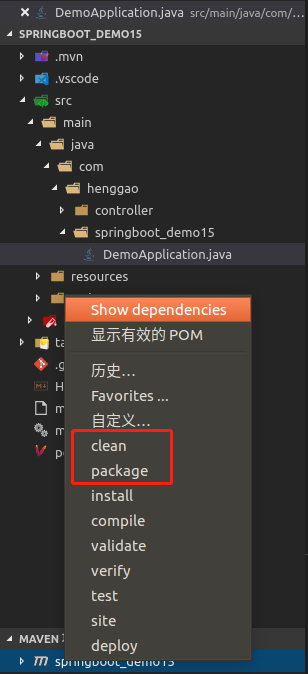

## Demo23:SpringBoot打包发布

1）、pom.xml 文件 首先更改打包方式 war,再排除springboot内置的 web 项目下tomcat依赖。

```xml
<dependency>
		<groupId>org.springframework.boot</groupId>
		<artifactId>spring-boot-starter-web</artifactId>
		<exclusions>
			<exclusion>
				<groupId>org.springframework.boot</groupId>
				<artifactId>spring-boot-starter-tomcat</artifactId>
			</exclusion>
		</exclusions>
</dependency>
```

2）、引入tomcat依赖.

```xml
<dependency>
    <groupId>org.springframework.boot</groupId>
    <artifactId>spring-boot-starter-tomcat</artifactId>
    <scope>provided</scope>
</dependency>
```

3）、pom.xml文件

```xml
<?xml version="1.0" encoding="UTF-8"?>
<project xmlns="http://maven.apache.org/POM/4.0.0" 
	xmlns:xsi="http://www.w3.org/2001/XMLSchema-instance" xsi:schemaLocation="http://maven.apache.org/POM/4.0.0 http://maven.apache.org/xsd/maven-4.0.0.xsd">
	<modelVersion>4.0.0</modelVersion>
	<parent>
		<groupId>org.springframework.boot</groupId>
		<artifactId>spring-boot-starter-parent</artifactId>
		<version>2.1.5.RELEASE</version>
		<relativePath/>
		<!-- lookup parent from repository -->
	</parent>
	<groupId>com.henggao</groupId>
	<artifactId>springboot_demo15</artifactId>
	<version>0.0.1-SNAPSHOT</version>
	<name>demo</name>
	<description>Demo project for Spring Boot</description>
	<!-- 打包成war -->
	<packaging>war</packaging>

	<properties>
		<java.version>1.8</java.version>
	</properties>

	<dependencies>
		<dependency>
			<groupId>org.springframework.boot</groupId>
			<artifactId>spring-boot-starter-thymeleaf</artifactId>
		</dependency>
		<dependency>
			<groupId>org.springframework.boot</groupId>
			<artifactId>spring-boot-starter-web</artifactId>
			<exclusions>
				<exclusion>
					<groupId>org.springframework.boot</groupId>
					<artifactId>spring-boot-starter-tomcat</artifactId>
				</exclusion>
			</exclusions>
		</dependency>

		<!-- tomcat -->
		<dependency>
			<groupId>org.springframework.boot</groupId>
			<artifactId>spring-boot-starter-tomcat</artifactId>
			<scope>provided</scope>
		</dependency>

		<dependency>
			<groupId>org.springframework.boot</groupId>
			<artifactId>spring-boot-devtools</artifactId>
			<scope>runtime</scope>
		</dependency>
		<dependency>
			<groupId>org.projectlombok</groupId>
			<artifactId>lombok</artifactId>
			<optional>true</optional>
		</dependency>
		<dependency>
			<groupId>org.springframework.boot</groupId>
			<artifactId>spring-boot-starter-test</artifactId>
			<scope>test</scope>
		</dependency>
	</dependencies>

	<build>
		<plugins>
			<plugin>
				<groupId>org.springframework.boot</groupId>
				<artifactId>spring-boot-maven-plugin</artifactId>
			</plugin>
		</plugins>
	</build>

</project>

```

4）、修改启动类

```java
package com.henggao.springboot_demo15;

import org.springframework.boot.SpringApplication;
import org.springframework.boot.autoconfigure.SpringBootApplication;
import org.springframework.boot.builder.SpringApplicationBuilder;
import org.springframework.boot.web.servlet.support.SpringBootServletInitializer;

@SpringBootApplication(scanBasePackages = "com.henggao")
public class DemoApplication extends SpringBootServletInitializer{

	public static void main(String[] args) {
		SpringApplication.run(DemoApplication.class, args);
	}

    @Override
    protected SpringApplicationBuilder configure(SpringApplicationBuilder builder) {
        return builder.sources(DemoApplication.class);
    }
}

```

5）、maven项目运行clean、package。



6）、查看


