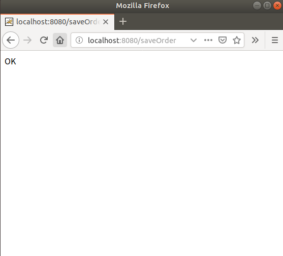
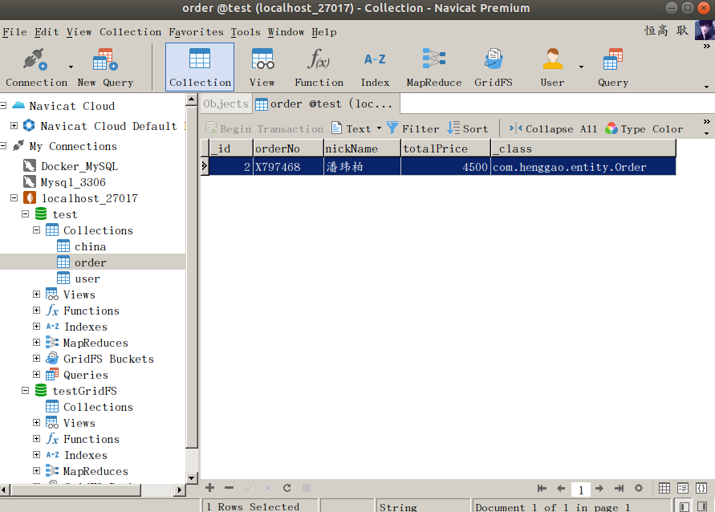

## Demo24：SpringBoot整合MongoDB

1）、配置pom.xml

```xml
<?xml version="1.0" encoding="UTF-8"?>
<project xmlns="http://maven.apache.org/POM/4.0.0" 
	xmlns:xsi="http://www.w3.org/2001/XMLSchema-instance" xsi:schemaLocation="http://maven.apache.org/POM/4.0.0 http://maven.apache.org/xsd/maven-4.0.0.xsd">
	<modelVersion>4.0.0</modelVersion>
	<parent>
		<groupId>org.springframework.boot</groupId>
		<artifactId>spring-boot-starter-parent</artifactId>
		<version>2.1.5.RELEASE</version>
		<relativePath/>
		<!-- lookup parent from repository -->
	</parent>
	<groupId>com.henggao</groupId>
	<artifactId>mongodb_demo1</artifactId>
	<version>0.0.1-SNAPSHOT</version>
	<name>demo</name>
	<description>Demo project for Spring Boot</description>

	<properties>
		<java.version>1.8</java.version>
	</properties>

	<dependencies>
		<dependency>
			<groupId>org.springframework.boot</groupId>
			<artifactId>spring-boot-starter-data-mongodb</artifactId>
		</dependency>

		<dependency>
			<groupId>org.springframework.data</groupId>
			<artifactId>spring-data-mongodb</artifactId>
		</dependency>


		<dependency>
			<groupId>org.springframework.boot</groupId>
			<artifactId>spring-boot-starter-thymeleaf</artifactId>
		</dependency>
		<dependency>
			<groupId>org.springframework.boot</groupId>
			<artifactId>spring-boot-starter-web</artifactId>
		</dependency>

		<dependency>
			<groupId>org.springframework.boot</groupId>
			<artifactId>spring-boot-devtools</artifactId>
			<scope>runtime</scope>
		</dependency>
		<dependency>
			<groupId>org.projectlombok</groupId>
			<artifactId>lombok</artifactId>
			<optional>true</optional>
		</dependency>
		<dependency>
			<groupId>org.springframework.boot</groupId>
			<artifactId>spring-boot-starter-test</artifactId>
			<scope>test</scope>
		</dependency>
	</dependencies>

	<build>
		<plugins>
			<plugin>
				<groupId>org.springframework.boot</groupId>
				<artifactId>spring-boot-maven-plugin</artifactId>
			</plugin>
		</plugins>
	</build>

</project>
```

2）、配置application.properties

```properties
#mongodb
spring.data.mongodb.uri=mongodb://localhost:27017/test
```

3）、编写实体类Order.java

```java
package com.henggao.entity;
 
import org.springframework.data.annotation.Id;

import lombok.Data;
 
@Data
public class Order {
	
	@Id
	private int id;
	private String orderNo;
	private String nickName;
	private double totalPrice;
 
	// public int getId() {
	// 	return id;
	// }
 
	// public void setId(int id) {
	// 	this.id = id;
	// }
 
	// public String getOrderNo() {
	// 	return orderNo;
	// }
 
	// public void setOrderNo(String orderNo) {
	// 	this.orderNo = orderNo;
	// }
 
	// public String getNickName() {
	// 	return nickName;
	// }
 
	// public void setNickName(String nickName) {
	// 	this.nickName = nickName;
	// }
 
	// public double getTotalPrice() {
	// 	return totalPrice;
	// }
 
	// public void setTotalPrice(double totalPrice) {
	// 	this.totalPrice = totalPrice;
	// }
 
}
```

4）、编写OrderController.java

```java
package com.henggao.controller;

import javax.annotation.Resource;

import com.henggao.entity.Order;
import com.henggao.service.OrderService;

import org.springframework.web.bind.annotation.RequestMapping;
import org.springframework.web.bind.annotation.ResponseBody;
import org.springframework.web.bind.annotation.RestController;

@RestController
public class OrderController {

	@Resource
	private OrderService orderService;

	@RequestMapping("/saveOrder")
	@ResponseBody
	public String saveOrder() {

		Order order = new Order();
		order.setId(2);
		order.setNickName("潘玮柏");
		order.setOrderNo("X797468");
		order.setTotalPrice(4500.00);

		orderService.saveOrder(order);

		return "OK";
	}

	@RequestMapping("/getOrderByOrderNo")
	@ResponseBody
	public Order getOrderByOrderNo() {
		Order order = orderService.getByOrderNo("X797466");
		return order;
	}

	@RequestMapping("/getOrderByOrderNoLike")
	@ResponseBody
	public Order getOrderByOrderNoLike() {
		// String cond="X797";
		// Pattern pattern=Pattern.compile("^.*"++".*$");
		Order order = orderService.getByOrderNoLike("X797");
		return order;
	}

	@RequestMapping("/removeOrderByOrderNo")
	@ResponseBody
	public String removeOrderByOrderNo() {
		orderService.removeOrderByOrderNo("X797468");
		return "OK";
	}

	@RequestMapping("/updateOrder")
	@ResponseBody
	public String updateOrder() {
		Order order = new Order();
		order.setNickName("Justin Timberlake");
		order.setOrderNo("X797467");
		orderService.updateOrder(order);
		return "OK";
	}
}
```

5）、编写启动类DemoApplication.java

```java
package com.henggao.mongodb_demo1;

import org.springframework.boot.SpringApplication;
import org.springframework.boot.autoconfigure.SpringBootApplication;
import org.springframework.boot.autoconfigure.domain.EntityScan;
import org.springframework.data.mongodb.repository.config.EnableMongoRepositories;

@SpringBootApplication(scanBasePackages = "com.henggao")
@EntityScan("com.henggao.entity")
@EnableMongoRepositories("com.henggao.repository")
public class DemoApplication {

	public static void main(String[] args) {
		SpringApplication.run(DemoApplication.class, args);
	}

}
```

6）、运行，浏览器输入http://localhost:8080/saveOrder，查看。



7）、数据库查看

