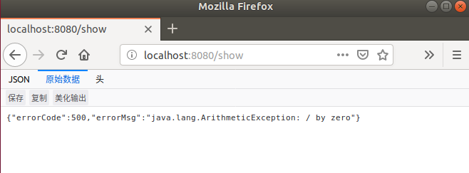
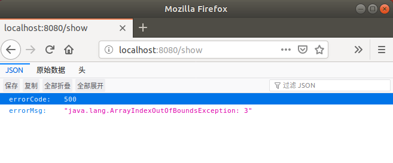
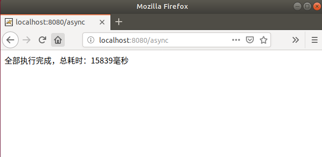
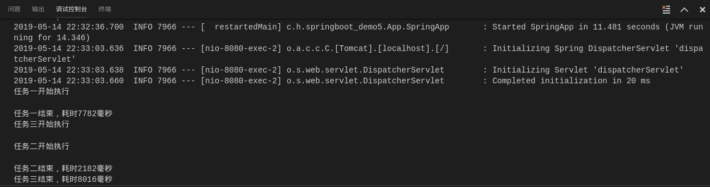

## Demo10:定义全局异常处理器

1）、创建一个全局异常处理类;

```java
package com.henggao.springboot_demo5.controller;

import java.util.HashMap;
import java.util.Map;

import org.springframework.web.bind.annotation.ControllerAdvice;
import org.springframework.web.bind.annotation.ExceptionHandler;
import org.springframework.web.bind.annotation.ResponseBody;

/**
 * GlobalExceptionHandler
 */
// 全局异常处理
@ControllerAdvice
public class GlobalExceptionHandler {

    @ExceptionHandler(Exception.class)
    @ResponseBody //以Json格式返回
    public Map<String, Object> handleException(Exception exception) {
        Map<String, Object> map = new HashMap<>();
        map.put("errorCode", 500);
        map.put(("errorMsg"), exception.toString());
        return map;
    }
}
```

2）、编写TestController.java类

```java
package com.henggao.springboot_demo5.controller;

import org.springframework.stereotype.Controller;
import org.springframework.web.bind.annotation.RequestMapping;
import org.springframework.web.bind.annotation.ResponseBody;

/**
 * TestController
 */
@Controller
public class TestController {
    @RequestMapping("/show")
    @ResponseBody
    public String show() {
        // int a = 5 / 0;
        int[] arr = new int[3];
        System.out.println(arr[3]);
        return "show";
    }

}
```

3）、编写SpringApp.java类

```java
package com.henggao.springboot_demo5.App;

import org.springframework.boot.SpringApplication;
import org.springframework.boot.autoconfigure.SpringBootApplication;

/**
 * SpringApp
 */
@SpringBootApplication(scanBasePackages = { "com.henggao.springboot_demo5.controller" })
public class SpringApp {

    public static void main(String[] args) {
        SpringApplication.run(SpringApp.class, args);
    }
}
```

4）、浏览器输入http://localhost:8080/show





## Demo11：异步调用

SpringBoot提供了异步处理方式**@Async**。

1）、编写AsyncService.java

```java
package com.henggao.springboot_demo5.service;

import java.util.concurrent.Future;

/**
 * AsyncService
 */
public interface AsyncService {

    Future<String> doTask1() throws Exception;
    Future<String> doTask2() throws Exception;
    Future<String> doTask3() throws Exception;
}
```

2）、AsyncServiceImpl.java继承接口

```java
package com.henggao.springboot_demo5.service;

import java.util.Random;
import java.util.concurrent.Future;

import org.springframework.scheduling.annotation.Async;
import org.springframework.scheduling.annotation.AsyncResult;
import org.springframework.stereotype.Service;

/**
 * AsyncServiceImpl
 */
@Service
public class AsyncServiceImpl  implements AsyncService{

    private static Random random = new Random();
    @Override
    public Future<String> doTask1() throws Exception {
        System.out.println("任务一开始执行");
        long start = System.currentTimeMillis();
        Thread.sleep(random.nextInt(10000));
        long end = System.currentTimeMillis();
        System.out.println("任务一结束，耗时" + (end - start) + "毫秒");
        return new AsyncResult<>("任务一结束");
    }
    @Async
    @Override
    public Future<String> doTask2() throws Exception {
        System.out.println("任务二开始执行");
        long start = System.currentTimeMillis();
        Thread.sleep(random.nextInt(10000));
        long end = System.currentTimeMillis();
        System.out.println("任务二结束，耗时" + (end - start) + "毫秒");
        return new AsyncResult<>("任务二结束");
    }
    @Override
    public Future<String> doTask3() throws Exception {
        System.out.println("任务三开始执行");
        long start = System.currentTimeMillis();
        Thread.sleep(random.nextInt(10000));
        long end = System.currentTimeMillis();
        System.out.println("任务三结束，耗时" + (end - start) + "毫秒");
        return new AsyncResult<>("任务三结束");
    }
}
```

3）、编写TestController.java

```java
package com.henggao.springboot_demo5.controller;

import java.util.concurrent.Future;

import com.henggao.springboot_demo5.service.AsyncService;

import org.springframework.beans.factory.annotation.Autowired;
import org.springframework.stereotype.Controller;
import org.springframework.web.bind.annotation.RequestMapping;
import org.springframework.web.bind.annotation.ResponseBody;

/**
 * TestController
 */
@Controller
public class TestController {
    @RequestMapping("/show")
    @ResponseBody
    public String show() {
        // int a = 5 / 0;
        int[] arr = new int[3];
        System.out.println(arr[3]);
        return "show";
    }

    @Autowired
    private AsyncService asyncService;

    @RequestMapping("/async")
    @ResponseBody
    public String asyncTest() throws Exception {
        long start = System.currentTimeMillis();
        Future<String> task1 = asyncService.doTask1();
        Future<String> task2 = asyncService.doTask2();
        Future<String> task3 = asyncService.doTask3();

        while (true) {

            if (task1.isDone() && task2.isDone() && task3.isDone()) {

                break;
            }
            Thread.sleep(10000);
        }
        long end = System.currentTimeMillis();
        return "全部执行完成，总耗时：" + (end - start) + "毫秒";

    }
}
```

4）、编写SpringApp.java

```java
package com.henggao.springboot_demo5.App;

import org.springframework.boot.SpringApplication;
import org.springframework.boot.autoconfigure.SpringBootApplication;
import org.springframework.scheduling.annotation.EnableAsync;

/**
 * SpringApp
 */
@SpringBootApplication(scanBasePackages = { "com.henggao.springboot_demo5.controller" ,"com.henggao.springboot_demo5.service"})
@EnableAsync //开启异步调用
public class SpringApp {

    public static void main(String[] args) {
        SpringApplication.run(SpringApp.class, args);
    }
}
```

5）、运行Debug，浏览器输入http://localhost:8080/async。

浏览器显示



控制台显示



