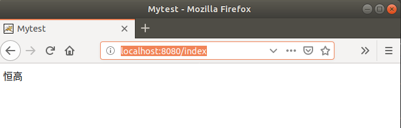
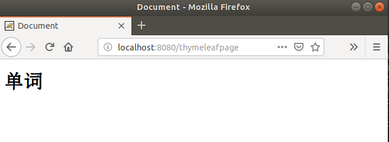
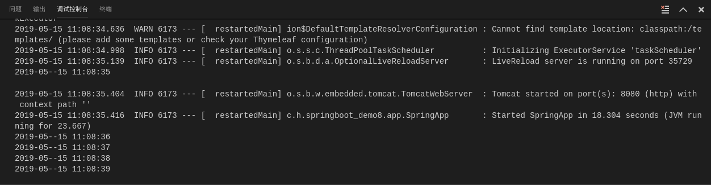

## Demo12：SpringBoot整合JSP（Spring官方不推荐）

1）、配置pom.xml文件

```xml
<?xml version="1.0" encoding="UTF-8"?>
<project xmlns="http://maven.apache.org/POM/4.0.0" 
	xmlns:xsi="http://www.w3.org/2001/XMLSchema-instance" xsi:schemaLocation="http://maven.apache.org/POM/4.0.0 http://maven.apache.org/xsd/maven-4.0.0.xsd">
	<modelVersion>4.0.0</modelVersion>
	<parent>
		<groupId>org.springframework.boot</groupId>
		<artifactId>spring-boot-starter-parent</artifactId>
		<version>2.1.4.RELEASE</version>
		<relativePath/>
		<!-- lookup parent from repository -->
	</parent>
	<groupId>com.henggao</groupId>
	<artifactId>springboot_demo6</artifactId>
	<!-- 打包为War -->
	<packaging>war</packaging> 
	<version>0.0.1-SNAPSHOT</version>
	<name>demo</name>
	<description>Demo project for Spring Boot</description>

	<properties>
		<java.version>1.8</java.version>
	</properties>

	<dependencies>
		<!-- <dependency>
			<groupId>org.springframework.boot</groupId>
			<artifactId>spring-boot-starter-thymeleaf</artifactId>
		</dependency> -->
		<dependency>
			<groupId>org.springframework.boot</groupId>
			<artifactId>spring-boot-starter-web</artifactId>
		</dependency>

		<dependency>
			<groupId>org.springframework.boot</groupId>
			<artifactId>spring-boot-devtools</artifactId>
			<scope>runtime</scope>
		</dependency>
		<dependency>
			<groupId>org.projectlombok</groupId>
			<artifactId>lombok</artifactId>
			<optional>true</optional>
		</dependency>
		<dependency>
			<groupId>org.springframework.boot</groupId>
			<artifactId>spring-boot-starter-test</artifactId>
			<scope>test</scope>
		</dependency>
		<!-- 整合JSP需要的依赖 -->
		<dependency>
			<groupId>org.springframework.boot</groupId>
			<artifactId>spring-boot-starter-tomcat</artifactId>
		</dependency>
		<dependency>
			<groupId>org.apache.tomcat.embed</groupId>
			<artifactId>tomcat-embed-jasper</artifactId>
		</dependency>

	</dependencies>

	<build>
		<plugins>
			<plugin>
				<groupId>org.springframework.boot</groupId>
				<artifactId>spring-boot-maven-plugin</artifactId>
			</plugin>
			<plugin>
				<groupId>org.apache.maven.plugins</groupId>
				<artifactId>maven-war-plugin</artifactId>
				<version>2.3</version>
				<configuration>
					<failOnMissingWebXMl>false</failOnMissingWebXMl>
				</configuration>
			</plugin>
		</plugins>
	</build>

</project>

```

2）、配置application.properties文件

```properties
spring.mvc.view.prefix=/jsp/
spring.mvc.view.suffix=.jsp
```

3）、编写indexContrller.java

```java
package com.henggao.springboot_demo6.controller;

import org.springframework.stereotype.Controller;
import org.springframework.ui.Model;
import org.springframework.web.bind.annotation.RequestMapping;

/**
 * indexController
 */
@Controller
public class indexController {

    @RequestMapping("/index")
    public String show(Model model) {
        model.addAttribute("name","恒高");
        return "index";
    }
}
```

4）、编写SpringApp.java

```java
package com.henggao.springboot_demo6.app;

import org.springframework.boot.SpringApplication;
import org.springframework.boot.autoconfigure.SpringBootApplication;

/**
 * SpringApp
 */
@SpringBootApplication(scanBasePackages = "com.henggao.springboot_demo6.controller")
public class SpringApp {
public static void main(String[] args) {
    SpringApplication.run(SpringApp.class, args);
}
    
}
```

5）、编写index.jsp

```jsp
<%@ page contentType="text/html;charset=UTF-8" language="java" %>
<!DOCTYPE html>
<html lang="zh">

<head>
    <meta charset="UTF-8">
    <meta name="viewport" content="width=device-width, initial-scale=1.0">
    <meta http-equiv="content-Type" content="text/html; charset=UTF-8">
    <title>Mytest</title>
</head>

<body>
    ${name}
</body>

</html>
```

6）、运行Debug，浏览器输入http://localhost:8080/index查看。



## Demo13：SpringBoot整合Thymeleaf

1）、在文件夹templates下编写test.html文件

```html
<!DOCTYPE html>
<html lang="en">
<head>
    <meta charset="UTF-8">
    <meta name="viewport" content="width=device-width, initial-scale=1.0">
    <meta http-equiv="X-UA-Compatible" content="ie=edge">
    <title>Document</title>
</head>
<body>
    <h1 th:text="${word}"></h1>
</body>
</html>
```

2）、在controller文件夹下写iindexController.java

```java
package com.henggao.springboot_demo7.controller;

import org.springframework.stereotype.Controller;
import org.springframework.ui.Model;
import org.springframework.web.bind.annotation.RequestMapping;

/**
 * IndexController
 */
@Controller
public class IndexController {

    @RequestMapping("/thymeleafpage")
    public String show(Model model){

        model.addAttribute("word","单词");
        return "test";
    }
}
```

3）、在App文件夹下编写SpringApp.java

```java
package com.henggao.springboot_demo7.App;

import org.springframework.boot.SpringApplication;
import org.springframework.boot.autoconfigure.SpringBootApplication;

@SpringBootApplication(scanBasePackages = {"com.henggao.springboot_demo7.controller","com.henggao.springboot_demo7.App"})
public class SpringApp {

    public static void main(String[] args) {
        SpringApplication.run(SpringApp.class, args);
	}

}

```

4）、配置applicatio.propert

```properties
#SpringBoot整合Thymeleaf
# <!--关闭thymeleaf缓存 开发时使用 否则没有实施画面-->
spring.thymeleaf.cache=false
## 检查模板是否存在，然后呈现
spring.thymeleaf.check-template-location=true
#content-Type值
spring.thymeleaf.servlet.content-type=text/html
#启用MVC Thymeleaf示图分辨率
spring.thymeleaf.enabled=true
## 应该从解决方案中排除的试图名称的逗号分隔列表
spring.groovy.template.view-names=
#模板编码
spring.thymeleaf.mode=LEGACYHTML5
# 在构建URL时与县查看名称的前缀
spring.thymeleaf.prefix=classpath:/templates/
# 构建URL时附加查看名称的后缀
spring.thymeleaf.suffix=.html
#链中模板解析的顺序
# spring.thymeleaf.template-resolver-order= o
# 可以解析的视图名称的逗号分隔列表
# spring.thymeleaf.view-names=
#thymeleaf end
```

5）、运行Debug，浏览器输入http://localhost:8080/thymeleafpage查看。



## Demo14：SpringBoot整合QuartZ

1）、编写myjob.java

```java
package com.henggao.springboot_demo8.job;

import java.text.SimpleDateFormat;
import java.util.Date;

import org.springframework.scheduling.annotation.Scheduled;
import org.springframework.stereotype.Component;

/**
 * myjob
 */
@Component
public class myjob {
    @Scheduled(fixedRate = 1000)
    private void run() {
        System.out.println(new SimpleDateFormat("yyyy-MM--dd HH:mm:ss").format(new Date()));
    }
    
}
```

2）、编写SpringApp.java

```java
package com.henggao.springboot_demo8.app;

import org.springframework.boot.SpringApplication;
import org.springframework.boot.autoconfigure.SpringBootApplication;
import org.springframework.scheduling.annotation.EnableScheduling;

@SpringBootApplication(scanBasePackages = {"com.henggao.springboot_demo8"})
@EnableScheduling
public class SpringApp {

    public static void main(String[] args) {
        SpringApplication.run(SpringApp.class, args);
	}

}

```

3）、查看控制台

