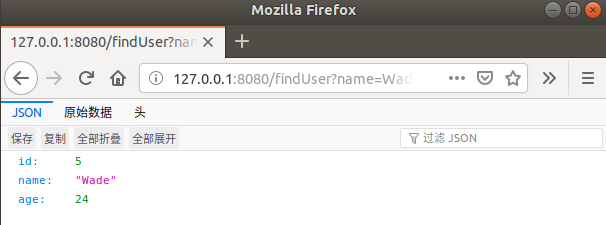
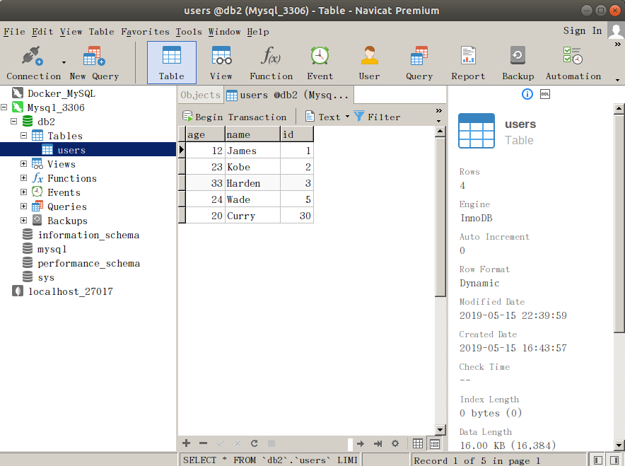

## Demo16：SpringBoot整合MyBatis（XML配置方式）

1）、配置pom.xml

```properties
<?xml version="1.0" encoding="UTF-8"?>
<project xmlns="http://maven.apache.org/POM/4.0.0" xmlns:xsi="http://www.w3.org/2001/XMLSchema-instance"
	xsi:schemaLocation="http://maven.apache.org/POM/4.0.0 http://maven.apache.org/xsd/maven-4.0.0.xsd">
	<modelVersion>4.0.0</modelVersion>
	<parent>
		<groupId>org.springframework.boot</groupId>
		<artifactId>spring-boot-starter-parent</artifactId>
		<version>2.1.5.RELEASE</version>
		<relativePath/> <!-- lookup parent from repository -->
	</parent>
	<groupId>com.henggao</groupId>
	<artifactId>springboot_demo10</artifactId>
	<version>0.0.1-SNAPSHOT</version>
	<name>demo</name>
	<description>Demo project for Spring Boot</description>

	<properties>
		<java.version>1.8</java.version>
	</properties>

	<dependencies>
		<dependency>
			<groupId>org.springframework.boot</groupId>
			<artifactId>spring-boot-starter-thymeleaf</artifactId>
		</dependency>
		<dependency>
			<groupId>org.springframework.boot</groupId>
			<artifactId>spring-boot-starter-web</artifactId>
		</dependency>
		<!-- MyBatis -->
		<dependency>
			<groupId>org.mybatis.spring.boot</groupId>
			<artifactId>mybatis-spring-boot-starter</artifactId>
			<version>2.0.1</version>
		</dependency>

		<dependency>
			<groupId>org.springframework.boot</groupId>
			<artifactId>spring-boot-devtools</artifactId>
			<scope>runtime</scope>
		</dependency>
		<!-- MySQL -->
		<dependency>
			<groupId>mysql</groupId>
			<artifactId>mysql-connector-java</artifactId>
			<scope>runtime</scope>
		</dependency>
		<dependency>
			<groupId>org.projectlombok</groupId>
			<artifactId>lombok</artifactId>
			<optional>true</optional>
		</dependency>
		<dependency>
			<groupId>org.springframework.boot</groupId>
			<artifactId>spring-boot-starter-test</artifactId>
			<scope>test</scope>
		</dependency>
		<!-- alibaba的druid数据库连接池 -->
		<dependency>
			<groupId>com.alibaba</groupId>
			<artifactId>druid-spring-boot-starter</artifactId>
			<version>1.1.16</version>
		</dependency>
		<dependency>
			<groupId>com.alibaba</groupId>
			<artifactId>druid</artifactId>
			<version>1.1.16</version>
		</dependency>
		<!-- 分页插件 -->
		<dependency>
			<groupId>com.github.pagehelper</groupId>
			<artifactId>pagehelper-spring-boot-starter</artifactId>
			<version>1.2.10</version>
		</dependency>

	</dependencies>

	<build>
		<plugins>
			<plugin>
				<groupId>org.springframework.boot</groupId>
				<artifactId>spring-boot-maven-plugin</artifactId>
			</plugin>
		</plugins>
	</build>

</project>

```

2）、配置MyBatis，新建Mybatis-config.xml

```xml
<?xml version="1.0" encoding="UTF-8" ?>
<!DOCTYPE configuration
  PUBLIC "-//mybatis.org//DTD Config 3.0//EN"
  "http://mybatis.org/dtd/mybatis-3-config.dtd">
<configuration>
```

3）、配置application.yml

```yaml
spring:
    datasource:
        name: users
        url: jdbc:mysql://127.0.0.1:3306/db2
        username: henggao
        password: abc123
        type: com.alibaba.druid.pool.DruidDataSource
        driver-class-name: com.mysql.jdbc.Driver
        
        druid:
            filters: stat
            max-active: 20
            initial-size: 1
            max-wait: 60000
            min-idle: 1
            time-between-eviction-runs-millis: 60000
            min-evictable-idle-time-millis: 300000
            validation-query: select 'x'
            test-while-idle: true
            test-on-borrow: false
            pool-prepared-statements: true
            max-open-prepared-statements: 20
```

4）、配置UserMapper.ava、UserMapper.xml、application.yml

5）、编写Userservice.java、UserServiceImpl.java

6）、编写UserController.java

7）、编写SpringApp.java.启动Debug（默认也可以）

## Demo17：SpringBoot整合MyBatis（注解方式）

1）、编写Users.java

```java
package com.henggao.springboot_demo11.pojo;

import lombok.Data;

/**
 * Users
 */
@Data
public class Users {

    private Integer id;
    private String name;
    private int age;

}
```

2）、编写UsersService.java

```java
package com.henggao.springboot_demo11.service;

import com.henggao.springboot_demo11.pojo.Users;

/**
 * UserService
 */
public interface UsersService {

    Users findUser(String name);
    void saveUser(Users user);
    
}
```

3）、编写UsersServiceimpl.java

```java
package com.henggao.springboot_demo11.service;

import com.henggao.springboot_demo11.mapper.UsersMapper;
import com.henggao.springboot_demo11.pojo.Users;

import org.springframework.beans.factory.annotation.Autowired;
import org.springframework.stereotype.Service;

/**
 * UserServiceImpl
 */
@Service
public class UserServiceImpl implements UsersService {

    @Autowired
    private UsersMapper UsersMapper;

    @Override
    public Users findUser(String name) {
        return UsersMapper.findUserByName(name);
    }

    @Override
    public void saveUser(Users user) {
        UsersMapper.addUser(user.getName(), user.getAge(),user.getId());

    }

    
}
```

4）、编写UsersMapper.java

```java
package com.henggao.springboot_demo11.mapper;

import com.henggao.springboot_demo11.pojo.Users;

import org.apache.ibatis.annotations.Insert;
import org.apache.ibatis.annotations.Param;
import org.apache.ibatis.annotations.Select;

/**
 * UserMapper
 */
public interface UsersMapper {

    @Select("select * from users where name =#{name}")
    Users findUserByName(@Param("name")String name);

    @Insert("insert into users(name,age,id) values(#{name},#{age},#{id})")
    void addUser(@Param("name")String name,@Param("age") int age,@Param("id") int id);

}
```

5）、编写UsersController.java

```java
package com.henggao.springboot_demo11.controller;

import com.henggao.springboot_demo11.pojo.Users;
import com.henggao.springboot_demo11.service.UsersService;

import org.springframework.beans.factory.annotation.Autowired;
// import org.springframework.stereotype.Controller;
import org.springframework.web.bind.annotation.RequestMapping;
// import org.springframework.web.bind.annotation.ResponseBody;
import org.springframework.web.bind.annotation.RestController;

/**
 * UsersController
 */
// @Controller
@RestController
public class UsersController {

    @Autowired
    private UsersService usersService;

    @RequestMapping("/findUser")
    // @ResponseBody
    public Users findUser(String name) {
        
        return usersService.findUser(name);
    }

    @RequestMapping("/addUser")
    // @ResponseBody
    public String addUser(){

        Users user = new Users();
        user.setId(30);
        user.setAge(20);
        user.setName("Curry");
        usersService.saveUser(user);
        return "ok";
    }
    
}
```

6）、修改DemoApplication.java。

```java
package com.henggao.springboot_demo11;

import org.mybatis.spring.annotation.MapperScan;
import org.springframework.boot.SpringApplication;
import org.springframework.boot.autoconfigure.SpringBootApplication;

@SpringBootApplication
@MapperScan("com.henggao.springboot_demo11.mapper")
public class DemoApplication {

	public static void main(String[] args) {
		SpringApplication.run(DemoApplication.class, args);
	}

}
```

7）、配置application.propert

```properties
spring.datasource.driverClassName=com.mysql.cj.jdbc.Driver
spring.datasource.username= henggao
spring.datasource.password= abc123
spring.datasource.url=jdbc:mysql://127.0.0.1:3306/db2
```

8）、pom,xml配置

```xml
<?xml version="1.0" encoding="UTF-8"?>
<project xmlns="http://maven.apache.org/POM/4.0.0" xmlns:xsi="http://www.w3.org/2001/XMLSchema-instance"
	xsi:schemaLocation="http://maven.apache.org/POM/4.0.0 http://maven.apache.org/xsd/maven-4.0.0.xsd">
	<modelVersion>4.0.0</modelVersion>
	<parent>
		<groupId>org.springframework.boot</groupId>
		<artifactId>spring-boot-starter-parent</artifactId>
		<version>2.1.5.RELEASE</version>
		<relativePath/> <!-- lookup parent from repository -->
	</parent>
	<groupId>com.henggao</groupId>
	<artifactId>springboot_demo11</artifactId>
	<version>0.0.1-SNAPSHOT</version>
	<name>demo</name>
	<description>Demo project for Spring Boot</description>

	<properties>
		<java.version>1.8</java.version>
	</properties>

	<dependencies>
		<dependency>
			<groupId>org.springframework.boot</groupId>
			<artifactId>spring-boot-starter-web</artifactId>
		</dependency>
		<dependency>
			<groupId>org.mybatis.spring.boot</groupId>
			<artifactId>mybatis-spring-boot-starter</artifactId>
			<version>2.0.1</version>
		</dependency>

		<dependency>
			<groupId>org.springframework.boot</groupId>
			<artifactId>spring-boot-devtools</artifactId>
			<scope>runtime</scope>
		</dependency>
		<dependency>
			<groupId>mysql</groupId>
			<artifactId>mysql-connector-java</artifactId>
			<scope>runtime</scope>
		</dependency>
		<dependency>
			<groupId>org.projectlombok</groupId>
			<artifactId>lombok</artifactId>
			<optional>true</optional>
		</dependency>
		<dependency>
			<groupId>org.springframework.boot</groupId>
			<artifactId>spring-boot-starter-test</artifactId>
			<scope>test</scope>
		</dependency>
	</dependencies>

	<build>
		<plugins>
			<plugin>
				<groupId>org.springframework.boot</groupId>
				<artifactId>spring-boot-maven-plugin</artifactId>
			</plugin>
		</plugins>
	</build>

</project>
```

9）、运行Debug，浏览器分别输入

http://127.0.0.1:8080/addUser。

http://127.0.0.1:8080/findUser?name=Wade




数据库查看



problem：

过程中如果缺少id字段，会报错~  实例可以产生空字段。下面SpringBootDemo7中解决了，给id字段设置成Auto increment即可。

