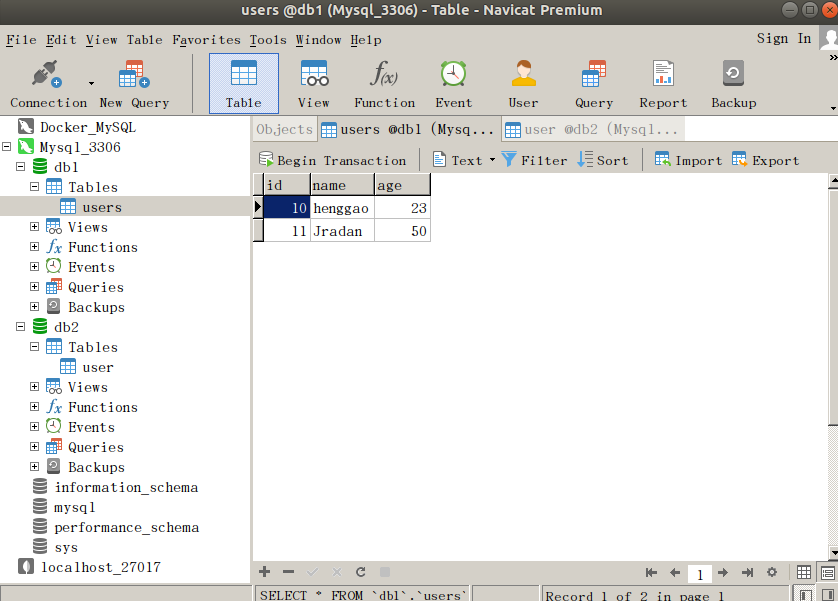
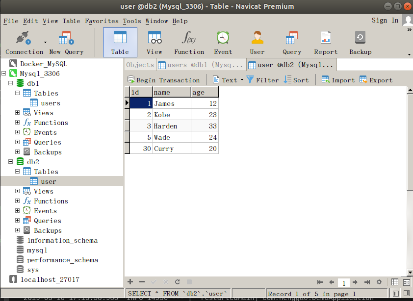
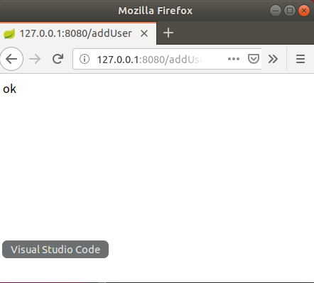
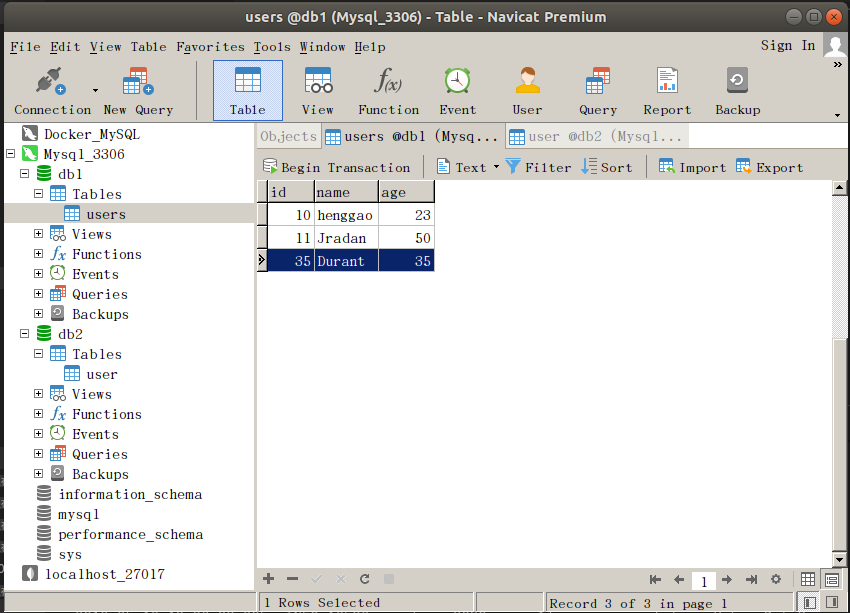

## Demo18：SpringBoot整合多数据源

1）、设置MySQL中db1数据库users表，db2数据库user表





2）、编写User.java，Users.java

```java
package com.henggao.pojo;

import lombok.Data;

/**
 * User
 */
@Data
public class User {

    private int id;
    private String name;
    private int age;

}
```

```java
package com.henggao.pojo;

import lombok.Data;

/**
 * Users
 */
@Data
public class Users {

    private int id;
    private String name;
    private int age;

}
```

3）、编写datasource1.java、datasource2.java。

```java
package com.henggao.datasource;

import javax.sql.DataSource;

import org.apache.ibatis.session.SqlSessionFactory;
import org.mybatis.spring.SqlSessionFactoryBean;
import org.mybatis.spring.SqlSessionTemplate;
import org.mybatis.spring.annotation.MapperScan;
import org.springframework.beans.factory.annotation.Qualifier;
import org.springframework.boot.context.properties.ConfigurationProperties;
import org.springframework.boot.jdbc.DataSourceBuilder;
import org.springframework.context.annotation.Bean;
import org.springframework.context.annotation.Configuration;
import org.springframework.context.annotation.Primary;
import org.springframework.jdbc.datasource.DataSourceTransactionManager;

/**
 * DataSource1
 */
@Configuration // 注册到spring容器中
@MapperScan(basePackages = "com.henggao.db1.mapper", sqlSessionFactoryRef = "db1SqlSessionFactory")
public class DataSource1 {

    /**
     * 配置db1数据库
     * 
     * @return
     */
    @Bean(name = "db1Datasource")
    @ConfigurationProperties(prefix = "spring.datasource.db1")
    @Primary
    public DataSource testDatasource() {
        return DataSourceBuilder.create().build();
    }

    /**
     * 创建SqlsessionFactory
     * 
     * @param dataSource
     * @return
     * @throws Exception
     */

    @Bean(name = "db1SqlSessionFactory")
    @Primary
    public SqlSessionFactory testSqlSessionFactory(@Qualifier("db1Datasource") DataSource dataSource) throws Exception {

        SqlSessionFactoryBean bean = new SqlSessionFactoryBean();
        bean.setDataSource(dataSource);
        return bean.getObject();
    }

    /**
     * 配置事务管理
     * 
     * @param dataSource
     * @return
     */
    @Bean(name = "db1TransactionManager")
    @Primary
    public DataSourceTransactionManager testTransactionManager(@Qualifier("db1Datasource") DataSource dataSource) {
        return new DataSourceTransactionManager(dataSource);
    }

    @Bean(name = "db1SqlSessionTemplate")
    @Primary
    public SqlSessionTemplate testSessionTemplate(
            @Qualifier("db1SqlSessionFactory") SqlSessionFactory sqlSessionFactory) {
        return new SqlSessionTemplate(sqlSessionFactory);
    }

}
```

```java
package com.henggao.datasource;

import javax.sql.DataSource;

import org.apache.ibatis.session.SqlSessionFactory;
import org.mybatis.spring.SqlSessionFactoryBean;
import org.mybatis.spring.SqlSessionTemplate;
import org.mybatis.spring.annotation.MapperScan;
import org.springframework.beans.factory.annotation.Qualifier;
import org.springframework.boot.context.properties.ConfigurationProperties;
import org.springframework.boot.jdbc.DataSourceBuilder;
import org.springframework.context.annotation.Bean;
import org.springframework.context.annotation.Configuration;
import org.springframework.context.annotation.Primary;
import org.springframework.jdbc.datasource.DataSourceTransactionManager;

/**
 * DataSource1
 */
@Configuration // 注册到spring容器中
@MapperScan(basePackages = "com.henggao.db1.mapper", sqlSessionFactoryRef = "db1SqlSessionFactory")
public class DataSource1 {

    /**
     * 配置db1数据库
     * 
     * @return
     */
    @Bean(name = "db1Datasource")
    @ConfigurationProperties(prefix = "spring.datasource.db1")
    @Primary
    public DataSource testDatasource() {
        return DataSourceBuilder.create().build();
    }

    /**
     * 创建SqlsessionFactory
     * 
     * @param dataSource
     * @return
     * @throws Exception
     */

    @Bean(name = "db1SqlSessionFactory")
    @Primary
    public SqlSessionFactory testSqlSessionFactory(@Qualifier("db1Datasource") DataSource dataSource) throws Exception {

        SqlSessionFactoryBean bean = new SqlSessionFactoryBean();
        bean.setDataSource(dataSource);
        return bean.getObject();
    }

    /**
     * 配置事务管理
     * 
     * @param dataSource
     * @return
     */
    @Bean(name = "db1TransactionManager")
    @Primary
    public DataSourceTransactionManager testTransactionManager(@Qualifier("db1Datasource") DataSource dataSource) {
        return new DataSourceTransactionManager(dataSource);
    }

    @Bean(name = "db1SqlSessionTemplate")
    @Primary
    public SqlSessionTemplate testSessionTemplate(
            @Qualifier("db1SqlSessionFactory") SqlSessionFactory sqlSessionFactory) {
        return new SqlSessionTemplate(sqlSessionFactory);
    }

}
```

4）、在mapper文件夹下编写UsersMapper.java、UserMapper.java。

```java
package com.henggao.db1.mapper;

import org.apache.ibatis.annotations.Insert;
import org.apache.ibatis.annotations.Param;
import org.springframework.beans.factory.annotation.Qualifier;

/**
 * UsersMapper
 */
@Qualifier("db1SqlSessionFactory")
public interface UsersMapper {

    @Insert("insert into users(id,name,age) values(#{id},#{name},#{age})")
    void addUser(@Param("name") String name, @Param("age") int age, @Param("id") int id);
}
```

```java
package com.henggao.db2.mapper;

import org.apache.ibatis.annotations.Insert;
import org.apache.ibatis.annotations.Param;
import org.springframework.beans.factory.annotation.Qualifier;

/**
 * UserMapper
 */
@Qualifier("db2SqlSessionFactory")
public interface UserMapper {

    @Insert("insert into user(id,name,age) values(#{id},#{name},#{age})")
    void addUser(@Param("id") int id,@Param("name") String name, @Param("age")int age);
}
```

5）、在service文件夹下编写UsersService.java,UserService.java;UsersServiceImpl.java、UserServiceImpl.java。

```java
package com.henggao.db1.service;

import com.henggao.pojo.Users;

/**
 * UsersService
 */
public interface UsersService {

    void saveUser (Users user);
}
```

```java
package com.henggao.db1.service;

import com.henggao.db1.mapper.UsersMapper;
import com.henggao.pojo.Users;

import org.springframework.beans.factory.annotation.Autowired;
import org.springframework.stereotype.Service;

/**
 * UsersServiceImpl
 */
@Service
public class UsersServiceImpl implements UsersService {

    @Autowired
    private UsersMapper usersMapper;

    @Override
    public void saveUser(Users user) {
        usersMapper.addUser(user.getName(), user.getAge(),user.getId());
    }
}
```

```java
package com.henggao.db2.service;

import com.henggao.pojo.User;

/**
 * UserService
 */
public interface UserService {

   void saveUser(User user);
}
```

```java
package com.henggao.db2.service;

import com.henggao.db2.mapper.UserMapper;
import com.henggao.pojo.User;

import org.springframework.beans.factory.annotation.Autowired;
import org.springframework.stereotype.Service;

/**
 * UserServiceImpl
 */
@Service
public class UserServiceImpl  implements UserService{

    @Autowired
    private UserMapper userMapper;

    @Override
    public void saveUser(User user){

        userMapper.addUser(user.getId(), user.getName(), user.getAge());
    }
    
}
```

6）、编写IndexController.java。

```java
package com.henggao.controller;

import com.henggao.db1.service.UsersService;
import com.henggao.db2.service.UserService;
import com.henggao.pojo.Users;

import org.springframework.beans.factory.annotation.Autowired;
import org.springframework.stereotype.Controller;
import org.springframework.web.bind.annotation.RequestMapping;
import org.springframework.web.bind.annotation.ResponseBody;

/**
 * IndexController
 */
@Controller
public class IndexController {

    @Autowired
    private UsersService usersService; //db1

    @Autowired
    private UserService userService;  //db2

    @RequestMapping("/addUser")
    @ResponseBody
    public String addUser(){
        Users u = new Users();
        u.setName("Durant");
        u.setAge(35);
        u.setId(35);

        usersService.saveUser(u);

        return "ok";
    }


}
```

7）、编写DemoApplication.java。

```java
package com.henggao;

import org.springframework.boot.SpringApplication;
import org.springframework.boot.autoconfigure.SpringBootApplication;

@SpringBootApplication(scanBasePackages = "com.henggao")

public class DemoApplication {

	public static void main(String[] args) {
		SpringApplication.run(DemoApplication.class, args);
	}

}

```

8）、配置application.propert文件

```properties
#SpringBoot整合多数据源
#db1数据源配置
spring.datasource.db1.jdbc-url=jdbc:mysql://127.0.0.1:3306/db1    //这个配置注意
spring.datasource.db1.driverClassName=com.mysql.cj.jdbc.Driver
spring.datasource.db1.username= henggao
spring.datasource.db1.password= abc123

#db2数据源配置
spring.datasource.db2.jdbc-url=jdbc:mysql://127.0.0.1:3306/db2
spring.datasource.db2.driverClassName=com.mysql.cj.jdbc.Driver
spring.datasource.db2.username= henggao
spring.datasource.db2.password= abc123
```

9）、配置pom.xml文件

```xml
<?xml version="1.0" encoding="UTF-8"?>
<project xmlns="http://maven.apache.org/POM/4.0.0" xmlns:xsi="http://www.w3.org/2001/XMLSchema-instance"
	xsi:schemaLocation="http://maven.apache.org/POM/4.0.0 http://maven.apache.org/xsd/maven-4.0.0.xsd">
	<modelVersion>4.0.0</modelVersion>
	<parent>
		<groupId>org.springframework.boot</groupId>
		<artifactId>spring-boot-starter-parent</artifactId>
		<version>2.1.5.RELEASE</version>
		<relativePath/> <!-- lookup parent from repository -->
	</parent>
	<groupId>com.henggao</groupId>
	<artifactId>springboot_demo12</artifactId>
	<version>0.0.1-SNAPSHOT</version>
	<name>demo</name>
	<description>Demo project for Spring Boot</description>

	<properties>
		<java.version>1.8</java.version>
	</properties>

	<dependencies>
		<dependency>
			<groupId>org.springframework.boot</groupId>
			<artifactId>spring-boot-starter-thymeleaf</artifactId>
		</dependency>
		<dependency>
			<groupId>org.springframework.boot</groupId>
			<artifactId>spring-boot-starter-web</artifactId>
		</dependency>
		<dependency>
			<groupId>org.mybatis.spring.boot</groupId>
			<artifactId>mybatis-spring-boot-starter</artifactId>
			<version>2.0.1</version>
		</dependency>

		<dependency>
			<groupId>org.springframework.boot</groupId>
			<artifactId>spring-boot-devtools</artifactId>
			<scope>runtime</scope>
		</dependency>
		<dependency>
			<groupId>mysql</groupId>
			<artifactId>mysql-connector-java</artifactId>
			<scope>runtime</scope>
		</dependency>
		<dependency>
			<groupId>org.projectlombok</groupId>
			<artifactId>lombok</artifactId>
			<optional>true</optional>
		</dependency>
		<dependency>
			<groupId>org.springframework.boot</groupId>
			<artifactId>spring-boot-starter-test</artifactId>
			<scope>test</scope>
		</dependency>
	</dependencies>

	<build>
		<plugins>
			<plugin>
				<groupId>org.springframework.boot</groupId>
				<artifactId>spring-boot-maven-plugin</artifactId>
			</plugin>
		</plugins>
	</build>

</project>

```

10）、运行Debug，浏览器查看：http://127.0.0.1:8080/addUser



11）、数据库db1中users表，刷新查看。



