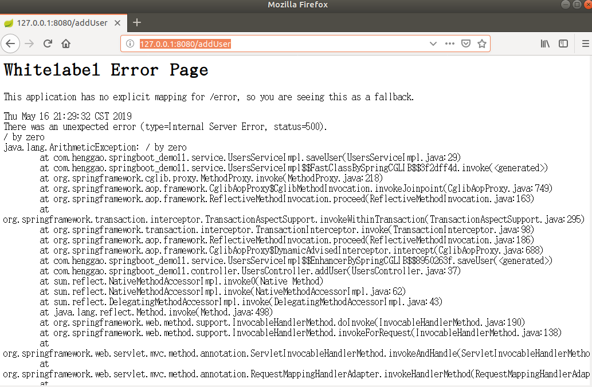
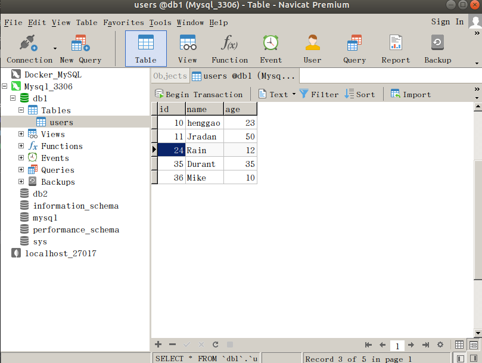
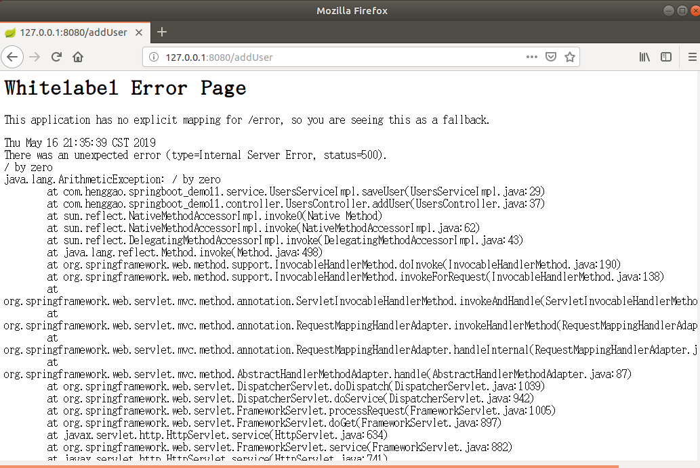
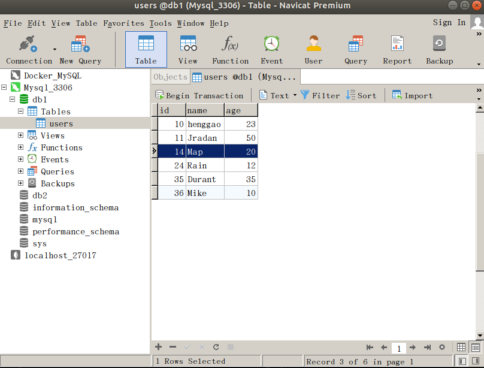
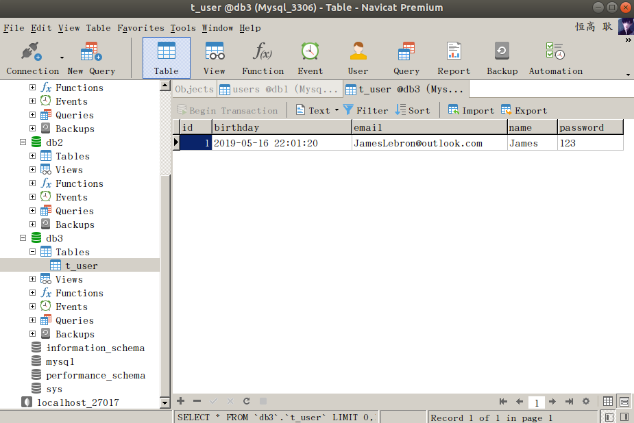
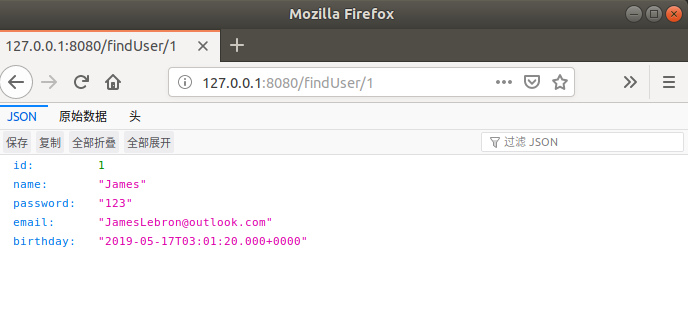
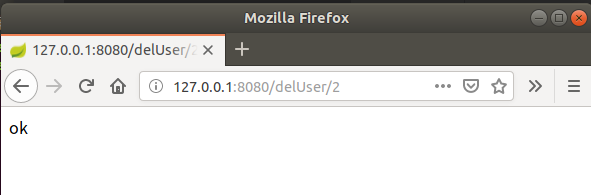

## Demo19：SpringBoot的事务管理

​	SpringBoot中推荐使用@Transactional注解来声明事务。

​	当我们使用spring-boot-starter-jdbc或spring-boot-starter-data-jpa依赖的时候，SpringBoot会自动默认分别注入DataSourceTransactionManager或JpaTransactionManager。

1）、在Demo17的基础上测试，在UsersServiceImpl.java文件中添加@Transactional

```java
package com.henggao.springboot_demo11.service;

import com.henggao.springboot_demo11.mapper.UsersMapper;
import com.henggao.springboot_demo11.pojo.Users;

import org.springframework.beans.factory.annotation.Autowired;
import org.springframework.stereotype.Service;
import org.springframework.transaction.annotation.Transactional;

/**
 * UserServiceImpl
 */
@Service
public class UsersServiceImpl implements UsersService {

    @Autowired
    private UsersMapper UsersMapper;

    @Override
    public Users findUser(String name) {
        return UsersMapper.findUserByName(name);
    }

    @Transactional     //后添加注解部分
    @Override
    public void saveUser(Users user) {
        UsersMapper.addUser(user.getName(), user.getAge(), user.getId());

        int a = 6 / 0;  //添加异常

    }

}
```

2）、UserController.java文件

```java
package com.henggao.springboot_demo11.controller;

import com.henggao.springboot_demo11.pojo.Users;
import com.henggao.springboot_demo11.service.UsersService;

import org.springframework.beans.factory.annotation.Autowired;
// import org.springframework.stereotype.Controller;
import org.springframework.web.bind.annotation.RequestMapping;
// import org.springframework.web.bind.annotation.ResponseBody;
import org.springframework.web.bind.annotation.RestController;

/**
 * UsersController
 */
// @Controller
@RestController
public class UsersController {

    @Autowired
    private UsersService usersService;

    @RequestMapping("/findUser")
    // @ResponseBody
    public Users findUser(String name) {
        
        return usersService.findUser(name);
    }

    @RequestMapping("/addUser")
    // @ResponseBody
    public String addUser(){

        Users user = new Users();
        user.setId(14);
        user.setAge(20);
        user.setName("Map");
        usersService.saveUser(user);
        return "ok";
    }
    
}
```

3）、浏览器查看http://127.0.0.1:8080/addUser



3）、刷新数据库db1中users表



4）、不使用@Transactional注解，UsersServiceImpl.java文件。

```java
package com.henggao.springboot_demo11.service;

import com.henggao.springboot_demo11.mapper.UsersMapper;
import com.henggao.springboot_demo11.pojo.Users;

import org.springframework.beans.factory.annotation.Autowired;
import org.springframework.stereotype.Service;
import org.springframework.transaction.annotation.Transactional;

/**
 * UserServiceImpl
 */
@Service
public class UsersServiceImpl implements UsersService {

    @Autowired
    private UsersMapper UsersMapper;

    @Override
    public Users findUser(String name) {
        return UsersMapper.findUserByName(name);
    }

    // @Transactional
    @Override
    public void saveUser(Users user) {
        UsersMapper.addUser(user.getName(), user.getAge(), user.getId());

        int a = 6 / 0;

    }

}
```

5）、运行Debug，浏览器输入http://127.0.0.1:8080/addUser



6）、刷新数据库db1中users表，查看




## Demo20:SpringBoot整合JPA

1）、编写User.java

```java
package com.henggao.pojo;

import java.util.Date;

import javax.persistence.Column;
import javax.persistence.Entity;
import javax.persistence.GeneratedValue;
import javax.persistence.GenerationType;
import javax.persistence.Id;
import javax.persistence.Table;

import lombok.Data;

/**
 * User
 */
@Data
@Entity
@Table(name="t_user")
public class User {

    @Id
    @GeneratedValue(strategy = GenerationType.IDENTITY)
    private Integer id;
    
    @Column
    private String name;
    private String password;
    private String email;
    private Date birthday;

}
```

2）、编写UserDao.java

```java
package com.henggao.dao;

import com.henggao.pojo.User;

import org.springframework.data.jpa.repository.JpaRepository;

/**
 * UserDao
 */
public interface UserDao extends JpaRepository<User,Integer>{

    
}
```

3）、编写UserService.java

```java
package com.henggao.service;

import com.henggao.pojo.User;

/**
 * UserService
 */
public interface UserService {

    void addUser(User user);
}
```

4）、编写UserServiceImpl.java

```java
package com.henggao.service;

import com.henggao.dao.UserDao;
import com.henggao.pojo.User;

import org.springframework.beans.factory.annotation.Autowired;
import org.springframework.stereotype.Service;

/**
 * UserServiceImpl
 */
@Service
public class UserServiceImpl implements UserService {

    @Autowired
    private UserDao userDao;

    @Override
    public void addUser(User user) {
        userDao.save(user);

    }

}
```

5）、编写UserController.java

```java
package com.henggao.controller;

import java.util.Date;

import com.henggao.pojo.User;
import com.henggao.service.UserService;

import org.springframework.beans.factory.annotation.Autowired;
import org.springframework.stereotype.Controller;
import org.springframework.web.bind.annotation.RequestMapping;
import org.springframework.web.bind.annotation.ResponseBody;

/**
 * UserController
 */
@Controller
public class UserController {

    @Autowired
    private UserService userService;

    @RequestMapping("/saveUser")
    @ResponseBody
    public String saveUser() {

        User user = new User();
        user.setName("James");
        user.setPassword("123");
        user.setEmail("JamesLebron@outlook.com");
        user.setBirthday(new Date());

        userService.addUser(user);
        return "success";

    }

}
```

6）、编写DemoApplication.java

```java
package com.henggao.springboot_demo13;

import org.springframework.boot.SpringApplication;
import org.springframework.boot.autoconfigure.SpringBootApplication;
import org.springframework.boot.autoconfigure.domain.EntityScan;
import org.springframework.data.jpa.repository.config.EnableJpaRepositories;

@SpringBootApplication(scanBasePackages = "com.henggao")
@EntityScan("com.henggao.pojo") //扫描实体类
@EnableJpaRepositories("com.henggao.dao") //扫描dao
public class DemoApplication {

	public static void main(String[] args) {
		SpringApplication.run(DemoApplication.class, args);
	}

}

```

7）、applicati.propert配置信息

```java
#db3数据源配置
spring.datasource.url=jdbc:mysql://127.0.0.1:3306/db3
spring.datasource.driverClassName=com.mysql.cj.jdbc.Driver
spring.datasource.username= henggao
spring.datasource.password= abc123

#让控制器输出Json格式
spring.jackson.serialization.indent-output=true
spring.jpa.hibernate.ddl-auto=update
spring.jpa.show-sql=true
# Allows Hibernate to generate SQL optimized for a particular DBMS
spring.jpa.properties.hibernate.dialect = org.hibernate.dialect.MySQL5Dialect
```

8）、pom.xml配置信息

```xml
<?xml version="1.0" encoding="UTF-8"?>
<project xmlns="http://maven.apache.org/POM/4.0.0" xmlns:xsi="http://www.w3.org/2001/XMLSchema-instance"
	xsi:schemaLocation="http://maven.apache.org/POM/4.0.0 http://maven.apache.org/xsd/maven-4.0.0.xsd">
	<modelVersion>4.0.0</modelVersion>
	<parent>
		<groupId>org.springframework.boot</groupId>
		<artifactId>spring-boot-starter-parent</artifactId>
		<version>2.1.5.RELEASE</version>
		<relativePath/> <!-- lookup parent from repository -->
	</parent>
	<groupId>com.henggao</groupId>
	<artifactId>springboot_demo13</artifactId>
	<version>0.0.1-SNAPSHOT</version>
	<name>demo</name>
	<description>Demo project for Spring Boot</description>

	<properties>
		<java.version>1.8</java.version>
	</properties>

	<dependencies>
		<dependency>
			<groupId>org.springframework.boot</groupId>
			<artifactId>spring-boot-starter-data-jpa</artifactId>
		</dependency>
		<dependency>
			<groupId>org.springframework.boot</groupId>
			<artifactId>spring-boot-starter-web</artifactId>
		</dependency>

		<dependency>
			<groupId>org.springframework.boot</groupId>
			<artifactId>spring-boot-devtools</artifactId>
			<scope>runtime</scope>
		</dependency>
		<dependency>
			<groupId>mysql</groupId>
			<artifactId>mysql-connector-java</artifactId>
			<scope>runtime</scope>
		</dependency>
		<dependency>
			<groupId>org.projectlombok</groupId>
			<artifactId>lombok</artifactId>
			<optional>true</optional>
		</dependency>
		<dependency>
			<groupId>org.springframework.boot</groupId>
			<artifactId>spring-boot-starter-test</artifactId>
			<scope>test</scope>
		</dependency>
	</dependencies>

	<build>
		<plugins>
			<plugin>
				<groupId>org.springframework.boot</groupId>
				<artifactId>spring-boot-maven-plugin</artifactId>
			</plugin>
		</plugins>
	</build>

</project>

```

9）、运行Debug，浏览器输入http://localhost:8080/saveUser


10）、数据库db3，刷新查看。




11）、添加查询、删除功能。（修改以下几个部分即可）

A、编写UserService.java

```java
package com.henggao.service;

import java.util.Optional;

import com.henggao.pojo.User;

/**
 * UserService
 */
public interface UserService {

    void addUser(User user);

    Optional<User> findUser(Integer id);

    void delUser(Integer id);
}
```

B、编写UserServiceImpl.java

```java
package com.henggao.service;

import java.util.Optional;

import com.henggao.dao.UserDao;
import com.henggao.pojo.User;

import org.springframework.beans.factory.annotation.Autowired;
import org.springframework.stereotype.Service;

/**
 * UserServiceImpl
 */
@Service
public class UserServiceImpl implements UserService {

    @Autowired
    private UserDao userDao;

    @Override
    public void addUser(User user) {
        userDao.save(user);

    }

    public Optional<User> findUser(Integer id) {
        return userDao.findById(id);
    }

    @Override
    public void delUser(Integer id) {
        userDao.deleteById(id);
    }

}
```

C、编写UserController.java

```java
package com.henggao.controller;

import java.util.Date;
import java.util.Optional;

import com.henggao.pojo.User;
import com.henggao.service.UserService;

import org.springframework.beans.factory.annotation.Autowired;
import org.springframework.stereotype.Controller;
import org.springframework.web.bind.annotation.PathVariable;
import org.springframework.web.bind.annotation.RequestMapping;
import org.springframework.web.bind.annotation.ResponseBody;

/**
 * UserController
 */
@Controller
public class UserController {

    @Autowired
    private UserService userService;

    @RequestMapping("/saveUser")
    @ResponseBody
    public String saveUser() {

        User user = new User();
        user.setName("James");
        user.setPassword("123");
        user.setEmail("JamesLebron@outlook.com");
        user.setBirthday(new Date());

        userService.addUser(user);
        return "success";

    }

    @RequestMapping("/findUser/{id}")
    @ResponseBody
    public Optional<User> findUser(@PathVariable Integer id) {
        return userService.findUser(id);
    }

    @RequestMapping("/delUser/{id}")
    @ResponseBody
    public String delUser(@PathVariable Integer id) {
        userService.delUser(id);
        return "ok";
    }

}
```

D、浏览器查看http://127.0.0.1:8080/findUser/1

​	查询功能



删除功能



problem

如果查询使用findOne与findByI需要考虑空值问题。[参考](https://github.com/spring-guides/tut-rest/issues/53)

