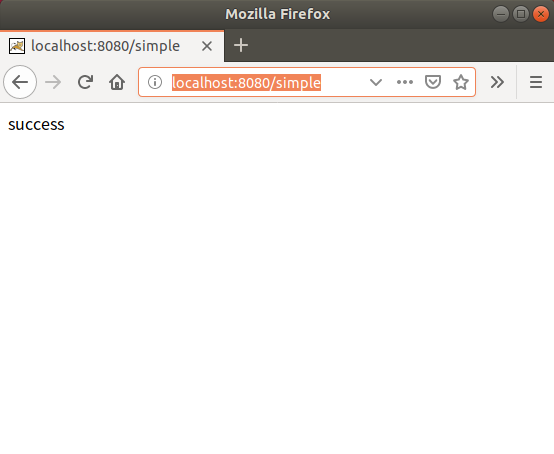
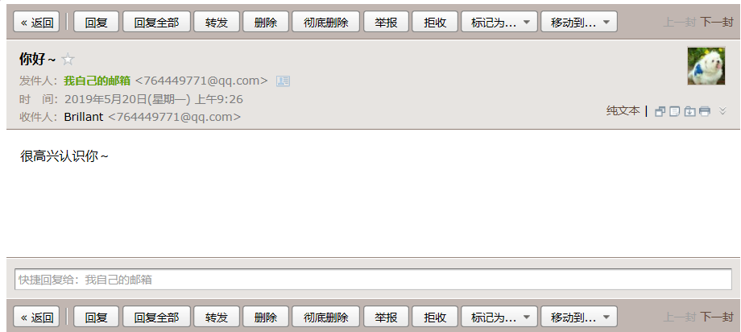
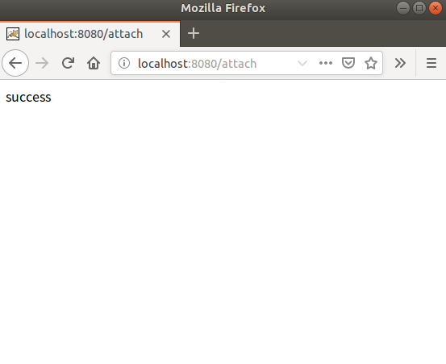
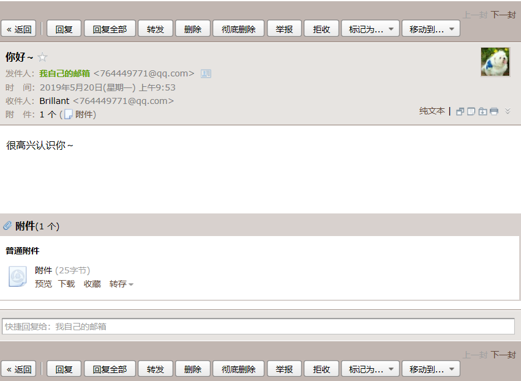
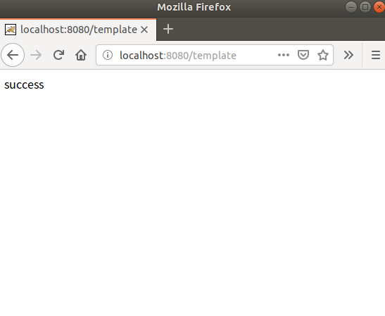
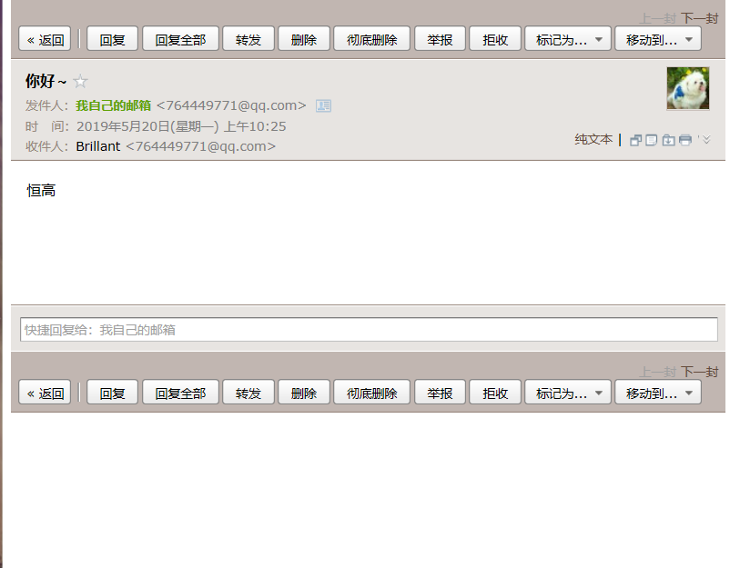

## Demo21：SpringBoot整合Mail

### 一、邮箱发送简单的纯文本

1）、配置application.propert文件

```properties
#JavaMailSender 邮箱发送的配置
spring.mail.host=smtp.qq.com
spring.mail.username=764449771@qq.com
spring.mail.password=ipukqleaxkiabbij
spring.mail.properties.mail.smtp.auth=true
spring.mail.properties.mail.smtp.starttls.enable=true
spring.mail.properties.mail.smtp.starttls.required=true
```

2）、编写EmailConfig.java

```java
package com.henggao.email;

import org.springframework.beans.factory.annotation.Value;
import org.springframework.stereotype.Component;

import lombok.Data;

/**
 * EmailConfig
 */
@Data
@Component
public class EmailConfig {

    @Value("${spring.mail.username}")
    private String emailFrom;
}
```

3）、编写EmailService.java

```java
package com.henggao.email;

/**
 * EmailService
 */
public interface EmailService {

    //发送简单的邮件
    void sendSimpleMail(String sendTo, String title, String content);
}
```

4）、编写EmailServiceImpl.java

```java
package com.henggao.email;

import org.springframework.beans.factory.annotation.Autowired;
import org.springframework.mail.SimpleMailMessage;
import org.springframework.mail.javamail.JavaMailSender;
import org.springframework.stereotype.Service;

/**
 * EmailServiceImpl
 */
@Service
public class EmailServiceImpl implements EmailService{

    @Autowired
    private EmailConfig emailConfig;
    
    @Autowired
    private JavaMailSender mailSender;

    @Override
    public void sendSimpleMail(String sendTo, String title, String content) {
        //简单邮件发送
        SimpleMailMessage message = new SimpleMailMessage();
        message.setFrom(emailConfig.getEmailFrom());
        message.setTo(sendTo);
        message.setSubject(title);
        message.setText(content);

        mailSender.send(message);
    }
}
```

5）、编写EmailController.java

```java
package com.henggao.email;

import org.springframework.beans.factory.annotation.Autowired;
import org.springframework.stereotype.Controller;
import org.springframework.web.bind.annotation.RequestMapping;
import org.springframework.web.bind.annotation.ResponseBody;

/**
 * EmailController
 */
@Controller
public class EmailController {

    @Autowired
    private EmailService emailService;

    @RequestMapping("/simple")
    @ResponseBody
    public String sendSimpleEmail(){
        emailService.sendSimpleMail("764449771@qq.com", "你好～", "很高兴认识你～");
        return "success";
    }

}
```

6）、编写启动类DemoApplication.java

```java
package com.henggao.springboot_demo14;

import org.springframework.boot.SpringApplication;
import org.springframework.boot.autoconfigure.SpringBootApplication;

@SpringBootApplication(scanBasePackages = "com.henggao")
public class DemoApplication {

	public static void main(String[] args) {
		SpringApplication.run(DemoApplication.class, args);
	}

}

```

7）、pom.xml配置如下。必须有的是Mail

```xml
<?xml version="1.0" encoding="UTF-8"?>
<project xmlns="http://maven.apache.org/POM/4.0.0" xmlns:xsi="http://www.w3.org/2001/XMLSchema-instance"
	xsi:schemaLocation="http://maven.apache.org/POM/4.0.0 http://maven.apache.org/xsd/maven-4.0.0.xsd">
	<modelVersion>4.0.0</modelVersion>
	<parent>
		<groupId>org.springframework.boot</groupId>
		<artifactId>spring-boot-starter-parent</artifactId>
		<version>2.1.5.RELEASE</version>
		<relativePath/> <!-- lookup parent from repository -->
	</parent>
	<groupId>com.henggao</groupId>
	<artifactId>springboot_demo14</artifactId>
	<version>0.0.1-SNAPSHOT</version>
	<name>demo</name>
	<description>Demo project for Spring Boot</description>

	<properties>
		<java.version>1.8</java.version>
	</properties>

	<dependencies>
		<dependency>
			<groupId>org.springframework.boot</groupId>
			<artifactId>spring-boot-starter-mail</artifactId>
		</dependency>
		<dependency>
			<groupId>org.springframework.boot</groupId>
			<artifactId>spring-boot-starter-thymeleaf</artifactId>
		</dependency>
		<dependency>
			<groupId>org.springframework.boot</groupId>
			<artifactId>spring-boot-starter-web</artifactId>
		</dependency>

		<dependency>
			<groupId>org.springframework.boot</groupId>
			<artifactId>spring-boot-devtools</artifactId>
			<scope>runtime</scope>
		</dependency>
		<dependency>
			<groupId>org.projectlombok</groupId>
			<artifactId>lombok</artifactId>
			<optional>true</optional>
		</dependency>
		<dependency>
			<groupId>org.springframework.boot</groupId>
			<artifactId>spring-boot-starter-test</artifactId>
			<scope>test</scope>
		</dependency>
	</dependencies>

	<build>
		<plugins>
			<plugin>
				<groupId>org.springframework.boot</groupId>
				<artifactId>spring-boot-maven-plugin</artifactId>
			</plugin>
		</plugins>
	</build>

</project>

```

8）、启动Debug，浏览器查看http://localhost:8080/simple



邮箱查看



### 二、邮箱发送带附件

1）、在EmailService.java编写如下内容

```java
package com.henggao.email;

import java.io.File;

/**
 * EmailService
 */
public interface EmailService {

    //发送简单的邮件
    void sendSimpleMail(String sendTo, String title, String content);

    //发送带附件的邮件
    void SendAttachmentMail(String sendTo, String title, String content,File file);
}
```

2）、在EmailServiceImpl.java编写如下内容

```java
package com.henggao.email;

import java.io.File;

import javax.mail.internet.MimeMessage;

import org.springframework.beans.factory.annotation.Autowired;
import org.springframework.core.io.FileSystemResource;
import org.springframework.mail.SimpleMailMessage;
import org.springframework.mail.javamail.JavaMailSender;
import org.springframework.mail.javamail.MimeMessageHelper;
import org.springframework.stereotype.Service;

/**
 * EmailServiceImpl
 */
@Service
public class EmailServiceImpl implements EmailService{

    @Autowired
    private EmailConfig emailConfig;
    
    @Autowired
    private JavaMailSender mailSender;

    @Override
    public void sendSimpleMail(String sendTo, String title, String content) {
        //简单邮件发送
        SimpleMailMessage message = new SimpleMailMessage();
        message.setFrom(emailConfig.getEmailFrom());
        message.setTo(sendTo);
        message.setSubject(title);
        message.setText(content);

        mailSender.send(message);
    }

    @Override
    public void SendAttachmentMail(String sendTo, String title, String content, File file) {
        
        MimeMessage msg = mailSender.createMimeMessage();

        try {
            MimeMessageHelper helper = new MimeMessageHelper(msg, true);
            helper.setFrom(emailConfig.getEmailFrom());
            helper.setTo(sendTo);
            helper.setSubject(title);
            helper.setText(content);

            FileSystemResource r = new FileSystemResource(file);
            helper.addAttachment("附件", r);
        } catch (Exception e) {
            e.printStackTrace();
        }

        mailSender.send(msg);
    }
}
```

3）、在EmailController.java编写如下内容

```java
package com.henggao.email;

import java.io.File;

import org.springframework.beans.factory.annotation.Autowired;
import org.springframework.stereotype.Controller;
import org.springframework.web.bind.annotation.RequestMapping;
import org.springframework.web.bind.annotation.ResponseBody;

/**
 * EmailController
 */
@Controller
public class EmailController {

    @Autowired
    private EmailService emailService;

    @RequestMapping("/simple")
    @ResponseBody
    public String sendSimpleEmail() {
        emailService.sendSimpleMail("764449771@qq.com", "你好～", "很高兴认识你～");
        return "success";
    }

    @RequestMapping("/attach")
    @ResponseBody
    public String sendAttacnmentEmail() {

        File file = new File("src/main/resources/static/helloworld.txt");
        emailService.SendAttachmentMail("764449771@qq.com", "你好～", "很高兴认识你～", file);
        return "success";
    }
}
```

4）、启动Debug。浏览器查看http://localhost:8080/attach



5）、邮箱查看




### 三、发送模板邮箱

1）、在EmailService.java编写如下内容

```java
package com.henggao.email;

import java.io.File;

/**
 * EmailService
 */
public interface EmailService {

    //发送简单的邮件
    void sendSimpleMail(String sendTo, String title, String content);

    //发送带附件的邮件
    void SendAttachmentMail(String sendTo, String title, String content,File file);

    //发送模板邮件
    void sendTemplateMail(String sendTo, String title, String info);
}
```

2）、在EmailServiceImpl.java编写如下内容

```java
package com.henggao.email;

import java.io.File;
import java.util.HashMap;
import java.util.Map;

import javax.mail.internet.MimeMessage;

import org.springframework.beans.factory.annotation.Autowired;
import org.springframework.core.io.FileSystemResource;
import org.springframework.mail.SimpleMailMessage;
import org.springframework.mail.javamail.JavaMailSender;
import org.springframework.mail.javamail.MimeMessageHelper;
import org.springframework.stereotype.Service;
import org.springframework.ui.freemarker.FreeMarkerTemplateUtils;
import org.springframework.web.servlet.view.freemarker.FreeMarkerConfigurer;

import freemarker.template.Template;

/**
 * EmailServiceImpl
 */
@Service
public class EmailServiceImpl implements EmailService {

    @Autowired
    private EmailConfig emailConfig;

    @Autowired
    private JavaMailSender mailSender;

    @Autowired
    private FreeMarkerConfigurer freemarkerConfig;

    // 简单邮件发送
    @Override
    public void sendSimpleMail(String sendTo, String title, String content) {

        SimpleMailMessage message = new SimpleMailMessage();
        message.setFrom(emailConfig.getEmailFrom());
        message.setTo(sendTo);
        message.setSubject(title);
        message.setText(content);

        mailSender.send(message);
    }

    // 发送带附件的邮箱
    @Override
    public void SendAttachmentMail(String sendTo, String title, String content, File file) {

        MimeMessage msg = mailSender.createMimeMessage();

        try {
            MimeMessageHelper helper = new MimeMessageHelper(msg, true);
            helper.setFrom(emailConfig.getEmailFrom());
            helper.setTo(sendTo);
            helper.setSubject(title);
            helper.setText(content);

            FileSystemResource r = new FileSystemResource(file);
            helper.addAttachment("附件", r);
        } catch (Exception e) {
            e.printStackTrace();
        }

        mailSender.send(msg);
    }

    // 发送模板邮件
    @Override
    public void sendTemplateMail(String sendTo, String title, String info) {
        MimeMessage msg = mailSender.createMimeMessage();
        try {
            MimeMessageHelper helper = new MimeMessageHelper(msg, true);
            helper.setFrom(emailConfig.getEmailFrom());
            helper.setTo(sendTo);
            helper.setSubject(title);

            // 封装模板使用的数据
            Map<String, Object> model = new HashMap<>();
            model.put("username", "恒高");

            // 得到模板
            Template template = freemarkerConfig.getConfiguration().getTemplate(info);
            String html = FreeMarkerTemplateUtils.processTemplateIntoString(template, model);

            helper.setText(html, true);
        } catch (Exception e) {
            e.printStackTrace();
        }
        mailSender.send(msg);
    }
}
```

3）、在EmailController.java编写如下内容

```java
package com.henggao.email;

import java.io.File;

import org.springframework.beans.factory.annotation.Autowired;
import org.springframework.stereotype.Controller;
import org.springframework.web.bind.annotation.RequestMapping;
import org.springframework.web.bind.annotation.ResponseBody;

/**
 * EmailController
 */
@Controller
public class EmailController {

    @Autowired
    private EmailService emailService;

    @RequestMapping("/simple")
    @ResponseBody
    public String sendSimpleEmail() {
        emailService.sendSimpleMail("764449771@qq.com", "你好～", "很高兴认识你～");
        return "success";
    }

    @RequestMapping("/attach")
    @ResponseBody
    public String sendAttacnmentEmail() {

        File file = new File("src/main/resources/static/helloworld.txt");
        emailService.SendAttachmentMail("764449771@qq.com", "你好～", "很高兴认识你～", file);
        return "success";
    }

    @RequestMapping("/template")
    @ResponseBody
    public String sendTemplateMail(){
        emailService.sendTemplateMail("764449771@qq.com", "你好～","info.html");
        return "success";
    }
}
```

4）、pom.xml中需要添加freemarker配置

```xml
<?xml version="1.0" encoding="UTF-8"?>
<project xmlns="http://maven.apache.org/POM/4.0.0" xmlns:xsi="http://www.w3.org/2001/XMLSchema-instance"
	xsi:schemaLocation="http://maven.apache.org/POM/4.0.0 http://maven.apache.org/xsd/maven-4.0.0.xsd">
	<modelVersion>4.0.0</modelVersion>
	<parent>
		<groupId>org.springframework.boot</groupId>
		<artifactId>spring-boot-starter-parent</artifactId>
		<version>2.1.5.RELEASE</version>
		<relativePath/> <!-- lookup parent from repository -->
	</parent>
	<groupId>com.henggao</groupId>
	<artifactId>springboot_demo14</artifactId>
	<version>0.0.1-SNAPSHOT</version>
	<name>demo</name>
	<description>Demo project for Spring Boot</description>

	<properties>
		<java.version>1.8</java.version>
	</properties>

	<dependencies>
			<dependency>
			<groupId>org.springframework.boot</groupId>
			<artifactId>spring-boot-starter-mail</artifactId>
		</dependency>
		<dependency>
			<groupId>org.springframework.boot</groupId>
			<artifactId>spring-boot-starter-freemarker</artifactId>
		</dependency>
		<dependency>
			<groupId>org.springframework.boot</groupId>
			<artifactId>spring-boot-starter-thymeleaf</artifactId>
		</dependency>
		<dependency>
			<groupId>org.springframework.boot</groupId>
			<artifactId>spring-boot-starter-web</artifactId>
		</dependency>

		<dependency>
			<groupId>org.springframework.boot</groupId>
			<artifactId>spring-boot-devtools</artifactId>
			<scope>runtime</scope>
		</dependency>
		<dependency>
			<groupId>org.projectlombok</groupId>
			<artifactId>lombok</artifactId>
			<optional>true</optional>
		</dependency>
		<dependency>
			<groupId>org.springframework.boot</groupId>
			<artifactId>spring-boot-starter-test</artifactId>
			<scope>test</scope>
		</dependency>
	</dependencies>

	<build>
		<plugins>
			<plugin>
				<groupId>org.springframework.boot</groupId>
				<artifactId>spring-boot-maven-plugin</artifactId>
			</plugin>
		</plugins>
	</build>

</project>

```

5）、启动Debug，查看浏览器http://localhost:8080/template



6）、邮箱查看



