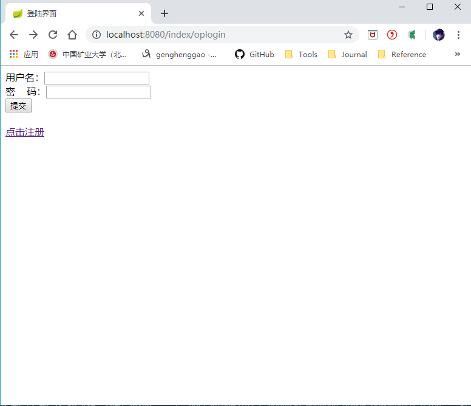

# springboot 整合 MongoDB 实现登录注册，html 页面获取后台参数的方法

1）、目录结构如下


2）、配置pom.xml

```xml
<?xml version="1.0" encoding="UTF-8" ?>
<project xmlns="http://maven.apache.org/POM/4.0.0" xmlns:xsi="http://www.w3.org/2001/XMLSchema-instance"
	xsi:schemaLocation="http://maven.apache.org/POM/4.0.0 http://maven.apache.org/xsd/maven-4.0.0.xsd">
	<modelVersion>4.0.0</modelVersion>
	<parent>
		<groupId>org.springframework.boot</groupId>
		<artifactId>spring-boot-starter-parent</artifactId>
		<version>2.1.5.RELEASE</version>
		<relativePath /> <!-- lookup parent from repository -->
	</parent>
	<groupId>com.henggao</groupId>
	<artifactId>mongodb_demo4</artifactId>
	<version>0.0.1-SNAPSHOT</version>
	<name>demo</name>
	<description>Demo project for Spring Boot</description>

	<properties>
		<java.version>1.8</java.version>
	</properties>

	<dependencies>
		<dependency>
			<groupId>org.springframework.boot</groupId>
			<artifactId>spring-boot-starter-data-mongodb</artifactId>
		</dependency>
		<dependency>
			<groupId>org.springframework.boot</groupId>
			<artifactId>spring-boot-starter-thymeleaf</artifactId>
		</dependency>
		<dependency>
			<groupId>org.springframework.boot</groupId>
			<artifactId>spring-boot-starter-web</artifactId>
		</dependency>

		<!--启用不严格检查html-->
		<dependency>
			<groupId>net.sourceforge.nekohtml</groupId>
			<artifactId>nekohtml</artifactId>
			<version>1.9.22</version>
		</dependency>


		<dependency>
			<groupId>org.springframework.boot</groupId>
			<artifactId>spring-boot-devtools</artifactId>
			<scope>runtime</scope>
			<optional>true</optional>
		</dependency>
		<dependency>
			<groupId>org.projectlombok</groupId>
			<artifactId>lombok</artifactId>
			<optional>true</optional>
		</dependency>
		<dependency>
			<groupId>org.springframework.boot</groupId>
			<artifactId>spring-boot-starter-test</artifactId>
			<scope>test</scope>
		</dependency>
	</dependencies>

	<build>
		<plugins>
			<plugin>
				<groupId>org.springframework.boot</groupId>
				<artifactId>spring-boot-maven-plugin</artifactId>
			</plugin>
		</plugins>
	</build>

</project>
```

3）、配置application.properties

```properties
# MongoDB 默认是无密码，这里配置一下要操作的数据库名称就行
#spring.data.mongodb.authentication-database= # Authentication database name.
# 选择数据库名称
# spring.data.mongodb.database=test
#对html检查不那么严格
spring.thymeleaf.mode = LEGACYHTML5
#spring.data.mongodb.field-naming-strategy= # Fully qualified name of the FieldNamingStrategy to use.
#spring.data.mongodb.grid-fs-database= # GridFS database name.
#spring.data.mongodb.host=localhost # Mongo server host.
#spring.data.mongodb.password= # Login password of the mongo server.
#spring.data.mongodb.port=27017 # Mongo server port.
#spring.data.mongodb.repositories.enabled=true # Enable Mongo repositories.
#spring.data.mongodb.uri=mongodb://localhost/test # Mongo database URI. When set, host and port are ignored.
#spring.data.mongodb.username= # Login user of the mongo server.

spring.data.mongodb.uri=mongodb://169.254.28.208:27017/test
```

4）、实体类：User.java

```java
package com.henggao.entity;

import org.springframework.data.annotation.Id;

import lombok.Data;

/**
 * User
 */
@Data
public class User {

    @Id
    private String id;
    private String username;
    private String password;

    public User () {
        
    }
    public User (String username,String password) {
        this.username = username;
        this.password = password;
    }

}
```

5）、数据库操作的接口：UserRepository.java

```java
package com.henggao.repository;

import com.henggao.entity.User;

import org.springframework.data.mongodb.repository.MongoRepository;

/**
 * UserRespository
 */
public interface UserRepository extends MongoRepository<User, String> {

	public User findByUsername(String username);
    
}
```

6）、控制层：UserController.java

```java
package com.henggao.controller;

import java.util.List;

import javax.servlet.http.HttpServletRequest;

import com.henggao.entity.User;
import com.henggao.repository.UserRepository;

import org.springframework.beans.factory.annotation.Autowired;
import org.springframework.data.mongodb.core.MongoTemplate;
import org.springframework.stereotype.Controller;
import org.springframework.ui.Model;
import org.springframework.web.bind.annotation.RequestMapping;
import org.springframework.web.bind.annotation.ResponseBody;

/**
 * UserController
 */
// 使用@Controller 才可以返回html页面，使用@ResController 返回的是字符串
@Controller
@RequestMapping(value="/index")
public class UserController {

    @Autowired
    private UserRepository userRepository;

    @Autowired
    private MongoTemplate mongoTemplate;

    /**
     * 首页
     * 
     * @param request
     * @return
     */

    @RequestMapping(value = "/index")
    public String index(Model model, HttpServletRequest request) {

        User user = (User) request.getAttribute("user");

        if (user == null) {
            System.out.println(user);
            User usero = new User("##errors##", "1234");
            model.addAttribute("user", usero);
        }

        return "index";
    }

    /**
     * 打开登陆界面
     * 
     * @return
     */
    @RequestMapping(value = "/oplogin")
    public String oplogin() {

        return "login";
    }

    /**
     * 登录
     * 
     * @param model
     * @return
     */
    @RequestMapping(value = "/login")
    public String login(HttpServletRequest request) {
        // 获取用户及密码
        String username = request.getParameter("username");
        String password = request.getParameter("password");

        // 根据用户名查询，用户是否存在
        User user = userRepository.findByUsername(username);

        // 如果存在
        if (user != null) {

            if (password.equals(user.getPassword())) {
                // 如果密码正确
                // 将用户信息放入到会话中...
                request.setAttribute("user", user);

                return "index";

            } else {
                // 如果密码错误
                System.out.println("密码错误");
                return "ferror";
            }
        } else {
            // 如果不存在，代码邮箱和密码输入有误
            System.out.println("用户不存在");
            return "ferror";
        }
    }

    /**
     * 打开注册界面
     * 
     * @return
     */
    @RequestMapping("/resgi")
    private String resgi() {
        return "resgi";
    }

    /**
     * 注册控制层
     * 
     * @param request
     * @return
     */
    @RequestMapping(value = "/rege")
    public String resig(HttpServletRequest request) {
        // 获取用户和密码
        String username = request.getParameter("username");
        String password = request.getParameter("password");

        // 根据昵称查询，用户是否存在
        User user = userRepository.findByUsername(username);

        // 若存在
        if (user != null) {
            // 昵称重复
            return "ferror";
        }

        // 若不存在
        User newUser = new User(username, password);
        // 注册
        userRepository.save(newUser);

        // 将信息设置session作用域
        request.setAttribute("user", newUser);

        return "index";
    }

    @ResponseBody
    @RequestMapping("/findByName")
    public User findByName() {

        return userRepository.findByUsername("krryxq");
    }

    @ResponseBody
    @RequestMapping("/find")
    public List<User> find() {

        return mongoTemplate.findAll(User.class);
    }

}
```

7）、启动类：DemoApplication.java

```java
package com.henggao.mongodb_demo4;

import org.springframework.boot.SpringApplication;
import org.springframework.boot.autoconfigure.SpringBootApplication;
import org.springframework.boot.autoconfigure.domain.EntityScan;
import org.springframework.data.mongodb.repository.config.EnableMongoRepositories;

@SpringBootApplication(scanBasePackages = "com.henggao")
@EntityScan("com.henggao.entity")
@EnableMongoRepositories("com.henggao.repository")
public class DemoApplication {

	public static void main(String[] args) {
		SpringApplication.run(DemoApplication.class, args);
	}

}

```

8）、首页:index.html

```html
<!DOCTYPE html>
<html xmlns:th="http://www.thymeleaf.org">
<head>
    <meta charset="UTF-8">
    <meta name="viewport" content="width=device-width, initial-scale=1.0">
    <meta http-equiv="X-UA-Compatible" content="ie=edge">
    <title>首页</title>
</head>
<body>
    <p class="title">用户名： <span class="username" th:text="${user.username}"></span>已登录</p>
    <a href="/index/logout" id="login"></a>
    
    <script type="text/javascript" th:src="@{/js/jquery-3.4.1.min.js}"></script>
    <script type="text/javascript">
        if ($(".username").text() == "##errors##") {
            $(".title").text("未登录");
            $("#login").attr("href","/index/oplogin");
            $("#login").text("点击登陆");
        }

        /**
         * @param val
         * @return {Boolean}
         */
        function isEmpty(val){
            val = $.trim(val);
            if (val ==null)
                return true;
            if (val == undefined || val == 'undefined')
                return true;
            if (val == "")
                return true;
            if  (val.length == 0)
                return true;
            if (!/[^(^\s*)|(\s*$)]/.test(val))
                return true;
            return false;           
        }
    </script>
</body>
</html>
```

9）、登录界面: login.html

```html
<!DOCTYPE html>
<html lang="en">
<head>
    <meta charset="UTF-8">
    <meta name="viewport" content="width=device-width, initial-scale=1.0">
    <meta http-equiv="X-UA-Compatible" content="ie=edge">
    <title>登陆界面</title>
</head>
<body>
    <form action="/index/login" method="POST">
        用户名：<input type="text" name="username"></input><br/>
        密&nbsp;&nbsp;&nbsp;&nbsp;码：<input type="password" name="password"></input><br>
        <input type="submit"><br/><br>
    </form>
    <a href="/index/resgi">点击注册</a>
</body>
</html>
```

10）、注册界面： resgi.html

```java
<!DOCTYPE html>
<html lang="en">
<head>
    <meta charset="UTF-8">
    <meta name="viewport" content="width=device-width, initial-scale=1.0">
    <meta http-equiv="X-UA-Compatible" content="ie=edge">
    <title>注册界面</title>
</head>
<body>
    <form action="/index/rege" method="POST">
        用户名：<input type="text" name="username"><br>
        密&nbsp;码<input type="password" name="password"></input><br>
        <input type="submit">
    </form>
    
</body>
</html>
```

11）、错误界面： ferror.html

```java
<!DOCTYPE html>
<html lang="en">
<head>
    <meta charset="UTF-8">
    <meta name="viewport" content="width=device-width, initial-scale=1.0">
    <meta http-equiv="X-UA-Compatible" content="ie=edge">
    <title>错误</title>
</head>
<body>
    登录时：用户名或者密码错误<br>或<br>注册时：用户名已存在
    <a href="/index/oplogin"返回登录></a>
</body>
</html>
```

**注意点：**

这里说一下，如果错误界面命名为 error.html 的话，那么 springboot 报错时跳转的页面就是默认跳转到你定义的 error.html 页面。


12）、启动Debug，浏览器输入：<http://localhost:8080/index/oplogin>，查看。



参考：

<https://cloud.tencent.com/developer/article/1333164>