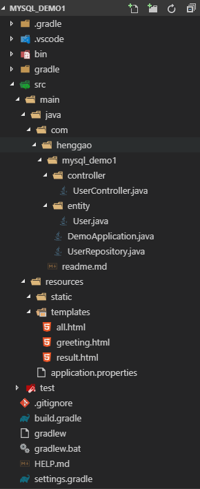
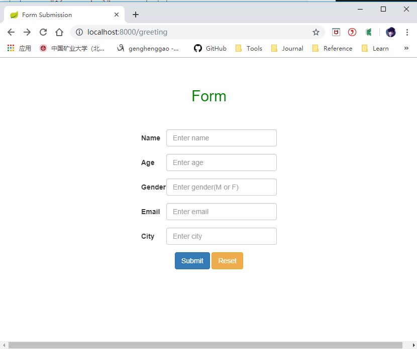

# SpringBoot提交表单并存入MySQL数据库

1）、目录结构，使用grandle构建项目。



2）、配置bulid.gradle

```groovy
plugins {
	id 'org.springframework.boot' version '2.1.5.RELEASE'
	id 'java'
}

apply plugin: 'io.spring.dependency-management'

group = 'com.henggao'
version = '0.0.1-SNAPSHOT'
sourceCompatibility = '1.8'

configurations {
	developmentOnly
	runtimeClasspath {
		extendsFrom developmentOnly
	}
	compileOnly {
		extendsFrom annotationProcessor
	}
}

repositories {
	mavenCentral()
}

dependencies {
	implementation 'org.springframework.boot:spring-boot-starter-data-jpa'
	implementation 'org.springframework.boot:spring-boot-starter-thymeleaf'
	implementation 'org.springframework.boot:spring-boot-starter-web'
	compileOnly 'org.projectlombok:lombok'
	developmentOnly 'org.springframework.boot:spring-boot-devtools'
	runtimeOnly 'mysql:mysql-connector-java'
	annotationProcessor 'org.projectlombok:lombok'
	testImplementation 'org.springframework.boot:spring-boot-starter-test'
	// https://mvnrepository.com/artifact/junit/junit
	testCompile group: 'junit', name: 'junit', version: '4.12'
}
```

3）、实体类：User.java

```java
package com.henggao.mysql_demo1.entity;

import javax.persistence.Entity;
import javax.persistence.GeneratedValue;
import javax.persistence.GenerationType;
import javax.persistence.Id;
import javax.validation.constraints.Email;
import javax.validation.constraints.Max;
import javax.validation.constraints.Min;
import javax.validation.constraints.NotEmpty;
import javax.validation.constraints.NotNull;
import javax.validation.constraints.Pattern;
import javax.validation.constraints.Size;

import lombok.Data;

/**
 * User
 */
@Data
@Entity // This tells Hibernate to make a table out of this class
public class User {

    @Id
    @GeneratedValue(strategy = GenerationType.AUTO)
    private Integer id;

    @NotEmpty
    @Size(min = 2, max = 30)
    private String name;

    @NotNull
    @Min(1)
    @Max(200)
    private Integer age;

    @Pattern(regexp = "[MFmf]")
    private String gender;

    @NotEmpty
    @Email
    private String email;

    @NotEmpty
    private String city;
}
```

4）、数据库操作的接口:UserRepository.java,实现CrudRepositoty接口。

```java
package com.henggao.mysql_demo1;

import com.henggao.mysql_demo1.entity.User;

import org.springframework.data.repository.CrudRepository;

/**
 * UserRepository
 */
public interface UserRepository extends CrudRepository<User,Long>{

    
}
```

5）、控制层：UserController.java

```java
package com.henggao.mysql_demo1.controller;

import javax.validation.Valid;

import com.henggao.mysql_demo1.UserRepository;
import com.henggao.mysql_demo1.entity.User;
import org.springframework.beans.factory.annotation.Autowired;
import org.springframework.stereotype.Controller;
import org.springframework.ui.Model;
import org.springframework.validation.BindingResult;
import org.springframework.web.bind.annotation.GetMapping;
import org.springframework.web.bind.annotation.ModelAttribute;
import org.springframework.web.bind.annotation.PostMapping;

/**
 * UserController
 */
@Controller
public class UserController {
    @Autowired
    private UserRepository userRepository;

    @GetMapping("/greeting")
    public String greetingForm(Model model) {
        model.addAttribute("user", new User());
        return "greeting";
    }

    @PostMapping("/greeting")
    public String greetingSubmit(@Valid @ModelAttribute User user, BindingResult bindingResult) {

        if (bindingResult.hasErrors()) {
            return "greeting";
        } else {
            User newUser = new User();
            newUser.setName(user.getName());
            newUser.setAge(user.getAge());
            newUser.setGender(user.getGender());
            newUser.setEmail(user.getEmail());
            newUser.setCity(user.getCity());
            userRepository.save(user);

            return "result";
        }
    }

    @GetMapping("/all")
    public String getMessage(Model model) {

        Iterable<User> users = userRepository.findAll();

        model.addAttribute("users", users);
        return "all";
    }
}
```

6）、启动类DemoApplication.java

```java
package com.henggao.mysql_demo1;

import org.springframework.boot.SpringApplication;
import org.springframework.boot.autoconfigure.SpringBootApplication;

@SpringBootApplication
public class DemoApplication {

	public static void main(String[] args) {
		SpringApplication.run(DemoApplication.class, args);
	}

}

```

7）、初始网页：greeting.html

```html
<!DOCTYPE HTML>

<html xmlns:th="http://www.thymeleaf.org">

<head>
    <title>Form Submission</title>
    <meta http-equiv="Content-Type" content="text/html; charset=UTF-8" />
    <link href="https://cdn.bootcss.com/bootstrap/3.3.7/css/bootstrap.min.css" rel="stylesheet">
</head>

<body>
    <center>
        <br><br>
        <h2 style="color:green">Form</h2>
        <br><br>

        <form class="form-horizontal" role="form" action="#" th:action="@{/greeting}" th:object="${user}" method="post">

            <div class="form-group" style="width:300px">
                <label for="name" class="col-sm-2 control-label">Name</label>
                <div class="col-sm-10">
                    <input type="text" th:field="*{name}" class="form-control" id="name" placeholder="Enter name">
                </div>

                <label style="color:red" th:if="${#fields.hasErrors('name')}" th:errors="*{name}">Name Error</label>

            </div>

            <div class="form-group" style="width:300px">
                <label for="age" class="col-sm-2 control-label">Age</label>
                <div class="col-sm-10">
                    <input type="text" th:field="*{age}" class="form-control" id="age" placeholder="Enter age">
                </div>
                <label style="color:red" th:if="${#fields.hasErrors('age')}" th:errors="*{age}">Age Error</label>
            </div>

            <div class="form-group" style="width:300px">
                <label for="gender" class="col-sm-2 control-label">Gender</label>
                <div class="col-sm-10">
                    <input type="text" th:field="*{gender}" class="form-control" id="gender"
                        placeholder="Enter gender(M or F)">
                </div>
                <label style="color:red" th:if="${#fields.hasErrors('gender')}" th:errors="*{gender}">Gender Error</label>
            </div>

            <div class="form-group" style="width:300px">
                <label for="email" class="col-sm-2 control-label">Email</label>
                <div class="col-sm-10">
                    <input type="text" th:field="*{email}" class="form-control" id="email" placeholder="Enter email">
                </div>
                <label style="color:red" th:if="${#fields.hasErrors('email')}" th:errors="*{email}">Email Error</label>
            </div>

            <div class="form-group" style="width:300px">
                <label for="city" class="col-sm-2 control-label">City</label>
                <div class="col-sm-10">
                    <input type="text" th:field="*{city}" class="form-control" id="city" placeholder="Enter city">
                </div>
                <label style="color:red" th:if="${#fields.hasErrors('city')}" th:errors="*{city}">City Error</label>
            </div>

            <div class="form-group">
                <div>
                    <button type="submit" class="btn btn-primary" id="btn">Submit</button>
                    <input type="reset" class="btn btn-warning" value="Reset" />
                </div>
            </div>
        </form>

    </center>

</body>

</html>
```

8）、提交表单后跳转后的页面:result.html

```html
<!DOCTYPE HTML>

<html xmlns:th="http://www.thymeleaf.org">

<head>
    <title>Handling Form Submission</title>
    <meta http-equiv="Content-Type" content="text/html; charset=UTF-8" />
    <link href="https://cdn.bootcss.com/bootstrap/3.3.7/css/bootstrap.min.css" rel="stylesheet">
</head>

<body>
    <center>
        <br><br>
        <h2 style="color:green">Result</h2>
        <br><br>

        <ul class="list-group" style="width:300px">
            <li class="list-group-item" th:text="'Name: ' + ${user.name}"></li>
            <li class="list-group-item" th:text="'Age: ' + ${user.age}"></li>
            <li class="list-group-item" th:text="'Gender: ' + ${user.gender}"></li>
            <li class="list-group-item" th:text="'Email: ' + ${user.email}"></li>
            <li class="list-group-item" th:text="'City: ' + ${user.city}"></li>
        </ul>

        <h4>
            <span class="glyphicon glyphicon-saved"></span>
            Insert into MySQL successfully!
        </h4>

        <a href="/greeting"><button type="button" class="btn btn-primary">Return to home</button></a>
        <a href="/all"><button type="button" class="btn btn-warning">See Records</button></a>

</body>

</html>
```

9）、显示user中的所有记录的网页：all.html

```html
<!DOCTYPE html>

<html xmlns:th="http://www.thymeleaf.org">

<head>
    <title>User list</title>
    <meta http-equiv="Content-Type" content="text/html; charset=UTF-8" />
    <link href="https://cdn.bootcss.com/bootstrap/4.0.0/css/bootstrap.css" rel="stylesheet">
</head>

<body>

    <center>
        <br><br>
        <h2 style="color:green">All Records in Table user</h2>
        <br><br>

        <table class="table table-bordered table table-hover" style="width:800px">
            <tr style="color:red">
                <th>NAME</th>
                <th>Age</th>
                <th>Gender</th>
                <th>Email</th>
                <th>City</th>
            </tr>
            <tr th:each="user : ${users}">
                <td th:text="${user.name}">Jack</td>
                <td th:text="${user.age}">24</td>
                <td th:text="${user.gender}">M</td>
                <td th:text="${user.email}">jack@gmail.com</td>
                <td th:text="${user.city}">New York</td>
            </tr>
        </table>

        <p>
            <a href="/greeting"><button type="button" class="btn btn-primary">Return to home</button></a>
        </p>

    </center>
</body>

</html>
```

10）、配置application.properties

```properties
spring.jpa.hibernate.ddl-auto=create
spring.datasource.url=jdbc:mysql://169.254.28.208:3306/test
spring.datasource.username=henggao
spring.datasource.password=abc123

server.port=8000

```

11）、启动Debug，浏览器输入<http://localhost:8000/greeting>，查看。



