# VScode + LaTex + TexLive 搭建

[TOC]

## 一、下载VScode：

VScode官网：https://code.visualstudio.com/


## 二、下载TexLive

TexLive（清华大学镜像）：https://mirrors.tuna.tsinghua.edu.cn/CTAN/systems/texlive/Images/

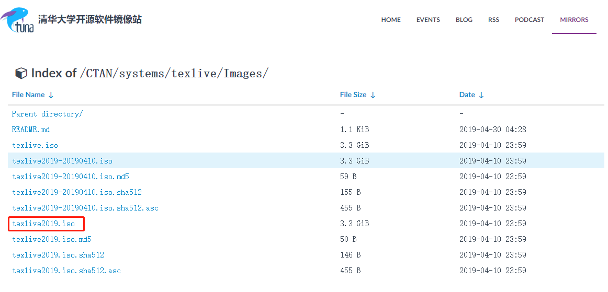

​	

## 三、安装TexLive

1、解压texlive2019镜像文件，在主目录中找到install-tl-advanced.bat文件，以管理员身份运行。

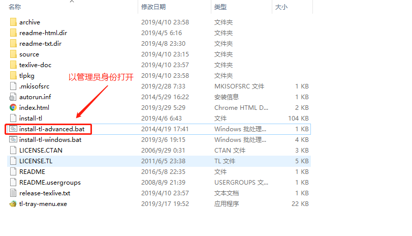

2、按照下图所示操作，可以直接点击安装，我这里在Advacned中只选择了中文和英文。

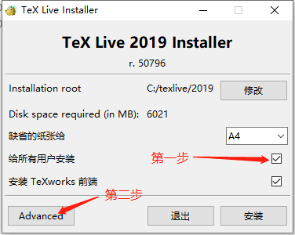

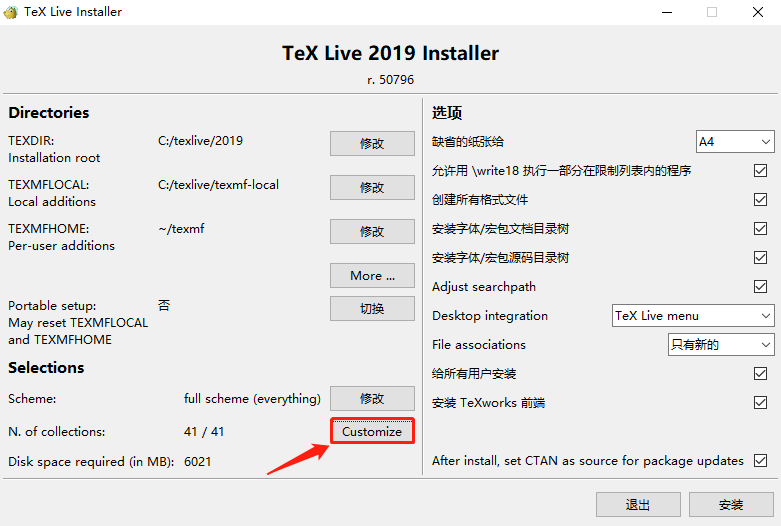


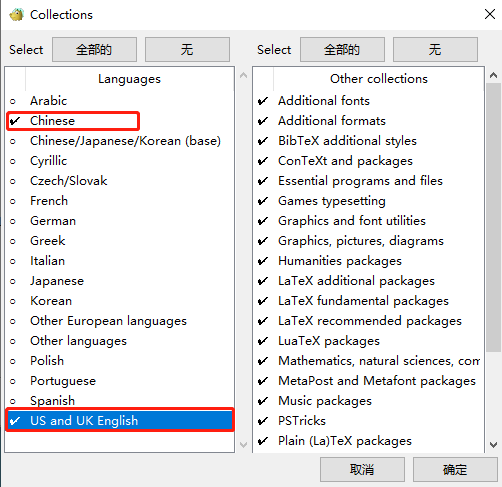

3、点击安装，等待如下界面，即安装成功。

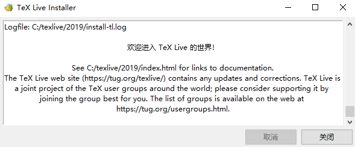

参考TexLive安装教程：

https://my.oschina.net/panquanxing/blog/3062522

## 四、Vscode安装插件

- LaTex language support

- LaTex Workshop

  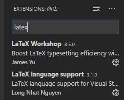

1、打开VScode，创建测试文件test.tex，输入内容如下：

```latex
\documentclass[UTF8]{ctexart}
    \title{文章标题}
    \author{David}
    \date{\today}
    \begin{document}
    \maketitle
    This is the context of the article.
\end{document}

```

2、保存（ctrl+s），生成如下文件

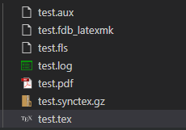

3、打开pdf

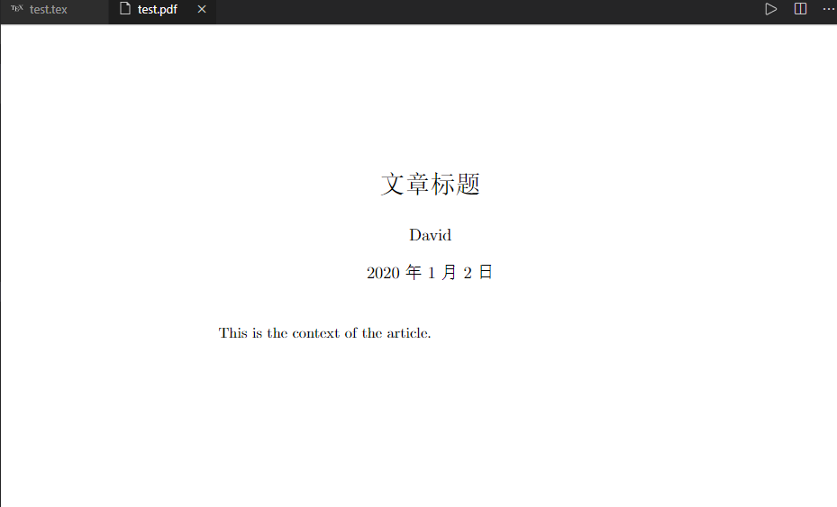

4、如果不想要其他文件，可以在“文件-首选项-设置”，搜索框输入LaTeX，点开第一个选项进入编辑设置文件。

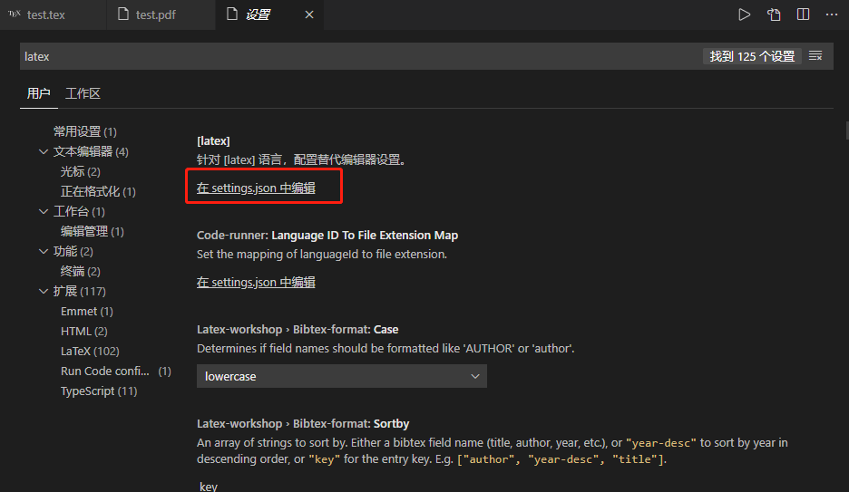

5、在setting.json文件中添加：

```json
    "latex-workshop.view.pdf.viewer": "tab",
    // "latex-workshop.latex.clean.enabled": true,
    "latex-workshop.latex.clean.fileTypes": [
    "*.aux",
    "*.bbl",
    "*.blg",
    "*.idx",
    "*.ind",
    "*.lof",
    "*.lot",
    "*.out",
    "*.toc",
    "*.acn",
    "*.acr",
    "*.alg",
    "*.glg",
    "*.glo",
    "*.gls",
    "*.ist",
    "*.fls",
    "*.log",
    "*.fdb_latexmk",
    "*.gz"
    ],
    "latex-workshop.latex.autoClean.run": "onBuilt"

```

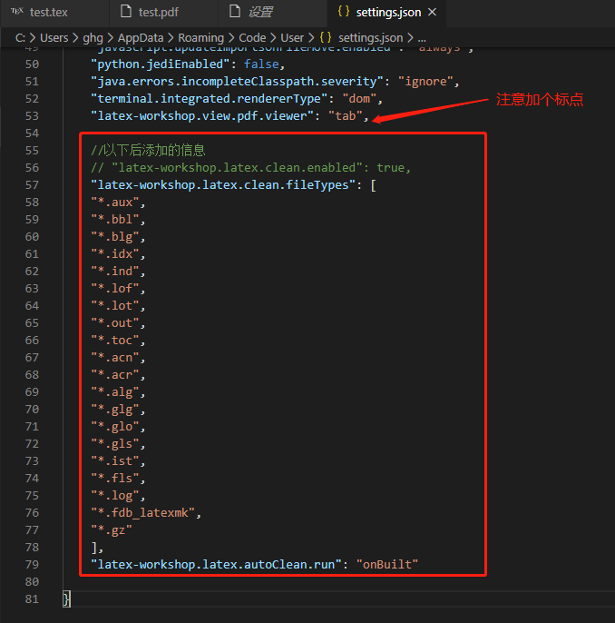

6、保存，编译LaTeX时产生的临时文件就可以直接清除了。

7、测试（如果不可以，先退出vscode，重新打开）

- 保存（ctrl+s），发现只有这两个个文件了。

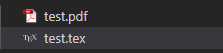


参考：

https://blog.csdn.net/ddydavie/article/details/83020615

https://blog.csdn.net/weixin_41111088/article/details/89879827


## 五、常用数学符号的 LaTeX 表示方法

http://www.mohu.org/info/symbols/symbols.htm

## 

