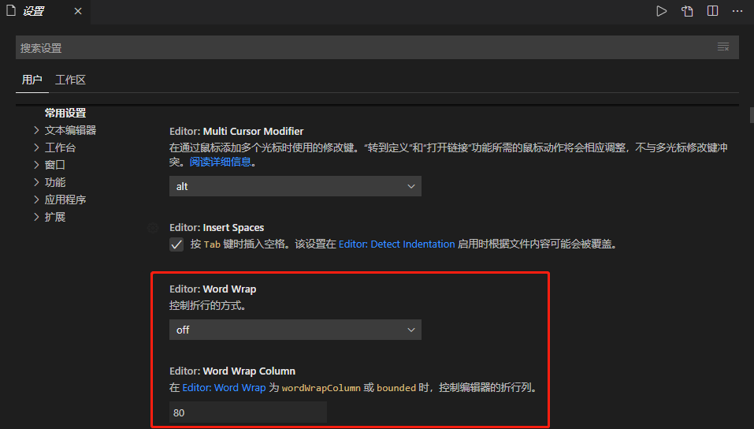
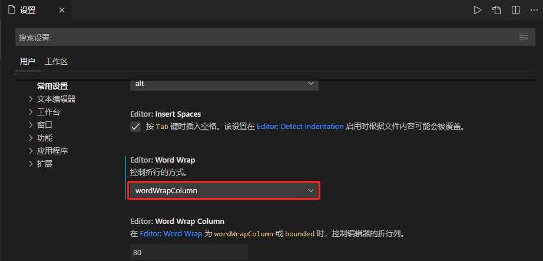

# VSCode

[TOC]

## 一、插件

- Live Server


## 二、设置

### 1、换行

**文件-首选项-设置**，下面是默认设置。



修改设置，我这里选择的是wordWrapColumn

```
// 编辑器的换行方式设置为指定的字符数，默认为"off"，即“不换行”。
    // 可选择"wordWrapColumn"或 "bounded"，具体区别见配置文件中的说明。
    "editor.wordWrap": "wordWrapColumn",

    // 如果"editor.wordWrap"被设置为"wordWrapColumn"或 "bounded"时，
    // 控制换行的阀值字符数。以下为80个字符则换行。
    "editor.wordWrapColumn": 80,
```



### 2、