# VSCode提交项目到Github

[TOC]


- 前提装好Git，参考我Linux目录下的一篇关于Git的文章

1、简单的写一个python项目

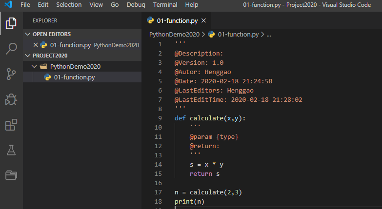

2、点击左侧的`Source Control`图标

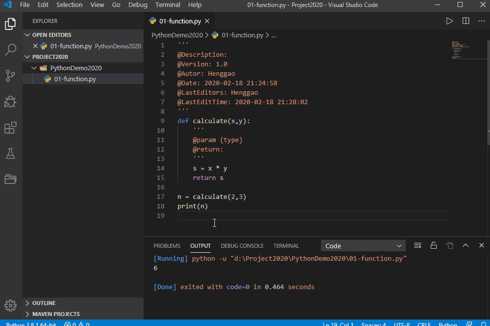

3、查看目录，发现文件夹下已经多了一个.git文件夹(这个文件夹在VSCode没有现实的)。

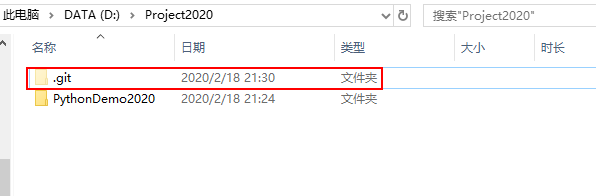

4、此时需要关联一下远程仓库，让本地的项目有个**寄宿**的地方。

- 打开Github,创建新仓库

  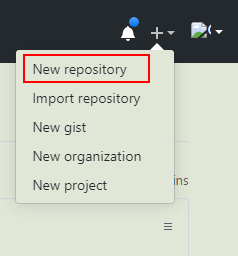

- 输入仓库名称，点击确定即可

  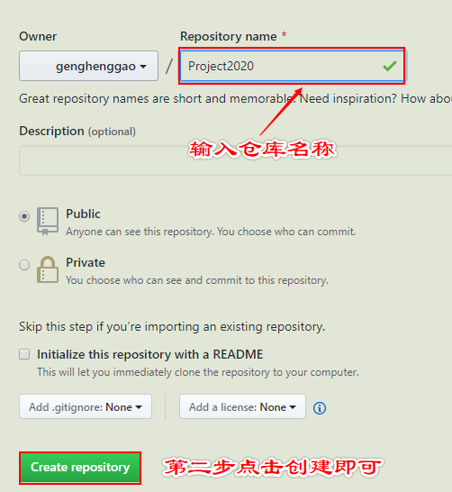

- 创建好仓库如下，我们要记住地址，也就是这个链接

  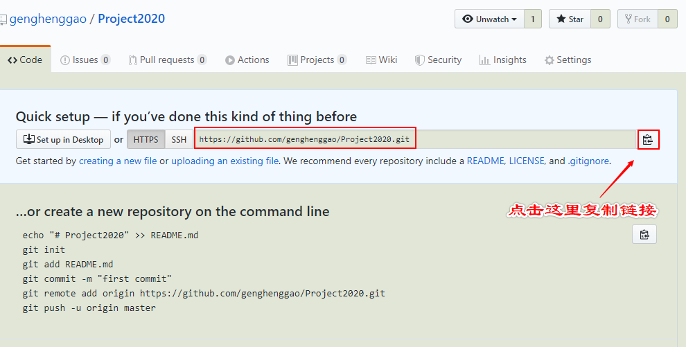

5、寄宿的地方找到了，现在我们将本地项目与仓库连接起来。

- 在终端输入

  ```shell
  git remote add origin 
  https://github.com/genghenggao/Project2020.git
  ```

  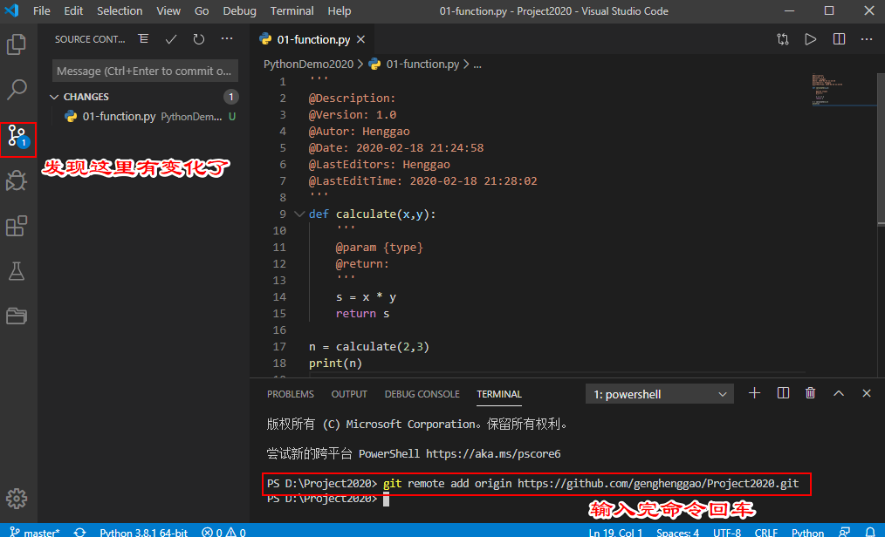

此时我们已经关联好了本地与远程仓库，开始愉快的提交项目吧。

6、有两种方式提交

- 第一种，通过VSCode上的符号

  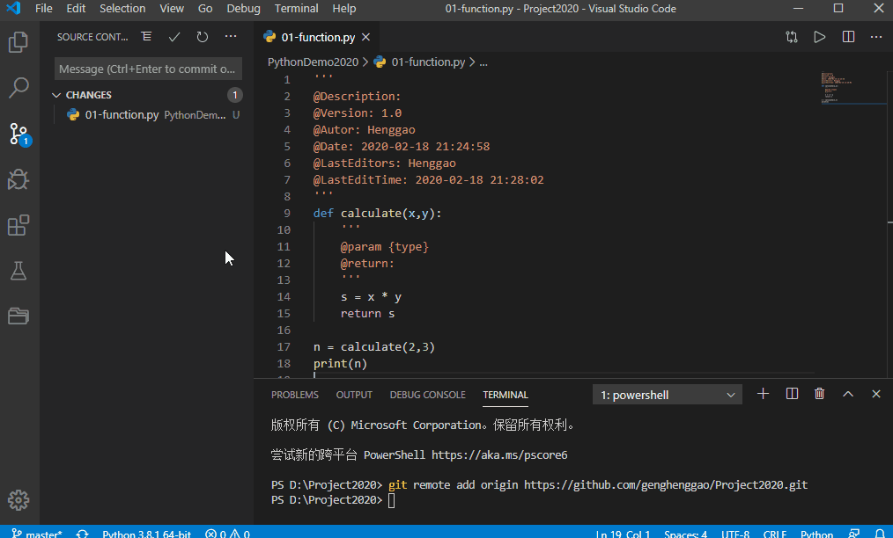

- 第二种，通过VSCode终端命令

  - 我们新写一个文件进行测试，U表示未提交，旁边的1是未提交的个数。

    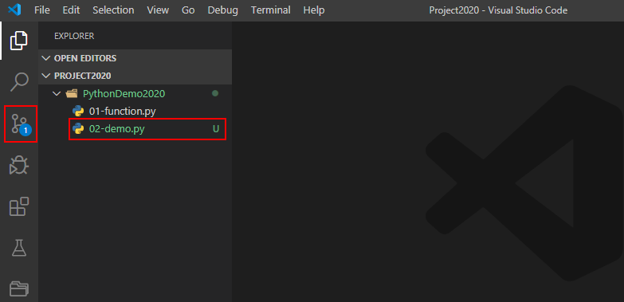

1、终端输入

```shell
git add .
```

2、观看界面变化

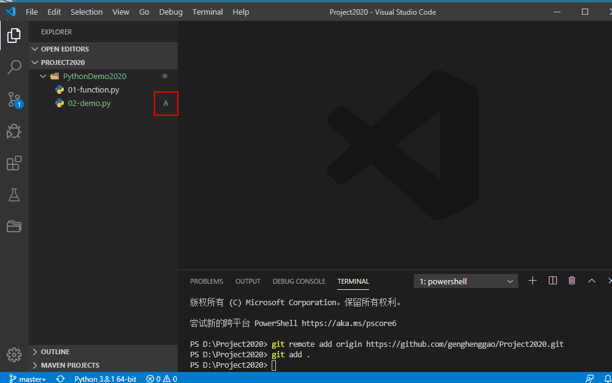

3、终端输入

```shell
git commit -m "Henggao"
```

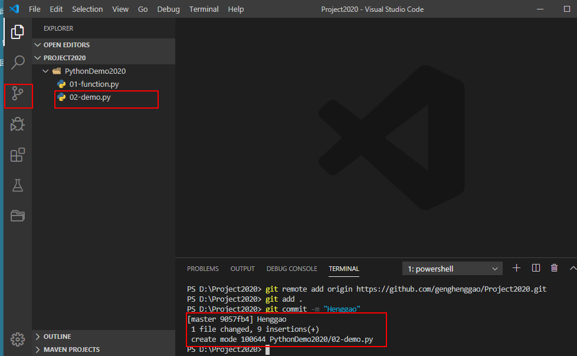

```shell
git push origin master 
```

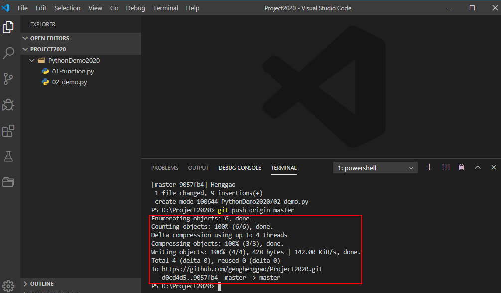

在Github上查看，成功上传。

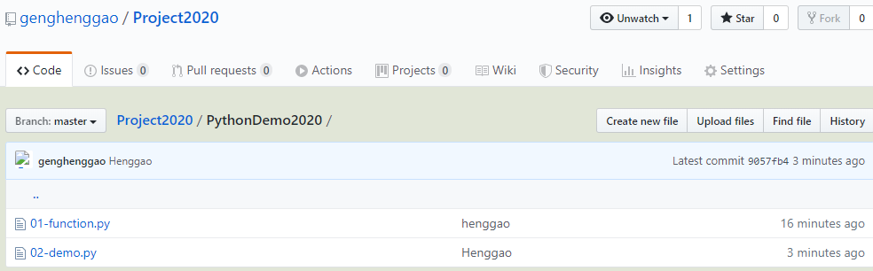