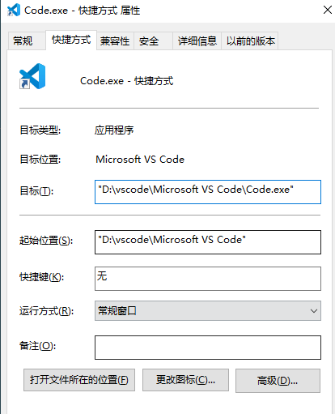
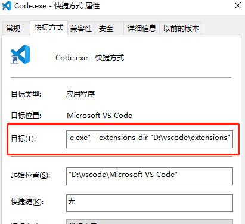
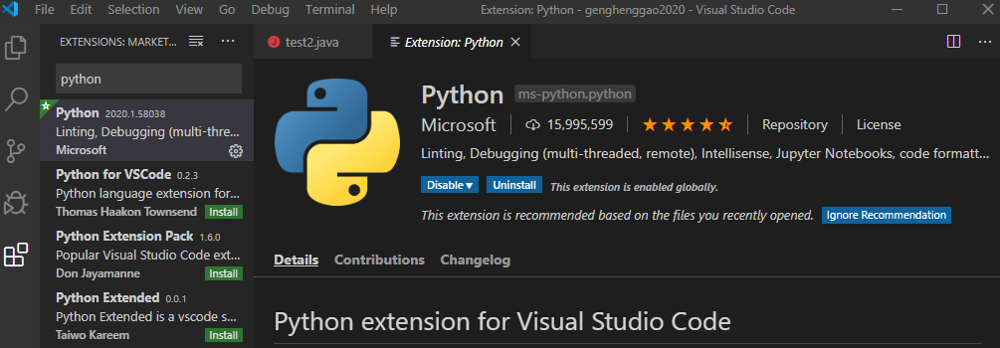
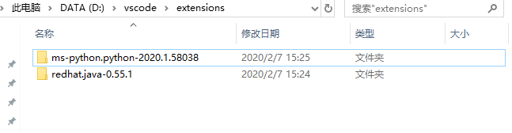
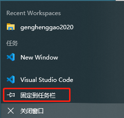

# VSCode设置插件位置

[TOC]

## 一、设置插件下载位置

### 1、查看

- 默认的VSCode插件位置在（果真在我们反感的C盘）

```
C:\Users\用户名\.vscode\extensions
```

### 2、修改（谨慎）

1、VSCode桌面快捷方式


2、右击，点击【属性】



```
"D:\vscode\Microsoft VS Code\Code.exe" --extensions-dir "D:\vscode\extensions"
```



- 点击【应用】，【确定】

3、测试下载插件

- Python
- Language Support for Java(TM) by Red Hat



在刚刚设置的插件文件查看，OK。



## 3、存在问题

后续我发现一个小问题，就是必须用这个快捷方式打开才可以

- 更新之后都需要重新去设置

- 如果将其固定到任务栏，从任务栏打开，就又回到了`C:\Users\用户名\.vscode\extensions`



### 4、采用最直接的方式

1、第一种方法：在cmd命令窗口启动VSCode

```
code --extensionHomePath "D:\vscode\extensions"
```

2、第二种方法：创建目录链接（建议这种方式）

将`C:\Users\用户名\.vscode\extensions`链接到`D:\vscode\extensions`

- 管理员身份打开cmd


- 创建连接（如果`C:\Users\用户名\.vscode\extensions`有文件，移动到`D:\vscode\extensions`，避免已经安装的插件还需要重新下载，同时需要删除`C:\Users\用户名\.vscode\extensions`这个extensions）

```powershell
mklink /D "C:\Users\Henggao\.vscode\extensions" "D:\vscode\extensions"
```


- 查看，可以看到已经创建链接了。不同于快捷方式的，快捷方式这里不行的。


- 现在无论从任务栏打开，还是更新插件位置都是在`D:\vscode\extensions`

