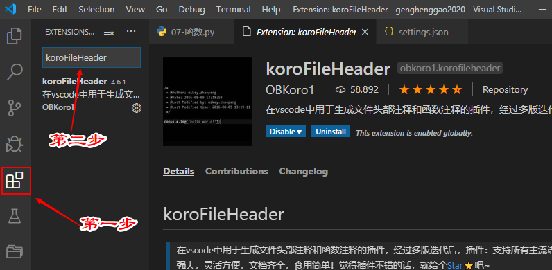
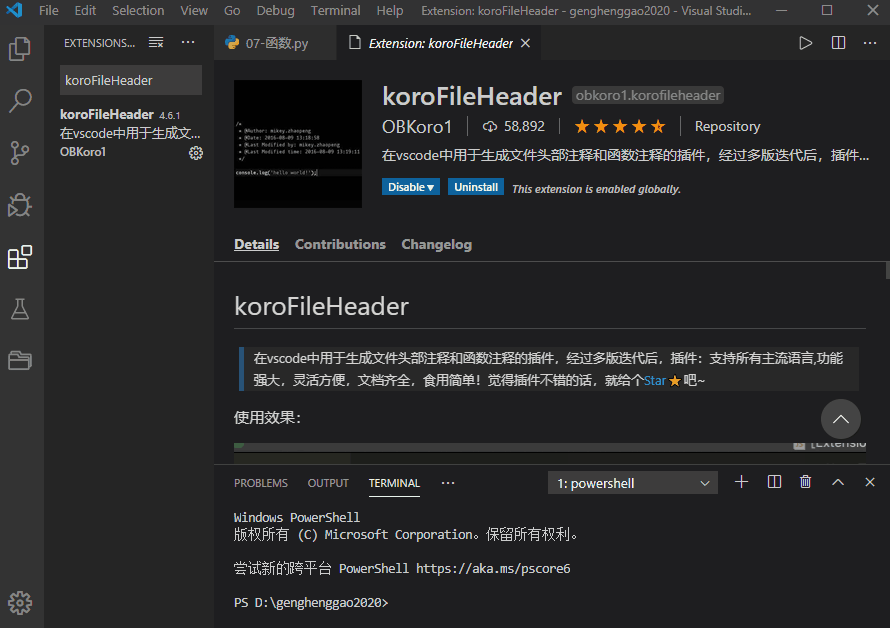

# koroFileHeade

文档头部注释  

- vscode-fileheader  不维护了    

- koroFileHeader  推荐使用

1、在插件搜索koroFileHeade下载



2、配置信息



```json
    "fileheader.customMade": {    //此为头部注释
        "Description": "",
        "Version": "1.0",
        "Autor": "Henggao",
        "Date": "Do not edit",
        "LastEditors": "Henggao",
        "LastEditTime": "Do not edit"
    },
    "fileheader.cursorMode": {  //此为函数注释
        "param": "",
        "return": "",
    }
```


- 快捷键使用

```
快捷键Ctrl+alt+i 在文件头部添加注释，

快捷键ctrl+alt+t 在光标处添加 JSDoc 注释。
```


- 先写函数方法，参数，然后在添加/**,回车，回车之后会自动提取部分内容，然后手动完善。

- TypeScript， visual studio code里面安装一个 **Document This**插件

```
将光标放置于function上面，快捷键是 Ctrl+Alt+D
```

