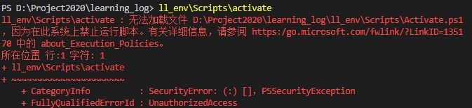

# vscode终端报错

[TOC]


## 问题

在cmd下可以使用得命令，在vscode终端powershell下使用报错如下：




## 最好的解决方案

解决vscode"在此系统上禁止运行脚本"报错，不能运行外部命令的错误

```powershell
# 第一步
get-ExecutionPolicy
# 如果提示则表示状态是呗禁用的
Restricted
# 第二步
set-ExecutionPolicy RemoteSigned
# 第三步，再次执行
get-ExecutionPolicy
# 结果变成下面，则表示解除禁用，之后就可以愉快的玩耍了
RemoteSigned
```

开始愉快的玩耍吧。


