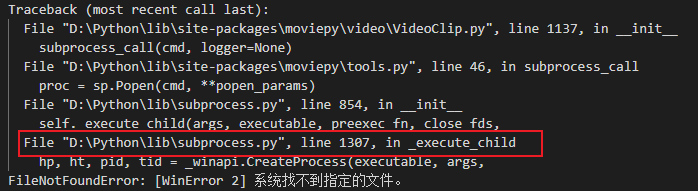
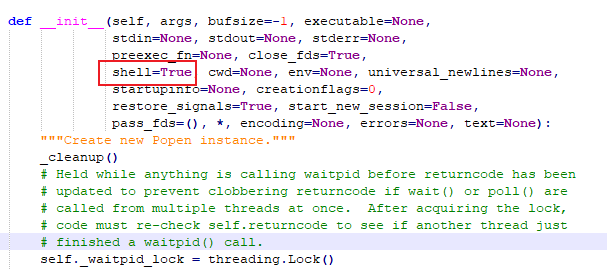

## vscode相对路径与一般编辑器的有所不同

| 符号      | vscode                                    | 一般的             |
| :-------- | :---------------------------------------- | :----------------- |
| “./2.txt” | 相对于工作路径（.vscode文件夹所在的位置） | 相对于当前运行文件 |
| “2.txt”   | 相对于工作路径                            | 相对于当前运行文件 |
| “/2.txt”  | 相对于磁盘根目录                          | 相对于磁盘根目录   |

## 解决FileNotFoundError: [WinError 2]

- 报错截图，报错信息显示`File "D:\Python\lib\subprocess.py"`

- 根据提示找到lib中的subprocess.py文件，查找class Popen模块，再将这个模块中的__init__函数中的shell = False 改成shell = True。

