# Nginx

[TOC]

## 一、Nginx

### 1、访问官网

- 访问官网： http://nginx.org/ 

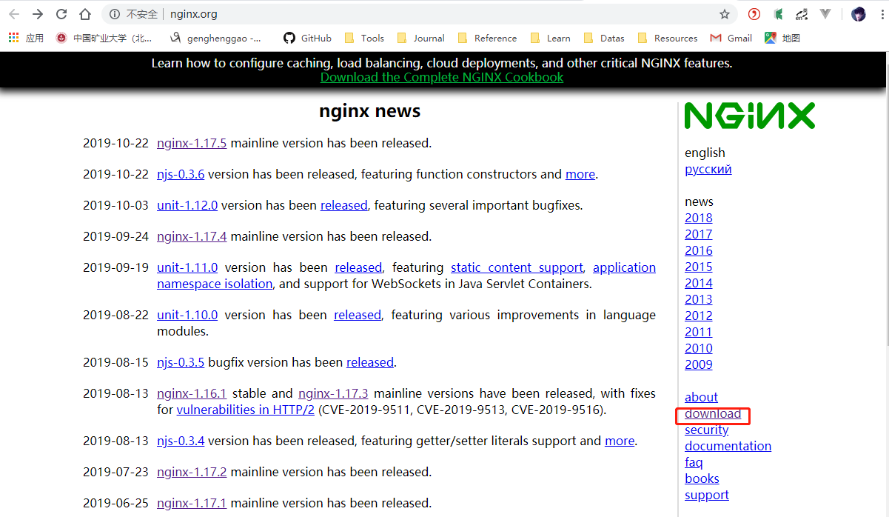

### 2、下载

- 选择Stable version windows稳定版

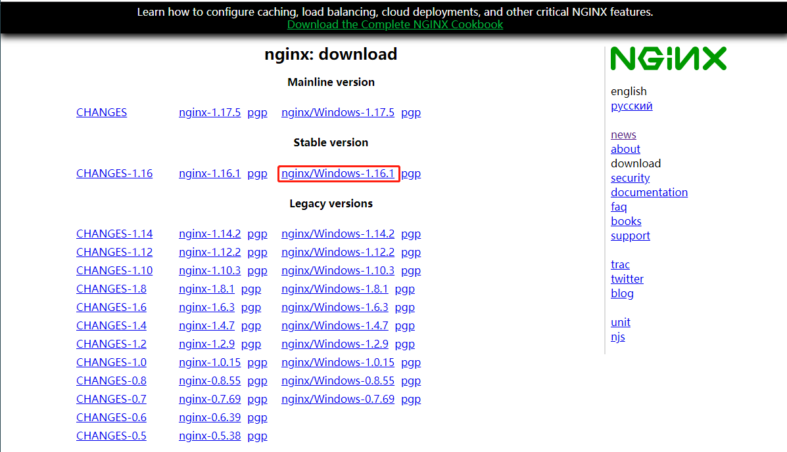

### 3、解压

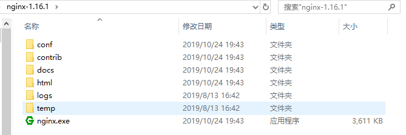

### 4、运行

- 打开nginx.exe

### 5、访问

- 浏览器输入：localhost

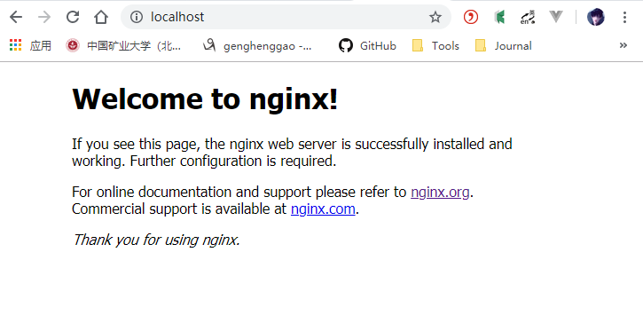

- 默认是打开html文件夹下的index.html,可以将项目打包dist文件后放到这里，访问默认的index.html。

  - 默认文件

    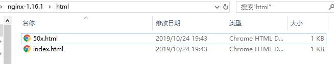

  - dist文件放入html中

    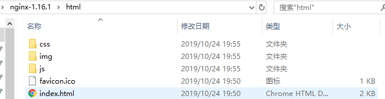

  - 查看

    

### 6、修改路径

- 可以将打包项目dist文件直接放入nginx-1.16.1目录下

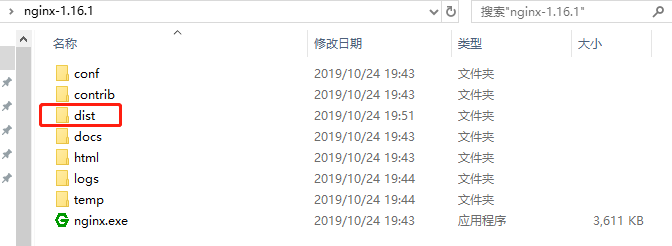

- 修改conf/nginx.conf

  - 默认

    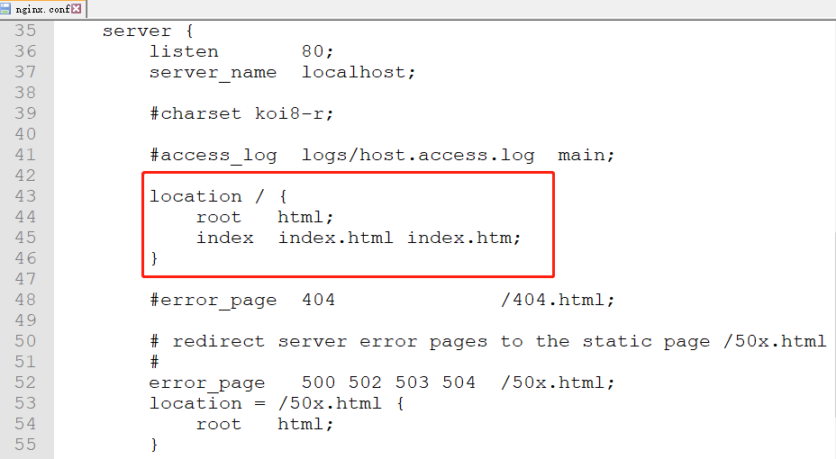

  - 修改为

    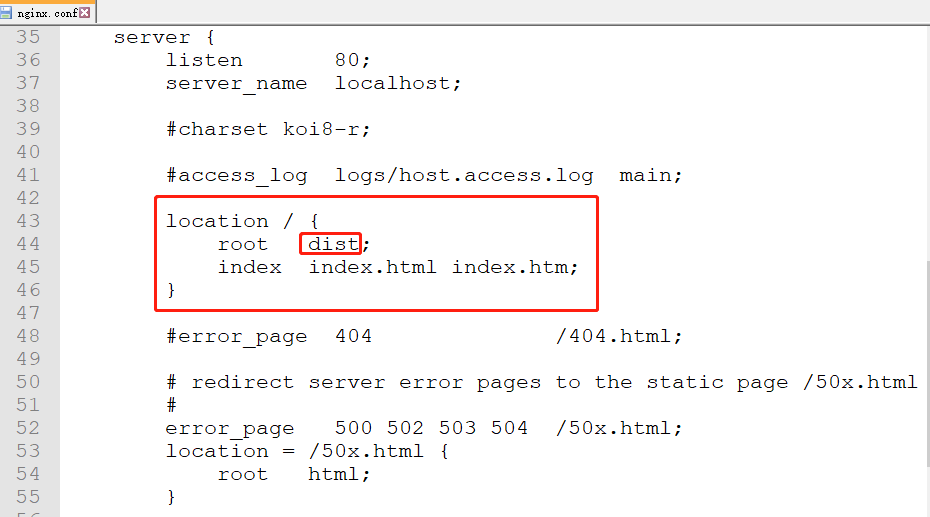

- 重启Nginx

  ```shell
  C:\WINDOWS\system32>cd C:\Users\ghg\Desktop\nginx-1.16.1
  
  C:\Users\ghg\Desktop\nginx-1.16.1>nginx.exe -s stop
  
  C:\Users\ghg\Desktop\nginx-1.16.1>
  ```

  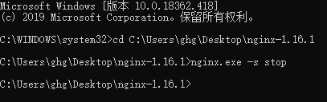

  ```shell
  #注：stop是快速停止nginx，可能并不保存相关信息；quit是完整有序的停止nginx，并保存相关信息。
  nginx.exe -s stop
  #或
  nginx.exe -s quit
  #重新载入Nginx：
  nginx.exe -s reload
  ```

  点击Nginx.exe运行即可

- 查看

  


## 二、Ngrok

### 1、进入官网

- 官网： https://ngrok.com/ 

### 2、注册Ngrock账号

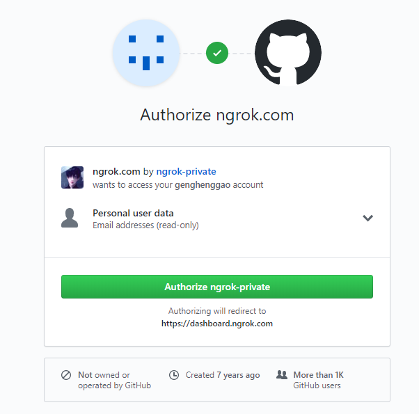

### 3、下载

- 下载对应版本windows

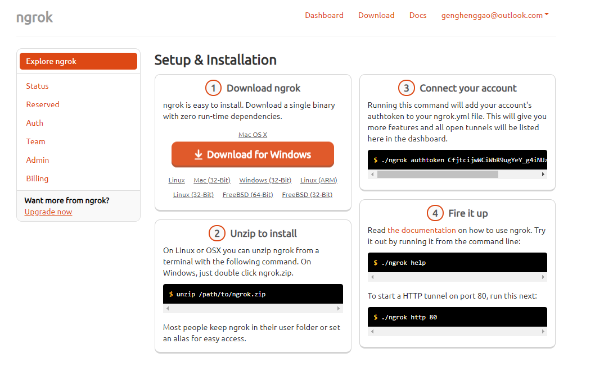

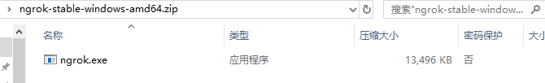

就一个ngrok.exe，解压到文件夹。

### 4、授权命令

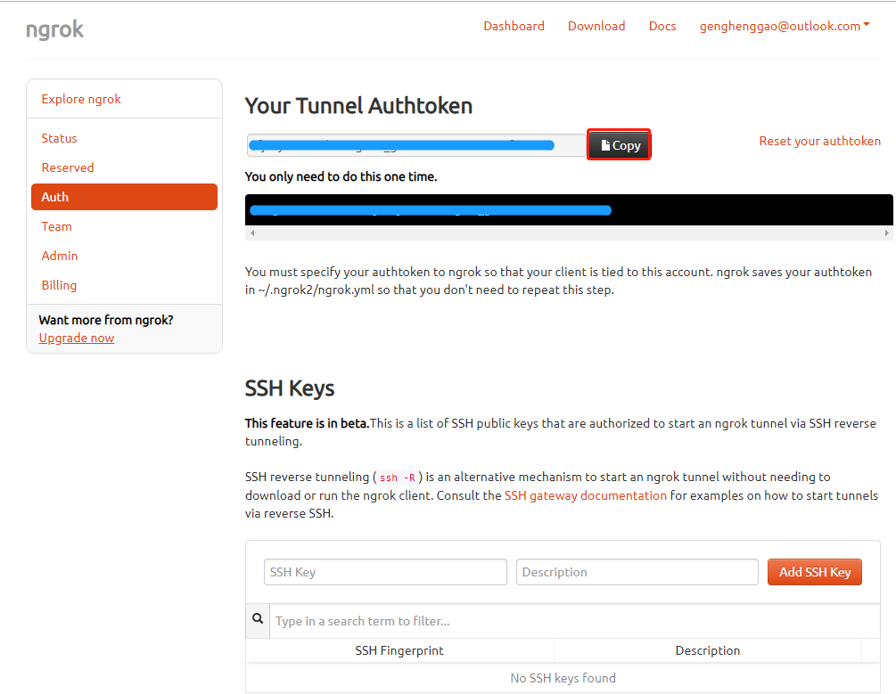

- 使用cmd 到ngrok.exe的目录，根据官网给定的授权码，运行如下授权命令

```shell
ngrok authtoken 授权码
```

​	

- 授权码和账户是绑定的，在授权命令运行后，ngrok会将授权码保存在~/.ngrok2/ngrok.yml中，所以只需要运行一次，以后都可以使用。 

### 5、运行命令开发端口。

```shell
ngrok http 80
```

- 命令的意思是将本地80端口对应的服务暴露到外网中。运行后将出现如下结果： 

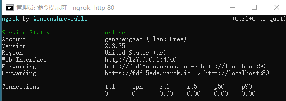

Forwarding，第一个是http协议对应的外网地址，第二个是https协议对应的外网地址。这样，凡是访问https://fdd15ede.ngrok.io的请求都将发送到localhost:80。

### 6、编写一个.Bat

- 简化步骤5，在ngrok.exe对应目录新建一个start.bat

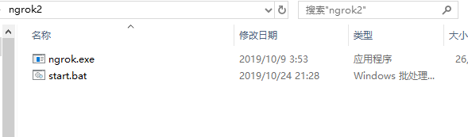

- start.bat内容如下，以后直接双击打开start.bat即可。

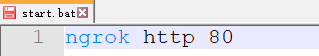

### 7、注意

每次启动ngrok都会分配一个新的外网域名，所以需要每次更换配置或者更换访问地址，不太方便。当然，ngrok也提供了解决方法，那就是付费，可以设置固定域名。


## 三、Nginx+Ngrok

### 1、运行nginx.exe

### 2、运行start.bat

### 3、查看

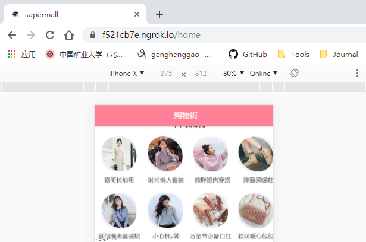

