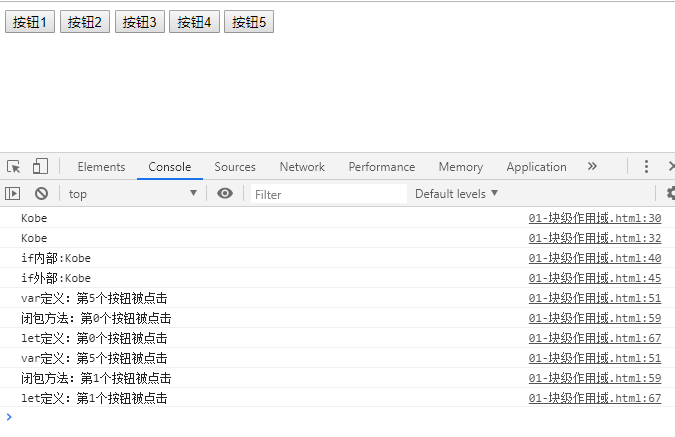
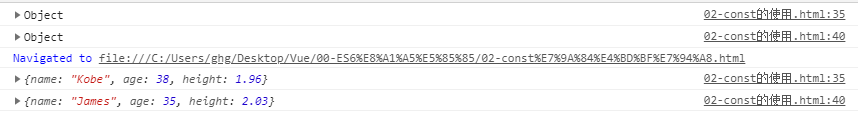

# Vue

[TOC]

## 一、let/var

- ES5之前因为if和for都没有块级作用域，所以在很多时候借助function的作用域来解决外面变量的问题。

- ES6加入了let，let是有if和for的块级作用域。

```html
<!--
 * @Description: 
 * @version: 
 * @Author: henggao
 * @Date: 2019-10-08 18:47:29
 * @LastEditors: henggao
 * @LastEditTime: 2019-10-08 19:35:36
 -->
<!DOCTYPE html>
<html lang="en">

<head>
    <meta charset="UTF-8">
    <meta name="viewport" content="width=device-width, initial-scale=1.0">
    <meta http-equiv="X-UA-Compatible" content="ie=edge">
    <title>Document</title>
</head>

<body>
    <button>按钮1</button>
    <button>按钮2</button>
    <button>按钮3</button>
    <button>按钮4</button>
    <button>按钮5</button>
    <script>
        // ES5之前因为if和for都没有块级作用域，所以在很多时候借助function的作用域来解决外面变量的问题
        // ES6加入了let，let是有if和for的块级作用域
        // 1、变量作用域：变量在什么范围内是可用的
        {
            var name = 'Kobe'
            console.log(name);
        }
        console.log(name)


        // 2、没有块级作用域引起的问题： if的块级
        var func;
        if (true) {
            var name = 'James'
            func = function () {
                console.log('if内部:' + name);
            }
        }
        name = 'Kobe'
        func()
        console.log('if外部:' + name)

        // 3、没有块级作用域引起的问题： for的块级
        var btns = document.getElementsByTagName('button')
        for (var i = 0; i < btns.length; i++) {
            btns[i].addEventListener('click', function () {
                console.log('var定义：第' + i + '个按钮被点击');
            })
        }
        // 为什么闭包可以解决问题：函数是一个作用域
        var btns = document.getElementsByTagName('button')
        for (var i = 0; i < btns.length; i++) {
            (function (i) {
                btns[i].addEventListener('click', function () {
                    console.log('闭包方法：' + '第' + i + '个按钮被点击');
                })
            })(i)
        }

        const btns1 = document.getElementsByTagName('button')
        for (let i = 0; i < btns1.length; i++) {
            btns[i].addEventListener('click', function () {
                console.log('let定义：第' + i + '个按钮被点击');
            })
        }
    </script>
</body>

</html>
```




## 二、const的使用

- 在ES6中，优先使用const，只有需要改变某一个标识符的时候才使用let。

```html
<!--
 * @Description: 
 * @version: 
 * @Author: henggao
 * @Date: 2019-10-08 18:47:29
 * @LastEditors: henggao
 * @LastEditTime: 2019-10-08 19:58:48
 -->
<!DOCTYPE html>
<html lang="en">

<head>
    <meta charset="UTF-8">
    <meta name="viewport" content="width=device-width, initial-scale=1.0">
    <meta http-equiv="X-UA-Compatible" content="ie=edge">
    <title>Document</title>
</head>

<body>
<script>
// 1、注意一：一旦给const修饰的标识符被赋值之后，不能修改
// const name = 'James'
// name = 'Kobe'

// 2、注意二：使用const定义标识符，必须进行赋值
// const name1;

// 3、注意三：常量的含义是指向的对象不能修改，但可以改变对象内部属性
const obj ={
    name:'Kobe',
    age:38,
    height:1.96
}
// obj={}
console.log(obj);
//const改变的是内存地址中的内容
obj.name = 'James'
obj.age = 35
obj.height=2.03
console.log(obj);

</script>
</body>

</html>
```




## 三、对象字面量的增强写法

```html
<!--
 * @Description: 
 * @version: 
 * @Author: henggao
 * @Date: 2019-10-08 18:47:29
 * @LastEditors: henggao
 * @LastEditTime: 2019-10-08 20:09:45
 -->
<!DOCTYPE html>
<html lang="en">

<head>
    <meta charset="UTF-8">
    <meta name="viewport" content="width=device-width, initial-scale=1.0">
    <meta http-equiv="X-UA-Compatible" content="ie=edge">
    <title>Document</title>
</head>

<body>
    <script>
        // const obj = new object()
        // const obj = {
        //     name = 'James',
        //     age: 35,
        //     run:function(){
        //         console.log('在奔跑');
        //     },
        //     eat:function(){
        //         console.log('在吃东西')
        //     }
        // }

        // 1、属性的增强写法
        const name = 'Kobe'
        const age = 24
        const height = 1.96

        // ES5的写法
        // const obj = {
        //     name:name,
        //     age:age,
        //     height:height
        // }
        // console.log(obj);
        
        const obj = {
            name,
            age,
            height
        }
        console.log(obj);


        // 2、函数的增强方法
        // ES5的写法
        const obj ={
            run: function(){

            },
            eat:function(){

            }
        }

        //增强写法  
        const obj = {
            run(){

            }
        }


    </script>
</body>

</html>
```

