# Vue
[TOC]
## 一、Vue初体验

### 1、HelloVue

```html
<!--
 * @Description: 
 * @version: 
 * @Author: henggao
 * @Date: 2019-10-08 09:12:55
 * @LastEditors: henggao
 * @LastEditTime: 2019-10-08 09:43:36
 -->
<!DOCTYPE html>
<html lang="en">

<head>
    <meta charset="UTF-8">
    <meta name="viewport" content="width=device-width, initial-scale=1.0">
    <meta http-equiv="X-UA-Compatible" content="ie=edge">
    <title>Document</title>
</head>

<body>
<div id="app">
    <h2>{{message}}</h2>
    <h2>{{name}}</h2>
</div>
<script src="../js/vue.js"></script>
<script>
    const app = new Vue({
        el: '#app',
        data: {
            message: 'Hello, Vue !',
            name: "Aaron"
        }
    })
</script>
</body>

</html>
```


### 2、V-for指令

```html
<!--
 * @Description: 
 * @version: 
 * @Author: henggao
 * @Date: 2019-10-08 09:01:08
 * @LastEditors: henggao
 * @LastEditTime: 2019-10-08 09:10:02
 -->
<!DOCTYPE html>
<html lang="en">
<head>
    <meta charset="UTF-8">
    <meta name="viewport" content="width=device-width, initial-scale=1.0">
    <meta http-equiv="X-UA-Compatible" content="ie=edge">
    <title>Document</title>
</head>
<body>
 <div id="app">
     <ul>
         <li v-for="item in movies">{{item}}</li>
     </ul>
 </div>   

 <script src="../js/vue.js"></script>
 <script>
    const app =  new Vue({
        el:'#app',
        data:{
            message:'你好啊',
            movies:['星际穿越','大话西游','少年派','盗梦空间']
        }
    })
 </script>
</body>
</html>
```


### 3、案例：计数器

- v-on
- @click
```html
<!--
 * @Description: 
 * @version: 
 * @Author: henggao
 * @Date: 2019-10-08 09:13:19
 * @LastEditors: henggao
 * @LastEditTime: 2019-10-08 09:23:38
 -->
<!DOCTYPE html>
<html lang="en">
<head>
    <meta charset="UTF-8">
    <meta name="viewport" content="width=device-width, initial-scale=1.0">
    <meta http-equiv="X-UA-Compatible" content="ie=edge">
    <title>Document</title>
</head>
<body>
 <div id="app">
     <h2>当前计数：{{counter}}</h2>
     <!-- <button v-on:click="counter++">+</button> -->
     <!-- <button v-on:click="counter--">-</button> -->
     <button v-on:click='add'>+</button>
     <button v-on:click='sub'>-</button>
 </div>
 <script src="../js/vue.js"></script>   
 <script>
     const app = new Vue({
         el:'#app',
         data: {
            counter: 0
         },
         methods:{
             add:function(){
                console.log('add被执行');
                this.counter++
             },
             sub:function(){
                console.log('sub被执行');
                this.counter--
             }
         }
     })
 </script>
</body>
</html>
```

### 4、MVVM
MVVM是Model-View-ViewModel的简写。它本质上就是MVC 的改进版。MVVM 就是将其中的View 的状态和行为抽象化，让我们将视图 UI 和业务逻辑分开。
```html
<!--
 * @Description: 
 * @version: 
 * @Author: henggao
 * @Date: 2019-10-08 09:13:19
 * @LastEditors: henggao
 * @LastEditTime: 2019-10-08 09:34:02
 -->
<!DOCTYPE html>
<html lang="en">
<head>
    <meta charset="UTF-8">
    <meta name="viewport" content="width=device-width, initial-scale=1.0">
    <meta http-equiv="X-UA-Compatible" content="ie=edge">
    <title>Document</title>
</head>
<body>
 <div id="app">
     <h2>当前计数：{{counter}}</h2>
     <!-- <button v-on:click="counter++">+</button> -->
     <!-- <button v-on:click="counter--">-</button> -->
     <button v-on:click='add'>+</button>
     <button v-on:click='sub'>-</button>
 </div>
 <script src="../js/vue.js"></script>   
 <script>
     const obj={
         counter:0
     }
     const app = new Vue({
         el:'#app',
         data: obj,
         methods:{
             add:function(){
                console.log('add被执行');
                this.counter++
             },
             sub:function(){
                console.log('sub被执行');
                this.counter--
             }
         }
     })
 </script>
</body>
</html>
```

- 对比上一节

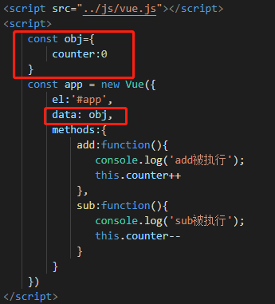


### 5、Vue的Options选项

- el

  - 类型：String|HTMLElement
  - 作用：决定之后Vue实例会管理哪一个DOM

- data

  - 类型：Object|Function(组件当中data必须是一个函数)
  - 作用：Vue实例对象的数据对象

- methods

  - 类型：{[key:String]: Function}
  - 作用：定义属于Vue的一些方法，可以在其他地方调用，也可以在指令中使用

  

### 6、Vue生命周期

事物诞生到消亡。


## 二、Vue插值的操作

### 1、Mustache

Mustache语法（双大括号语法）

```html
<!--
 * @Description: 
 * @version: 
 * @Author: henggao
 * @Date: 2019-10-08 10:13:23
 * @LastEditors: henggao
 * @LastEditTime: 2019-10-08 10:21:09
 -->
<!DOCTYPE html>
<html lang="en">
<head>
    <meta charset="UTF-8">
    <meta name="viewport" content="width=device-width, initial-scale=1.0">
    <meta http-equiv="X-UA-Compatible" content="ie=edge">
    <title>Document</title>
</head>
<body>
<div id="app">
    <h2>{{meassage}}</h2>
    <h2>{{firstName + lastName}}</h2>
    <h2>{{counter * 2}}</h2>
</div>
<script src="../js/vue.js"></script>   
<script>
    const app = new Vue({
        el:'#app',
        data:{
            message:'Hello,Vue!',
            firstName:'Kobe',
            lastName:'byrant',
            counter:100
        },
    })
</script>
</body>
</html>
```


### 2、v-once

```html
<!--
 * @Description: 
 * @version: 
 * @Author: henggao
 * @Date: 2019-10-08 10:13:23
 * @LastEditors: henggao
 * @LastEditTime: 2019-10-08 10:23:01
 -->
<!DOCTYPE html>
<html lang="en">
<head>
    <meta charset="UTF-8">
    <meta name="viewport" content="width=device-width, initial-scale=1.0">
    <meta http-equiv="X-UA-Compatible" content="ie=edge">
    <title>Document</title>
</head>
<body>
<div id="app">
    <h2>{{message}}</h2>
    <h2 v-once>{{message}}</h2>
</div>
<script src="../js/vue.js"></script>   
<script>
    const app = new Vue({
        el:'#app',
        data:{
            message:'Hello,Vue!'
        }
    })
</script>
</body>
</html>
```

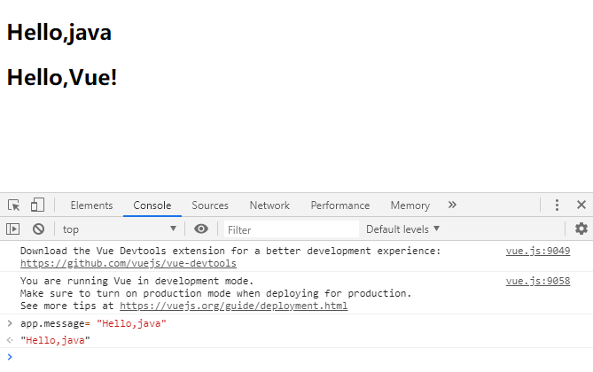

### 3、v-html

- v-html

```html
<!--
 * @Description: 
 * @version: 
 * @Author: henggao
 * @Date: 2019-10-08 10:13:23
 * @LastEditors: henggao
 * @LastEditTime: 2019-10-08 10:29:50
 -->
<!DOCTYPE html>
<html lang="en">
<head>
    <meta charset="UTF-8">
    <meta name="viewport" content="width=device-width, initial-scale=1.0">
    <meta http-equiv="X-UA-Compatible" content="ie=edge">
    <title>Document</title>
</head>
<body>
<div id="app">
    <h2>{{message}}</h2>
    <h2>{{url}}</h2>
    <h2 v-html="url"></h2>
</div>
<script src="../js/vue.js"></script>   
<script>
    const app = new Vue({
        el:'#app',
        data:{
            message:'Hello,Vue!',
            url:'<a href="http://www.baidu.com">百度一下</a>'
        }
    })
</script>
</body>
</html>
```

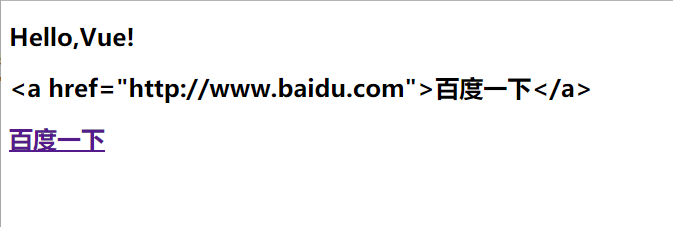

### 4、v-text

- v-text会覆盖内容

```html
<!--
 * @Description: 
 * @version: 
 * @Author: henggao
 * @Date: 2019-10-08 10:13:23
 * @LastEditors: henggao
 * @LastEditTime: 2019-10-08 10:38:00
 -->
<!DOCTYPE html>
<html lang="en">
<head>
    <meta charset="UTF-8">
    <meta name="viewport" content="width=device-width, initial-scale=1.0">
    <meta http-equiv="X-UA-Compatible" content="ie=edge">
    <title>Document</title>
</head>
<body>
<div id="app">
    <h2>{{message}} Welcome to visit!</h2>
    <h2 v-text="message">Welcome to visit!</h2>
</div>
<script src="../js/vue.js"></script>   
<script>
    const app = new Vue({
        el:'#app',
        data:{
            message:'Hello,Vue !'
        }
    })
</script>
</body>
</html>
```

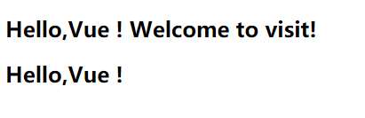

### 5、v-pre

```html
<!--
 * @Description: 
 * @version: 
 * @Author: henggao
 * @Date: 2019-10-08 10:13:23
 * @LastEditors: henggao
 * @LastEditTime: 2019-10-08 10:45:54
 -->
<!DOCTYPE html>
<html lang="en">
<head>
    <meta charset="UTF-8">
    <meta name="viewport" content="width=device-width, initial-scale=1.0">
    <meta http-equiv="X-UA-Compatible" content="ie=edge">
    <title>Document</title>
</head>
<body>
<div id="app">
    <h2>{{message}}</h2>
    <h2 v-pre>{{message}}</h2>
</div>
<script src="../js/vue.js"></script>   
<script>
    const app = new Vue({
        el:'#app',
        data:{
            message:'Hello,Vue !'
        }
    })
</script>
</body>
</html>
```


### 6、v-cloak

```html
<!--
 * @Description: 
 * @version: 
 * @Author: henggao
 * @Date: 2019-10-08 10:13:23
 * @LastEditors: henggao
 * @LastEditTime: 2019-10-08 10:50:49
 -->
<!DOCTYPE html>
<html lang="en">
<head>
    <meta charset="UTF-8">
    <meta name="viewport" content="width=device-width, initial-scale=1.0">
    <meta http-equiv="X-UA-Compatible" content="ie=edge">
    <title>Document</title>
</head>
<body>
<div id="app" v-cloak>
    <h2>{{message}}</h2>
</div>
<script src="../js/vue.js"></script>   
<script>
    // 在vue解析解之前，div中有一个属性v-cloak
    // 在vue解析解之后，div中没有一个属性v-cloak
    setTimeout(function(){
    const app = new Vue({
        el:'#app',
        data:{
            message:'Hello,Vue !'
        }
    })
    },3000)
</script>
</body>
</html>
```

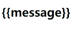

## 三、Vue动态绑定

### 1、v-bind基础绑定

- v-bind语法糖
  - 简写  `:`

    ```html
    <!--
     * @Description: 
     * @version: 
     * @Author: henggao
     * @Date: 2019-10-08 10:13:23
     * @LastEditors: henggao
     * @LastEditTime: 2019-10-08 11:28:48
     -->
    <!DOCTYPE html>
    <html lang="en">
    <head>
        <meta charset="UTF-8">
        <meta name="viewport" content="width=device-width, initial-scale=1.0">
        <meta http-equiv="X-UA-Compatible" content="ie=edge">
        <title>Document</title>
    </head>
    <body>
    <div id="app">
        <h2>{{message}}</h2>
        
        <a v-bind:href="aHerf">百度一下</a>
        
        <a :href="aHerf">百度一下</a>
    </div>
    <script src="../js/vue.js"></script>   
    <script>
        const app = new Vue({
            el:'#app',
            data:{
                message:'Hello,Vue!',
                imgURL:'https://uploadfile.bizhizu.cn/up/fe/ce/51/fece51db77e034842f9d96e4bd314847.jpg',
                aHerf:'https://www.baidu.com/'
           }
        })
    </script>
    </body>
    </html>
    ```

    

### 2、v-bind动态绑定

```html
<!--
 * @Description: 
 * @version: 
 * @Author: henggao
 * @Date: 2019-10-08 10:13:23
 * @LastEditors: henggao
 * @LastEditTime: 2019-10-08 14:51:43
 -->
<!DOCTYPE html>
<html lang="en">
<style>
    .active {
        color: red;

    }
</style>

<head>
    <meta charset="UTF-8">
    <meta name="viewport" content="width=device-width, initial-scale=1.0">
    <meta http-equiv="X-UA-Compatible" content="ie=edge">
    <title>Document</title>
</head>

<body>
<div id="app">
    <h2>{{message}}</h2>
    <h2 v-bind:class="{active: isActive, line:isLine}">{{message}}</h2>
    <button v-on:click="btnClick">按钮</button>
</div>
<script src="../js/vue.js"></script>
<script>
    const app = new Vue({
        el: '#app',
        data: {
            message: 'Hello,Vue!',
            isActive: true,
            isLine: true
        },
        methods: {
            btnClick: function () {
                this.isActive = !this.isActive
            }
        }
    })
</script>
</body>

</html>
```

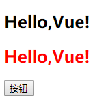

### 3、v-bind动态绑定 Style（对象语法）

```html
<!--
 * @Description: 
 * @version: 
 * @Author: henggao
 * @Date: 2019-10-08 10:13:23
 * @LastEditors: henggao
 * @LastEditTime: 2019-10-08 16:39:21
 -->
<!DOCTYPE html>
<html lang="en">
<head>
    <meta charset="UTF-8">
    <meta name="viewport" content="width=device-width, initial-scale=1.0">
    <meta http-equiv="X-UA-Compatible" content="ie=edge">
    <title>Document</title>
</head>
<body>
<div id="app">
    <h2 :style = "{fontSize: '50px'}">{{message}}</h2>
    <h2 :style = "{fontSize: finalSize , color:finalColor}">{{message}}</h2>
    <h2 :style = "{fontSize: finalSize1 + 'px' , color:finalColor}">{{message}}</h2>
</div>
<script src="../js/vue.js"></script>   
<script>
    const app = new Vue({
        el:'#app',
        data:{
            message:'Hello,Vue!',
            finalSize: '100px',
            finalSize1: 100,
            finalColor:'red'
        }
    })
</script>
</body>
</html>
```

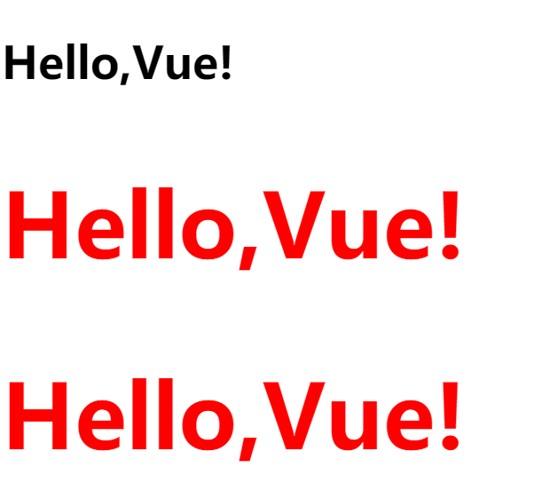

### 4、v-bind动态绑定 Style（数组语法）

```html
<!--
 * @Description: 
 * @version: 
 * @Author: henggao
 * @Date: 2019-10-08 10:13:23
 * @LastEditors: henggao
 * @LastEditTime: 2019-10-08 16:43:58
 -->
<!DOCTYPE html>
<html lang="en">
<head>
    <meta charset="UTF-8">
    <meta name="viewport" content="width=device-width, initial-scale=1.0">
    <meta http-equiv="X-UA-Compatible" content="ie=edge">
    <title>Document</title>
</head>
<body>
<div id="app">
    <h2 :style= "[baseStyle,baseStyle1]">{{message}}</h2>
</div>
<script src="../js/vue.js"></script>   
<script>
    const app = new Vue({
        el:'#app',
        data:{
            message:'Hello,Vue!',
            baseStyle:{backgroundColor:'red'},
            baseStyle1:{fontSize:'50px'}
        }
    })
</script>
</body>
</html>
```


## 四、计算属性

### 1、计算属性基础使用

```html
<!--
 * @Description: 
 * @version: 
 * @Author: henggao
 * @Date: 2019-10-08 10:13:23
 * @LastEditors: henggao
 * @LastEditTime: 2019-10-08 16:52:03
 -->
<!DOCTYPE html>
<html lang="en">
<head>
    <meta charset="UTF-8">
    <meta name="viewport" content="width=device-width, initial-scale=1.0">
    <meta http-equiv="X-UA-Compatible" content="ie=edge">
    <title>Document</title>
</head>
<body>
<div id="app">
    <h2>{{message}}</h2>
    <h2>{{firstName + ' ' + lastName}}</h2>
    <h2>{{getFullName()}}</h2>
    <h2>{{fullName}}</h2>
</div>
<script src="../js/vue.js"></script>   
<script>
    const app = new Vue({
        el:'#app',
        data:{
            message:'Hello,Vue!',
            firstName:'Lebron',
            lastName:'James'
        },
        computed:{
            fullName:function(){
                return this.firstName + ' ' + this.lastName
            }
        },
        methods:{
            getFullName(){
                return this.firstName + ' ' + this.lastName
            }
        }
    })
</script>
</body>
</html>
```

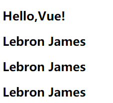

### 2、计算属性的复杂操作

```html
<!--
 * @Description: 
 * @version: 
 * @Author: henggao
 * @Date: 2019-10-08 10:13:23
 * @LastEditors: henggao
 * @LastEditTime: 2019-10-08 18:05:28
 -->
<!DOCTYPE html>
<html lang="en">
<head>
    <meta charset="UTF-8">
    <meta name="viewport" content="width=device-width, initial-scale=1.0">
    <meta http-equiv="X-UA-Compatible" content="ie=edge">
    <title>Document</title>
</head>
<body>
<div id="app">
    <h2>{{message}}</h2>
    <h2>总价格：{{totalPrice}}</h2>

</div>
<script src="../js/vue.js"></script>   
<script>
    const app = new Vue({
        el:'#app',
        data:{
            message:'Hello,Vue!',
            books:[
                {id:110,name:'Linux',price:119},
                {id:111,name:'Java Web',price:169},
                {id:112,name:'Spring',price:129},
                {id:113,name:'Vue',price:109}
            ]

        },
        computed:{
            totalPrice:function(){
                let result = 0
                for (let i = 0; i < this.books.length; i++) {
                    result += this.books[i].price
                }
                return result

                // for(let i in this.books){
                //     this.books[i]
                // }

                // for(let book of this.books){

                // }
            }
        },
        methods:{

        }
    })
</script>
</body>
</html>
```

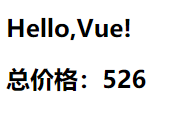

### 3、计算属性的setter和getter方法

```html
<!--
 * @Description: 
 * @version: 
 * @Author: henggao
 * @Date: 2019-10-08 10:13:23
 * @LastEditors: henggao
 * @LastEditTime: 2019-10-08 18:25:26
 -->
<!DOCTYPE html>
<html lang="en">
<head>
    <meta charset="UTF-8">
    <meta name="viewport" content="width=device-width, initial-scale=1.0">
    <meta http-equiv="X-UA-Compatible" content="ie=edge">
    <title>Document</title>
</head>
<body>
<div id="app">
    <h2>{{message}}</h2>
    <h2>{{fullName}}</h2>
</div>
<script src="../js/vue.js"></script>   
<script>
    const app = new Vue({
        el:'#app',
        data:{
            message:'Hello,Vue!',
            firstName:'Kobe',
            lastName:'Bryant'
        },
        computed:{
            // fullName:function(){
            //     return this.firstName + ' ' + this.lastName
            // }
            // 计算属性一般没有setter方法，只读属性
            fullName:{
                set: function(newValue){
                    // console.log('----' ,newValue);
                    const names = newValue.split(' ')
                    this.firstName = names[0]
                    this.lastName = names[1]
                },
                get:function(){
                    return this.firstName + " " + this.lastName
                }
            }
        }
    })
</script>
</body>
</html>
```

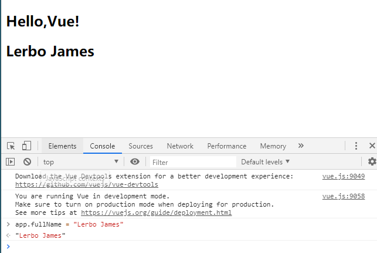

### 4、计算属性和methods对比

计算属性有缓存，尽量使用计算属性computed。

```html
<!--
 * @Description: 
 * @version: 
 * @Author: henggao
 * @Date: 2019-10-08 10:13:23
 * @LastEditors: henggao
 * @LastEditTime: 2019-10-08 18:40:30
 -->
<!DOCTYPE html>
<html lang="en">

<head>
    <meta charset="UTF-8">
    <meta name="viewport" content="width=device-width, initial-scale=1.0">
    <meta http-equiv="X-UA-Compatible" content="ie=edge">
    <title>Document</title>
</head>

<body>
    <div id="app">
        <!-- 通过定义methods -->
        <h2>{{getfulName()}}</h2>
        <h2>{{getfulName()}}</h2>
        <h2>{{getfulName()}}</h2>
        <!-- 通过computed -->
        <h2>{{fullName}}</h2>
        <h2>{{fullName}}</h2>
        <h2>{{fullName}}</h2>
    </div>
    <script src="../js/vue.js"></script>
    <script>
        const app = new Vue({
            el: '#app',
            data: {
                message: 'Hello,Vue!',
                firstName: 'Kobe',
                lastName: 'Bryant'
            },
            methods: {
                getfulName: function () {
                    console.log('getfullName');
                    return this.firstName + " " + this.lastName
                }
            },
            computed: {
                fullName: function () {
                    console.log('fullName');
                    return this.firstName + " " + this.lastName
                }
            }
        })
    </script>
</body>

</html>
```

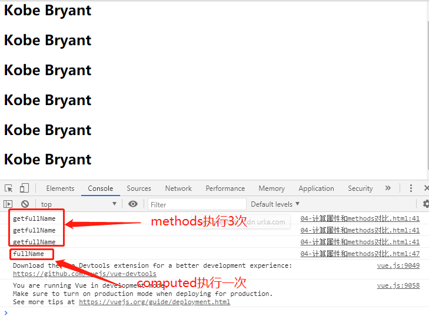

