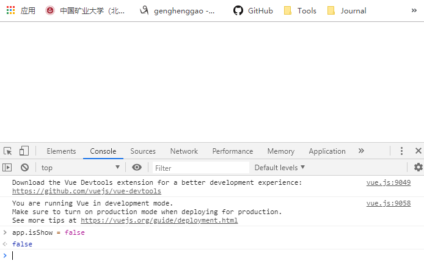
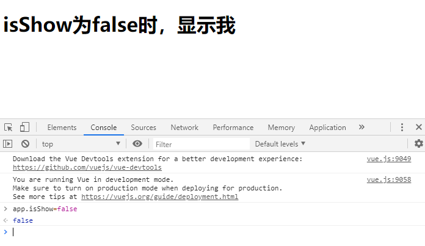
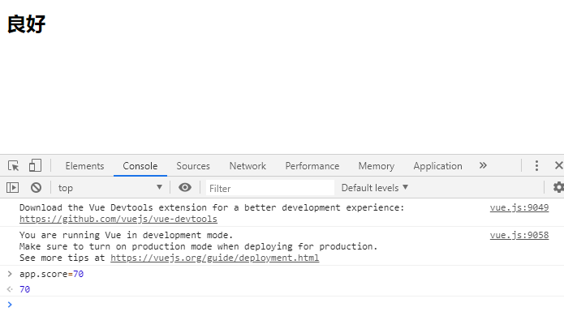
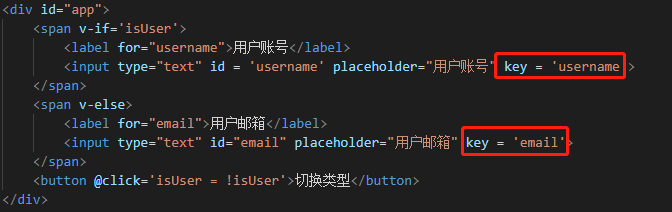
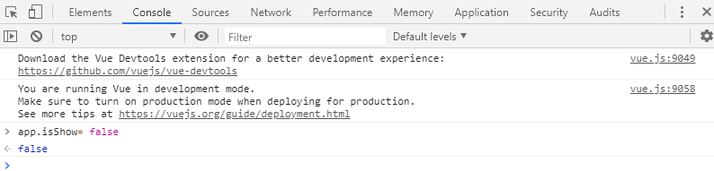
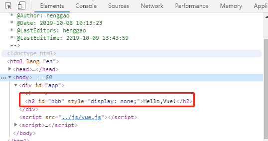
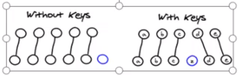
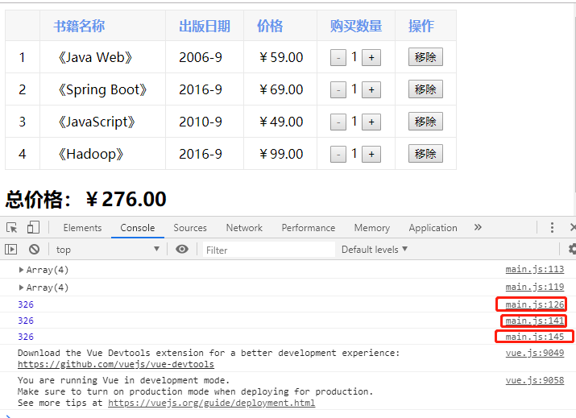

# Vue

[TOC]

## 一、事件监听

### 1、v-on基本使用

- `v-on:click`

- `@click`

```html
<!--
 * @Description: 
 * @version: 
 * @Author: henggao
 * @Date: 2019-10-08 10:13:23
 * @LastEditors: henggao
 * @LastEditTime: 2019-10-08 20:30:42
 -->
<!DOCTYPE html>
<html lang="en">
<head>
    <meta charset="UTF-8">
    <meta name="viewport" content="width=device-width, initial-scale=1.0">
    <meta http-equiv="X-UA-Compatible" content="ie=edge">
    <title>Document</title>
</head>
<body>
<div id="app">
    <h2>{{counter}}</h2>
    <button v-on:click='counter++'>+</button>
    <button v-on:click='counter--'>-</button>
    <button v-on:click='increment'>+</button>
    <button v-on:click='decrement'>-</button>
    <button @click='increment'>+</button>
    <button @click='decrement'>-</button>
</div>
<script src="../js/vue.js"></script>   
<script>
    const app = new Vue({
        el:'#app',
        data:{
            message:'Hello,Vue!',
            counter : 0
        },
        methods:{
            increment(){
                this.counter++
            },
            decrement(){
                this.counter--
            }
        }
    })
</script>
</body>
</html>
```

### 2、v-on的参数问题

```shell
<!--
 * @Description: 
 * @version: 
 * @Author: henggao
 * @Date: 2019-10-08 10:13:23
 * @LastEditors: henggao
 * @LastEditTime: 2019-10-08 20:55:32
 -->
<!DOCTYPE html>
<html lang="en">
<head>
    <meta charset="UTF-8">
    <meta name="viewport" content="width=device-width, initial-scale=1.0">
    <meta http-equiv="X-UA-Compatible" content="ie=edge">
    <title>Document</title>
</head>
<body>
<div id="app">
    <!-- 事件调用的方法没有参数 -->
    <button @click='btn1Click()'>按钮1</button>
    <button @click='btn1Click'>按钮2</button>
    
    <!-- 在事件定义时,写函数时省略了小括号，但方法本身是需要一个参数的，这个时候Vue会默认将浏览器的event事件作为参数传入到方法 -->
    <button @click='btn2Click(123)'>按钮3</button>
    <button @click='btn2Click'>按钮4</button>   
    
    <!-- 方法定义时，需要event对象，同时又需要其他参数 -->
    <!-- 在调用方式，如何手动的获取到浏览器参数event对象： $event -->
    <button @click='btn3Click(123, $event)'>按钮5</button>   
    <button @click='btn3Click(abc, $event)'>按钮6</button>   

</div>
<script src="../js/vue.js"></script>   
<script>
    const app = new Vue({
        el:'#app',
        data:{
            message:'Hello,Vue!',
            abc:666
        },
        methods:{
            btn1Click(){
                console.log("btn1Click");
            },
            btn2Click(event){
                console.log('----',event)
            },
            btn3Click(abc,event){
                console.log('++++',abc , event)
            }
        }
    })
</script>
</body>
</html>
```

### 3、v-on修饰符

```html
<!--
 * @Description: 
 * @version: 
 * @Author: henggao
 * @Date: 2019-10-08 10:13:23
 * @LastEditors: henggao
 * @LastEditTime: 2019-10-09 09:05:09
 -->
<!DOCTYPE html>
<html lang="en">
<head>
    <meta charset="UTF-8">
    <meta name="viewport" content="width=device-width, initial-scale=1.0">
    <meta http-equiv="X-UA-Compatible" content="ie=edge">
    <title>Document</title>
</head>
<body>
<div id="app">
    <!-- 1、 .stop修饰符使用 -->
    <div @click="divClick">
        aaaa
        <button @click.stop = 'btnClick'>按钮</button>
    </div>
    <br>

    <!-- 2、 .prevent修饰符使用 -->
    <form action = 'baidu'>
        <input type="submit" value="提交" @click.prevent='submitClick'>
    </form>
    <br>

    <!-- 3、 .监听某个键盘的键帽 -->
    <input type="text" @keyup.enter='keyUp'>
    <br>
    <br>

    <!-- 4、 .once修饰符使用 -->
    <button @click.once='btn2Click'>按钮2</button>
</div>
<script src="../js/vue.js"></script>   
<script>
    const app = new Vue({
        el:'#app',
        data:{
            message:'Hello,Vue!'
        },
        methods:{
            btnClick(){
                console.log('btnClick')
            },
            divClick(){
                console.log('divClick')
            },
            submitClick(){
                console.log('submitClick')
            },
            keyUp(){
                console.log('keyUp')
            },
            btn2Click(){
                console.log('btn2Click')
            }
        }
    })
</script>
</body>
</html>
```


## 二、条件判断

### 1、v-if

```html
<!--
 * @Description: 
 * @version: 
 * @Author: henggao
 * @Date: 2019-10-08 10:13:23
 * @LastEditors: henggao
 * @LastEditTime: 2019-10-09 09:10:22
 -->
<!DOCTYPE html>
<html lang="en">
<head>
    <meta charset="UTF-8">
    <meta name="viewport" content="width=device-width, initial-scale=1.0">
    <meta http-equiv="X-UA-Compatible" content="ie=edge">
    <title>Document</title>
</head>
<body>
<div id="app">
    <h2 v-if='false'>{{message}}</h2>
    <h2 v-if='isShow'>
        <div>James</div>
        <div>James</div>
        <div>James</div>
        <div>James</div>
        {{message}}
    </h2>
</div>
<script src="../js/vue.js"></script>   
<script>
    const app = new Vue({
        el:'#app',
        data:{
            message:'Hello,Vue!',
            isShow: true
        }
    })
</script>
</body>
</html>
```



### 2、v-if和v-else

```html
<!--
 * @Description: 
 * @version: 
 * @Author: henggao
 * @Date: 2019-10-08 10:13:23
 * @LastEditors: henggao
 * @LastEditTime: 2019-10-09 09:18:11
 -->
<!DOCTYPE html>
<html lang="en">
<head>
    <meta charset="UTF-8">
    <meta name="viewport" content="width=device-width, initial-scale=1.0">
    <meta http-equiv="X-UA-Compatible" content="ie=edge">
    <title>Document</title>
</head>
<body>
<div id="app">
    <h2 v-if='false'>{{message}}</h2>
    <h2 v-if='isShow'>
        <div>James</div>
        <div>James</div>
        <div>James</div>
        <div>James</div>
        {{message}}
    </h2>
    <h1 v-else='isShow'>isShow为false时，显示我</h1>
</div>
<script src="../js/vue.js"></script>   
<script>
    const app = new Vue({
        el:'#app',
        data:{
            message:'Hello,Vue!',
            isShow: true
        }
    })
</script>
</body>
</html>
```



### 3、v-if和v-else-if和v-else

```html
<!--
 * @Description: 
 * @version: 
 * @Author: henggao
 * @Date: 2019-10-08 10:13:23
 * @LastEditors: henggao
 * @LastEditTime: 2019-10-09 09:25:26
 -->
<!DOCTYPE html>
<html lang="en">
<head>
    <meta charset="UTF-8">
    <meta name="viewport" content="width=device-width, initial-scale=1.0">
    <meta http-equiv="X-UA-Compatible" content="ie=edge">
    <title>Document</title>
</head>
<body>
<div id="app">
    <h2 v-if= 'score>=90'>优秀</h2>
    <h2 v-else-if= 'score>=70'>良好</h2>
    <h2 v-else-if= 'score>=60'>及格</h2>
    <h2 v-else>不及格</h2>
</div>
<script src="../js/vue.js"></script>   
<script>
    const app = new Vue({
        el:'#app',
        data:{
            score: 99
        }
    })
</script>
</body>
</html>
```



- 复杂的逻辑判断，不采用这种方法，采用计算属性

```html
<!--
 * @Description: 
 * @version: 
 * @Author: henggao
 * @Date: 2019-10-08 10:13:23
 * @LastEditors: henggao
 * @LastEditTime: 2019-10-09 09:31:53
 -->
<!DOCTYPE html>
<html lang="en">
<head>
    <meta charset="UTF-8">
    <meta name="viewport" content="width=device-width, initial-scale=1.0">
    <meta http-equiv="X-UA-Compatible" content="ie=edge">
    <title>Document</title>
</head>
<body>
<div id="app">
    <h2 v-if= 'score>=90'>优秀</h2>
    <h2 v-else-if= 'score>=70'>良好</h2>
    <h2 v-else-if= 'score>=60'>及格</h2>
    <h2 v-else>不及格</h2>

    <h2>{{result}}</h2>
</div>
<script src="../js/vue.js"></script>   
<script>
    const app = new Vue({
        el:'#app',
        data:{
            score: 99
        },
        computed:{
            result(){
                let showMessage = ''
                if(this.score>=90){
                    showMessage = '优秀'
                }else if(this.score>=70){
                    showMessage = '良好'
                }else if(this.score>=60){
                    showMessage = '及格'
                }else{
                    showMessage = '不及格'
                }
                return showMessage
            }
        }
    })
</script>
</body>
</html>
```


### 4、用户登录切换案例

```html
<!--
 * @Description: 
 * @version: 
 * @Author: henggao
 * @Date: 2019-10-08 10:13:23
 * @LastEditors: henggao
 * @LastEditTime: 2019-10-09 09:40:57
 -->
<!DOCTYPE html>
<html lang="en">
<head>
    <meta charset="UTF-8">
    <meta name="viewport" content="width=device-width, initial-scale=1.0">
    <meta http-equiv="X-UA-Compatible" content="ie=edge">
    <title>Document</title>
</head>
<body>
<div id="app">
    <span v-if='isUser'>
        <label for="username">用户账号</label>
        <input type="text" id = 'username' placeholder="用户账号">
    </span>
    <span v-else>
        <label for="email">用户邮箱</label>
        <input type="text" id="email" placeholder="用户邮箱">
    </span>
    <button @click='isUser = !isUser'>切换类型</button>
</div>
<script src="../js/vue.js"></script>   
<script>
    const app = new Vue({
        el:'#app',
        data:{
            isUser: true
        }
    })
</script>
</body>
</html>
```

- 解决一个小问题

  添加`key`语句

  

### 5、v-if和v-show对比

```html
<!--
 * @Description: 
 * @version: 
 * @Author: henggao
 * @Date: 2019-10-08 10:13:23
 * @LastEditors: henggao
 * @LastEditTime: 2019-10-09 13:48:37
 -->
<!DOCTYPE html>
<html lang="en">
<head>
    <meta charset="UTF-8">
    <meta name="viewport" content="width=device-width, initial-scale=1.0">
    <meta http-equiv="X-UA-Compatible" content="ie=edge">
    <title>Document</title>
</head>
<body>
<div id="app">
    <!-- v-if:当条件为false时，包含v-if指令的元素，根本就不会存在DOM中 -->
    <h2 v-if='isShow' id = 'aaa'>{{message}}</h2>
    <!-- v-show：当条件为false时，v-show只是给元素添加一个行样式：display：none -->
    <h2 v-show='isShow' id = 'bbb'>{{message}}</h2>
</div>
<script src="../js/vue.js"></script>   
<script>
    const app = new Vue({
        el:'#app',
        data:{
            message:'Hello,Vue!',
            isShow:true
        }
    })
</script>
</body>
</html>
```


- v-if当条件为false时，没有对应的元素在DOM

- v-show当条件为false时，仅仅将元素的dispaly属性设置为none而已





- 当需要显示与隐藏之间切片频繁时，使用v-show
- 当只有一次切换时，通常使用v-if


## 三、循环遍历

### 1、v-for遍历数组

```html
<!--
 * @Description: 
 * @version: 
 * @Author: henggao
 * @Date: 2019-10-09 13:55:36
 * @LastEditors: henggao
 * @LastEditTime: 2019-10-09 13:55:36
 -->

<!DOCTYPE html>
<html lang="en">
<head>
    <meta charset="UTF-8">
    <meta name="viewport" content="width=device-width, initial-scale=1.0">
    <meta http-equiv="X-UA-Compatible" content="ie=edge">
    <title>Document</title>
</head>
<body>
    <div id="app">
        <!-- 1. 在遍历的过程中，没有使用索引值(下标值) -->
        <ul>
            <li v-for='item in names'>{{item}}</li>
        </ul>
        <!-- 2. 在遍历过程中，获取索引值 -->
        <ul v-for = '(item,index) in names'>
            {{index + 1}}.{{item}}
        </ul>
    </div>
<script src="../js/vue.js"></script>  
<script>
    const app = new Vue({
        el:'#app',
        data:{
            names:['James','Kobe','Wade']
        }
    })
</script>
</body>
</html>
```

### 2、v-for遍历对象

```html
<!--
 * @Description: 
 * @version: 
 * @Author: henggao
 * @Date: 2019-10-09 13:55:36
 * @LastEditors: henggao
 * @LastEditTime: 2019-10-09 14:11:28
 -->

<!DOCTYPE html>
<html lang="en">
<head>
    <meta charset="UTF-8">
    <meta name="viewport" content="width=device-width, initial-scale=1.0">
    <meta http-equiv="X-UA-Compatible" content="ie=edge">
    <title>Document</title>
</head>
<body>
    <div id="app">
        <!-- 1. 在遍历对象的过程中，如果只是获取一个值，那么获取到的是value -->
        <ul>
            <li v-for='item in info'>{{item}}</li>
        </ul>

        <!-- 2. 获取key和value 格式：(value , key) -->
        <ul>
            <li v-for='(value,key) in info '>{{value}}-{{key}}</li>
        </ul>

        <!-- 3.获取key和value和index  格式：（value,key,index）-->
        <ul>
            <li v-for='(value,key,index) in info'>{{value}}--{{key}}--{{index}}</li>
        </ul>
    </div>
<script src="../js/vue.js"></script>  
<script>
    const app = new Vue({
        el:'#app',
        data:{
            info:{
                name:'James',
                age:23,
                height:2.03
            }
        }
    })
</script>
</body>
</html>
```

### 3、v-for使用过程添加key

```html
<!--
 * @Description: 
 * @version: 
 * @Author: henggao
 * @Date: 2019-10-09 14:14:22
 * @LastEditors: henggao
 * @LastEditTime: 2019-10-09 16:09:28
 -->
<!DOCTYPE html>
<html lang="en">
<head>
    <meta charset="UTF-8">
    <meta name="viewport" content="width=device-width, initial-scale=1.0">
    <meta http-equiv="X-UA-Compatible" content="ie=edge">
    <title>Document</title>
</head>
<body>
    <div id="app">
        <!-- 1. 在遍历对象的过程中，如果只是获取一个值，那么获取到的是value -->
        <ul>
            <li v-for='item in letters' :key='item'>{{item}}</li>
        </ul>

    </div>
<script src="../js/vue.js"></script>  
<script>
    const app = new Vue({
        el:'#app',
        data:{
            letters:['A','B','C','D','E']
        }
    })
</script>
</body>
</html>
```


- key的作用主要是高效的更新虚拟DOM。

  

### 4、哪些数组的方法是响应式的

```html
<!--
 * @Description: 
 * @version: 
 * @Author: henggao
 * @Date: 2019-10-09 14:14:22
 * @LastEditors: henggao
 * @LastEditTime: 2019-10-09 16:43:14
 -->
 <!DOCTYPE html>
 <html lang="en">
 <head>
     <meta charset="UTF-8">
     <meta name="viewport" content="width=device-width, initial-scale=1.0">
     <meta http-equiv="X-UA-Compatible" content="ie=edge">
     <title>Document</title>
 </head>
 <body>
     <div id="app">
         <!-- 1. 在遍历对象的过程中，如果只是获取一个值，那么获取到的是value -->
         <ul>
             <li v-for='item in letters'>{{item}}</li>
         </ul>
         <button @click='btnClick'>按钮</button>
     </div>
 <script src="../js/vue.js"></script>  
 <script>
     const app = new Vue({
         el:'#app',
         data:{
             letters:['A','B','C','D','E']
         },
         methods:{
             btnClick(){
                //  1、push方法
                //  this.letters.push('aaa')

                // 2、pop():删除最后一个元素
                // this.letters.pop()
                
                // 3.shift()删除数组中的第一个元素
                // this.letters.shift()

                // 4. unshift(): 在数组最前面添加元素
                // this.letters.unshift()
                // this.letters.unshift('aaa','bbb','ccc')

                // splice作用：删除元素/插入元素/替换元素
                // splice(start)
                // 删除元素：第二个参数传入你要删除几个元素(如果没有传，则删除后面所有元素)
                // this.letters.splice(1,2)
                // 替换元素：第二个参数，表示要替换的个数，后面用于替换的元素
                // this.letters.splice(1,3,'m','n','x')
                // 替换元素：第二个参数，传入0，表示后面要插入的元素
                // this.letters.splice(1,0,'m','n','x')

                //5.sort()
                // this.letters.sort()

                // 6.reverse()
                // this.letters.reverse()


                //  注意：通过索引值修改的数组的元素，不是响应式的
                // this.letters[0] = 'bbbb'

                // set(要修改的对象，索引值，修改后的值))
                Vue.set(this.letters,0,'bbbb')
             }
         }
     })
 </script>
 </body>
 </html>
```

### 5、案例（点击选项变色）

```html
<!--
 * @Description: 
 * @version: 
 * @Author: henggao
 * @Date: 2019-10-08 10:13:23
 * @LastEditors: henggao
 * @LastEditTime: 2019-10-09 16:53:34
 -->
<!DOCTYPE html>
<html lang="en">

<head>
    <meta charset="UTF-8">
    <meta name="viewport" content="width=device-width, initial-scale=1.0">
    <meta http-equiv="X-UA-Compatible" content="ie=edge">
    <title>Document</title>
    <style>
        .active{
            color:red;
        }
    </style>
</head>

<body>
    <div id="app">
        <ul>
            <li v-for='(item,index) in movies' 
            :class="{active:currentIndex === index}"
            @click = 'liClick(index)'> 
            {{item}}
            </li>
        </ul>
    </div>
    <script src="../js/vue.js"></script>
    <script>
        const app = new Vue({
            el: '#app',
            data: {
                movies: ['海王', '海贼王', '加勒比海盗', '海尔兄弟'],
                currentIndex: 0
            },
            methods:{
                liClick(index){
                    this.currentIndex = index
                }
            }
        })
    </script>
</body>

</html>
```

## 四、书籍购物车

- index.html

  ```html
  
  ```

  - toFixed(2)	保留2位效数
  - 

- style.css

  ```css
  table{
      border: 1px solid #e9e9e9;
      border-collapse:collapse;
      border-spacing: 0;
  }
  
  th, td{
      padding: 8px 16px;
      border: 1px solid #e9e9e9;
      text-align: left;
  }
  
  th{
      background-color:  #f7f7f7;
      color: cornflowerblue;
      font-size: 600;
  }
  ```

  

- main.js

  ```js
  /*
   * @Description: 
   * @version: 
   * @Author: henggao
   * @Date: 2019-10-09 17:41:39
   * @LastEditors: henggao
   * @LastEditTime: 2019-10-09 22:24:10
   */
  const app = new Vue({
      el: '#app',
      data: {
          books: [
              {
                  id: 1,
                  name: '《Java Web》',
                  date: '2006-9',
                  price: 59.00,
                  count: 1
              },
              {
                  id: 2,
                  name: '《Spring Boot》',
                  date: '2016-9',
                  price: 69.00,
                  count: 1
              },
              {
                  id: 3,
                  name: '《JavaScript》',
                  date: '2010-9',
                  price: 49.00,
                  count: 1
              },
              {
                  id: 4,
                  name: '《Hadoop》',
                  date: '2016-9',
                  price: 99.00,
                  count: 1
              },
          ]
      },
      methods: {
          // getFinalPrice(price){
          //     return '￥' + price.toFixed(2)
          // }
          increment(index) {
              // console.log('increment' + index);
              this.books[index].count++
  
          },
          decrement(index) {
              // console.log('decrement '+  index);
              this.books[index].count--
  
          },
          // 移除按钮
          removeHandle(index) {
              this.books.splice(index, 1)
          }
      },
      computed: {
          totalPrice() {
  
              let totalPrice = 0
              
              // 1. 普通的for循环
              // for (let i = 0; i < this.books.length; i++) {
              //     totalPrice +=this.books[i].price * this.books[i].count
              // }
              // return totalPrice
  
              // 2. for(let i in  this.books)
              // for(let i in this.books){
              //     // console.log(i);
              //     totalPrice +=this.books[i].price * this.books[i].count
              // }
              // return totalPrice
  
              // 3. for(let i of this.books)
              // for (let item of this.books) {
              //     totalPrice += item.price * item.count
              // }
              // return totalPrice
  
              // 4. reduce 数组高阶函数
              return this.books.reduce(function(preValue, book){
                  return preValue + book.price * book.count
              },0)
  
          }
      },
      filters: { //过滤器
          showPrice(price) {
              return '￥' + price.toFixed(2)
          }
      },
  })
  
  
  
  // 编程范式：命令式编程/声明式编程
  // 编程范式： 面向对象编程(第一公民；对象)/函数式编程(第一公民:函数)
  // 数组高阶函数例子 filter/map/reduce
  const nums = [20,40,23,80,100,156,188]
  // 1.filter函数
  // filter中的回调函数有一个要求：必须返回一个boolean值
  // true: 当返回值为true时，函数内部会自动将这次回调的n加入新的数组
  // false:当返回值为false时，函数内部会过滤掉这次的n
  let newNums =  nums.filter(function(n){
  return n < 100
  })
  console.log(newNums); //20, 40, 23, 80
  
  // 2.map函数
  let new2Nums = newNums.map(function(n){
      return n * 2
  })
  console.log(new2Nums) //40, 80, 46, 160
  
  // 3.reduce函数
  // reduce作用多数组中所有的内容进行汇总
  let total= new2Nums.reduce(function(preValue, n ){
      return preValue + n
  },0)
  console.log(total)
  // 第一次: preValue 0  n 40
  // 第一次: preValue 40  n 80
  // 第一次: preValue 120  n 46
  // 第一次: preValue 166  n 160
  // 326
  
  // filter/map/reduce结合起来
  let total1 = nums.filter(function(n){
      return n <100
  }).map(function(n){
      return n * 2
  }).reduce(function(preValue ,n){
      return preValue + n
  },0)
  console.log(total1)
  
  // 换一种方法(箭头函数)
  let total2 = nums.filter(n => n < 100).map(n => n *2).reduce((pre,n) => pre + n );
  console.log(total2)
  ```

  

- 数组高阶函数
  - filter函数
  - map函数
  - reduce函数



