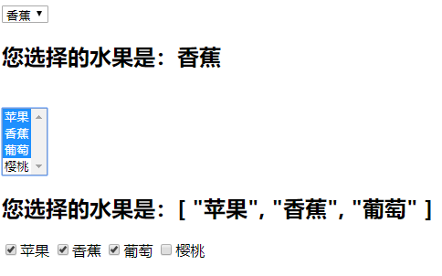
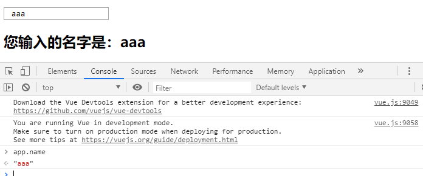
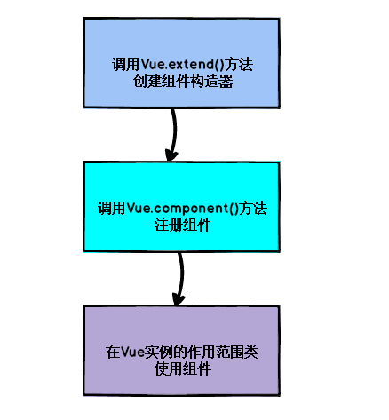
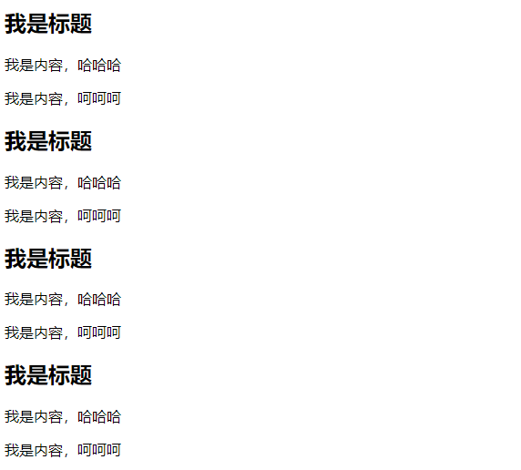

# Vue

[TOC]

## 一、v-model基本使用

### 1、v-model基本使用

```html
<!--
 * @Description: 
 * @version: 
 * @Author: henggao
 * @Date: 2019-10-08 10:13:23
 * @LastEditors: henggao
 * @LastEditTime: 2019-10-09 22:41:02
 -->
<!DOCTYPE html>
<html lang="en">
<head>
    <meta charset="UTF-8">
    <meta name="viewport" content="width=device-width, initial-scale=1.0">
    <meta http-equiv="X-UA-Compatible" content="ie=edge">
    <title>Document</title>
</head>
<body>
<div id="app">
    <!-- <input type="text" v-model='message'> -->
    <!-- <input type="text" :value='message' v-on:input="valueChange"> -->
    <!-- <input type="text" :value='message' @input="valueChange"> -->
    <input type="text" :value='message' @input="message = $event.target.value">
    <h2>{{message}}</h2>
</div>
<script src="../js/vue.js"></script>   
<script>
    const app = new Vue({
        el:'#app',
        data:{
            message:'Hello,Vue!'
        },
        methods:{
            valueChange(){
                // this.message = 'aaaaa'
                this.message = event.target.value;
            }
        }
    })
</script>
</body>
</html>
```

### 2、v-model结合radio类型

```html
<!--
 * @Description: 
 * @version: 
 * @Author: henggao
 * @Date: 2019-10-08 10:13:23
 * @LastEditors: henggao
 * @LastEditTime: 2019-10-10 08:45:46
 -->
<!DOCTYPE html>
<html lang="en">
<head>
    <meta charset="UTF-8">
    <meta name="viewport" content="width=device-width, initial-scale=1.0">
    <meta http-equiv="X-UA-Compatible" content="ie=edge">
    <title>Document</title>
</head>
<body>
<div id="app">
    <label for="male">
        <input type="radio" id = 'male' value="男" name="sex" v-model='sex'>男
    </label>
    <label for="female">
        <input type="radio" id = 'female' value="女" name="sex" v-model='sex'>女
    </label>
    <h2>您选择得性别是：{{sex}}</h2>
</div>
<script src="../js/vue.js"></script>   
<script>
    const app = new Vue({
        el:'#app',
        data:{
            message:'Hello,Vue!',
            sex:'女'
        }
    })
</script>
</body>
</html>
```

### 3、v-model结合checkbox类型

```html
<!--
 * @Description: 
 * @version: 
 * @Author: henggao
 * @Date: 2019-10-08 10:13:23
 * @LastEditors: henggao
 * @LastEditTime: 2019-10-10 09:12:06
 -->
<!DOCTYPE html>
<html lang="en">
<head>
    <meta charset="UTF-8">
    <meta name="viewport" content="width=device-width, initial-scale=1.0">
    <meta http-equiv="X-UA-Compatible" content="ie=edge">
    <title>Document</title>
</head>
<body>
<div id="app">
    <!-- 1. checkbox单选框 -->
    <label for="agree">
        <input type="checkbox" id= 'agree' v-model='isAgree'>
    </label>
    <h2>您选择的是：{{isAgree}}</h2>
    <button :disabled="!isAgree">下一步</button>
    <br>
    <br>

    <!-- 2.checkbox多选框 -->
    <input type="checkbox" value="篮球" v-model='hobbies'>篮球
    <input type="checkbox" value="足球" v-model='hobbies'>足球
    <input type="checkbox" value="羽毛球" v-model='hobbies'>羽毛球
    <input type="checkbox" value="乒乓球" v-model='hobbies'>乒乓球
    <h2>您的爱好是:{{hobbies}}</h2>
</div>
<script src="../js/vue.js"></script>   
<script>
    const app = new Vue({
        el:'#app',
        data:{
            message:'Hello,Vue!',
            isAgree:false, //单选框
            hobbies:[], //多选框
        }
    })
</script>
</body>
</html>
```

### 4、v-model结合select类型

```html
<!--
 * @Description: 
 * @version: 
 * @Author: henggao
 * @Date: 2019-10-08 10:13:23
 * @LastEditors: henggao
 * @LastEditTime: 2019-10-10 09:15:46
 -->
<!DOCTYPE html>
<html lang="en">
<head>
    <meta charset="UTF-8">
    <meta name="viewport" content="width=device-width, initial-scale=1.0">
    <meta http-equiv="X-UA-Compatible" content="ie=edge">
    <title>Document</title>
</head>
<body>
<div id="app">
    <!-- 1.选择一个 -->
    <select name="abc" v-model='fruit'>
        <option value="苹果">苹果</option>
        <option value="香蕉">香蕉</option>
        <option value="葡萄">葡萄</option>
        <option value="樱桃">樱桃</option>
    </select>
    <h2>您选择的水果是：{{fruit}}</h2>
    <br>


    <!-- 2.选择多个 -->
    <select name="abc" v-model='fruits' multiple>
        <option value="苹果">苹果</option>
        <option value="香蕉">香蕉</option>
        <option value="葡萄">葡萄</option>
        <option value="樱桃">樱桃</option>
    </select>
    <h2>您选择的水果是：{{fruits}}</h2>

    <label v-for="item in originFruits" :for='item'>
        <input type="checkbox" :value='item' :id='item' v-model='fruits'>{{item}}
    </label>
</div>
<script src="../js/vue.js"></script>   
<script>
    const app = new Vue({
        el:'#app',
        data:{
            message:'Hello,Vue!',
            fruit:'香蕉', //单选框
            fruits:[],  //多选框
            originFruits:['苹果','香蕉','葡萄','樱桃'],

        }
    })
</script>
</body>
</html>
```



- 多选，按住ctrl选择

### 5、v-model修饰符

```html
<!--
 * @Description: 
 * @version: 
 * @Author: henggao
 * @Date: 2019-10-08 10:13:23
 * @LastEditors: henggao
 * @LastEditTime: 2019-10-10 09:26:49
 -->
<!DOCTYPE html>
<html lang="en">
<head>
    <meta charset="UTF-8">
    <meta name="viewport" content="width=device-width, initial-scale=1.0">
    <meta http-equiv="X-UA-Compatible" content="ie=edge">
    <title>Document</title>
</head>
<body>
<div id="app">
    <!-- 1. 修饰符:lazy  点击回车才显示 -->
    <input type="text" v-model.lazy='message'>
    <h2>{{message}}</h2>
    <br>


    <!-- 2. 修饰符：number 输入值类型为number -->
    <input type="number" v-model.number='age'>
    <h2>{{age}}---{{typeof age}}</h2>

    <!-- 3. 修饰符：trim  删除左右的空格-->
    <input type="text" v-model.trim='name'>
    <h2>您输入的名字是：{{name}}</h2>
</div>
<script src="../js/vue.js"></script>   
<script>
    const app = new Vue({
        el:'#app',
        data:{
            message:'Hello,Vue!',
            age:0,
            name:'',
        }
    })
</script>
</body>
</html>
```




## 二、组件化

- 组件化使用步骤
  - 创建组件构造器
  - 注册组件
  - 使用组件



- ES6语法 ``和''相似，但可以换行。

### 1、组件化开发基本使用

```html
<!--
 * @Description: 
 * @version: 
 * @Author: henggao
 * @Date: 2019-10-08 10:13:23
 * @LastEditors: henggao
 * @LastEditTime: 2019-10-10 09:57:36
 -->
<!DOCTYPE html>
<html lang="en">
<head>
    <meta charset="UTF-8">
    <meta name="viewport" content="width=device-width, initial-scale=1.0">
    <meta http-equiv="X-UA-Compatible" content="ie=edge">
    <title>Document</title>
</head>
<body>
<div id="app">
    <!-- 3. 使用组件 -->
    <my-cpn></my-cpn>
    <my-cpn></my-cpn>
    <my-cpn></my-cpn>
    <my-cpn></my-cpn>
</div>
<script src="../js/vue.js"></script>   
<script>
    //ES6语法 ``和''相似，但可以换行。

    // 1.创建组件构造器
    const cpnC = Vue.extend({
        template:`
        <div>
            <h2>我是标题</h2>
            <p>我是内容，哈哈哈</p>
            <p>我是内容，呵呵呵</p>
        </div>
        `
    })
    //2. 注册组件
    Vue.component('my-cpn',cpnC)
    
    const app = new Vue({
        el:'#app',
        data:{
            message:'Hello,Vue!'
        }
    })
</script>
</body>
</html>
```



### 2、全局组件和局部组件

```html
<!--
 * @Description: 
 * @version: 
 * @Author: henggao
 * @Date: 2019-10-08 10:13:23
 * @LastEditors: henggao
 * @LastEditTime: 2019-10-10 10:36:14
 -->
<!DOCTYPE html>
<html lang="en">
<head>
    <meta charset="UTF-8">
    <meta name="viewport" content="width=device-width, initial-scale=1.0">
    <meta http-equiv="X-UA-Compatible" content="ie=edge">
    <title>Document</title>
</head>
<body>
<div id="app">
    <!-- 3. 使用组件 -->
    <cpn></cpn>
    <cpn></cpn>
</div>

<div id="app2">
    <cpn></cpn>
</div>
<script src="../js/vue.js"></script>   
<script>
    //ES6语法 ``和''相似，但可以换行。

    // 1.创建组件构造器
    const cpnC = Vue.extend({
        template:`
        <div>
            <h2>我是标题</h2>
            <p>我是内容，哈哈哈</p>
            <p>我是内容，呵呵呵</p>
        </div>
        `
    })

    //2. 注册组件（全局组件，可以在多个Vue的实例下面使用）
    // 怎么注册的组件才是局部组件
    //Vue.component('cpn',cpnC)    //全局组件
    
    const app = new Vue({
        el:'#app',
        data:{
            message:'Hello,Vue!'
        },
        components: {
            // cpn使用组件是的标签名
            cpn: cpnC  //局部组件
        }
    })


    const app2 = new Vue({
        el:'#app2'
    })
</script>
</body>
</html>
```

### 3、父组件和子组件

```html
<!--
 * @Description: 
 * @version: 
 * @Author: henggao
 * @Date: 2019-10-08 10:13:23
 * @LastEditors: henggao
 * @LastEditTime: 2019-10-10 10:47:08
 -->
<!DOCTYPE html>
<html lang="en">
<head>
    <meta charset="UTF-8">
    <meta name="viewport" content="width=device-width, initial-scale=1.0">
    <meta http-equiv="X-UA-Compatible" content="ie=edge">
    <title>Document</title>
</head>
<body>

<div id="app">
    <!-- 3. 使用组件 -->
    <!-- <cpn1></cpn1> -->
    <cpn2></cpn2>
</div>
<script src="../js/vue.js"></script>   
<script>

    //1.创建第一个组件构造器(子组件))
    const cpnC1 = Vue.extend({
        template: `
        <div>
            <h2>我是标题1</h2>
            <p>我是内容，哈哈哈</p>
        </div>
        `
    })


    //2.创建第二个组件构造器(父组件)
    const cpnC2 = Vue.extend({
        template: `
        <div>
            <h2>我是标题2</h2>
            <p>我是内容，呵呵呵</p>
            <cpn1></cpn1>
        </div>
        `,
        components:{
            cpn1:cpnC1
        }
    })

    //2. 注册组件（全局组件，可以在多个Vue的实例下面使用）
    // 怎么注册的组件才是局部组件
    // Vue.component('cpn',cpnC)    //全局组件
    
    // root组件
    const app = new Vue({
        el:'#app',
        data:{
            message:'Hello,Vue!'
        },
        components: {
            // cpn使用组件是的标签名
            // cpn1: cpnC1,  //局部组件
            cpn2:cpnC2,
        }
    })

    const app2 = new Vue({
        el:'#app2'
    })
</script>
</body>
</html>
```

### 4、注册组件语法糖

```html
<!--
 * @Description: 
 * @version: 
 * @Author: henggao
 * @Date: 2019-10-08 10:13:23
 * @LastEditors: henggao
 * @LastEditTime: 2019-10-10 10:58:07
 -->
<!DOCTYPE html>
<html lang="en">
<head>
    <meta charset="UTF-8">
    <meta name="viewport" content="width=device-width, initial-scale=1.0">
    <meta http-equiv="X-UA-Compatible" content="ie=edge">
    <title>Document</title>
</head>
<body>

<div id="app">
    <!-- 3. 使用组件 -->
    <cpn1></cpn1>
    <cpn2></cpn2>
</div>
<script src="../js/vue.js"></script>   
<script>

    //1. 全局组件注册的语法糖  

    //1.创建组件构造器
    // const cpnC1 = Vue.extend()

    //2. 注册组件
    Vue.component('cpn1',{
        template: `
        <div>
            <h2>我是标题1</h2>
            <p>我是内容，哈哈哈</p>
        </div>
        `
    })

    const app = new Vue({
        el:'#app',
        data:{
            message:'Hello,Vue!'
        },
        components: {
            // cpn1:cpnC1,
            'cpn2':{
                template: `
                    <div>
                        <h2>我是标题2</h2>
                        <p>我是内容，呵呵呵</p>
                    </div>
                `
            }
            
        }
    })

</script>
</body>
</html>
```

### 5、组件模板抽离的写法

```html
<!--
 * @Description: 
 * @version: 
 * @Author: henggao
 * @Date: 2019-10-08 10:13:23
 * @LastEditors: henggao
 * @LastEditTime: 2019-10-10 11:08:08
 -->
<!DOCTYPE html>
<html lang="en">
<head>
    <meta charset="UTF-8">
    <meta name="viewport" content="width=device-width, initial-scale=1.0">
    <meta http-equiv="X-UA-Compatible" content="ie=edge">
    <title>Document</title>
</head>
<body>

<div id="app">
    <!-- 3. 使用组件 -->
    <cpn></cpn>
    <cpn></cpn>
</div>


<!-- 1.script标签，注意;leixing bixueshi text -->
<!-- <script type="text/x-template" id="cpn">
<div>
    <h2>我是标题</h2>
    <p>我是内容，哈哈哈</p>
</div>
</script> -->


<!-- 2.template标签 -->
<template id="cpn">
    <div>
        <h2>我是标题</h2>
        <p>我是内容，呵呵呵</p>
    </div>
</template>

<script src="../js/vue.js"></script>   
<script>

    //1. 注册一个全局组件
    Vue.component('cpn',{
        template: '#cpn'
    })

    const app = new Vue({
        el:'#app',
        data:{
            message:'Hello,Vue!'
        },
    })

</script>
</body>
</html>
```

### 6、组件中存放问题

```html
<!--
 * @Description: 
 * @version: 
 * @Author: henggao
 * @Date: 2019-10-08 10:13:23
 * @LastEditors: henggao
 * @LastEditTime: 2019-10-10 14:18:32
 -->
<!DOCTYPE html>
<html lang="en">
<head>
    <meta charset="UTF-8">
    <meta name="viewport" content="width=device-width, initial-scale=1.0">
    <meta http-equiv="X-UA-Compatible" content="ie=edge">
    <title>Document</title>
</head>
<body>

<div id="app">
    <!-- 3. 使用组件 -->
    <cpn></cpn>
    <cpn></cpn>
</div>


<!-- 1.script标签，注意;leixing bixueshi text -->
<!-- <script type="text/x-template" id="cpn">
<div>
    <h2>我是标题</h2>
    <p>我是内容，哈哈哈</p>
</div>
</script> -->


<!-- 2.template标签 -->
<template id="cpn">
    <div>
        <h2>{{title}}</h2>
        <p>我是内容，呵呵呵</p>
    </div>
</template>

<script src="../js/vue.js"></script>   
<script>

    //1. 注册一个全局组件
    Vue.component('cpn',{
        template: '#cpn',
        data(){ //data必须是一个函数，不能是对象
            return{
                title:'abc' //组件中使用的title
            }
        }
    })

    const app = new Vue({
        el:'#app',
        data:{
            message:'Hello,Vue!',
            title: '我是标题',  //组件中不能使用这里的title，找不到
        },
    })

</script>
</body>
</html>
```


### 7、data必须是函数

```html
<!--
 * @Description: 
 * @version: 
 * @Author: henggao
 * @Date: 2019-10-08 10:13:23
 * @LastEditors: henggao
 * @LastEditTime: 2019-10-10 14:18:22
 -->
<!DOCTYPE html>
<html lang="en">
<head>
    <meta charset="UTF-8">
    <meta name="viewport" content="width=device-width, initial-scale=1.0">
    <meta http-equiv="X-UA-Compatible" content="ie=edge">
    <title>Document</title>
</head>
<body>

<div id="app">
    <!-- 3. 使用组件 -->
    <cpn></cpn>
    <cpn></cpn>
</div>


<!-- 2.template标签 -->
<template id="cpn">
    <div>
        <h2>当前记数：{{counter}}</h2>
        <button @click='increment'> + </button>
        <button @click='decrement'> - </button>
    </div>
</template>

<script src="../js/vue.js"></script>   
<script>

    //1. 注册一个全局组件
    Vue.component('cpn',{
        template: '#cpn',
        data(){ //必须是一个函数，不能是对象,对象会相互影响
            return{
                counter: 0 
            }
        },
        methods:{
            increment(){
                this.counter ++
            },
            decrement(){
                this.counter--
            }
        }
    })

    const app = new Vue({
        el:'#app',
        data:{
            message:'Hello,Vue!',
        },
    })

</script>
</body>
</html>
```

- data必须是一个函数，不能是对象,对象会相互影响

### 8、组件的通信-父组件向子组件传递数据

```html
<!--
 * @Description: 
 * @version: 
 * @Author: henggao
 * @Date: 2019-10-08 10:13:23
 * @LastEditors: henggao
 * @LastEditTime: 2019-10-10 17:34:07
 -->
<!DOCTYPE html>
<html lang="en">
<head>
    <meta charset="UTF-8">
    <meta name="viewport" content="width=device-width, initial-scale=1.0">
    <meta http-equiv="X-UA-Compatible" content="ie=edge">
    <title>Document</title>
</head>
<body>

<div id="app">
    <!-- 3. 使用组件 -->
    <!-- <cpn cmovies='movies' cmessage='message'></cpn>   -->
    <!-- 一定要用v-bind，不然不会获取数据 -->

    <!-- <cpn v-bind:cmovies='movies' :cmessage='message'></cpn> -->
    <!-- aaaa -->
    <cpn v-bind:cmovies='movies' :cmessage='message'></cpn>     
</div>

<!-- 2.template标签 -->
<template id="cpn">
    <div>
        <!-- <p>{{cmovies}}</p> -->
        <ul>
            <li v-for='item in cmovies'>{{item}}</li>
        </ul>
        <h2>{{cmessage}}</h2>
    </div>
</template>

<script src="../js/vue.js"></script>   
<script>
    const cpn = {
        template:'#cpn',

        // 1.数组
        // props:['cmovies','cmessage'], //数组

        // 2.对象
        props:{  //对象
            // 2.1.类型限制
            // cmovies:Array,
            // cmessage:String,

            //2.2.提供一些默认值,以及必传值
            cmessage:{
                type:String, //类型
                default:'aaaa',  //默认值
                require: true, //必传值
            },
            cmovies:{
                type:Array,
                // default:[],   //vue2.5.3以下不会报错，2.5.17会报错
                // 类型是对象或者是数组时，默认值必须是一个函数
                default(){
                    return []
                }
            }
        },
        data(){
            return {}
        },
        methods:{

        }
    }

    const app = new Vue({
        el:'#app',
        data:{
            message:'Hello,Vue!',
            movies:['我和我的祖国','中国机长','攀登者']
        },
        components:{
            cpn
        }
    })

</script>
</body>
</html>
```

### 9、组件通信-父传子中的驼峰标识

```html
<!--
 * @Description: 
 * @version: 
 * @Author: henggao
 * @Date: 2019-10-08 10:13:23
 * @LastEditors: henggao
 * @LastEditTime: 2019-10-10 17:52:03
 -->
<!DOCTYPE html>
<html lang="en">
<head>
    <meta charset="UTF-8">
    <meta name="viewport" content="width=device-width, initial-scale=1.0">
    <meta http-equiv="X-UA-Compatible" content="ie=edge">
    <title>Document</title>
</head>
<body>

<div id="app">
    <!-- 3. 使用组件 -->
    <!-- 使用驼峰标识转换 -->
    <cpn :c-info='info' :child-my-message='message'></cpn>
</div>

<!-- 2.template标签 -->
<template id="cpn">
    <div>
        <h2>{{cInfo}}</h2>
        <h2>{{childMyMessage}}</h2>
    </div>
</template>

<script src="../js/vue.js"></script>   
<script>

    const cpn = {
        template:'#cpn',
        props:{
            cInfo:{
                type:Object,
                default(){
                    return {}
                }
            },
            childMyMessage:{
                type:String,
                default:''
            }
        },
    }
    //1. 注册一个全局组件
    const app = new Vue({
        el:'#app',
        data:{
            info:{
                name:'henggao',
                age:23,
                height:1.72
            },
            message: 'Hello,Vue !'
        },
        components:{
            cpn
        }
    })

</script>
</body>
</html>
```

### 10、组件通信-子传父(自定义事件)

```html
<!--
 * @Description: 
 * @version: 
 * @Author: henggao
 * @Date: 2019-10-08 10:13:23
 * @LastEditors: henggao
 * @LastEditTime: 2019-10-10 18:13:07
 -->
<!DOCTYPE html>
<html lang="en">
<head>
    <meta charset="UTF-8">
    <meta name="viewport" content="width=device-width, initial-scale=1.0">
    <meta http-equiv="X-UA-Compatible" content="ie=edge">
    <title>Document</title>
</head>
<body>

<!-- 父组件模板 -->
<div id="app">
    <cpn @item-click ='cpnClick'></cpn>
</div>

<!-- 子组件模板 -->
<template id="cpn">
    <div>
        <button v-for='item in categories' 
                @click='btnClick(item)' >
            {{item.name}}
        </button>
    </div>
</template>

<script src="../js/vue.js"></script>   
<script>

    // 1.子组件
    const cpn = {
        template:'#cpn',
        data(){
            return{
                categories:[
                    {id:'aaa',name:'热门推荐'},
                    {id:'bbb',name:'手机数码'},
                    {id:'ccc',name:'家用电器'},
                    {id:'ddd',name:'电脑办公'}
                ]
            }
        },
        methods:{
            btnClick(item){
                // console.log(item)
                // 发射事件
                this.$emit('item-click' , item)
            }
        }
    }
    //2.父组件
    const app = new Vue({
        el:'#app',
        data:{
            message: 'Hello,Vue !'
        },
        components:{
            cpn
        },
        methods:{
            cpnClick(item){
                console.log('cpnClick',item)
            }
        }
    })

</script>
</body>
</html>
```

### 11、组件通信-父子组件通信案例

```html
<!--
 * @Description: 
 * @version: 
 * @Author: henggao
 * @Date: 2019-10-10 19:10:35
 * @LastEditors: henggao
 * @LastEditTime: 2019-10-10 20:00:45
 -->
<!DOCTYPE html>
<html lang="en">

<head>
    <meta charset="UTF-8">
    <meta name="viewport" content="width=device-width, initial-scale=1.0">
    <meta http-equiv="X-UA-Compatible" content="ie=edge">
    <title>Document</title>
</head>

<body>
    <div id="app">
        <cpn :number1='num1' :number2='num2' @num1change='num1change' @num2change='num2change'>
        </cpn>
    </div>

    <!-- 子组件 -->
    <template id='cpn'>
        <div>
            <h2>props:{{number1}}</h2>
            <h2>data:{{dnumber1}}</h2>
            <!-- <input type="text" v-model='dnumber1'> -->
            <!-- <input type="text" v-bind:value='dnumber1' @input='dnumber1 = $event.target.value'> -->
            <input type="text" v-bind:value='dnumber1' @input='num1Input'>
            <h2>props:{{number2}}</h2>
            <h2>data:{{dnumber2}}</h2>
            <!-- <input type="text" v-model='dnumber2'> -->
            <!-- <input type="text" v-bind:value='dnumber2' @input='dnumber2 = $event.target.value'> -->
            <input type="text" v-bind:value='dnumber2' @input='num2Input'>
        </div>
    </template>
    <script src="../js/vue.js"></script>
    <script>
        // 子组件
        const cpn = {
            template: 'cpn'
        }

        // 父组件
        const app = new Vue({
            el: '#app',
            data: {
                num1: 1,
                num2: 0,
            },
            methods: {
                num1change(value) {
                    // console.log(typeof value)
                    // this.num1 = value * 1
                    this.num1 = parseFloat(value)
                },
                num2change(value) {
                    this.num2 = parseFloat(value)
                }
            },
            components: {
                cpn: {
                    template: '#cpn',
                    props: {
                        number1: Number,
                        number2: Number
                    },
                    data() { //组件中的data必须是函数
                        return {
                            dnumber1: this.number1,
                            dnumber2: this.number2
                        }
                    },
                    methods: {
                        num1Input(event) {
                            //1. 将input中的value复制到dnumber1中
                            this.dnumber1 = event.target.value;

                            // 2. 为了让父组件可以修改值，发出一个事件
                            this.$emit('num1change', this.dnumber1)

                            // 3. 同时修饰dumber2的值
                            this.dnumber2 = this.dnumber1 * 100     //改变input的值
                            this.$emit('num2change', this.dnumber2)  //改变props的值
                        },
                        num2Input(event) {
                            this.dnumber2 = event.target.value
                            this.$emit('num2change', this.dnumber2)

                            this.dnumber1 = this.dnumber2 / 100
                            this.$emit('num1change', this.dnumber1)
                        }
                    }
                }
            }
        })
    </script>
</body>

</html>
```


### 12、组件通信-父子组件通信案例(watch实现)

```html
<!--
 * @Description: 
 * @version: 
 * @Author: henggao
 * @Date: 2019-10-10 19:10:35
 * @LastEditors: henggao
 * @LastEditTime: 2019-10-10 20:40:40
 -->
<!DOCTYPE html>
<html lang="en">

<head>
    <meta charset="UTF-8">
    <meta name="viewport" content="width=device-width, initial-scale=1.0">
    <meta http-equiv="X-UA-Compatible" content="ie=edge">
    <title>Document</title>
</head>

<body>
    <div id="app">
        <cpn :number1='num1' :number2='num2' @num1change='num1change' @num2change='num2change'>
        </cpn>
    </div>

    <!-- 子组件 -->
    <template id='cpn'>
        <div>
            <h2>props:{{number1}}</h2>
            <h2>data:{{dnumber1}}</h2>
            <input type="text" v-model='dnumber1'>
            <!-- <input type="text" v-bind:value='dnumber1' @input='dnumber1 = $event.target.value'> -->
            <!-- <input type="text" v-bind:value='dnumber1' @input='num1Input'> -->
            <h2>props:{{number2}}</h2>
            <h2>data:{{dnumber2}}</h2>
            <input type="text" v-model='dnumber2'>
            <!-- <input type="text" v-bind:value='dnumber2' @input='dnumber2 = $event.target.value'> -->
            <!-- <input type="text" v-bind:value='dnumber2' @input='num2Input'> -->
        </div>
    </template>
    <script src="../js/vue.js"></script>
    <script>
        // 子组件
        const cpn = {
            template: 'cpn'
        }

        // 父组件
        const app = new Vue({
            el: '#app',
            data: {
                num1: 1,
                num2: 0,
            },
            methods: {
                num1change(value) {
                    // console.log(typeof value)
                    // this.num1 = value * 1
                    this.num1 = parseFloat(value)
                },
                num2change(value) {
                    this.num2 = parseFloat(value)
                }
            },
            components: {
                cpn: {
                    template: '#cpn',
                    props: {
                        number1: Number,
                        number2: Number
                    },
                    data() { //组件中的data必须是函数
                        return {
                            dnumber1: this.number1,
                            dnumber2: this.number2
                        }
                    },
                    watch: {
                        dnumber1(newValue) {
                            this.dnumber2 = this.dnumber1 * 100 //改变input的值
                            this.$emit('num2change', this.dnumber2) //改变props的值
                        },
                        dnumber2(newvalue) {
                            this.dnumber1 = this.dnumber2 / 100;
                            this.$emit('num1change', this.dnumber1);
                        }
                    }
                }
            }
        })
    </script>
</body>

</html>
```

### 13、组件访问-父访问子-$children和-$ref

```html
<!--
 * @Description: 
 * @version: 
 * @Author: henggao
 * @Date: 2019-10-08 10:13:23
 * @LastEditors: henggao
 * @LastEditTime: 2019-10-11 09:08:01
 -->
<!DOCTYPE html>
<html lang="en">
<head>
    <meta charset="UTF-8">
    <meta name="viewport" content="width=device-width, initial-scale=1.0">
    <meta http-equiv="X-UA-Compatible" content="ie=edge">
    <title>Document</title>
</head>
<body>
<div id="app">
    <cpn></cpn>
    <cpn></cpn>
    <cpn ref='aaa'></cpn>
    <button @click='btnClick'>按钮</button>
</div>

<template id='cpn'>
    <div>我是子组件</div>
</template>
<script src="../js/vue.js"></script>   
<script>
    const app = new Vue({
        el:'#app',
        data:{
            message:'Hello,Vue!'
        },
        methods:{
            btnClick(){
                // 1. $children
                // console.log(this.$children)
                // this.$children[0].showMessage()
                // this.$children[0].name
                // for (let c of this.$children) {
                //     console.log(c.name);
                //     c.showMessage();
                // }
                // console.log(this.$children[2].name)

                // 2. refs  =>对象类型，默认是一个空的对象  ref='aaa'
                console.log(this.$refs.aaa.name)

            }
        },
        components:{
            cpn:{
                template:'#cpn',
                data(){ 
                    return{
                        name:'我是子组件的name',
                    }
                },
                methods:{
                    showMessage(){
                        console.log('showMessage');
                    }
                }
            }
        }
    })
</script>
</body>
</html>
```

### 14、组件访问-子访问父

```html
<!--
 * @Description: 
 * @version: 
 * @Author: henggao
 * @Date: 2019-10-08 10:13:23
 * @LastEditors: henggao
 * @LastEditTime: 2019-10-11 09:30:06
 -->
<!DOCTYPE html>
<html lang="en">

<head>
    <meta charset="UTF-8">
    <meta name="viewport" content="width=device-width, initial-scale=1.0">
    <meta http-equiv="X-UA-Compatible" content="ie=edge">
    <title>Document</title>
</head>

<body>

    <div id="app">
        <cpn></cpn>
    </div>

    <template id='cpn'>
        <div>
            <h2>我是cpn组件</h2>
            <ccpn></ccpn>
        </div>
    </template>
    <template id="ccpn">
        <div>
            <h2>我是子组件</h2>
            <button @click='btnClick'>按钮</button>
        </div>
    </template>
    <script src="../js/vue.js"></script>
    <script>
        const app = new Vue({
            el: '#app',
            data: {
                message: 'Hello,Vue!'
            },
            components: {
                cpn: {
                    template: '#cpn',
                    data(){
                        return{
                            name:'我是cpn组件的name'
                        }
                    },
                    components: {
                        ccpn: {
                            template: '#ccpn',
                            methods: {
                                btnClick() {
                                    // 1.访问父组件的$parent
                                    console.log(this.$parent);
                                    console.log(this.$parent.name);

                                    // 2. 访问根组件$root
                                    console.log(this.$root);
                                    console.log(this.$root.message);
                                }
                            }
                        }
                    }
                }
            }
        })
    </script>
</body>

</html>
```

