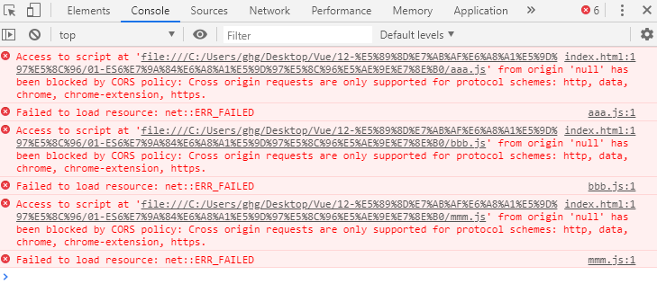

# Vue

[TOC]

## 一、组件化高级

### 1、slot-插槽的基本使用

```html
<!--
 * @Description: 
 * @version: 
 * @Author: henggao
 * @Date: 2019-10-11 09:35:20
 * @LastEditors: henggao
 * @LastEditTime: 2019-10-11 09:53:42
 -->
<!DOCTYPE html>
<html lang="en">
<head>
    <meta charset="UTF-8">
    <meta name="viewport" content="width=device-width, initial-scale=1.0">
    <meta http-equiv="X-UA-Compatible" content="ie=edge">
    <title>Document</title>
</head>
<body>
    <!-- 
        1. 插槽的基本使用<slot></slot>
        2. 插槽的默认值 <slot>button</slot>
        3. 如果有多个值，同时放入到组件进行替换时，一起作为替换元素
     -->
    <div id="app">
        <cpn></cpn>
        <cpn><span>哈哈哈</span></cpn>
        <cpn><i>呵呵呵</i></cpn>
        <cpn>
            <i>呵呵呵</i>
            <div>我是div元素</div>
            <p>我是p元素</p>
        </cpn>
        <cpn></cpn>
    </div>

    <template id ='cpn'>
        <div>
            <h2>我是组件</h2>
            <p>我是组件，哈哈哈</p>
            <!-- <button>按钮</button> -->
            <slot><button>按钮</button></slot>
        </div>
    </template>
    <script src="../js/vue.js"></script>
    <script>
        const app = new Vue({
            el:'#app',
            data:{
                message:'Hello,Vue !'
            },
            components:{
                cpn:{
                    template:'#cpn',
                }
            }
        })
    </script>
</body>
</html>
```

### 2、slot-具名插槽的使用

```html
<!--
 * @Description: 
 * @version: 
 * @Author: henggao
 * @Date: 2019-10-11 09:35:20
 * @LastEditors: henggao
 * @LastEditTime: 2019-10-11 10:03:24
 -->
<!DOCTYPE html>
<html lang="en">
<head>
    <meta charset="UTF-8">
    <meta name="viewport" content="width=device-width, initial-scale=1.0">
    <meta http-equiv="X-UA-Compatible" content="ie=edge">
    <title>Document</title>
</head>
<body>

    <div id="app">
        <cpn><span slot="center">标题</span></cpn>
        <cpn><button slot="right">返回</button></cpn>
    </div>

    <template id ='cpn'>
        <div>
            <slot name='left'><span>左边</span></slot>
            <slot name='center'><span>中间</span></slot>
            <slot name='right'><span>右边</span></slot>
        </div>
    </template>
    <script src="../js/vue.js"></script>
    <script>
        const app = new Vue({
            el:'#app',
            data:{
                message:'Hello,Vue !'
            },
            components:{
                cpn:{
                    template:'#cpn',
                }
            }
        })
    </script>
</body>
</html>
```


### 3、什么是编译的作用域

```html
<!--
 * @Description: 
 * @version: 
 * @Author: henggao
 * @Date: 2019-10-11 09:35:20
 * @LastEditors: henggao
 * @LastEditTime: 2019-10-11 10:20:58
 -->
<!DOCTYPE html>
<html lang="en">
<head>
    <meta charset="UTF-8">
    <meta name="viewport" content="width=device-width, initial-scale=1.0">
    <meta http-equiv="X-UA-Compatible" content="ie=edge">
    <title>Document</title>
</head>
<body>

    <div id="app">
        <cpn v-show='isShow'></cpn>
    </div>

    <template id ='cpn'>
        <div>
            <h2>我是子组件</h2>
            <p>我是内容，哈哈哈</p>
            <button v-show = 'isShow'>按钮</button>
        </div>
    </template>
    <script src="../js/vue.js"></script>
    <script>
        const app = new Vue({
            el:'#app',
            data:{
                message:'Hello,Vue !',
                isShow:true
            },
            components:{
                cpn:{
                    template:'#cpn',
                    data(){
                        return{
                            isShow:false
                        }
                    }
                }
            }
        })
    </script>
</body>
</html>
```

### 4、作用域插槽案例

```html
<!--
 * @Description: 
 * @version: 
 * @Author: henggao
 * @Date: 2019-10-11 10:24:41
 * @LastEditors: henggao
 * @LastEditTime: 2019-10-11 10:38:25
 -->
<!DOCTYPE html>
<html lang="en">

<head>
    <meta charset="UTF-8">
    <meta name="viewport" content="width=device-width, initial-scale=1.0">
    <meta http-equiv="X-UA-Compatible" content="ie=edge">
    <title>Document</title>
</head>

<body>
    <div id="app">
        <cpn></cpn>
        <cpn>
            <!-- 目的是获取子组件中的pLanguages -->
            <template slot-scope='slot'>
                <!-- <span v-for='item in slot.data'>{{item}} - </span> -->
                <span>{{slot.data.join(' - ')}}</span>
            </template>
        </cpn>
        
        <cpn>
            <!-- 目的是获取子组件中的pLanguages -->
            <template slot-scope='slot'>
                <!-- <span v-for='item in slot.data'>{{item}} * </span> -->
                <span>{{slot.data.join(' * ')}}</span>
            </template>
        </cpn>
    </div>

    <template id="cpn">
        <div>
            <slot :data='pLanguages'>
                <ul>
                    <li v-for='item in pLanguages'>{{item}}</li>
                </ul>
            </slot>
        </div>
    </template>

    <script src="../js/vue.js"></script>
    <script>
        const app = new Vue({
            el: '#app',
            data: {
                message: 'Hello,Vue!'
            },
            components: {
                cpn: {
                    template: '#cpn',
                    data() {
                        return {
                            pLanguages: ['JavaScript', 'Java', 'C#', 'Python']
                        }
                    }
                }
            }
        })
    </script>
</body>

</html>
```


## 二、模块化

### 1、为什么使用模块化

### 2、ES6的模块化实现

- aaa.js

```js
/*
 * @Description: 
 * @version: 
 * @Author: henggao
 * @Date: 2019-10-11 14:26:03
 * @LastEditors: henggao
 * @LastEditTime: 2019-10-11 15:36:14
 */
var name = '小明';
var age = 23;
var flag = true

function sum(num1,num2) {
    return num1 + num2;
}

if (flag) {
    console.log(sum(10,20));
}

// 1. 导出方式一
export {
    flag,sum
}

// 2. 导出方式二
export let num1 = 1000;
export let height = 1.72;

// 3.导出函数
export function mul(num1,num2){
    return num1 * num2
} 
// 4.导出类
export class Person{
    run(){
        console.log('在奔跑');
    }
}


// 4. export default
// const address = '北京市'
// export default address

export  default function(argument){
    console.log(argument);    
}
```

- bbb.js

```js
/*
 * @Description: 
 * @version: 
 * @Author: henggao
 * @Date: 2019-10-11 14:30:28
 * @LastEditors: henggao
 * @LastEditTime: 2019-10-11 14:55:24
 */
import  {sum}  from './aaa.js'

let name = '小红'
let flag = false

console.log(sum(10,10));
```

- mmm.js

```js
/*
 * @Description: 
 * @version: 
 * @Author: henggao
 * @Date: 2019-10-11 14:30:34
 * @LastEditors: henggao
 * @LastEditTime: 2019-10-11 15:37:39
 */
// 1. 导入的{}中定义的变量
import {flag,sum} from "./aaa.js";

if (flag) {
    console.log('小明是天才，哈哈哈~');
    console.log(sum(20,30));  
}

// 2. 直接导入export定义的变量
import{num1,height} from './aaa'
console.log(num1);
console.log(height);

// 3. 导入export的function/class
import {mul,Person} from './aaa'
console.log(mul(30,50));

const p = new Person();
p.run()

// 4. 导入export default中的内容
// import addr from './aaa'
// console.log(addr);

import fun from './aaa'
fun('你好啊')


// 5. 统一导入
// import * as aaa from './aaa'
// console.log(aaa.flag);
// console.log(aaa.height);
```

- index.html

```html
<!--
 * @Description: 
 * @version: 
 * @Author: henggao
 * @Date: 2019-10-11 10:48:18
 * @LastEditors: henggao
 * @LastEditTime: 2019-10-11 15:32:16
 -->
<!DOCTYPE html>
<html lang="en">
<head>
    <meta charset="UTF-8">
    <meta name="viewport" content="width=device-width, initial-scale=1.0">
    <meta http-equiv="X-UA-Compatible" content="ie=edge">
    <title>Document</title>
</head>
<body>

<script src="aaa.js" type="module" ></script>
<script src="bbb.js" type="module"></script>
<script src="mmm.js" type="module"></script>
</body>
</html>
```

- 报错

  

  

