# Vue

[TOC]

## 一、webpack的起步

- 必须依赖node

### 1、安装webpack

```shell
npm install webpack -g

npm install webpack-cli -g
```

- mathUtils.js

```js
/*
 * @Description: 
 * @version: 
 * @Author: henggao
 * @Date: 2019-10-11 19:51:17
 * @LastEditors: henggao
 * @LastEditTime: 2019-10-11 19:55:16
 */
function add(num1,num2) {
    return num1 + num2
}

function mul(num1,num2) {
return num1 * num2
}

module.exports = {
    add,
    mul
}
```

- main.js

```js
/*
 * @Description: 
 * @version: 
 * @Author: henggao
 * @Date: 2019-10-11 19:48:19
 * @LastEditors: henggao
 * @LastEditTime: 2019-10-11 21:00:37
 */
// 1，使用commonjs模块化规范
const {add, mul} = require('./mathUtils.js')

console.log(add(20,30));
console.log(mul(20,30));

// 2. 使用ES6的模块化规范
import {name, age ,height} from "./info.js";

console.log(name);
console.log(age);
console.log(height);

```

- info.js

```js
/*
 * @Description: 
 * @version: 
 * @Author: henggao
 * @Date: 2019-10-11 20:56:21
 * @LastEditors: henggao
 * @LastEditTime: 2019-10-11 20:56:21
 */
export const name = 'henggao'
export const age = 23
export const height = 1.88
```

### 2、打包

```shell
cd .\01-webpack的使用\01-webpack的起步\

#webpack3.x
webpack .\src\main.js  .\dist\bundle.js

#webpack4.x
webpack .\src\main.js -o .\dist\bundle.js --mode development
```


- index.html

```html
<!--
 * @Description: 
 * @version: 
 * @Author: henggao
 * @Date: 2019-10-11 19:48:48
 * @LastEditors: henggao
 * @LastEditTime: 2019-10-11 20:55:22
 -->
<!DOCTYPE html>
<html lang="en">
<head>
    <meta charset="UTF-8">
    <meta name="viewport" content="width=device-width, initial-scale=1.0">
    <meta http-equiv="X-UA-Compatible" content="ie=edge">
    <title>Document</title>
</head>
<body>

    <!-- <script src="./src/main.js"></script>
    <script src="./src/mathUtils.js"></script> -->
    <!-- 通过下面引用 -->
    <script src="./dist/bundle.js"></script>
</body>
</html>
```

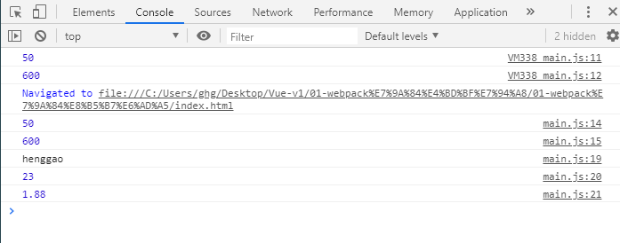

## 二、webpack的配置

### 1、创建webpack.config.js

```js
/*
 * @Description: 
 * @version: 
 * @Author: henggao
 * @Date: 2019-10-11 21:05:59
 * @LastEditors: henggao
 * @LastEditTime: 2019-10-11 21:27:14
 */
const path = require('path')

module.exports = {
    entry:'./src/main.js',
    output:{
        path:path.resolve(__dirname,'dist'),   //动态获取绝对路径
        filename:'bundle.js'
    }
}
```

### 2、初始化

```shell
npm init
```

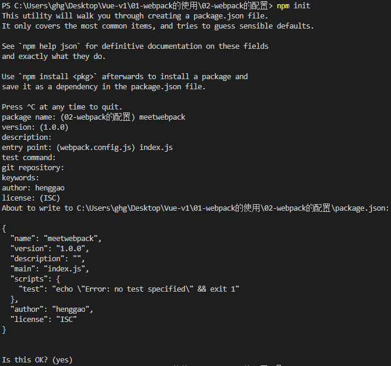

- 生成一个package.json


- package.json里有添加的依赖时，执行npm install，生成package-lock.json文件

  ```shell
  npm install
  ```

  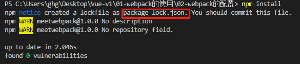

- 打包

  ```shell
  #开发模式
  webpack --mode development 
  #产品模式
  webpack --mode production
  ```

  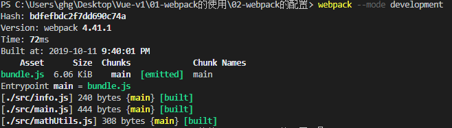

- 再做一层映射，在package.json添加信息，可以在终端使用npm run  build进行打包

  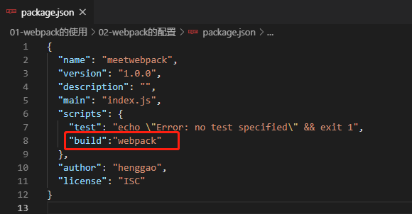

  ```shell
  npm run  build
  ```

  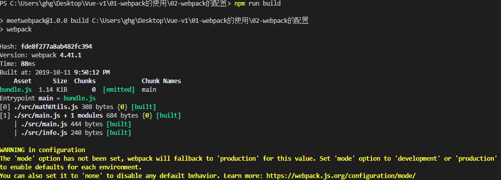

  - 优先在运行本地webpack

- 在本地安装webpack

  ```shell
  cnpm install webpack --save-dev
  ```

  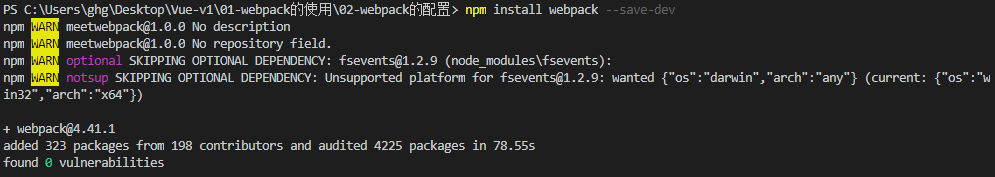

  - 重新打开package.json,多了下面部分。

    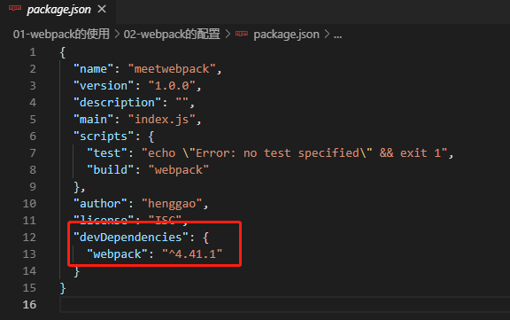

- 开发时依赖

- 运行时依赖

## 三、webpack的loader

### 1、创建css文件，在src/css/normal/css

- mormal.css

```css
body{
    background-color: greenyellow;
}
```

### 2、安装css-loader、style-loader

```shell
cnpm install --save-dev css-loader

cnpm install style-loader --save-dev
```

### 3、配置**webpack.config.js**

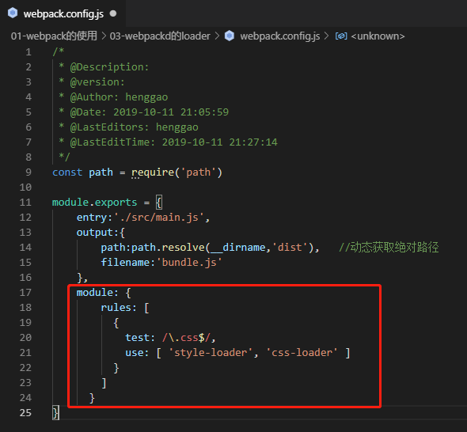

-  参考官方文档：

​	https://www.webpackjs.com/loaders/css-loader/

### 4、打包

```shell
npm run build
```

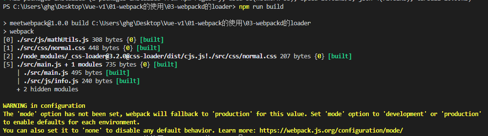

### 5、less文件的处理

#### 5.1、在src/css/special.less

- special.less

```less
@fontSize:50px;
@fontColor: orange;

body{
    font-size: @fontSize;
    color: @fontColor;
}
```

#### 5.2、在main.js中添加信息

```js
// 4. 依赖less文件
require('./css/special.less')
document.writeln('<h2>Hello，Vue！</h2>')  //写一个测试文字
```

#### 5.3、安装less-loader

```shell
 cnpm install --save-dev less-loader less
```

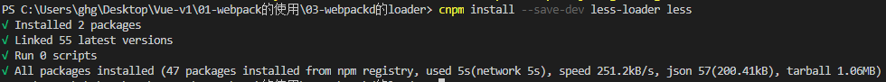

#### 5.4、在webpack.config.js添加信息

```js
      {
        test: /\.less$/,
        use: [{
          loader: "style-loader" // creates style nodes from JS strings
        }, {
          loader: "css-loader" // translates CSS into CommonJS
        }, {
          loader: "less-loader" // compiles Less to CSS
        }]
      }
```

#### 5.5、打包

```shell
npm run build
```

#### 5.6、查看index.html


### 6、图片文件的处理

#### 6.1、在src/img添加图片

- 添加图片

- 修改normal.js

  ```js
  body{
      /* background-color: greenyellow; */
      background:url('../img/timg.jpg')
  }
  ```

  - timg.jps大小约是2kb，2kb*1024=4048kb，小于6.3中limit设置的8192，所以使用base64字符串形式编译

#### 6.2、安装url-loader

```shell
cnpm install --save-dev url-loader

cnpm install --save-dev file-loader
```

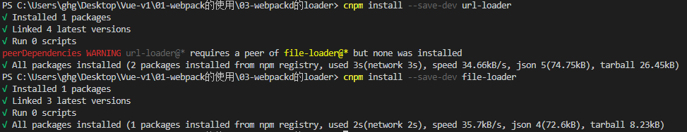

#### 6.3、配置webpack.config.js

```js
      {
        test: /\.(png|jpg|gif|jpeg)$/,
        use: [
          {
            loader: 'url-loader',
            options: {
              // 当加载的图片，小于limit时，会将图片编译成base64字符串形式
              // 当加载的图片，大于limit时，需要使用file-loader模块进行加载
              limit: 8192
            }
          }
        ]
      }
```

#### 6.4、打包

```shell
npm run build
```

#### 6.5、查看index.html


#### 6.6、修改normal.js

```js
body{
    /* background-color: greenyellow; */
    /* background:url('../img/timg.jpg') */
    background:url('../img/test.jpg')
}
```

- 当加载的图片，大于limit时，需要使用file-loader模块进行加载，就是上面6.1命令`cnpm install --save-dev file-loader`
- test.jpg约32kb，32kb*1024大于6.3中limit设置的8192，所以使用file-loader模块进行加载。

- 打包

  ```shell
  npm run build
  ```

  - 在dist文件夹中生成一个图片文件

  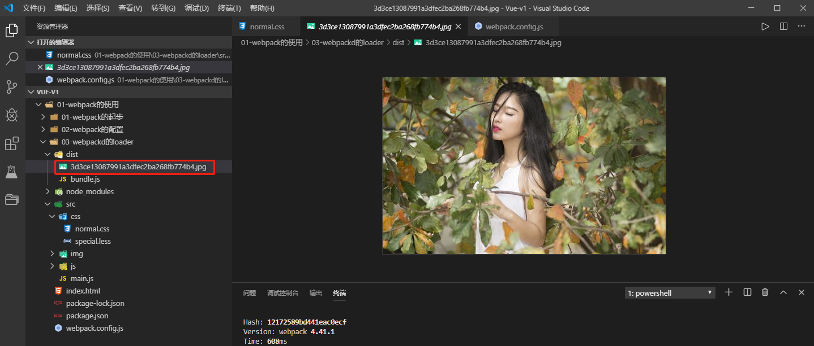

- 修改webpack.config.js配置，添加如下信息，涉及url，会在前面拼接dist。

  ```js
  publicPath:'dist/'
  ```

  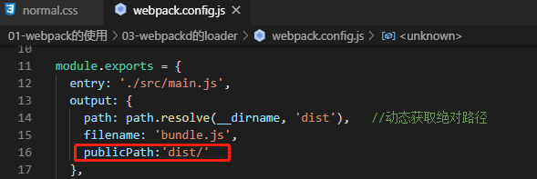

- 查看index.html

  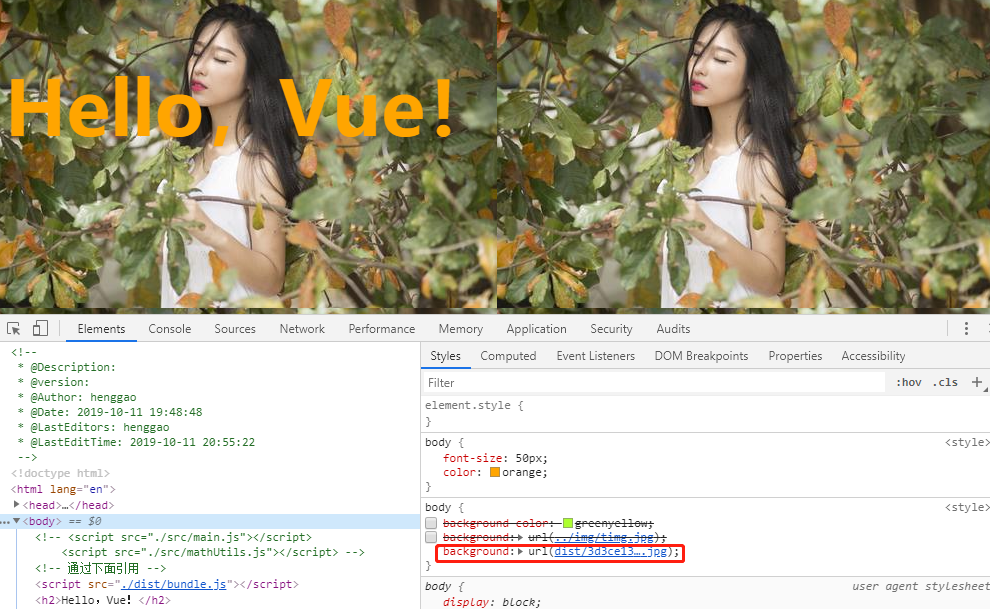

- 如果index.html以后打包到dist文件夹中，还需要去掉`publicPath:'dist/'`

- 由于默认加载到dist文件夹的图片文件以hash值，不易识别，添加如下信息，命名加载到dist的文件。

  ```js
   name:'img/[name].[hash:8].[ext]' //命名加载到dist的文件
  ```

  


### 7、webpack-ES6转化为ES5

将ES6转化为ES5，需要使用babel。

#### 1、安装babel

```shell
cnpm install babel-loader@7 babel-core babel-preset-es2015 --save-dev 
```

#### 2、配置webpack.config.js

```js
    {
      test: /\.js$/,
      exclude: /(node_modules|bower_components)/,
      use: {
        loader: 'babel-loader',
        options: {
          presets: ['es2015']
        }
      }
    }
```

#### 3、打包

```shell
npm run build
```

- bundle.js中没有了const，都是ES5语法


## 四、webpack配置vue

### 1、安装vue

```shell
cnpm install vue --save
```

### 2、配置webpack.config.js

- 以别名的方式指定使用vue版本

```js
  resolve:{
    // alias:别名
    alias:{
      'vue$':'vue/dist/vue.esm.js'
    }
```

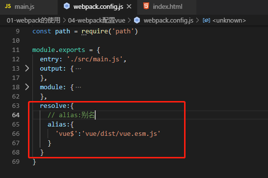

### 3、在index.html添加信息

```html
    <div id="app">
        <h2>{{message}}</h2>
    </div>
```

### 4、在main.js添加信息

```js
// 5. 使用vue进行开发
import Vue from 'vue'
const app = new Vue({
    el:'#app',
    data:{
        message:'Hello,Vue ~~~'
    }
})
```

### 5、打包

```shell
npm run build
```

### 6、访问index.html

显示了Hello，Vue~~~


## 五、创建vue的template和el关系

### 1、修改index.html

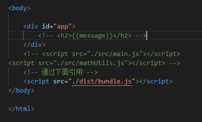

### 2、在main.js中添加信息

```js
// 5. 使用vue进行开发
import Vue from 'vue'
const app = new Vue({
    el: '#app',
    template: `
    <div>
        <h2>{{message}}</h2>
        <button @click='btnClick'>按钮</button>
        <h2>{{name}}</h2>
    </div>
    `,
    data: {
        message: 'Hello,Vue ~~~',
        name:'henggao'
    },
    methods:{
        btnClick(){

        }
    }
})
```

### 3、打包

```shell
npm run build
```

### 4、访问index.html


## 六、vue的终极使用方法

### 1、修改index.html信息

```html
<!--
 * @Description: 
 * @version: 
 * @Author: henggao
 * @Date: 2019-10-11 19:48:48
 * @LastEditors: henggao
 * @LastEditTime: 2019-10-12 15:18:24
 -->
<!DOCTYPE html>
<html lang="en">

<head>
    <meta charset="UTF-8">
    <meta name="viewport" content="width=device-width, initial-scale=1.0">
    <meta http-equiv="X-UA-Compatible" content="ie=edge">
    <title>Document</title>
</head>

<body>

    <div id="app">
        <!-- <h2>{{message}}</h2> -->
    </div>
    <!-- <script src="./src/main.js"></script>
<script src="./src/mathUtils.js"></script> -->
    <!-- 通过下面引用 -->
    <script src="./dist/bundle.js"></script>
</body>

</html>
```

### 2、修改main.js

```js
/*
 * @Description: 
 * @version: 
 * @Author: henggao
 * @Date: 2019-10-11 19:48:19
 * @LastEditors: henggao
 * @LastEditTime: 2019-10-12 15:34:16
 */
// 1，使用commonjs模块化规范
const { add, mul } = require('./js/mathUtils')

console.log(add(20, 30));
console.log(mul(20, 30));

// 2. 使用ES6的模块化规范
import { name, age, height } from "./js/info";

console.log(name);
console.log(age);
console.log(height);

// 3.依赖css文件
require('./css/normal.css')

// 4. 依赖less文件
require('./css/special.less')
document.writeln('<h2>Hello，Vue！</h2>')  //写一个测试文字

// 5. 使用vue进行开发
import Vue from 'vue'

const App = {
    template: `
    <div>
        <h2>{{message}}</h2>
        <button @click='btnClick'>按钮</button>
        <h2>{{name}}</h2>
    </div>
    `,
    data() {
        return {
            message: 'Hello,Vue ~~~',
            name: 'henggao'
        }
    },
    methods: {
        btnClick() {

        }
    }
}

// const app = new Vue({
new Vue({
    el: '#app',
    template: '<App/>',
    components: {
        App
    }
})
```

### 3、打包

```shell
npm run build
```

### 4、访问index.html

### 5、进一步简化

#### 5.1、在src/vue/app.js

- app.js

  ```js
  /*
   * @Description: 
   * @version: 
   * @Author: henggao
   * @Date: 2019-10-12 15:38:32
   * @LastEditors: henggao
   * @LastEditTime: 2019-10-12 15:38:32
   */
  export default{
      template: `
      <div>
          <h2>{{message}}</h2>
          <button @click='btnClick'>按钮</button>
          <h2>{{name}}</h2>
      </div>
      `,
      data() {
          return {
              message: 'Hello,Vue ~~~',
              name: 'henggao'
          }
      },
      methods: {
          btnClick() {
  
          }
      }
  }
  ```

#### 5.2、修改main.js

- main.js

```js
/*
 * @Description: 
 * @version: 
 * @Author: henggao
 * @Date: 2019-10-11 19:48:19
 * @LastEditors: henggao
 * @LastEditTime: 2019-10-12 15:39:54
 */
// 1，使用commonjs模块化规范
const { add, mul } = require('./js/mathUtils')

console.log(add(20, 30));
console.log(mul(20, 30));

// 2. 使用ES6的模块化规范
import { name, age, height } from "./js/info";

console.log(name);
console.log(age);
console.log(height);

// 3.依赖css文件
require('./css/normal.css')

// 4. 依赖less文件
require('./css/special.less')
document.writeln('<h2>Hello，Vue！</h2>')  //写一个测试文字

// 5. 使用vue进行开发
import Vue from 'vue'
import App from './vue/app'

// const app = new Vue({
new Vue({
    el: '#app',
    template: '<App/>',
    components: {
        App
    }
})
```

#### 5.3、打包

```shell
npm run build
```

#### 5.4、访问index.html

### 6、进一步分离

#### 6.1、在src/vue/App.vue

- App.vue

```vue
<!--
 * @Description: 
 * @version: 
 * @Author: henggao
 * @Date: 2019-10-12 15:43:30
 * @LastEditors: henggao
 * @LastEditTime: 2019-10-12 16:36:48
 -->
<template>
  <div>
    <h2 class="title">{{message}}</h2>
    <button @click="btnClick">按钮</button>
    <h2>{{name}}</h2>
  </div>
</template>

<script>
export default {
  name: "App",
  data() {
    return {
      message: "Hello,Vue ~~~",
      name: "henggao"
    }
  },
  methods: {
    btnClick() {}
  }
};
</script>

<style scoped>
.title{
    color: aqua;
}
</style>>
```

#### 6.2、修改main.js

```js
// 5. 使用vue进行开发
import Vue from 'vue'
// import App from './vue/app'
import App from './vue/App.vue'

// const app = new Vue({
new Vue({
    el: '#app',
    template: '<App/>',
    components: {
        App
    }
})
```

#### 6.3、安装vue-loader和Vvue-template-compiler

```shell
cnpm install vue-loader vue-template-compiler --save-dev
```

#### 6.4、修改webpack.config.js

```js
      {
        test: /\.vue$/,
        use: ['vue-loader']
      }
```

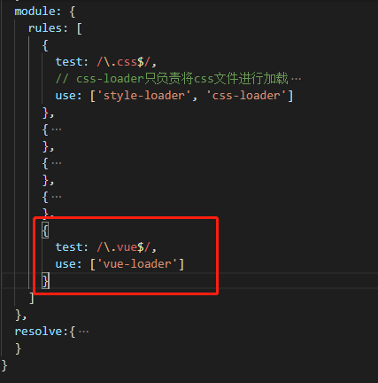

#### 6.5、修改package.json

- 将vue-loader的版本改为低版本,注意版本问题。

```json
"vue-loader": "^14.0.0",
```

- 每次修改package.json，都需要执行`npm install`

  ```shell
  npm install
  ```

#### 6.6、打包

```shell
npm run build
```

#### 6.7、查看index.html


### 7、进一步添加内容

#### 7.1、在sr/vue/Cpn.vue

- Cpn.vue

  ```vue
  <!--
   * @Description: 
   * @version: 
   * @Author: henggao
   * @Date: 2019-10-12 16:48:09
   * @LastEditors: henggao
   * @LastEditTime: 2019-10-12 16:48:09
   -->
  <template>
    <div>
        <h2>我是cpn组件的标题</h2>
        <p>我是cpn组件的内容，哈哈哈</p>
    </div>
  </template>
  
  <script>
  export default {
      name:'Cpn',
      data(){
          return{
              name:'Cpn组件的name'
          }
      }
  
  }
  </script>
  
  <style>
  
  </style>
  ```

#### 7.2、在App.vue添加信息

```vue
<!--
 * @Description: 
 * @version: 
 * @Author: henggao
 * @Date: 2019-10-12 15:43:30
 * @LastEditors: henggao
 * @LastEditTime: 2019-10-12 16:54:05
 -->
<template>
  <div>
    <h2 class="title">{{message}}</h2>
    <button @click="btnClick">按钮</button>
    <h2>{{name}}</h2>
    <Cpn/>
  </div>
</template>

<script>
import Cpn from './Cpn.vue'

export default {
  name: "App",
  components:{
    Cpn
  },
  data() {
    return {
      message: "Hello,Vue ~~~",
      name: "henggao"
    }
  },
  methods: {
    btnClick() {}
  }
};
</script>

<style scoped>
.title{
    color: aqua;
}
</style>>
```

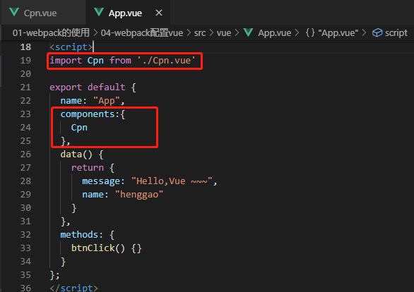

#### 7.3、打包

```shell
npm run build
```

#### 7.4、访问index.html


### 8、解决扩展名

#### 8.1、在webpack.config.js添加信息

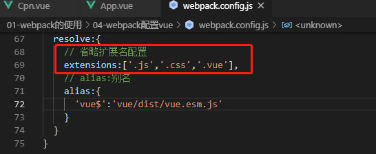

#### 8.2、在App.vue，可以省略扩展名了

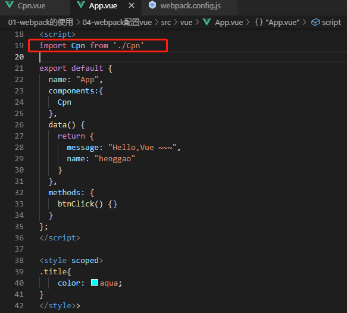

#### 8.3、打包测试

```shell
npm run bulid
```

#### 8.4、访问index.html


## 七、webpack-横幅plugind的使用

### 1、添加版权的Plugin

#### 1.1、在webpack.config.js中导入webpack

```js
/*
 * @Description: 
 * @version: 
 * @Author: henggao
 * @Date: 2019-10-11 21:05:59
 * @LastEditors: henggao
 * @LastEditTime: 2019-10-12 17:23:48
 */
const path = require('path')
const webpack = require('webpack')

module.exports = {
  entry: './src/main.js',
  output: {
    path: path.resolve(__dirname, 'dist'),   //动态获取绝对路径
    filename: 'bundle.js',
    publicPath: 'dist/'    //涉及url，会在前面拼接dist
  },
  module: {
    rules: [
      {
        test: /\.css$/,
        // css-loader只负责将css文件进行加载
        // styl-loader负责将样式添加到DOM中
        // 使用多个loader，是从右向左
        use: ['style-loader', 'css-loader']
      },
      {
        test: /\.less$/,
        use: [{
          loader: "style-loader" // creates style nodes from JS strings
        }, {
          loader: "css-loader" // translates CSS into CommonJS
        }, {
          loader: "less-loader" // compiles Less to CSS
        }]
      },
      {
        test: /\.(png|jpg|gif|jpeg)$/,
        use: [
          {
            loader: 'url-loader',
            options: {
              // 当加载的图片，小于limit时，会将图片编译成base64字符串形式
              // 当加载的图片，大于limit时，需要使用file-loader模块进行加载
              limit: 8192,
              name: 'img/[name].[hash:8].[ext]' //命名加载到dist的文件
            }
          }
        ]
      },
      {
        test: /\.js$/,
        exclude: /(node_modules|bower_components)/,
        use: {
          loader: 'babel-loader',
          options: {
            presets: ['es2015']
          }
        }
      },
      {
        test: /\.vue$/,
        use: ['vue-loader']
      }
    ]
  },
  resolve:{
    // 省略扩展名配置
    extensions:['.js','.css','.vue'],
    // alias:别名
    alias:{
      'vue$':'vue/dist/vue.esm.js'
    }
  },
  plugins:[
    new webpack.BannerPlugin('最终版权归Mongeostore所有')
  ]
}
```

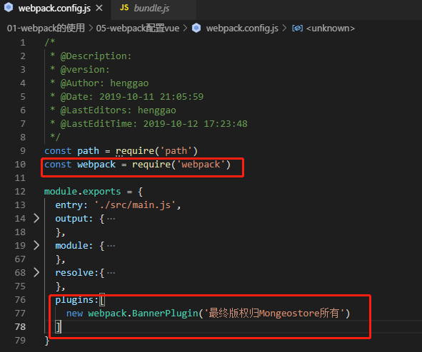

#### 1.2、查看dist/bundle.js

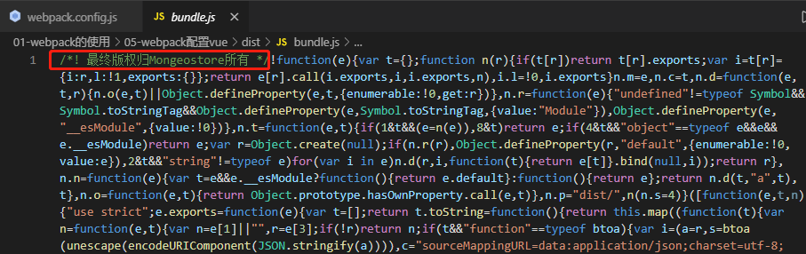


## 八、webpack-HtmlWebpackplugin

### 1、打包html的plugin

#### 1、安装html-webpack-plugin

```shell
cnpm install html-webpack-plugin --save-dev
```

#### 2、配置webpack.config.js

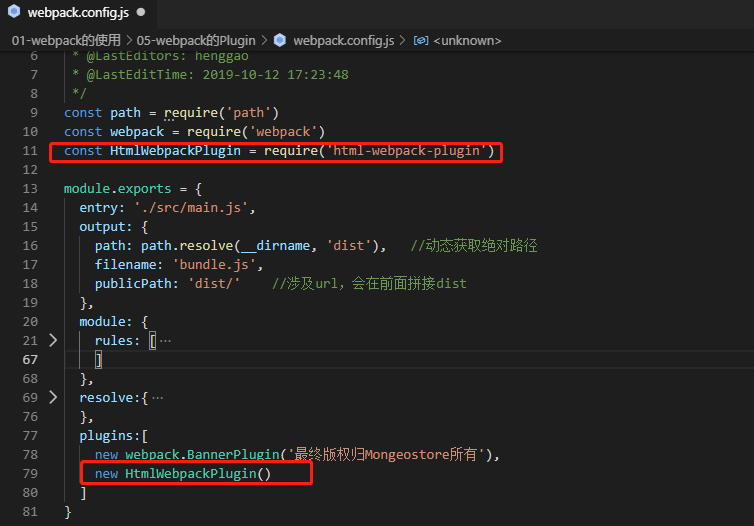

#### 3、打包

```shell
npm run build
```

在dist目录下生成index.html

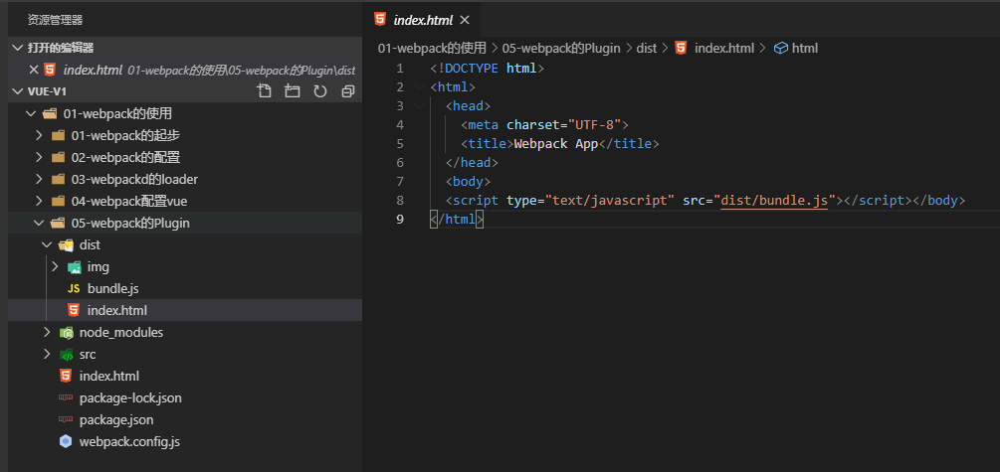

- index.html中`<script type="text/javascript" src="dist/bundle.js"></script></body>`中 多了一个dist，注释掉webpack.config.js中的配置。

  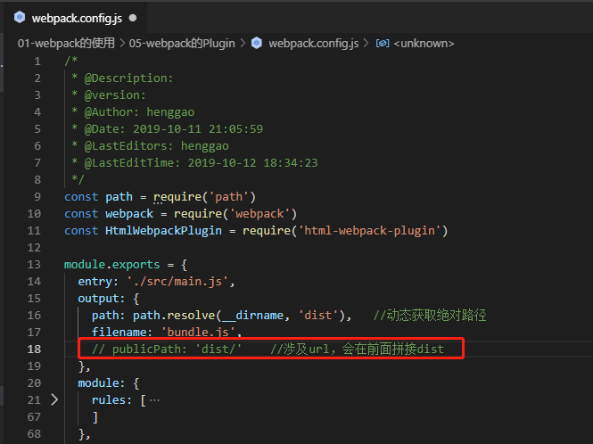

### 2、修改src下的index.html

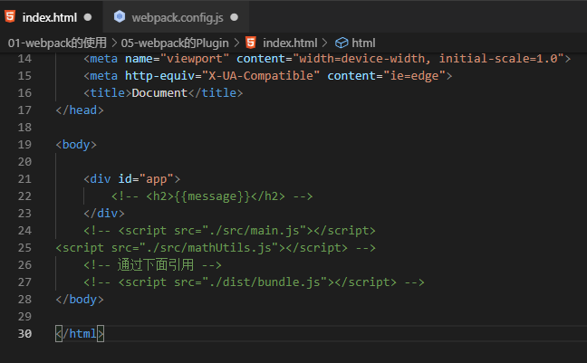

### 3、在webpack.config.js配置

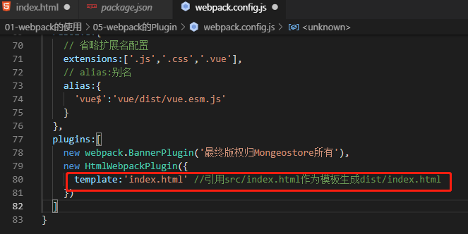

### 4、打包

```shell
npm run build
```

### 5、在dist下生成index.html,访问index.html


## 九、webpack-UglifyjsWebpackPlugin的使用

- js压缩的plugin

### 1、下载uglifyjs-webpack-plugin

```shell
cnpm install uglifyjs-webpack-plugin --save-dev
```

### 2、在webpack.config.js添加信息

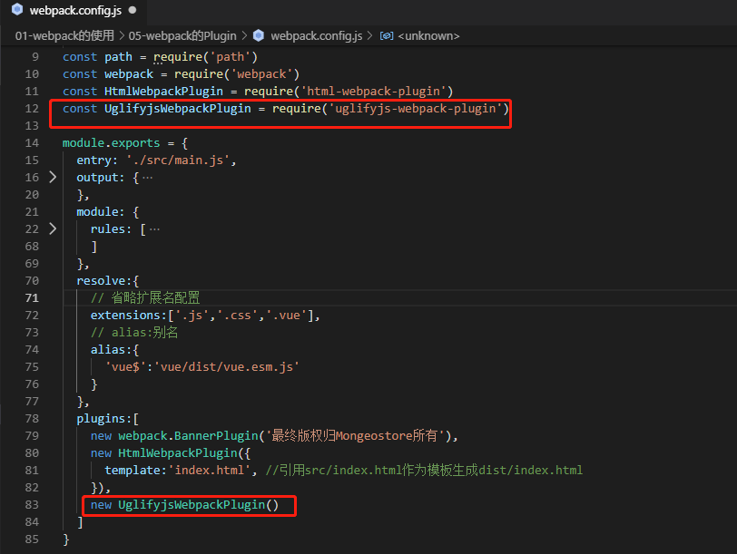

### 3、打包

```shell
npm run build
```

- 报错

  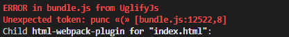

- 这里我使用的是webpack4.x打包以后就是压缩的，具体原因还没发现，猜测是版本的问题吧。测试安装了1.1.1，需要的webpack是2.x||3.x。

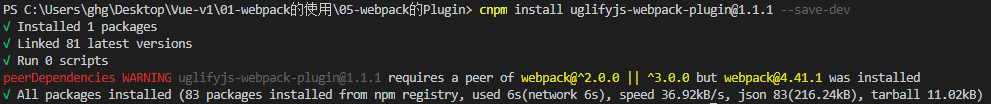


## 十、webpack-dev-server搭建本地服务器

- webpack提供一个可选的本地开发服务器，这个本地服务器基于Node.js，内部使用express框架，实现让浏览器自动刷新修改后的结果。

### 1、安装webpack-dev-server

```shell
cnpm install webpack-dev-server --save-dev 
```

### 2、配置webpack.config.js

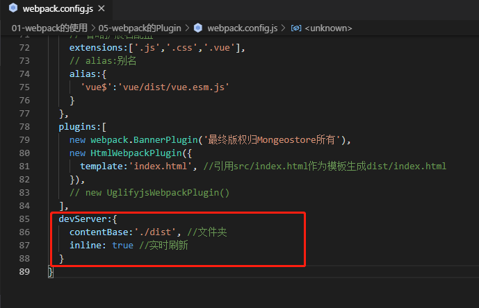

### 3、在package.json中配置

- 为了方便再终端简化使用

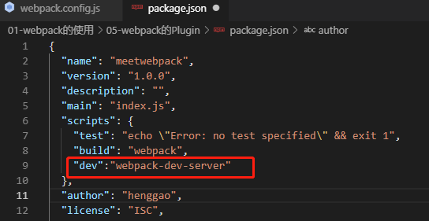

### 4、运行

- 在终端运行

```shell
npm run dev
```

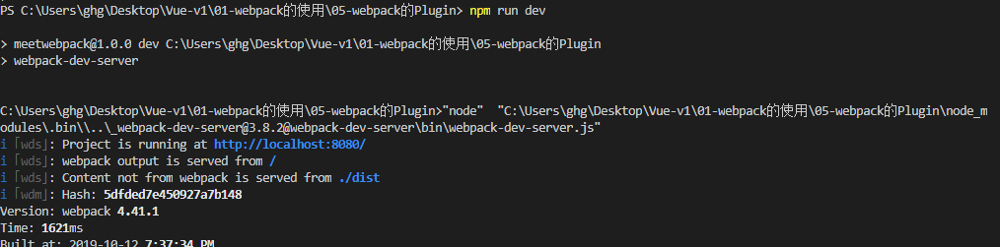

### 5、访问http://localhost:8080/


- 优化，添加--open命令，运行`npm run dev`，将自动打开网页http://localhost:8080/

```json
"dev":"webpack-dev-server --open" 
```


## 十一、webpack-配置文件分离

### 1、安装webpack-merge

```shell
cnpm install webpack-merge --save-dev
```

### 2、在build下新建base.config.js、dev.config.js、prod.config.js

将webpack.config.js文件进行分离，在src下新建build文件休夹。

- base.config.js

  ```js
  /*
   * @Description: 
   * @version: 
   * @Author: henggao
   * @Date: 2019-10-11 21:05:59
   * @LastEditors: henggao
   * @LastEditTime: 2019-10-13 08:51:46
   */
  const path = require('path')
  const webpack = require('webpack')
  const HtmlWebpackPlugin = require('html-webpack-plugin')
  // const UglifyjsWebpackPlugin = require('uglifyjs-webpack-plugin')
  
  module.exports = {
    entry: './src/main.js',
    output: {
      path: path.resolve(__dirname, 'dist'),   //动态获取绝对路径
      filename: 'bundle.js',
      // publicPath: 'dist/'    //涉及url，会在前面拼接dist
    },
    module: {
      rules: [
        {
          test: /\.css$/,
          // css-loader只负责将css文件进行加载
          // styl-loader负责将样式添加到DOM中
          // 使用多个loader，是从右向左
          use: ['style-loader', 'css-loader']
        },
        {
          test: /\.less$/,
          use: [{
            loader: "style-loader" // creates style nodes from JS strings
          }, {
            loader: "css-loader" // translates CSS into CommonJS
          }, {
            loader: "less-loader" // compiles Less to CSS
          }]
        },
        {
          test: /\.(png|jpg|gif|jpeg)$/,
          use: [
            {
              loader: 'url-loader',
              options: {
                // 当加载的图片，小于limit时，会将图片编译成base64字符串形式
                // 当加载的图片，大于limit时，需要使用file-loader模块进行加载
                limit: 8192,
                name: 'img/[name].[hash:8].[ext]' //命名加载到dist的文件
              }
            }
          ]
        },
        {
          test: /\.js$/,
          exclude: /(node_modules|bower_components)/,
          use: {
            loader: 'babel-loader',
            options: {
              presets: ['es2015']
            }
          }
        },
        {
          test: /\.vue$/,
          use: ['vue-loader']
        }
      ]
    },
    resolve:{
      // 省略扩展名配置
      extensions:['.js','.css','.vue'],
      // alias:别名
      alias:{
        'vue$':'vue/dist/vue.esm.js'
      }
    },
    plugins:[
      new webpack.BannerPlugin('最终版权归Mongeostore所有'),
      new HtmlWebpackPlugin({
        template:'index.html', //引用src/index.html作为模板生成dist/index.html
      })    
    ],
  }
  ```

-  dev.config.js

  ```js
  /*
   * @Description: 
   * @version: 
   * @Author: henggao
   * @Date: 2019-10-11 21:05:59
   * @LastEditors: henggao
   * @LastEditTime: 2019-10-13 09:00:15
   */
  
  const webpackMerge = require('webpack-merge')
  const baseConfig = require('./base.config')
  
  module.exports = webpackMerge(baseConfig,{
      // 下面是开发阶段用到的配置
      devServer: {
          contentBase: './dist', //文件夹
          inline: true //实时刷新
      }
  })
  
  ```

  

- prod.config.js

  ```js
  /*
   * @Description: 
   * @version: 
   * @Author: henggao
   * @Date: 2019-10-11 21:05:59
   * @LastEditors: henggao
   * @LastEditTime: 2019-10-13 08:59:00
   */
  
  // const UglifyjsWebpackPlugin = require('uglifyjs-webpack-plugin')
  const webpackMerge = require('webpack-merge')
  const baseConfig = require('./base.config')
  
  module.exports = webpackMerge(baseConfig,{
      plugins:[
          // new UglifyjsWebpackPlugin()
        ]
  })
  ```

### 3、删除webpack.config.js

### 4、配置package.json

- 指定配置文件位置

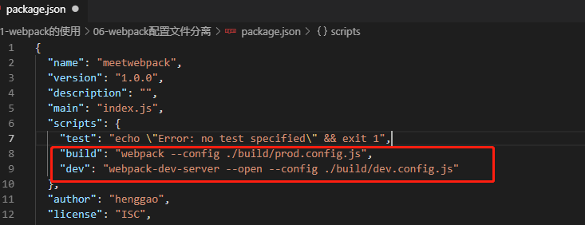

### 5、修改打包路径

- base.config.js

  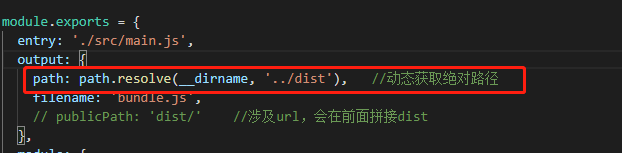

### 6、打包

```shell
npm run build
```

### 7、运行

```shell
npm run dev
```

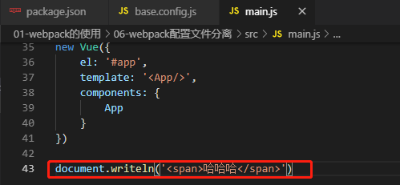

http://localhost:8080/网页自动编译。

