# Vue

[TOC]

## 一、Vue-CLI2

### 1、安装Vue脚手架

```shell
#安装vue2.x
npm install vue-cli -g

#安装vue3.x，我这里安装的是3.x
npm install @vue/cli -g
```

### 2、查看版本

```shell
vue --version
```

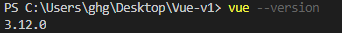

### 3、拉取2.x模板(旧模板)

- 拉取2.x模板，就可以即使用vue2.x版本，也可以使用vue3.x。

```shell
npm install @vue/cli-init -g
```

### 4、创建项目

#### 4.1、Vue CLI2

##### 4.1.1、Vue CLI2初始化项目

```shell
vue init webpack 项目夹名称
```

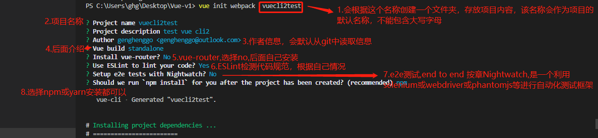

##### 4.1.2、查看生成好文件，并重命名为02-vuecli2test

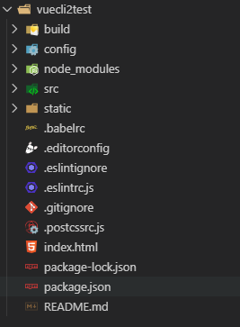

##### 4.1.3、build和config文件夹

- build和config文件夹是配置webpack，例如：将config/index.js设置为true，自动打开浏览器。

  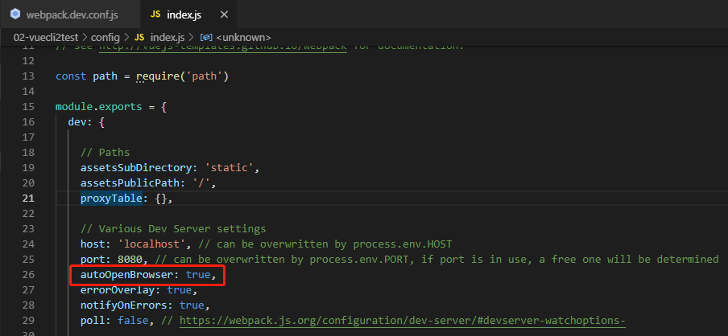

#### 4.2、Vue CLI3初始化项目

```shell
vue creat 项目夹名称
```


## 二、Vue-CLI2

### 1、创建项目，测试ESLint规范

- 创建runtimecompiler项目

  ```shell
  vue init webpack runtimecompiler
  ```

  - 这个项目装了ESLint

  - ESLint规范代码
  - 关闭ESLint，在congif/index.js,将参数设置为false即可关闭。

  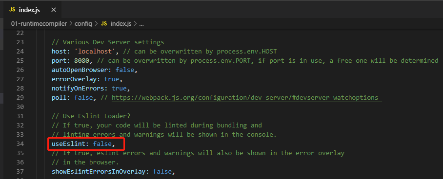

  

- 创建runtimeonly项目

- 这里不装了ESLint

  ```shell
  vue init webpack runtimeonly
  ```

### 2、Runtime-Compiler和Runtime-Only区别

- runtimecompiler(V1)

  template -> ast -> render -> vdom ->UIR

- runtimeonly(V2)（1.性能更高 2.代码量更少）

  render -> vdom ->UI

#### 2.1、在01-runtimecompiler项目中，修改mai.js，测试render

```js
/*
 * @Description: henggao_learning
 * @version: v1.0.0
 * @Author: henggao
 * @Date: 2019-10-13 15:27:18
 * @LastEditors: henggao
 * @LastEditTime: 2019-10-14 08:40:53
 */
// The Vue build version to load with the `import` command
// (runtime-only or standalone) has been set in webpack.base.conf with an alias.
import Vue from 'vue'
// import App from './App'

Vue.config.productionTip = false

/* eslint-disable no-new */
const cpn = {
  template: '<div>{{message}}</div>',
  data () {
    return {
      message: '我是组件message'
    }
  }
}
new Vue({
  el: '#app',
  // components: { App },
  // template: '<App/>'
  render: function (createElement) {
    // 1. 普通用法：creatElement('标签',{标签的属性}，[''])
    // return createElement('h2', { class: 'box' }, ['Hello World', createElement('button', ['按钮'])])

    // 2. 传入组件
    return createElement(cpn)
  }
})

// - runtimecompiler(V1)
//   template -> ast -> render -> vdom ->UI
// - runtimeonly(V2)（1.性能更高 2.代码量更少）
//   render -> vdom -> UI

```


## 三、Vue-CLI3

- vue-cli 3与 2版本区别
  - 基于webpack 打造，vue-cli2基于webpack 3 
  - 设计原则“0配置”，移除了build和config等目录
  - vue-cli 3 提供了vue ui 命令，提供可视化
  - 移除了static文件夹，新增public，并将index.html移动到public

### 1、创建项目

```shell
vue create testvuecli3
```

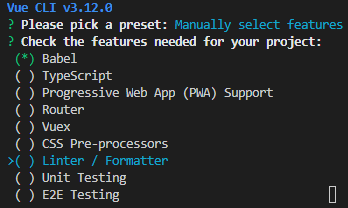

- 通过空格选择

  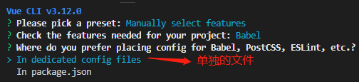

​		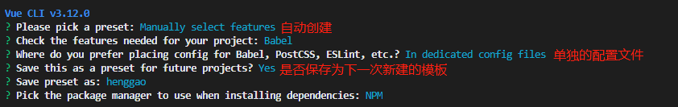

- 如果需要删除自己创建项目的默认配置

  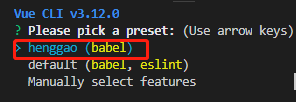

  - 找到C:\Users\ghg\.vuerc，删除以下内容。

  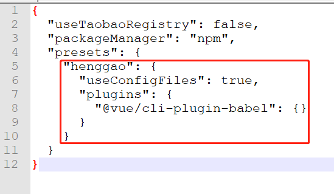

### 2、查看目录

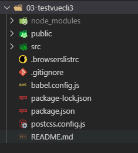

### 3、用户图形界面UI

- 本地服务器

```shell
vue ui
```

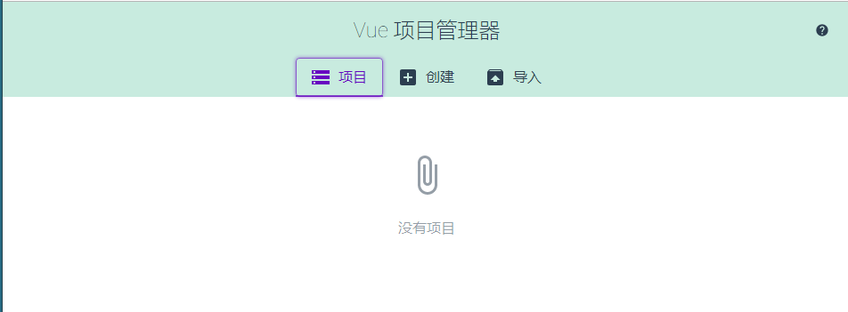


### 4、新建配置

- 如果需要修改自己独有的配置，在项目里新建`vue.config.js`,必须是这个名称。

- 提交到本地git仓库

  - 查看修改

    ```shell
    git status
    ```

    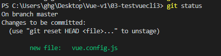

  - 提交到本地git仓库

    ```shell
    git add .
    git commit -m 'henggao'
    ```

- `vue.config.js`

  ```js
  module.exports = {
      
  }
  ```
  - 提交到本地git仓库

  ```
  git add .
  git commit -m 'henggao'
  ```


## 四、箭头函数

### 1、箭头函数的基本使用

```html
<!DOCTYPE html>
<html lang="en">
<head>
    <meta charset="UTF-8">
    <meta name="viewport" content="width=device-width, initial-scale=1.0">
    <meta http-equiv="X-UA-Compatible" content="ie=edge">
    <title>Document</title>
</head>
<body>
 <script>
    //  箭头函数：也是一种定义函数的方式
    // 1. 定义函数的方式
    const aaa =function(){

    }

    // 2. 对象字面量中定义函数
    const obj = {
        bbb(){

        }
    }

    // 3. ES6中箭头函数
    // const ccc = (参数列表) =>{      
    // }
    const ccc = () =>{

    }
    
</script>   
</body>
</html>

```


### 2、箭头函数和返回值

```html
<!--
 * @Description: henggao_learning
 * @version: v1.0.0
 * @Author: henggao
 * @Date: 2019-10-14 11:11:48
 * @LastEditors: henggao
 * @LastEditTime: 2019-10-14 13:49:30
 -->
<!DOCTYPE html>
<html lang="en">
<head>
    <meta charset="UTF-8">
    <meta name="viewport" content="width=device-width, initial-scale=1.0">
    <meta http-equiv="X-UA-Compatible" content="ie=edge">
    <title>Document</title>
</head>
<body>
<script>
    // 1. 参数问题
    // 1.1 放入两个参数
    const sum = (num1,num2) =>{
        return num1 + num2
    }
    // 1.2 放入一个参数
    const power= num => {
        return num * num
    }

    // 2. 函数中
    // 2.1 函数代码有多行代码时
    const test = () => {
        // 1. 打印Hello World
        console.log('Hello World');
        
        // 2. 打印Hello Vue
        console.log('Hello Vue');
    }

    // 2.2 函数代码块中只有一行代码
    // const mui = (num1, num2) =>{
    //     return num1 + num2
    // }
    const mul = (num1,num2) => num1 + num2
    console.log(mul(20,30));

    // const demo = () => {
    //     console.log('Hello Demo')
    // }
    const demo = () => console.log('Hello Demo')
    console.log(demo());
    
</script>
</body>
</html>
```

### 3、箭头函数中this的使用

```html
<!--
 * @Description: henggao_learning
 * @version: v1.0.0
 * @Author: henggao
 * @Date: 2019-10-14 13:50:25
 * @LastEditors: henggao
 * @LastEditTime: 2019-10-14 14:11:37
 -->
<!DOCTYPE html>
<html lang="en">

<head>
    <meta charset="UTF-8">
    <meta name="viewport" content="width=device-width, initial-scale=1.0">
    <meta http-equiv="X-UA-Compatible" content="ie=edge">
    <title>Document</title>
</head>

<body>
    <script>
        //  是么时候用箭头
        // setTimeout(function (){
        //     console.log(this);
        // },1000)

        // setTimeout(( ) => {
        //     console.log(this);
        // },1000)

        // 问题： 箭头函数中的this是如何查找的？
        // 答案：向外层作用域中，一层层查找this，直到有this的定义 
        //  const obj ={
        //      aaa() {
        //          setTimeout(function(){
        //              console.log(this);  //window
        //          })

        //          setTimeout(() => {
        //              console.log(this);  //obj对象
        //          })
        //      }
        //  }


        const obj = {
            aaa() {
                setTimeout(function () {
                    setTimeout(function () {
                        console.log(this); //window
                    })

                    setTimeout(() => {
                        console.log(this); //window
                    })
                })

                setTimeout(() => {
                    setTimeout(function () {
                        console.log(this); //window
                    })

                    setTimeout(() => {
                        console.log(this); //obj对象
                    })
                })
            }
        }

        obj.aaa()
    </script>
</body>

</html>
```

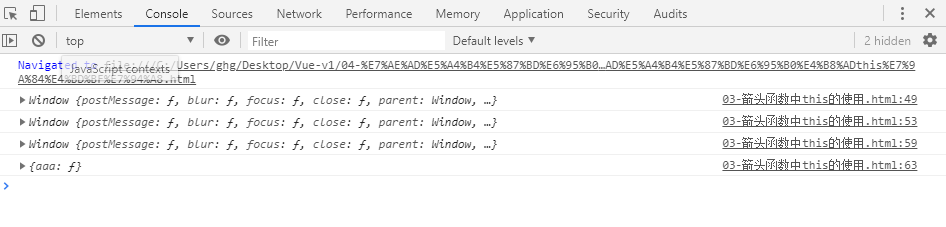

