# Vue

[TOC]

## 一、Vue-Router

### 1、vue-cli2创建项目

```shell
vue init webpack learnvuerouter
```

- 路由
  - 内网IP
  - 公网IP

#### 1.1、后端渲染

- jsp（java server page）

- 后端路由

  - 后端处理URL和页面之间的映射关系。

    

#### 1.2、前后端分离

- 前端渲染

  - 浏览器中显示的网页中的大部分内容，都是有前端写的js代码在浏览器中执行，最终渲染出来的网页。

  - 前后端分离

    

#### 1.3、SPA页面

- SPA(single page web application)单页面富应用阶段

- 整个网站只有一个页面

  

### 2、URL的Hash和HTML5的history

#### 2.1、URL的Hash

- 修改location.hash来改变href，但网页不发生刷新。

  ```js
  location.hash = 'aaa'
  ```

  

#### 2.2、HTML5的history

##### 2.2.1、pushState

- 类似栈结构，可以返回back

```js
history.pushState({},'','about')

history.back()
```


##### 2.2.2、replaceState

- 不可以返回

```js
history.replaceState({},'','home')
```

##### 2.2.3、go

- go可以回退，前进。

  - history.go(-1) 等价于history.back()
  - history.go(1)等价于history.forward()

  ```js
  history.go(-1)
  
  history.go(-2)
  
  history.go(2)
  ```

  

### 3、vue-router

#### 3.1、安装路由

```shell
npm install vue-router --save
```

- 使用脚手架已经创建

  

- 查看main.js

  

- 如果手动安装

  - 在src/router/index.js搭建路由框架

  - index.js

    ```js
    // 配置路由相关的信息
    import Vue from 'vue'
    import VueRouter from 'vue-router'
    
    // 1.通过Vue.use(插件),安装插件
    Vue.use(VueRouter)
    
    // 2.创建VueRouter对象
    const routes = [
      
    ]
    const router = new VueRouter({
      // 配置路由和组件之间的应用关系
      routes
    })
    
    // 3.将router传入到到Vue实例
    export default router
    ```

  - 在main.js进行挂载

  - main.js

    ```js
    import Vue from 'vue'
    import App from './App'
    import router from './router'  //默认到index
    // import router from './router/index'
    
    Vue.config.productionTip = false
    
    /* eslint-disable no-new */
    new Vue({
      el: '#app',
      router,
      render: h => h(App)
    })
    ```

    

#### 3.2、路由映射配置

1、删除src/components里的默认文件HelloWorld.vue,创建自己的文件Home.vue、About.vue

- Home.vue

  ```vue
  <template>
    <div>
        <h2>我是Home</h2>
        <p>我是Home内容，哈哈哈</p>
    </div>
  </template>
  
  <script>
  export default {
      name:"Home"
  }
  </script>
  
  <style>
  
  </style>
  ```

- About.vue

  ```vue
  <!--
   * @Description: henggao_learning
   * @version: v1.0.0
   * @Author: henggao
   * @Date: 2019-10-14 19:13:59
   * @LastEditors: henggao
   * @LastEditTime: 2019-10-14 19:13:59
   -->
  <template>
    <div>
        <h2>我是About</h2>
        <p>我是About内容，呵呵呵</p>
    </div>
  </template>
  
  <script>
  export default {
      name:'About'
  }
  </script>
  
  <style>
  
  </style>
  ```

2、删除src/App.vue里的默认配置

- App.vue

  ```vue
  <template>
    <div id="app">
  
    </div>
  </template>
  
  <script>
  export default {
    name: 'App'
  }
  </script>
  
  <style>
  
  </style>
  
  ```

3、配置映射关系

一个映关系就是一个对象

- src/router/index.js

  ```js
  import Vue from 'vue'
  import VueRouter from 'vue-router'
  import Home from '../components/Home.vue'
  import About from '../components/About.vue'
  
  // 1.通过Vue.use(插件),安装插件
  Vue.use(VueRouter)
  
  // 2.创建VueRouter对象
  const routes = [
    {
      path:'/home',
      component:Home
    },
    {
      path:'/about',
      component:About
    }
    
  ]
  const router = new VueRouter({
    // 配置路由和组件之间的应用关系
    routes
  })
  
  // 3.将router传入到到Vue实例
  export default router
  
  ```

  

#### 3.3、使用路由

##### 3.3.1、router-link

router-link会被渲染为a标签

- App.vue

  

- 运行

  ```shell
  npm run dev
  ```

  

##### 3.3.2、使用router-view占位

- App.vue


- 查看

  

##### 3.3.3、默认打开路径

- src/router/index.js

  

- 查看，默认打开 http://localhost:8080/#/home 


##### 3.3.4、路由的默认值改为history模式

- 去掉网址中的`#`


- src/router/index.js

  

- 查看

  

##### 3.3.5、router-link补充

1、渲染为button


查看

​	

2、使用replace属性


重新打开网页，点击`首页`、`关于`，无法返回


3、渲染点击按钮

3.1、当点击按钮时，会出现 `class=“router-link-exact-active router-link-active ”`


3.2、根据上面这个class设置样式，使得点击的时候按钮变红。

- App.vue


3.3、查看


3.4、如果相将 router-link-active修改成ative

- App.vue


查看


一般开发的时候不用修改。

3.5、如果需要统一修改的样式比较多


只需要在router/index.js,修改如下信息


查看


##### 3.3.5、通过代码跳转路由

vue-router源码中所有组件都有一个router属性。


查看


- push =>pushState，这个可以返回、前进。

可以通过replace设置属性


重新打开网页，点击按钮后，查看，不可以返回、前进。


### 4、动态路由

#### 4.1、新建user.vue

在components文件下新建user.vue

- user.vue

  ```vue
  <template>
    <div>
        <h2>我是用户界面</h2>
        <p>我是User内容，呵呵呵</p>
    </div>
  </template>
  
  <script>
  export default {
  
  }
  </script>
  
  <style>
  
  </style>
  ```

#### 4.2、修改index.js

在index.js中配置user信息


#### 4.3、修改App.vue


#### 4.4、user路径添加信息

实现 `http://localhost:8080/user/henggao` 这种样式。

##### 4.4.1、修改index.js


##### 4.4.2、修改App.vue


#### 4.5、动态获取路径

使用`v-bind:`或`:`动态获取数据。

修改App.vue


查看


#### 4.6、进一步动态获取路径

在user.vue添加信息


在index.js中通过`:userId`获取值


在App.vue中通过`userId:henggao`赋值


查看


也可以这样获取值


### 5、路由懒加载

路由懒加载：用到时在加载。把不同路由对应的组件打包到不同的js文件。

- index.js


运行打包

```shell
npm run build
```

查看打包,一个路由打包成一个js文件，上面添加了三个路由懒加载


### 6、路由的嵌套

希望通过/home/news和/home/message访问呢一些内容。

#### 6.1、创建子组件

在components文件中新建HomeNews.vue、HoneMessage.vue

- HomeNews.vue

  ```vue
  <template>
    <div>
        <ul>
            <li>新闻1</li>
            <li>新闻2</li>
            <li>新闻3</li>
            <li>新闻4</li>
        </ul>
    </div>
  </template>
  
  <script>
  export default {
  
  }
  </script>
  
  <style>
  
  </style>
  ```

- HomeMessage.vue

  ```vue
  <template>
    <div>
      <ul>
        <li>消息1</li>
        <li>消息2</li>
        <li>消息3</li>
        <li>消息4</li>
      </ul>
    </div>
  </template>
  
  <script>
  export default {};
  </script>
  
  <style>
  </style>
  ```

#### 6.2、在index.js中配置映射关系


#### 6.3、在Home.vue中显示组件


#### 6.4、运行、查看

运行程序

```shell
npm run dev
```

查看


#### 6.5、嵌套路由的默认路径设置

默认定向到news


查看，默认就有news新闻内容了。


### 7、传递参数

传递参数主要有两种类型：params和query

- params类型
  - 配置路由格式：`/router/:id`
  - 传递方式：在path后面跟上对应的值
  - 传递后形成的路径：`/router/123`，`/router/abc`
- query类型
  - 配置路由格式：/router，也就是普通配置
  - 传递的方式：对象中使用query的key作为传递方式
  - 传递后形成的路径：`/router?id=123`，`/router?id=abc`

#### 7.1、新建Profile.vue

在components文件下新建Profile.vue

```vue
<template>
  <div>
      <h2>我是Profile组件</h2>
  </div>
</template>

<script>
export default {

}
</script>

<style>

</style>
```

#### 7.2、在index.js中配置映射关系


#### 7.3、在APP.vue中配置跳转


#### 7.4、在路径中加入信息

使用对象添加信息，`v-bind:`或`:`动态获取数据。


- 查看

  

- 在Profile.vue中添加信息，可以取出值到页面。

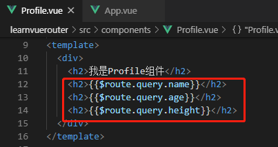

#### 7.5、通过Button跳转

##### 7.5.1、修改APP.vue

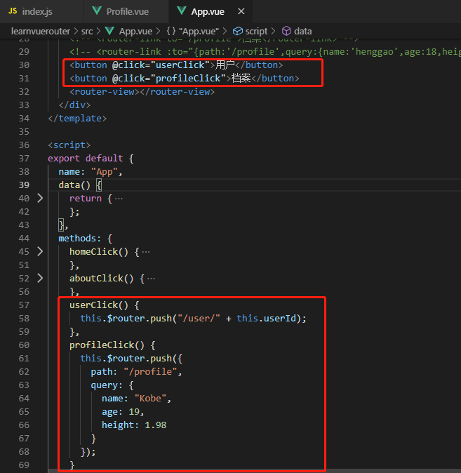

查看

- 点击用户

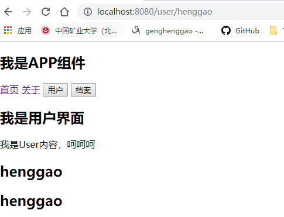

- 点击档案

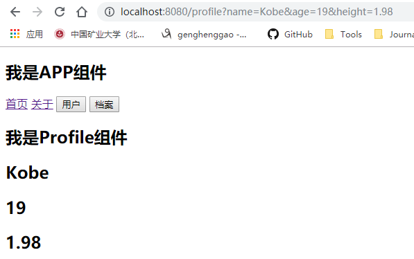

#### 7.6、vue-router中$router与$route

- `$router`：所有位置拿到的是一样的。
- `$route`：当前活跃的对象


## 二、导航守卫

### 1、使用生命周期函数

- Home.vue

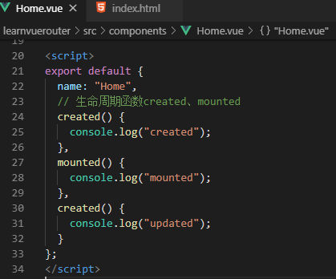

### 2、添加测试数据

- 添加测试数据，验证created

  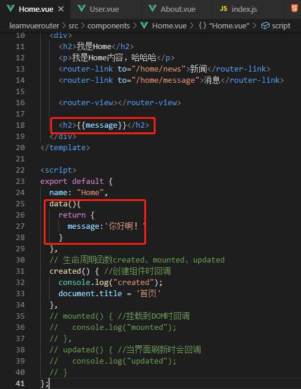

- 查看

  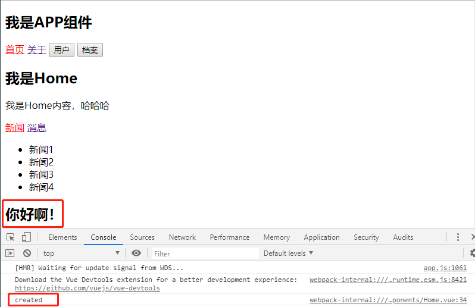

### 3、修改导航守卫

#### 3.1、设置Home.vue标题

使用生命周期创建导航，这里以created为例。

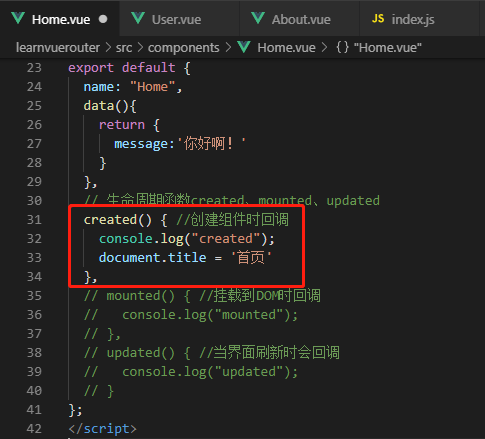


#### 3.2、同样的设置User.vue、About.vue

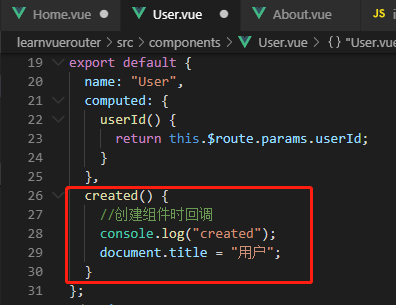

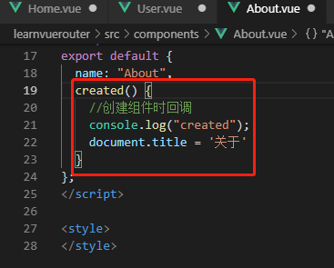

#### 3.3、查看

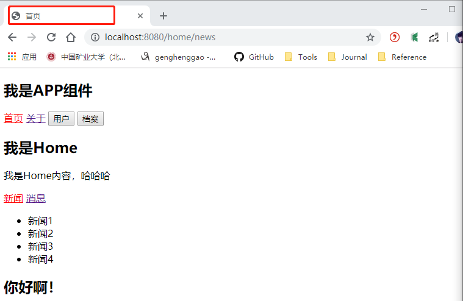


### 4、全局守卫

- 当文件多了，步骤3一个一个文件配置比较麻烦，使用全局导航守卫修改标题。

#### 4.1、配置index.js

- 添加首页属性

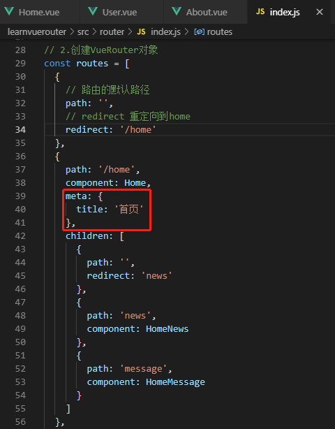

- 同样的需要配置相关的几个属性

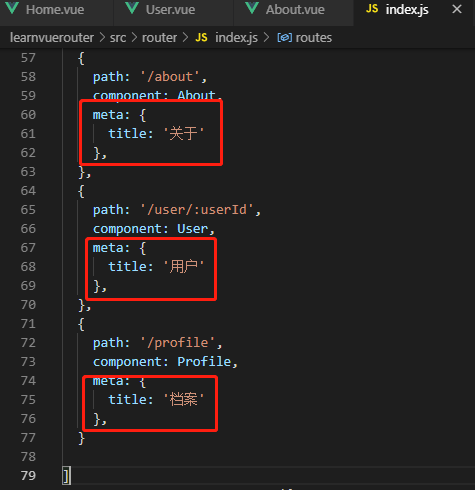

- 获取属性

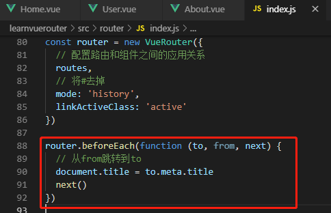

#### 4.2、查看

- 当访问首页的时候，会出现undefined，访问关于、用户、档案可以正常显示。

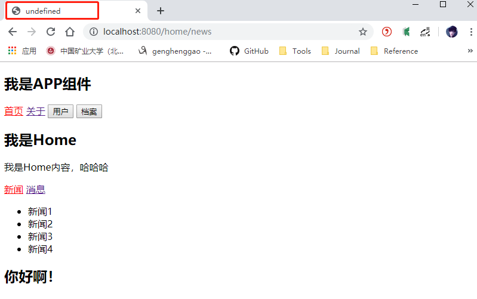

- 使用console.log(to)查看

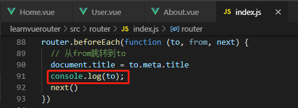

- 访问网页查看信息，发现meta中没有title，在matched中meta有title

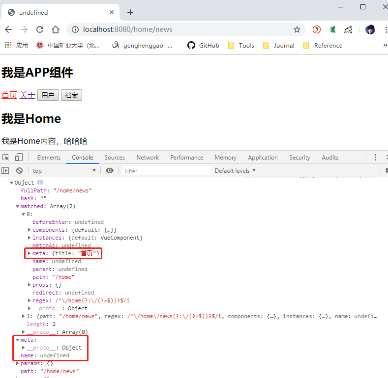

- 可以获取home中matched的meta里的title，matched是一个数组，获取第一个。当数组中只有一个路由时，会取到第一个，比如about中、profile中。

  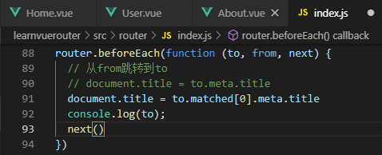

- 查看，可以正常显示首页


### 5、keep-alive遇见vue-router

- keep-alive才能使用activated、deactivated这两个函数

- index.js

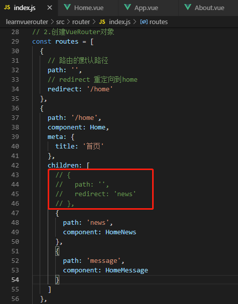

- Home.vue

  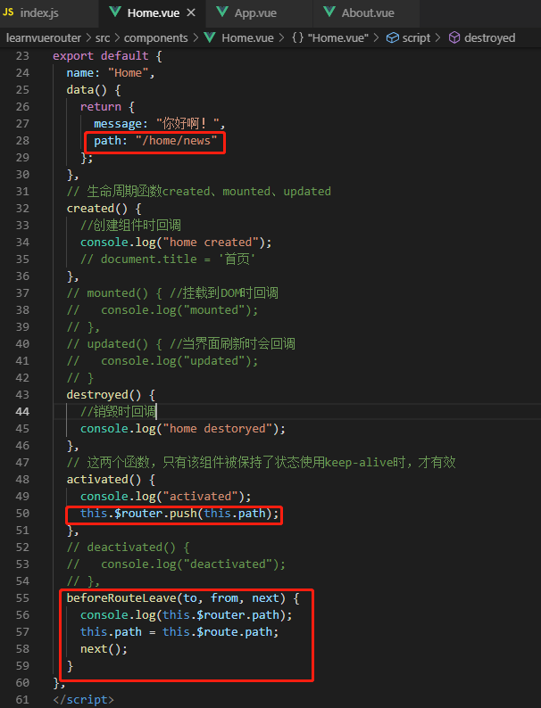

  

- App.vue

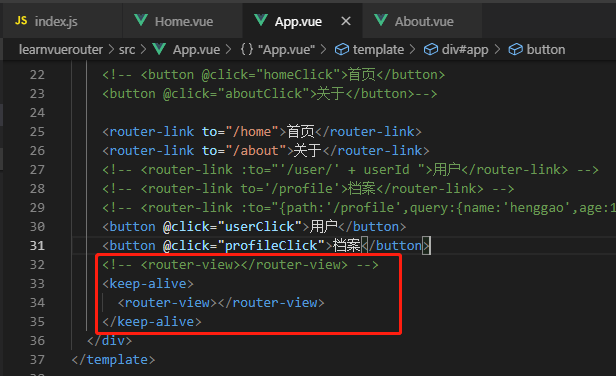

- 查看，进入首页，点击消息，再点击关于，点击首页后，页面展示的是消息列表。

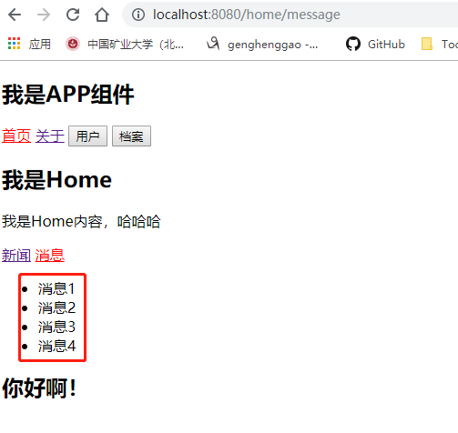

### 6、keep-alive属性

- include字符串或正则表达，只匹配的组件会被缓存

- exclude字符串或正则表达，任何匹配的组件都不会被缓存

6.1、在Home.vue、User.vue、Profile.vue、About.vue中设置查看

- Home.vue

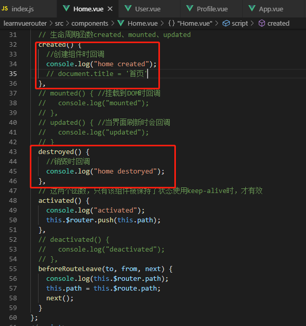

- User.vue

  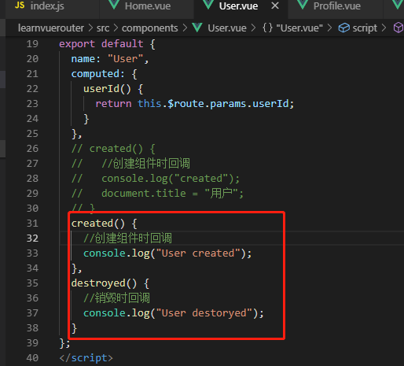

- Profile.vue

  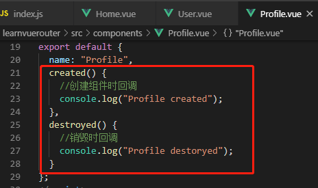

- About.vue

  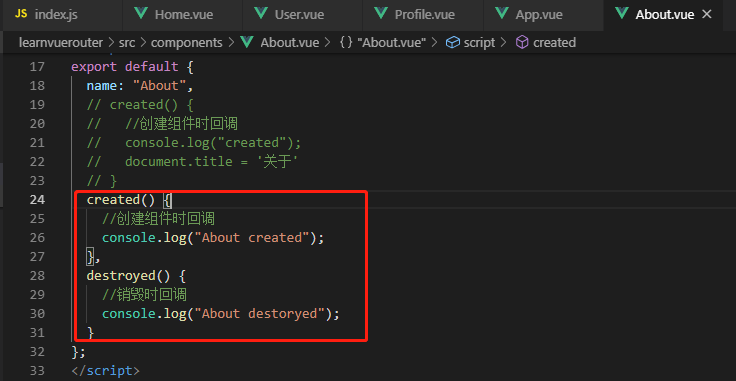

- App.vue

  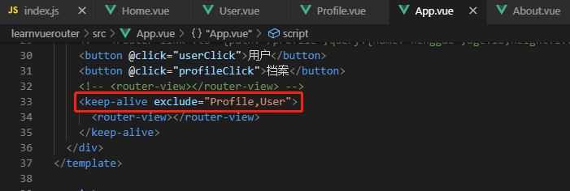

6.2、查看

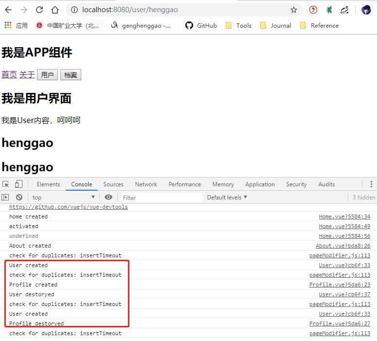