# Vue

[TOC]

## 一、Axios

Axios网络请求

### 1、Axios的使用(一)

#### 1.1、安装

```shell
npm install axios --save 
```

#### 1.2、删除默认文件及配置

#### 1.3、编写main.js

```js
/*
 * @Description: henggao_learning
 * @version: v1.0.0
 * @Author: henggao
 * @Date: 2019-10-22 08:53:49
 * @LastEditors: henggao
 * @LastEditTime: 2019-10-22 10:21:48
 */
import Vue from 'vue'
import App from './App'
import router from './router'

import axios from 'axios'

Vue.config.productionTip = false

/* eslint-disable no-new */
new Vue({
  el: '#app',
  router,
  render: h => h(App)
})

axios({
  url: 'http://123.207.32.32:8000/home/multidata'
}).then(res => {
  console.log(res);
})

axios({
  url:'http://123.207.32.32:8000/home/data',
  // 专门针对get请求的参数拼接
  params:{
    type:'pop',
    page:1
  }
}).then(res =>{
  console.log(res);
})
```

### 2、Axios的使用(二)

并发请求

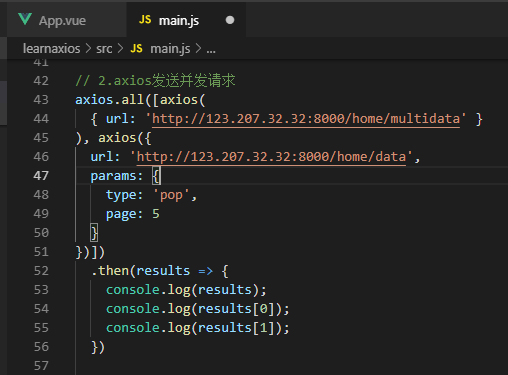

axios.spread将数组[res1,res2]展开为res1，res2

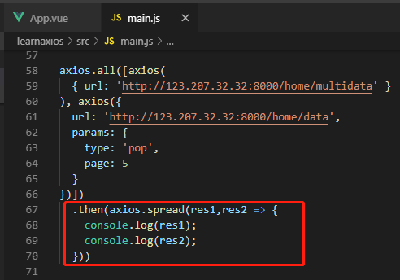

### 3、全局配置

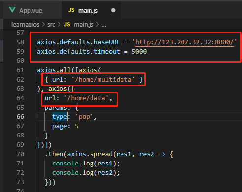

### 4、Axios实例和模块封装

#### 4.1、axios实例

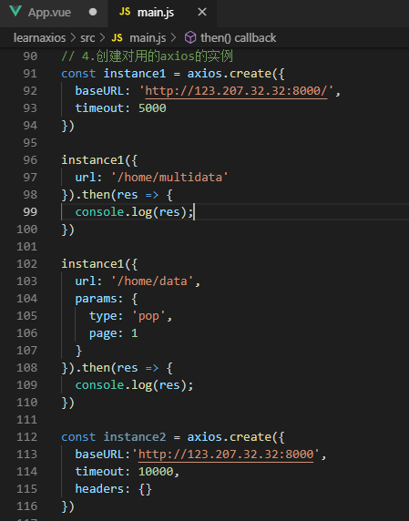

#### 4.2、封装

##### 4.2.1、封装（一）

回调函数的方式

- network/request.js

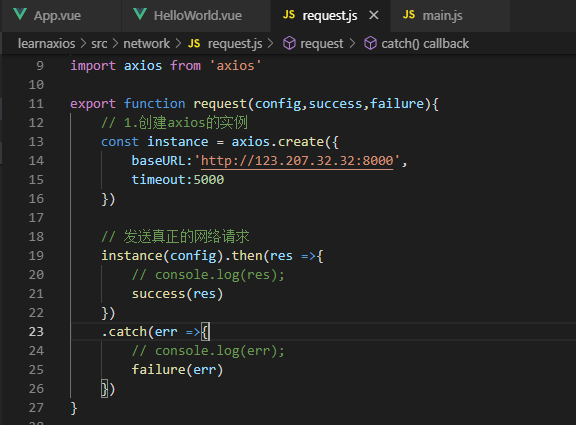

- main.js

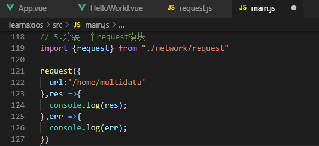

##### 4.2.2、封装（二）

- request.js

  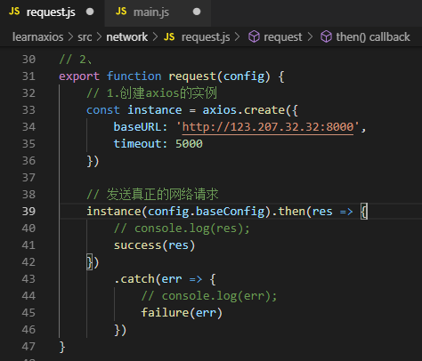

- main.js

  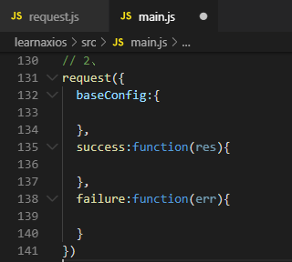

##### 4.2.3、封装（三）

Promise的方式

- request.js

  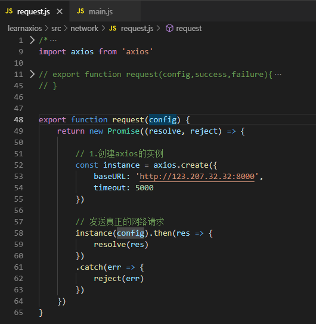

- main.js

  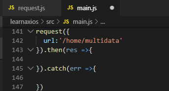

##### 4.2.3、封装（三）

`instance(config)`返回值就是Promise，可以直接return

- request.js

  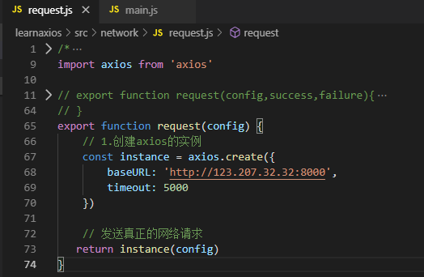

- main.js

  


#### 4.3、axios拦截器

##### 4.3.1、请求拦截

- request.js

  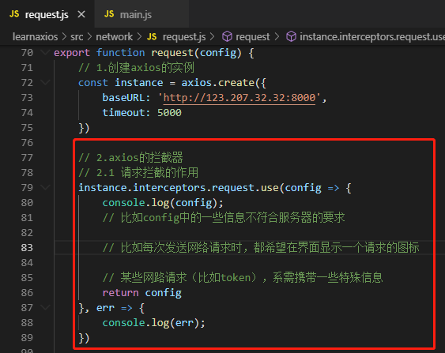

##### 4.3.2、响应拦截

- request.js

  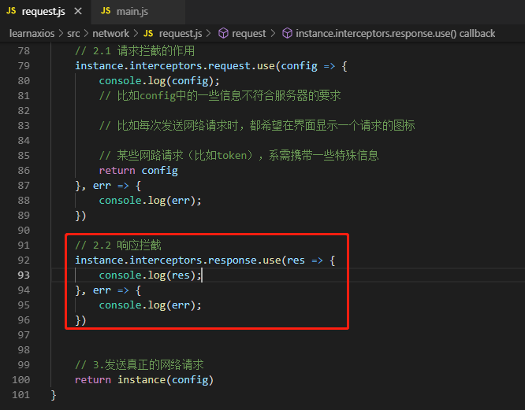

